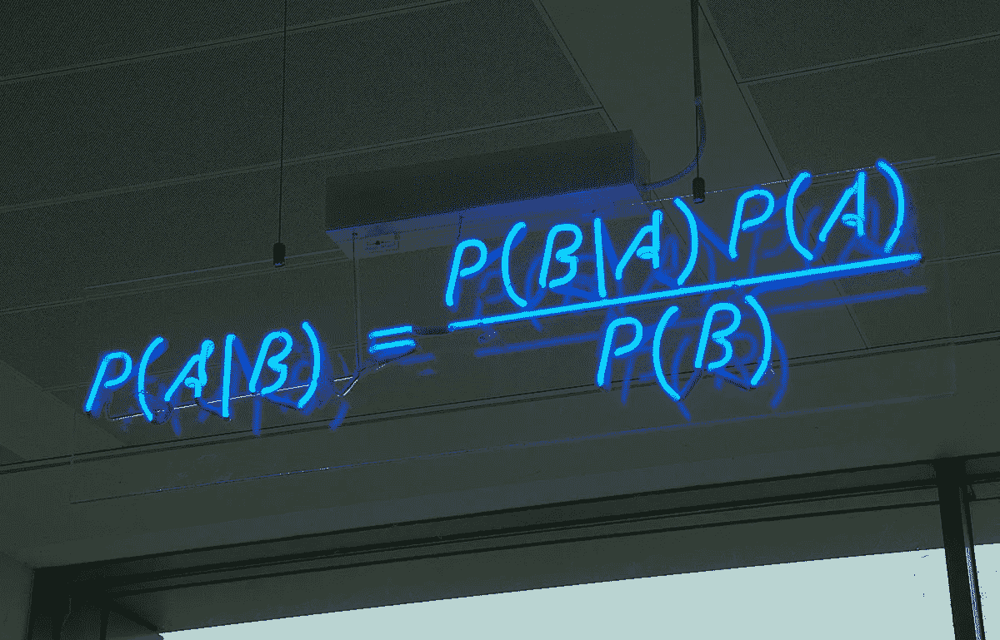

# 贝叶斯大脑假说

> 原文：<https://towardsdatascience.com/the-bayesian-brain-hypothesis-35b98847d331?source=collection_archive---------4----------------------->

## 我们的大脑是如何进化来预见未来的

> 如果你能看透时间的种子，并说出哪些谷粒会生长，哪些不会…
> 麦克白，威廉·莎士比亚

人生充满了不确定性，谁也说不清未来。根据布莱士·帕斯卡的说法，*我们在一个巨大的球体中航行，永远在不确定性中漂流，被从一端驱动到另一端*。没有人知道死亡什么时候会来，什么时候生活会给我们带来苦难，什么时候生活会给我们回报。

虽然我们都必须在生命中的某个时刻学习这一沉闷的课程，但我们仍然令人钦佩地成功地在一个充满不确定性的宇宙中获胜。我们盖房子，我们把钱存入银行账户，我们为退休基金和我们的孙辈存钱。我们塑造稳定的关系，建造不朽的丰碑。我们对正在发生的事情有一种控制感，这是我们应得的。

对于像我们这样的人来说，这是非常了不起的，我们是从进化的随机和混乱的幻想中诞生的。我们是如何从不确定性定义的未来中发展出一种确定感的能力的？

***贝叶斯大脑假说*** 认为我们的行为背后有一个深藏的结构，其根源可以追溯到生命的本质。它指出，在某种程度上，大脑除了预测未来和实现这种期望的未来之外，几乎没有什么别的作用，大脑与生命系统的法则一致，总是与大自然为它们准备的惊喜进行艰苦的斗争。

Photo by [Ramón Salinero](https://unsplash.com/@donramxn?utm_source=medium&utm_medium=referral) on [Unsplash](https://unsplash.com?utm_source=medium&utm_medium=referral)

## 体内平衡的必要性

*体内平衡是所有生命背后的根本原则。它源自拉丁语 *homeo* (相等)和 *stasis* (静止不动)，由沃尔特·布雷德福·坎农于 1926 年创造。体内平衡象征着维持生命系统内的物理和化学过程，使生命系统保持完整，并阻止它们消失(我在关于生命起源的文章中对此做了更详细的介绍)。这是自我组织的原则，可以抵御自然的无序趋势。*

*Antonio Damasio 在他的书《事物的奇怪顺序》 中指出，这个术语具有误导性，因为体内平衡不仅仅意味着静止。生命是一个自我实现的原则，它不仅仅满足于在当下维持它的功能。如果你有两个相互竞争的有机体，其中一个满足于现有的生活，而另一个经过优化可以在未来的岁月里过得很好，哪一个将有更大的机会存活数百万甚至数十亿年？我们在当今世界发现的生命总是 ***含蓄地将自己推向遥远的未来*** ，因为在过去，它进化出的特性会激励它继续将自己推向未来。*

****保持车轮滚动，保持呼吸，向前推进。****

**

*Priestess of Delphi, by John Collier [Public domain]*

## *预测未来*

*人们总是试图预测和改变未来。在古代，算命是牧师和巫师的一项复杂技艺。这方面最著名的例子可能是德尔斐神谕，数百年来，希腊政治家和罗马皇帝都参考这一神谕。古代政治是一个充满不确定性的时代，我们不应该对人们希望减少不确定性的愿望过于武断。*

*但是从更现代的科学角度来看，我们已经认识到，在恍惚状态下吸入有毒气体和说谜语不太可能给我们任何关于世界运作的真正见解。为了减少对未来的不确定性，我们(以及我们的大脑)需要采取一种更普通的方法，试图根据我们对世界的已知尽可能好地预测未来。根据我对当今世界的观察，我可以期待明天会发生什么，我应该在什么意义上指导我的行动，以获得对我的生存最有利的结果？*

## *贝叶斯定理*

*18 世纪虔诚的托马斯·贝叶斯提出了一个简洁的小定理，这个定理在他生前没有发表，但后来证明在许多领域都非常有用。这真的很简单，但这并不妨碍贝叶斯的名字成为现代认知科学中最热门的理论之一。*

*这里我们可以看到它的蓝色发光版本:*

**

*Bayes’ theorem. Credit to mattbuck (category) [CC BY-SA 2.0]*

*贝叶斯定理指出，给定 B 的概率等于给定 A 的 B 的概率乘以 A 的概率，再除以 B 的概率。*

*当我们已经知道其他相关事情发生的概率时，它给出了某些事情发生的概率。*

*你可能已经猜到了为什么这在预测未来时会派上用场。*

*应用贝叶斯定理的一个流行的例子是看天气，这是不确定性和对自然残酷的沮丧的永恒来源。*

**

*Photo by [Elliott Engelmann](https://unsplash.com/@elliottengelmann?utm_source=medium&utm_medium=referral) on [Unsplash](https://unsplash.com?utm_source=medium&utm_medium=referral)*

*比方说，你去散步，但由于某种原因在干旱和无尽的沙漠中迷路了。你打算在公园里散步，所以你只带了一小瓶水喝。迷路三天后，你自然会很渴。你在早晨扫描天空寻找一片云，你瞧，在地平线上你看到一小片云。*

*下雨的概率有多大，你不死于脱水的概率有多大？*

*我们正在寻找概率 P(雨|云)，因此对于给定你观察到云的情况下下雨的**条件概率**。我们需要:*

1.  ***P(云|雨)**:如果某一天下雨，这一天是以天空中的云开始的吗？假设沙漠中 80%的雨天一开始都是多云天气。这意味着很有可能一开始就有云，以防那天下雨。*
2.  *在某一天，沙漠中出现云的几率非常小:只有 10%。*
3.  *下雨的可能性就更小了。沙漠里每隔一百天才会下雨，所以概率在 1%。*

*假设你观察到一朵云，那么下雨的总概率为:*

***P(雨|云)=P(云|雨)*P(雨)/P(云)=0.8*0.01/0.10=0.08***

*看到云之后，你可以说有大约 8%的可能性会下雨。小小的安慰，但总比没有好。*

*重要的是要注意，在计算你感兴趣的条件概率时，其他三个概率都是必不可少的。放弃一个会显著改变你想要的结果。*

## *假阳性*

*贝叶斯定理帮助我们纠正*假阳性，例如，当我们假设一个事件可以提供关于一个结果的信息，而这个结果本身是不太可能的。一个著名的例子是癌症测试(或任何其他罕见疾病)。**

**假设只有 0.1%的人口患有某种癌症。你的医生告诉你一种新的、改进的癌症测试，如果病人真的患有癌症，这种测试可以在 90%的情况下检测出癌症。缺点是，当癌症并不真正存在时，它也在大约 9%的测量中检测到癌症。**

**你是一个天生焦虑的人，所以你想通过考试来缓解你的焦虑。你有一个积极的结果。你真的害怕了一秒钟，因为毕竟，你患癌症的几率是 90%，不是吗？**

**不，因为你可以快速应用贝叶斯定理计算出你患癌症的真实几率。请注意，在这种情况下，您需要划分出真阳性的概率和假阳性的几率:**

*****P(癌|阳性结果)=P(阳性结果|癌)*p(癌)/(p(阳性结果)*p(癌)+p(假阳性)*p(未患癌))= 9.17%*****

**所以，你不应该太担心(考虑到你一开始是出于焦虑而参加测试，这将是很困难的)，因为患癌症的可能性很小，假阳性的几率比得到阳性结果并实际患有癌症的几率大约高十倍**。****

## **关于独角兽的一个注记**

****

**This is very probably not a real unicorn. Photo by [Andrea Tummons](https://unsplash.com/@krewellah87?utm_source=medium&utm_medium=referral) on [Unsplash](https://unsplash.com?utm_source=medium&utm_medium=referral)**

**因此，对于任何对预测未来感兴趣的人来说，很好地了解事件发生的先验概率是有帮助的。**

**为了判断一个事件(例如，看到云或阳性癌症测试)对预测另一个事件(例如，下雨或患癌症)的信息量有多大，当我们观察云或癌症测试时，我们需要对下雨或癌症的总体概率进行表示。**

**由于大脑在对感官收集的关于外部世界的信息进行分类时不断判断概率，你可能会开始猜测为什么它的运行方式可能有一些 ***贝叶斯*** 。**

**假设你看到一只四条腿的动物沿着地平线飞奔的模糊轮廓。看起来像有一个又长又尖的物体附着在动物的前额上。**

*****你的大脑会自动跳到结论是独角兽吗？*****

**如果你没有疯，可能不会，因为在给定你正在观察的形状的情况下，观察到独角兽的概率 **P(独角兽|形状)**必须由观察到独角兽的先验概率 **P(独角兽)**在我们的宇宙中很可能为零这一事实来加权。**

## **世界的内部模型**

**如果大脑想要模拟世界的行为，特别是未来的行为，大脑需要有一个世界是什么样子的内部模型，以便了解世界可能会变成什么样子。**

**大脑需要能够在接收到关于世界状态的新信息(例如，通过接收新样本)后更新世界的内部模型。假设你经常在上班的路上看到独角兽。多久你会开始怀疑你关于没有独角兽的假设是否仍然成立？或者说，50 个癌症检测呈阳性的人中有 20 个实际上患有癌症。对于所有阳性结果中只有 9.17%意味着患者实际上患有癌症的估计，您有多大的信心？**

**以统计最优的方式基于新信息更新内部模型的概率分布称为 ***贝叶斯推理*** 。**

**我们经常观察到大脑在行为实验中进行这种推理，或者在将感官输入相互关联时进行这种推理:已经表明，在巴甫洛夫关联刺激实验中，不同刺激之间的相互信息得到了最佳解释(参见第 16 页[此处](https://www.ncbi.nlm.nih.gov/pmc/articles/PMC5226236/pdf/nihms839615.pdf)的概述)。另一个很好的例子是布里顿等人 1992 年著名的[视觉运动研究。al](https://www.ncbi.nlm.nih.gov/pubmed/1464765) ，表明当试图根据对刺激的神经反应/放电率解码视觉运动的一致性时，猴脑设法接近贝叶斯最佳解码率。**

*****原来，大脑以可预测的方式进行预测。*****

## **贝叶斯大脑假说**

**现在我们准备更深入地研究 ***贝叶斯大脑假说*** 实际需要什么。**

*****贝叶斯大脑*** 存在于外部世界，并被赋予了这个外部世界的内在表征。这两者由所谓的 ***马尔科夫毯*** 相互隔开。**

**大脑试图根据世界的生成模型来推断其感觉的原因。为了成功地模拟外部世界，它必须能够以某种方式模拟外部世界正在发生的事情。用 ***卡尔·弗里斯顿*** (此处摘自)的话说:**

> **如果大脑正在对其感觉的原因进行推理，那么它必须有一个导致感觉输入的世界的
> (隐藏的)状态之间的因果关系(联系)的模型。由此可见，
> 神经元连接编码(模拟)了共同产生感觉信息的因果连接。**

**这是理解 ***贝叶斯大脑假说*** 的第一个关键点。这是一个深刻的观点:大脑内部世界的内部模型表明，大脑中的 ***过程是物理世界中的*** 过程。为了成功预测未来，大脑需要在自己的硬件上运行对世界的模拟。这些过程需要遵循与外部世界相似的因果关系，在观察它的大脑中，它自己的世界变得活跃起来。**

**第二点涉及回贝叶斯推理:它需要大脑在某种意义上是最优的/优化的 ，就像我们对自然的期望一样。**

**正如我前面指出的，当对感知内容进行分类并在不确定性下做出决策时，贝叶斯大脑在近似贝叶斯最优水平上工作，这意味着它在推断世界的未来(隐藏)状态时，尽可能地考虑所有可用信息和所有概率约束。**

**你可以给被优化的量取几个名字，但是通常情况下，在深入统一的理论中，不同的观点优化不同的事物，最终得到相同的量。一种看待方式是作为 ***证据*** ，这在信息论中等同于最大化感知数据和世界内部模型之间的*。***

## ***自由能***

***在我关于自由意志热力学的文章中，我更详细地研究了卡尔·弗里斯顿的主动推理理论。***

***自由能被最小化，以优化模型的证据或边际可能性，弗里斯顿将其等同于最小化被称为模型 的 ***惊喜的东西(因此最小化体验不符合你的世界模型的东西)。******

**该理论进一步在大脑 ***等生命系统的行为中融入了一个主动成分，让系统在世界中执行动作*** 。你不仅可以梦想未来，还可以积极地改变未来，改变世界，让你的期望成真。**

**主动推理被 AI 缩写并非巧合，因为 Karl Friston [在这里，](https://www.wired.com/story/karl-friston-free-energy-principle-artificial-intelligence/)他认为“在 5 到 10 年内，大多数机器学习将纳入自由能最小化”。**

**这就把我们带回了达玛西欧的 稳态批判:**

*****生命系统不是一成不变的，它们在世界上的行为是为了最小化惊奇，并在不确定性塑造的未来中持续存在。*****

**最小化自由能与熵相关，因为*对惊喜*的时间平均给了我们一个*熵*的度量。这具有深刻的物理后果，因为正如弗里斯顿所说:**

> **这意味着试图最大化其
> 证据的贝叶斯大脑隐含地试图最小化其熵。换句话说，它
> 抵制热力学第二定律，并在面对
> 无序的自然趋势时，为自我组织提供了原则性的
> 解释。**

*****因此，贝叶斯大脑假说*** 是一个理论的根本范畴。它将大脑的行为与 ***稳态命令*** 联系在一起，与生命在一个宁愿消散的世界中的生存斗争联系在一起。**

## **我们如何观察贝叶斯大脑？**

**提出大范围理论是一回事。从大脑的行为方式中寻找证据是另一回事。如果大脑表现为贝叶斯大脑，我们需要进一步了解大脑实际上是如何实现贝叶斯推理的。**

**贝叶斯推理被认为发生在许多认知层面上，从运动控制到注意力和工作记忆。每一项认知任务都有自己的预测、内部模型和独特的时间尺度。新的研究表明，执行贝叶斯推理的结构[可以在神经成像数据中观察到，并且“神经元活动的时间
序列与理论预测的计算顺序相匹配”](https://arxiv.org/pdf/1709.02323.pdf)。**

**实现它的一个有希望的尝试被称为 ***预测编码*** ，它做的正是贝叶斯大脑应该做的事情:它的算法通过改变它们预测的参数来为未来做准备，以便在再次面临相同情况时将惊讶降至最低。这方面的证据已经在所谓的 N400 效应的单词预测实验中被发现(参见这里的[这里的](https://www.nature.com/articles/nn1504)或[这里的](https://science.sciencemag.org/content/207/4427/203))**

**认知科学正在认识到，大脑不仅仅是一个被动接受世界信息并做出反应的探测器。它通过对世界现状和未来做出假设，以一种 ***自上而下*** 的方式不断塑造其对世界的愿景(这意味着高阶概念首先塑造了低阶感官数据的感知方式，如独角兽的例子中所述)。这使得研究人员采用了现实的奇妙概念，即 ***控制的幻觉*** (更多信息见[安尼尔·塞思的 Ted 演讲](https://www.ted.com/talks/anil_seth_how_your_brain_hallucinates_your_conscious_reality/transcript))，例如，先证者在事先阅读了“kick”后，产生了听到“kick”而不是“pick”的幻觉，如本研究中的[所示。](https://www.jneurosci.org/content/38/27/6076)**

**以可预测的方式幻想现实给了我们决定性的进化优势，这是我们希望在纷乱复杂的世界中找到结构时迫切需要的。**

**科学家们仍在激烈地争论该理论的有效性，以及大脑如何在功能层面上实际整合贝叶斯推理这一大问题。在我们做出任何明确的断言之前，还需要进一步的研究。但是我认为理论的美丽和我们目前所看到的证据可以让我们充满希望，我们正走在一条好的轨道上。**

**我们越来越接近于破解宇宙中最神秘的物体的秘密，这个物体允许我们观察世界并在其中导航，它使我们生老病死并希望有一个更好的未来(你可能已经有了我将如何结束这句话的内在表示):我们自己的贝叶斯大脑。**