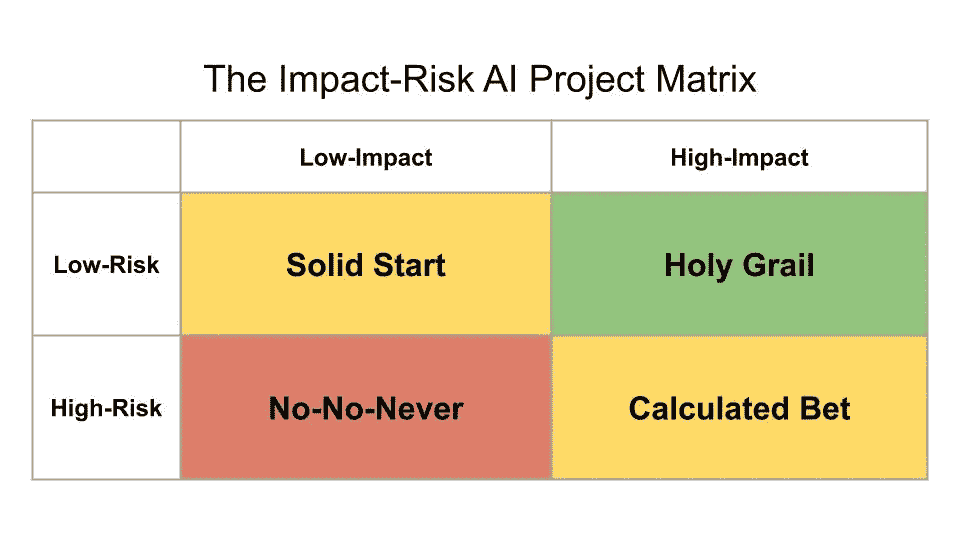
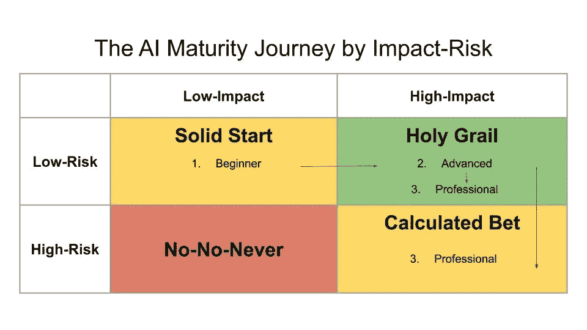

# 圣杯人工智能项目的美妙之处——以及如何找到它们

> 原文：<https://towardsdatascience.com/the-beauty-of-holy-grail-ai-projects-and-how-to-find-them-5dbbbadd7ae6?source=collection_archive---------20----------------------->

## [人工智能项目管理](https://towardsdatascience.com/tagged/project-management-ai)

## 关于下一个最佳人工智能星际飞船的排名和双倍下注的艺术。

W 面对充满人工智能(AI)项目想法的海洋，很难找到从哪里开始钓鱼的方法。公司越来越意识到人工智能的好处。在过去的六年里，私募股权部门在人工智能初创公司投资了超过[500 亿美元。你应该从哪里开始你的人工智能之旅？你是如何对不同的 AI 项目进行排名的？根据你的业务的 AI 成熟度水平，你应该专注于哪些 AI 项目？](https://www.researchgate.net/publication/325644986_Impact_of_Artificial_Intelligence_on_Business)

Photo by [Vince Fleming](https://unsplash.com/@vincefleming?utm_source=unsplash&utm_medium=referral&utm_content=creditCopyText) on [Unsplash](https://unsplash.com/?utm_source=unsplash&utm_medium=referral&utm_content=creditCopyText)

这篇文章解释了如何对不同的人工智能项目进行评估和排序。每个组织都有有限的资源，他们需要分配这些资源来最大化影响。根据你在人工智能成熟旅程中的位置，人工智能项目的影响和风险之间的权衡变得更加重要。这些见解是通过与保时捷股份公司、硅谷初创公司 Xcalar 的行业专家讨论以及我自己的经历得出的。

让我们继续读下去。🎳

# 使用影响-风险人工智能项目矩阵

评估人工智能项目的主要维度是影响和风险。影响定义了人工智能项目的价值，风险定义了项目失败的可能性。人工智能项目可以根据其估计的影响和风险水平分为四组。

低影响、低风险的人工智能项目属于“扎实起步”类别。这些项目可能有助于开始你的人工智能之旅，但一旦你的公司达到人工智能成熟度的高级水平，这些项目就不再相关了。

高影响力、低风险的人工智能项目是寻找的“圣杯”项目。这些项目都有可能成功，并对业务目标产生重大影响。如果你发现了这些项目，就牢牢抓住它们，集中精力让它们发挥作用。

The Holy Grail AI Projects everyone is looking for. Source: [Wikimedia](https://commons.wikimedia.org/wiki/File:Holy-grail-round-table-bnf-ms-120-f524v-14th-detail.jpg)

高影响、高风险的人工智能项目被认为是“计算好的赌注”。这个项目是否会成功还不确定，但是如果你的天才工程师找到了让它工作的方法，这个项目保证会有回报。

最后，低影响、高风险的人工智能项目属于“不-不-从不”类别。始终避免这些项目。即使项目成功，对底线的影响也有限。

Photo by [Lubo Minar](https://unsplash.com/@bubo?utm_source=unsplash&utm_medium=referral&utm_content=creditCopyText) on [Unsplash](https://unsplash.com/?utm_source=unsplash&utm_medium=referral&utm_content=creditCopyText)

现在，你如何评估人工智能项目的影响和风险来对它们进行排序？下面几节将深入探讨这两个标准。

# 影响

如果一个人工智能项目影响了商业目标，那么它就是有意义的。每个公司都有目标，KPI，或称 [OKRs](/the-power-of-goal-setting-for-your-data-science-project-9338bf475abd) ，以此来指导业务。一些公司甚至采用了成功的[人工智能策略](/the-secrets-to-a-successful-ai-strategy-d241adda5832)。人工智能项目应该支持人工智能策略，从而支持商业目标。

Photo by [James Toose](https://unsplash.com/@portablepeopleproductions?utm_source=unsplash&utm_medium=referral&utm_content=creditCopyText) on [Unsplash](https://unsplash.com/?utm_source=unsplash&utm_medium=referral&utm_content=creditCopyText)

## 所有产生的影响是相等的吗？

[前微软研究员、现保时捷公司创新经理 Tobias Grosse-Puppendahl](https://www.linkedin.com/in/tobias-grosse-puppendahl-54a6b2121/) ，区分了人工智能提供的三类价值:业务、客户和知识价值。商业价值通过新产品或降低成本直接影响公司的财务状况。客户价值侧重于推动用户参与。知识价值使员工能够采用新技能或在未来做出更明智的决策(例如通过收集有价值的数据)。

根据您公司的情况，侧重于将影响与这三个方面联系起来。

## 你如何计算人工智能项目的潜在影响？

低影响力和高影响力人工智能项目之间的区别在于可寻址受众的规模和财务机会。您可以将影响定义为

*影响力=潜在受众*机会。*

潜在受众是指受变更影响的用户、员工或产品数量。机会解决财务或 KPI 数据的预期变化。这包括交付项目的成本。你可以通过将你的情况与竞争对手的结果或你自己的预测进行比较来估计机会。将这两个因素相乘，你就有了一个衡量影响的尺度。

Photo by [Miguel Henriques](https://unsplash.com/@miguel_photo?utm_source=unsplash&utm_medium=referral&utm_content=creditCopyText) on [Unsplash](https://unsplash.com/search/photos/audience?utm_source=unsplash&utm_medium=referral&utm_content=creditCopyText)

例如，让我们假设你有 1000 个用户，他们平均每月在你的网站上花费 10 美元。我们预计推荐系统将增加 5%的利润。作为对比，[麦肯锡](https://www.mckinsey.com/industries/retail/our-insights/how-retailers-can-keep-up-with-consumers)表示，推荐引擎已经为亚马逊创造了超过 35%的收入。由于我们不是亚马逊，5%的涨幅似乎是合理的。这相当于(1000 * 10 美元)* 0.05 =每月额外利润 500 美元。很高兴我们锁定了我们的[业务基础](/business-basics-for-data-scientists-862f116a82da)！如果我们计算所有项目的影响，我们可以将它们分成高影响或低影响类别。

# 风险

风险是指在给定时间、成本和质量限制的情况下，项目不成功的可能性。项目的风险越大，失败的可能性就越大。

Photo by [Loic Leray](https://unsplash.com/@loicleray?utm_source=unsplash&utm_medium=referral&utm_content=creditCopyText) on [Unsplash](https://unsplash.com/?utm_source=unsplash&utm_medium=referral&utm_content=creditCopyText)

## 什么因素定义了人工智能项目的风险？

每个人工智能项目都通过数据、算法和基础设施来满足人工智能的三位一体。如果数据不可用，算法是一个新的领域，并且你没有合适的基础设施，那么实现一个人工智能项目就变得非常困难。因此，它变得更加危险。

[OpenAI 的 Josh Tobin](https://fullstackdeeplearning.com/march2019) 在[全栈深度学习](https://fullstackdeeplearning.com/march2019)课程中指出，定义人工智能项目可行性的主要因素是数据可用性、准确性要求和问题的复杂性。一般来说，数据标注和精度要求往往是主要的成本因素([第 2 周，Min 29](https://fullstackdeeplearning.com/march2019) )。需要的标记数据越多，精度要求越高，项目的成本就越高。制造自动驾驶汽车需要很高的精确度，因此非常昂贵。另一方面，创建一个基本的在线推荐器通常具有有限的数据标记和准确性要求，因此更便宜且风险更小。

Photo by [Matthew Szlichta](https://unsplash.com/photos/utIhBw00Jxs?utm_source=unsplash&utm_medium=referral&utm_content=creditCopyText) on [Unsplash](https://unsplash.com/?utm_source=unsplash&utm_medium=referral&utm_content=creditCopyText)

前谷歌项目经理丽贝卡·叶(Rebecca Ye)现在是创业公司 XCalar 的联合创始人和首席运营官，她将与商业成果的联系作为每个人工智能项目的主要风险因素。丽贝卡看到许多大公司刚刚开始使用人工智能。为了进行可持续的投资和实施人工智能，来自业务部门的拉动至关重要。人工智能项目应该明白他们需要满足商业目标。

现在我们有了 AI 项目的风险因素列表，让我们标准化 AI 项目风险评估。

## 你可以用什么工具来定义人工智能项目的风险？

虽然人工智能项目的风险不像影响那样容易计算，但是[人工智能项目画布](/introducing-the-ai-project-canvas-e88e29eb7024)可以作为评估风险的良好代理。AI 项目画布检查项目的价值主张、数据、客户和财务视角。因此，它回答了 Josh 和 Rebecca 在上面提到的主要因素。

你能在 AI 项目画布中回答的类别越多，你的 AI 项目的风险就越低。如果你有一个清晰的价值定义，数据随时可用，你知道如何将产品运送给你的客户，并且你关注项目财务，那么你就走上了成功之路。使用令人信服的回答类别的数量将项目分为高风险和低风险的 AI 项目。

作为最后一步，现在我们已经根据影响和风险对项目进行了排序，我们应该根据 AI 成熟度的水平来关注哪些项目？

# 根据你的人工智能成熟度水平下注

[吴恩达](https://www.linkedin.com/in/andrewyng/)，前谷歌和百度大脑负责人，现任 [landing.ai](https://landing.ai/) 首席执行官，建议公司简单地从人工智能开始。在[人工智能转型剧本](https://landing.ai/ai-transformation-playbook/)中，从人工智能项目开始是第一个要点。在在线课程[AI for everybody](https://www.coursera.org/learn/ai-for-everyone)中，他进一步解释说，从人工智能开始比拥有人工智能战略更重要。我们想更进一步，建议在开始人工智能之前先看看人工智能项目的影响和风险。

通常，踏上人工智能成熟之旅的公司会发现自己处于三个成熟水平之一:初级、高级、专业。刚起步的公司没有可用的基础设施，没有对其数据能力的概述，并且只雇佣了最初的几名数据员工。先进的人工智能组织已经成功交付了第一批人工智能项目。专业的人工智能公司已经将人工智能确立为其主要竞争优势之一，并从有效的基础设施和高技能的工程师中受益。

例如，保时捷强调人工智能是其[重点主题之一](https://www.automotiveit.com/digital-enterprise/porsche-cio-coming-out-with-the-perfect-product-idea-isnt-always-the-main-issue/38599.article)，以推动其 IT 能力的未来。

Tobias 强调了理解你的公司在人工智能成熟之旅中的位置的重要性。对他来说，当一家公司正在寻找创新的新方法来解决现有问题时，高影响、高风险的“计算赌注”人工智能项目尤其具有吸引力。创新的想法很少是低风险的，但对于一个人工智能成熟度高的公司来说是重要的。谷歌建议将你的核心/可行创新/登月项目的工作分成 70/20/10 份，以持续创新。

# 关键要点

在评估人工智能项目时，要考虑影响-风险矩阵。鉴于你在人工智能成熟之旅中的位置，专注于不同类别的人工智能项目。

*   影响=潜在受众*机会
*   风险最好通过人工智能项目画布来评估
*   如果你是从人工智能开始，寻找低影响、低风险的“扎实起步”人工智能项目开始
*   在你的第一次学习之后，专注于高影响力、低风险的“圣杯”人工智能项目来推动价值
*   一旦你已经达到人工智能的成熟期，从高影响和高风险类别中分配一些资源到“计算好的赌注”人工智能项目上

这篇文章旨在给你一个评估不同人工智能项目的实践指南。这些方法已经被尝试和测试，并在今天的工业中被应用。如果你想了解更多商业和数据科学之间的联系，**关注[媒体](https://medium.com/@janzawadzki)、 [LinkedIn](https://www.linkedin.com/in/jan-zawadzki/) 或 [Twitter](https://twitter.com/janmzawa) 上的**我。