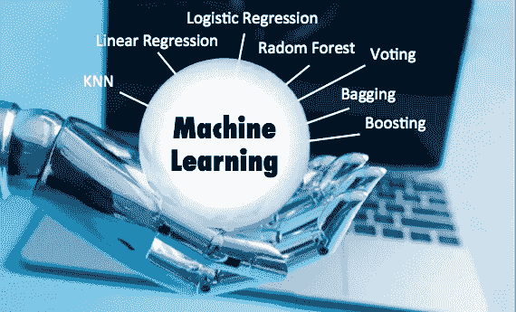
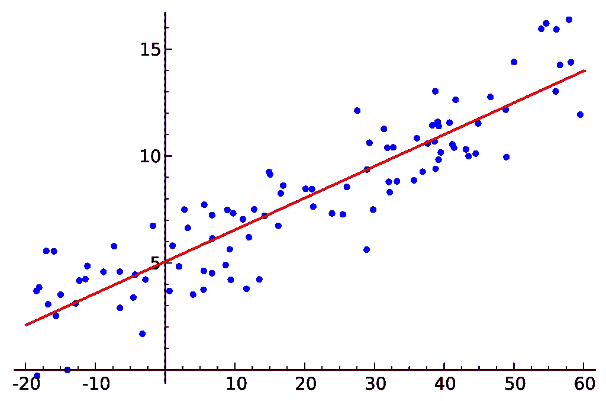
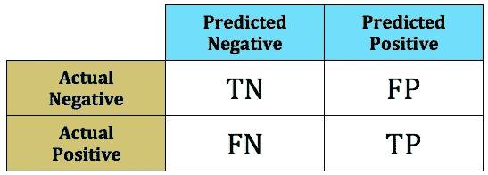
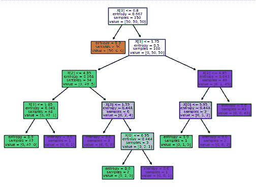
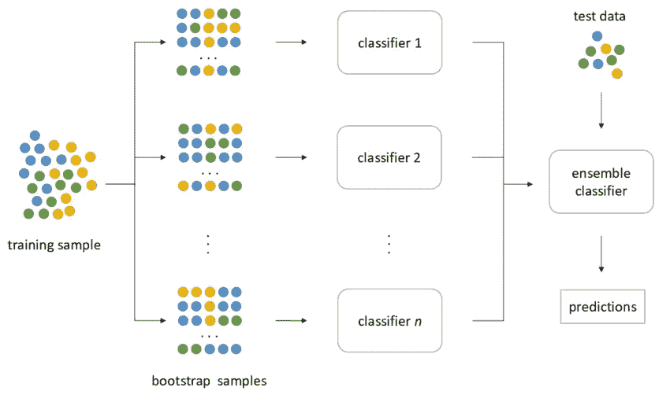
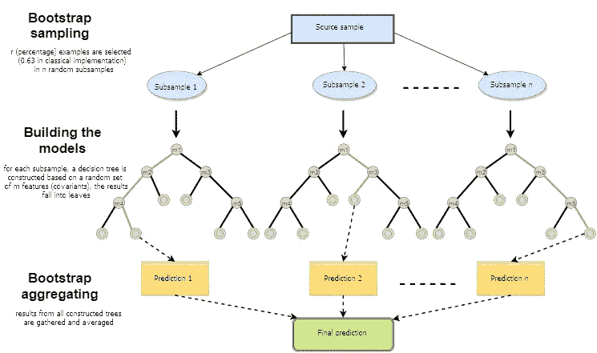

# 在 Python 中选择机器学习预测模型的数据科学家指南

> 原文：<https://towardsdatascience.com/the-beginners-guide-to-selecting-machine-learning-predictive-models-in-python-f2eb594e4ddc?source=collection_archive---------6----------------------->

## 了解如何为您的 ML 项目选择最佳模型。

Photo by [Franck V.](https://unsplash.com/@franckinjapan?utm_source=medium&utm_medium=referral) on [Unsplash](https://unsplash.com?utm_source=medium&utm_medium=referral)

本文提供了 Python 中一些预测性机器学习模型的快速概述，并为针对数据科学问题选择正确的模型提供了指导。

近年来，随着机器计算能力的提高，预测建模经历了一场革命。我们现在能够在多个内核上以数 GHz 的速度运行数千个模型，使预测建模比以往任何时候都更高效、更经济。虚拟机，例如亚马逊网络服务(AWS)提供的虚拟机，为我们提供了实际上无限的定量能力(当然成本很高！).

然而，每个数据科学家面临的一个基本问题是:

> 哪种预测模型更适合手头的问题？

回答这个问题可以归结为每个机器学习问题中的一个基本问题:

> 你试图预测的目标是什么样子的？

如果你试图预测一个**连续目标**，那么你将需要一个**回归模型**。

但是如果你试图预测一个**离散目标**，那么你将需要一个**分类模型**。

# **Python 中的回归模型:**

Regression Modeling — [https://en.wikipedia.org/wiki/Regression_analysis](https://en.wikipedia.org/wiki/Regression_analysis)

*   **线性回归:**当您预测一个连续模型，并且您的目标在-∞和+∞(如温度)之间变化时，最佳模型是线性回归模型。根据您可能拥有的预测值(即特征)的数量，您可以使用简单线性回归(SLR)或多元线性回归(MLR)。这两者在 Python 中使用相同的包:`sklearn.linear_model.LinearRegression()` [关于这一点的文档可以在这里找到](https://scikit-learn.org/stable/modules/generated/sklearn.linear_model.LinearRegression.html)。
*   **伽马回归:**当对具有 0 到+∞分布的目标进行预测时，那么除了线性回归之外，具有`Gamma Distribution`的广义线性模型(GLM)可用于预测。关于 GLM 的详细信息可以在这里找到。

# Python 中的分类模型

Python 提供了许多分类模型。在这一节中，我们回顾一下`[scikit-learn](https://scikit-learn.org)`库中一些广泛使用的模型。

*   **逻辑回归(LogReg):** 该模型用于预测多类目标。与 K_Nearest Neighbors (kNN)不同，该模型在线性情况下工作良好。SciKit-Learn 在其线性模型库中提供了这个包:`sklearn.linear_model.LogisticRegression()` [关于这个的文档可以在这里找到](https://scikit-learn.org/stable/modules/generated/sklearn.linear_model.LogisticRegression.html)。
*   **KNN(或 K 近邻)**为非参数模型，其中 logistic 回归为参数模型。一般来说， **KNN** 比 LogReg 模型效率低，支持非线性解。该模型根据特定类的最近邻居数量(顾名思义)对目标进行分类。这里可以找到`sklearn.neighbors.KNeighborsClassifer` [的文档。](https://scikit-learn.org/stable/modules/generated/sklearn.neighbors.KNeighborsClassifier.html)需要注意的是，`sklearn`还提供了一个`KNeighborsRegressor`，本文未涉及。

# 分类问题的混淆矩阵

我的关于**[**用 Python 评估机器学习分类问题:重要的 5+1 度量**](https://medium.com/@minaienick/evaluating-machine-learning-classification-problems-in-python-5-1-metrics-that-matter-792c6faddf5) 的文章提供了分类性能度量的概述，以及这些模型的**混淆矩阵**和**混淆度量**的定义。**

****

**Structure of a Binary Classification Confusion Matrix [https://medium.com/@minaienick/evaluating-machine-learning-classification-problems-in-python-5-1-metrics-that-matter-792c6faddf5](https://medium.com/@minaienick/evaluating-machine-learning-classification-problems-in-python-5-1-metrics-that-matter-792c6faddf5)**

# **高级分类器/回归器模型**

**Python 库提供了许多算法，如 SciKit-Learn、XGBoost 和……其中一些算法既提供了分类器又提供了回归器，还提供了许多用于定制的参数。**

*   ****决策树:**决策树提供可定制的模型，同时也是更加优化的模型的基础，如 **RandomForest** 或 **GradientBoosting** 。[文档可在此处找到。](https://scikit-learn.org/stable/modules/tree.html)决策树是非参数监督学习，因此能够处理异常值和相关变量。但是，它们很容易过度适应训练数据集，用户应该小心这个问题。**

****

**Visualization of a Decision Tree — [https://scikit-learn.org/stable/modules/tree.html](https://scikit-learn.org/stable/modules/tree.html)**

*   ****Bagging 模型(或集成):** Bagging 分类器在原始数据集的随机子集上拟合基本分类器(例如决策树或任何其他分类器)，然后聚合这些分类器以获得最终预测。这可以通过投票或平均来实现。[更多关于](https://scikit-learn.org/stable/modules/generated/sklearn.ensemble.BaggingClassifier.html) `[sklearn.ensemble.BaggingClassifier](https://scikit-learn.org/stable/modules/generated/sklearn.ensemble.BaggingClassifier.html)` [的细节可以在这里找到。](https://scikit-learn.org/stable/modules/generated/sklearn.ensemble.BaggingClassifier.html)**

****

**Bagging Approach — “Data Mining: Accuracy and Error Measures for Classification and Prediction” , Paola Galdi Roberto Tagliaferri**

*   ****随机森林:**随机森林模型类似于装袋模型，但有区别。[根据 Sklearn 关于](https://scikit-learn.org/stable/modules/generated/sklearn.ensemble.RandomForestClassifier.html) `[sklearn.ensemble.RandomForstClassifie](https://scikit-learn.org/stable/modules/generated/sklearn.ensemble.RandomForestClassifier.html)r` [:](https://scikit-learn.org/stable/modules/generated/sklearn.ensemble.RandomForestClassifier.html) *的文档，“随机森林是一种元估计器，它在数据集的各个子样本上拟合多个决策树分类器，并使用平均来提高预测精度和控制过拟合。子样本大小始终与原始输入样本大小相同，但样本是替换抽取的。*这种类型的模型有许多优点，包括高学习速度、可扩展性、模型的非迭代性质(它总是收敛的)。该模型的另一个重要优点是，它可以处理不平衡的情况，并可以利用 bootstrapping 来处理这种情况。但是，该模型可能会占用大量内存，并且可能会过度适应定型数据集。[本文很好地总结了这一模式。](https://www.mql5.com/en/articles/3856)**

****

**General Scheme of a Random Forest Model — [https://www.mql5.com/en/articles/3856](https://www.mql5.com/en/articles/3856)**

*   ****投票模型:**投票模型可以将多个模型打包在一个模型下。Sklearn 文档称之为 [*“用于不适合估计器的软投票/多数规则分类器。”*](https://scikit-learn.org/stable/modules/generated/sklearn.ensemble.VotingClassifier.html) 在这个模型中，可以给每个投票模型分配一个权重，这样不合适的模型就会被打折扣。这类似于 bagging，但适用于不同的模型和不同的权重(Bagging 仅适用于一个基础模型，然后对预测值进行平均)。`[sklearn.ensemble.VotingClassifier](https://scikit-learn.org/stable/modules/generated/sklearn.ensemble.VotingClassifier.html)`有关于这款车型的更多细节。**
*   ****Boosting 模型:**在 Boosting 模型中，每棵树根据其准确性获得一个重要性权重。更精确的模型将具有更高的权重，因此对最终预测的贡献更大。高度不准确的模型将被负权重惩罚，这意味着它们的预测将在最终预测中被逆转。助推模型有多种，但值得注意的有:`[sklearn.ensemble.GradientBoostingClassifier](https://scikit-learn.org/stable/modules/generated/sklearn.ensemble.GradientBoostingClassifier.html)`和`[sklearn.ensemble.AdaBoostingClassifier](https://scikit-learn.org/stable/modules/generated/sklearn.ensemble.AdaBoostClassifier.html)`。**

# **Scikit-Learn 算法备忘单**

**Scikit-Learn 开发了一个流程图，用于根据样本的特性、特征(或预测值)和目标为机器学习问题选择正确的模型。[此互动备忘单可在此处找到。](https://scikit-learn.org/stable/tutorial/machine_learning_map/index.html)**

****

**Scikit-learn Algorithm Cheat-Sheet ([https://scikit-learn.org/stable/tutorial/machine_learning_map/index.html](https://scikit-learn.org/stable/tutorial/machine_learning_map/index.html))**

# **最后的想法…**

**当谈到机器学习预测模型时，这篇文章几乎没有触及表面。为此目的已经开发了许多包(并且仍在增加),这将需要大量的时间来复习和学习。学习这些模型的最好方法是在实际项目中使用它们。我希望这篇文章可以作为为您的数据科学项目选择正确模型的指南，并帮助您完成数据科学之旅。**

*****尼克·米奈，*** *博士(* [*LinkedIn 简介*](https://www.linkedin.com/in/nickminaie/) *)是一位高级顾问和富有远见的数据科学家，代表了领导技能、世界级数据科学专业知识、商业敏锐度和领导组织变革能力的独特组合。他的使命是推进人工智能(AI)和机器学习在行业中的实践。***