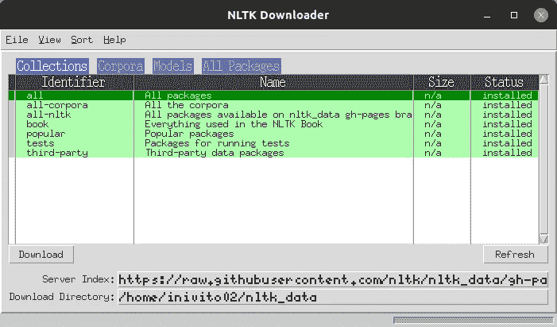

# 自然语言处理的开端

> 原文：<https://towardsdatascience.com/the-beginning-of-natural-language-processing-74cce2545676?source=collection_archive---------33----------------------->


让我们都回到人类生活的早期阶段，早期人类用不同的手势相互交流，在一定程度上，今天我们在世界各地使用 7000 多种语言。对于早期人类来说，这是一个相当大的成就，这使得人类有别于世界上的其他生物，这就是沟通的艺术。

现在，我们通过一种被称为“**自然语言处理”的新方法与计算机进行互动，将这种艺术推向了一个新的高度它与自然语言和计算机之间的交互有关。它是人工智能和计算语言学的主要组成部分之一。它提供了计算机和人类之间的无缝交互，并在机器学习的帮助下赋予计算机理解人类语言的能力。**

NLP 的历史可以追溯到 1971 年，当时美国国防高级研究计划局(DARPA)将 NLP 用于语音的鲁棒自动转录(rat ),以执行与通过极度嘈杂和/或高度失真的通信信道接收的包含语音的信号相关的任务。


2011 年，苹果在 iPhone 中引入了 Siri，这为 NLP 的各种应用带来了突破。


如今，我们都知道聊天机器人在各种公司中有多重要，例如信使、公司网站、银行、客户服务等等。

因此，让我们借助 Python 编程语言，开始我们学习这项蓬勃发展的技术的旅程。

## Python 和 NLTK 入门:

Python 是不同机器学习活动中使用最多的语言，其中一个主要原因是支持不同的第三方包。为了学习 NLP，我们需要首先安装“**NLTK”**，可以从[http://www.nltk.org](http://www.nltk.org/)免费下载，并按照那里的说明下载您的平台所需的版本。

一旦安装了 NLTK，就可以按照下面的命令安装所需的数据

```
import nltk
nltk.download()
```



一旦你运行了命令，你将得到上面的窗口，在这里你可以从你想要安装的软件包列表中选择。一旦你安装了所有必要的软件包，我们就可以开始探索它们了。

**标准自然语言处理工作流程**

我假设您知道 CRISP-DM 模型，这是执行任何数据科学项目的典型行业标准。任何基于 NLP 的问题都可以通过包含一系列步骤的系统工作流来解决。下图描述了主要步骤。


我们通常从文本文档的语料库开始，并遵循文本争论和预处理、解析和基本探索性数据分析的标准流程。基于最初的见解，我们通常使用相关的特征工程技术来表示文本。根据手头的问题，我们要么专注于建立预测的监督模型，要么专注于无监督模型，后者通常更专注于模式挖掘和分组。最后，我们与相关利益相关者或客户一起评估模型和整体成功标准，并部署最终模型以供将来使用。

**预处理**

清理和预处理文本数据通常涉及多个步骤。我将强调自然语言处理(NLP)管道中大量使用的一些最重要的步骤，我经常在我的 NLP 项目中使用它们。

**1)标记化**

通过使用空格和标点符号分隔单词将文本分成小块的过程。

为了实现这一点，我们需要使用 nltk.word_tokenize()

**代号:**

```
string = ‘Virat Kohli is the best batsmen in the world’
tokens = nltk.word_tokenize(string)
tokens[‘Virat’, ‘Kohli’, ‘is’, ‘the’, ‘best’, ‘batsmen’, ‘in’, ‘the’, ‘world’]
```

上面的列表是我们的字符串的记号，也称为 Unigrams，我们还可以从这些记号中创建二元、三元、n 元，如下所示:

**二元模型:**

二元模型是由两个连续单词组成的记号。

**代码**:

```
tokens_bigrams = list(nltk.bigrams(tokens))
tokens_bigrams[(‘Virat’, ‘Kohli’),
(‘Kohli’, ‘is’),
(‘is’, ‘the’),
(‘the’, ‘best’),
(‘best’, ‘batsmen’),
(‘batsmen’, ‘in’),
(‘in’, ‘the’),
(‘the’, ‘world’)]
```

**三元模型:**

三元模型是由三个连续单词组成的记号。

**代码**:

```
tokens_trigrams = list(nltk.trigrams(tokens))
tokens_trigrams[(‘Virat’, ‘Kohli’, ‘is’),
(‘Kohli’, ‘is’, ‘the’),
(‘is’, ‘the’, ‘best’),
(‘the’, ‘best’, ‘batsmen’),
(‘best’, ‘batsmen’, ‘in’),
(‘batsmen’, ‘in’, ‘the’),
(‘in’, ‘the’, ‘world’)]
```

**n 语法:**

n 元语法是有 n 个连续单词的记号，我们可以在代码中指定。

**代码**:

```
tokens_ngrams = list(nltk.ngrams(tokens,4))
tokens_ngrams[(‘Virat’, ‘Kohli’, ‘is’, ‘the’),
(‘Kohli’, ‘is’, ‘the’, ‘best’),
(‘is’, ‘the’, ‘best’, ‘batsmen’),
(‘the’, ‘best’, ‘batsmen’, ‘in’),
(‘best’, ‘batsmen’, ‘in’, ‘the’),
(‘batsmen’, ‘in’, ‘the’, ‘world’)]
```

这些不同的记号化方法对你的 NLP 项目非常有帮助。

**2)词干**

要理解词干，你需要了解词干代表什么。词干也被称为单词的基本形式，我们可以通过在词干上附加词缀来创造新单词，这一过程称为词尾变化。考虑跳跃这个词。你可以给它加上词缀，组成新词，比如 JUMPS，JUMPED 和 JUMPING。在这种情况下，基本词 JUMP 是词干。

该图显示了词干是如何出现在所有词形变化中的，因为词干构成了词缀构成每个词形变化的基础。从一个词的词尾变化形式获得其基本形式的逆过程称为词干提取。词干分析帮助我们将单词标准化为词根或词根，而不管它们的词形变化，这有助于许多应用，如分类或聚类文本，甚至在信息检索中。现在让我们来看看流行的波特梗

**代号:**

```
def simple_stemmer(text):
    ps = nltk.porter.PorterStemmer()
    text = ' '.join([ps.stem(word) for word in text.split()])
    return text
simple_stemmer("My system keeps crashing his crashed yesterday, ours crashes daily")‘My system keep crash hi crash yesterday, our crash daili’
```

请注意，词干通常有一套固定的规则，因此，词根可能在词典上不正确。这意味着，词干单词可能在语义上不正确，并且可能不在字典中(从前面的输出中可以明显看出)。

3) **词汇化**

词汇化与词干化非常相似，我们去掉词缀来获得单词的基本形式。然而，在这种情况下，基本形式被称为词根，而不是词干。区别在于词根在词典中总是正确的(存在于词典中)，但是词根可能不是这样。因此，词根，也称为引理，将始终存在于字典中。

**代号:**

```
from nltk.stem import WordNetLemmatizer
from nltk.stem import wordnetword_lem = WordNetLemmatizer()
word_lem.lemmatize("My system keeps crashing his crashed yesterday, ours crashes daily")'My system keeps crashing his crashed yesterday, ours crashes daily'
```

你可以看到单词的语义并没有受到影响，然而我们的文本仍然是标准化的。

请注意，词干化过程比词干化慢得多，因为当且仅当词条存在于词典中时，通过从单词中移除词缀来形成词根形式或词条还需要一个额外的步骤。

**4)删除停用词**

意义不大或没有意义的单词，尤其是当从文本中构造有意义的特征时，被称为停用词。如果你在语料库中做一个简单的术语或词频，这些通常是出现频率最高的词。通常，这些可以是冠词、连词、介词等等。停用词的一些例子是 a、an、the 等等。

**代码:**

```
from nltk.corpus import stopwords
stopword_list = set(stopwords.words('english'))
```

如果您想了解更多关于停用词的信息，可以查看上面代码中创建的停用词列表。基于你的 NLP 问题，你甚至可以在这个列表中添加更多的单词。

```
def remove_stopwords(text, is_lower_case=False):
    tokens = nltk.word_tokenize(text)
    tokens = [token.strip() for token in tokens]
    if is_lower_case:
        filtered_tokens = [token for token in tokens if token not in stopword_list]
    else:
        filtered_tokens = [token for token in tokens if token.lower() not in stopword_list]
    filtered_text = ' '.join(filtered_tokens)    
    return filtered_textremove_stopwords("The, and, if are stopwords, computer is not")‘, , stopwords , computer’
```

就这样，我们到了这篇文章的结尾。在我的下一篇文章中，我们将看到如何构建一个文本规格化器，它将在一个函数下为我们做所有需要的预处理。

本文使用的 Jupyter 笔记本的 Github 链接:[https://github . com/sunil manu/Natural-Language-Processing-Series](https://github.com/sunilmanu/Natural-Language-Processing-Series)

**谢谢**