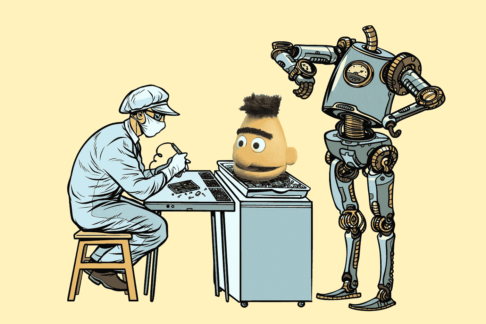

# 基于 BERT 的 DeepPavlov 文本分类模型

> 原文：<https://towardsdatascience.com/the-bert-based-text-classification-models-of-deeppavlov-a85892f14d61?source=collection_archive---------11----------------------->

DeepPavlov 是一个对话式人工智能框架，包含了构建聊天机器人所需的所有组件。DeepPavlov 是在开源机器学习框架 [TensorFlow](https://www.tensorflow.org) 和 [Keras](https://keras.io) 之上开发的。它免费且易于使用。本文描述了如何使用 DeepPavlov 的基于 BERT 的模型。



# 关于伯特

BERT(Transformers 的双向编码器表示)[1]的发布是自然语言处理(NLP)社区去年最激动人心的事件。BERT 是一种基于转换器的技术，用于预训练语言表示，它可以在各种 NLP 任务中产生最先进的结果。伯特论文被计算语言学协会北美分会评为年度最佳长篇论文。

Google Research 发布了几个预训练的 BERT 模型，包括多语言、中文和英文的 BERT。关于这些预训练模型的更多细节可以在[这里](https://github.com/google-research/bert#pre-trained-models)找到。除了已发布的模型，在 DeepPavlov，我们还为俄语培训了基于 BERT 的模型(RuBERT)。

RuBERT 基于多语言 BERT，并在俄语维基百科和新闻数据上进行训练。我们将 BERT 集成到三个下游任务中:文本分类、标注、问题回答。因此，我们在所有这些任务上都取得了重大进展。基于 DeepPavlov BERT 的模型可以在这里找到。

# BERT 预处理器

DeepPavlov NLP 管道在 config/faq 文件夹下的单独配置文件中定义。配置文件由四个主要部分组成:**数据集 _ 读取器**、**数据集 _ 迭代器**、**链接器**和**训练器**。你可以在这里阅读更多关于配置文件[的结构。](https://medium.com/deeppavlov/simple-intent-recognition-and-question-answering-with-deeppavlov-c54ccf5339a9)

所有基于 BERT 的模型的公共元素是配置文件的**链接器**部分中的**BERT _ 预处理器**块。未处理的文本应该被传递给 **bert_preprocessor** 用于标记化成子标记，用它们的索引编码子标记，并创建标记和段掩码。如果将类处理为流水线中的独热标签，则应将 **one_hot_labels** 设置为 **true** 。 **vocab_file** 参数定义了 BERT 词汇文件。

```
{
    "in": [ "x" ],    
    "class_name": "bert_preprocessor",
    "do_lower_case": false,
    "vocab_file": "{DOWNLOADS_PATH}/bert_models/multi_cased_L-12_H-768_A-12/vocab.txt",
    "out": [ "bert_features" ]
}
```

# 文本分类的 BERT

DeepPavlov 通过使用预训练的 BERT，为 NLP 中最受欢迎的任务之一——文本分类问题——提供了一个易于使用的解决方案。人们可以使用几个经过预先训练的英语、多语言和 RuBERT 模型。对于文本分类情况，对应于[CLS]令牌的最终隐藏状态(即，变换器输出)被用作分类任务的聚合序列表示。

让我们在情感分析问题上演示基于 DeepPavlov BERT 的文本分类模型。它包括确定作者对某一特定主题的态度。这可以通过应用文本分类来实现。在这种情况下，类别可以是阴性、中性和阳性。

首先，安装模型的所有需求。

```
python -m deeppavlov install rusentiment_bert
```

rusentiment _ bert 模型基于多语言环境的 bert，其最大序列长度( **max_seq_length** )等于 64。

您可以使用命令行与模型进行交互。

```
python -m deeppavlov interact rusentiment_bert -dx::I like this game>> [‘positive’]
```

或者，您可以通过 Python 代码与模型进行交互。

您可以在自己的数据上训练基于 BERT 的文本分类模型。为此，更改配置文件的 **dataset_reader** 中的 **data_path** 参数，以及分别定义训练集和测试集文件的****train**和 **test** 参数。数据文件应该是 csv 格式，由 **class_sep** 分隔(默认为 class_sep= "，)。然后以同样的方式训练模型:**

```
python -m deeppavlov train <config_file>
```

**你可以在这里阅读更多关于基于 BERT 的文本分类模型。**

****参考文献****

1.  **[https://arxiv.org/abs/1810.04805](https://arxiv.org/abs/1810.04805)**