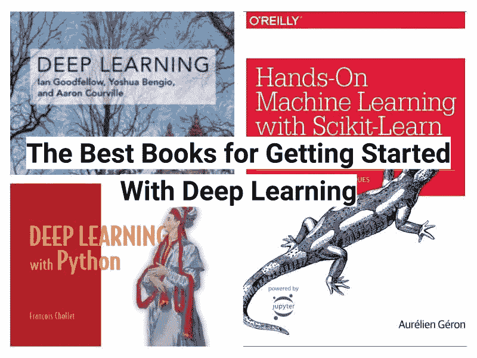

# 开始深度学习的最佳书籍

> 原文：<https://towardsdatascience.com/the-best-books-for-getting-started-with-deep-learning-df15fc6da9d1?source=collection_archive---------37----------------------->

## 如果你想跟上深度学习，你应该读哪些书？考虑从这三个中的一个或多个开始！

虽然人工神经网络的想法最初是在 20 世纪 40 年代提出的，第一个[感知器](https://en.wikipedia.org/wiki/Perceptron)是在 1958 年建造的，但深度学习领域真正开始腾飞是在过去十年里，在成功将神经网络应用于计算机视觉、自然语言处理和许多其他常见的机器学习任务方面取得了实质性突破。

但是深度学习是一个庞大且快速增长的领域。提高速度的最好方法是什么？没有哪本书会包含该领域的所有最新技术——为了跟上那些你开始阅读学术论文所需要的技术。但是在你这么做之前，你必须先在这个领域打好基础才能跟上。这里有三本书将为你提供理解与深度学习相关的最新论文所需的背景。

# 伊恩·古德菲勒、约舒阿·本吉奥和亚伦·库维尔的《[深度学习](https://www.deeplearningbook.org/)

这是一个全面的，但容易理解的领域介绍。[亚马逊页面](https://www.amazon.com/Deep-Learning-Adaptive-Computation-Machine/dp/0262035618/)清楚地表明了这本书的影响力，两位著名的数据科学家 Geoff Hinton 和 Yann LeCun，甚至 Elon Musk 都发表了评论！这可能是关于深度学习的最著名的书，如果你真的想成为一名数据科学家，你真的应该花时间去吸收。

在提供一些背景的简短介绍之后，“深度学习”被分成三个部分。第 1 部分介绍了足够的数学知识来帮助您完成本书的其余部分——线性代数、概率、信息论、数值计算和机器学习基础知识。如果你根本没有这些主题的背景知识，你可能会想就每个主题挑选一些更深入的书籍来填补你理解中的任何空白，但每个领域都有一个很好的总结，其中有足够的信息来帮助你完成本书后面的深度学习内容。

第 2 部分是本书的核心，带您了解深度学习系统的常见元素。它始于“深度前馈网络”(有时称为多层感知器)，这是所有深度学习系统的核心。然后介绍正则化(避免过度适应训练数据)、优化(有效训练网络的技术)、卷积网络(针对具有已知网格状结构的数据进行优化)以及使用递归和递归网络的序列建模(针对序列数据)。

第 3 部分然后介绍了深度学习研究的一些关键领域——从线性因子模型和自动编码器到蒙特卡罗方法和深度生成模型。

这不是一本轻量级的书，它可能很难读，因为它完全专注于理论(书中没有源代码——这是对该领域的概念性介绍)。也就是说，一旦你开始用手指敲击键盘，使用 Tensorflow 或 Pytorch 创建模型，这是开始理解你将要处理的关键主题的好方法。也有[可以免费在线](https://www.deeplearningbook.org/)。

# Aurélien Géron 的“[使用 Scikit-Learn 的动手机器学习& Tensorflow](https://www.amazon.com/Hands-Machine-Learning-Scikit-Learn-TensorFlow/dp/1491962291/)

这本书与古德费勒的大书大不相同。在短短的 500 多页中，Géron 介绍了经典的机器学习和深度学习。每一部分都以代码开始，后面是你需要理解的解释。

如果你有编程的背景，你绝对应该试试这本书。到第 77 页，除了提供机器学习过程的概述，你将已经从头到尾实现了你的第一个机器学习项目！您将体验到整个数据科学工作流程，从构建问题、清理和可视化数据，一直到选择和训练模型，然后使用网格搜索和集成方法微调模型。然后，您将了解分类、训练模型、支持向量机、决策树、其他集成方法，以及使用[主成分分析](https://en.wikipedia.org/wiki/Principal_component_analysis)进行维度缩减。

如果你主要对深度学习感兴趣，当你建立 TensorFlow 并创建你的第一个图表时，好东西从第 229 页开始。还有一种实用的、代码优先的方法，在代码周围散布足够的理论，这样你就知道发生了什么。它涵盖了深度学习的关键理论概念，包括卷积神经网络、递归神经网络、自动编码器，甚至简单地涉及了强化学习。同时，它还涵盖了关键的实际问题，如跨设备和服务器分布张量流处理(对于大多数非平凡数据集的及时训练是必不可少的)。

要知道还有一个[第二版](https://www.amazon.com/Hands-Machine-Learning-Scikit-Learn-TensorFlow/dp/1492032646)应该是 2019 年 10 月出来的。鉴于自该书两年前首次出版以来深度学习的变化速度，等待新版本可能是值得的。

# Francois Chollet 的《[用 Python 进行深度学习](https://www.amazon.com/Deep-Learning-Python-Francois-Chollet/dp/1617294438)

这本书提供了一个机器学习领域的实践，浓缩的介绍，介于“深度学习”的权威和深度与“用 Scikit-Learn & Tensorflow 实践机器学习”的实用简洁之间

它从定义人工智能、机器学习和深度学习开始。从那里，它提供了机器学习的简史，展示了决策树等传统机器学习模型如何与神经网络相关联。它还使用小代码片段提供了足够的线性代数和微积分背景，为本书的其余部分做好准备。

从那里，它介绍了 Keras——一个用于快速构建神经网络的复杂框架，并使用该库来实现二元和多类分类器，然后使用标准波士顿房价数据集进行回归。

然后，它将向您介绍一些关键概念的概述，如数据预处理、特征工程/学习、过拟合和欠拟合以及机器学习问题的工作流。从那里，它贯穿了解决计算机视觉和自然语言处理问题的实际工作的例子，介绍了一些概念，如循环神经网络(RNN 的)，甚至长期短期记忆(LSTM 的)。

如果你决定尽快构建复杂的模型，并且只愿意读一本书，假设你已经熟悉 Python 编程，这可能就是你一直在寻找的书。

# 选择你自己的冒险

如果您只是想获得一些关于机器学习的实践经验，“用 Scikit-Learn & Tensorflow 实践机器学习”是一个极好的起点。它会让你在短短 500 多页的篇幅内练习构建经典和深度学习解决方案。

如果你准备好了更深入的深度学习体验，“用 Python 进行深度学习”是理想的选择。通过使用 Keras 而不是像 TensorFlow 这样的低级框架，它允许您快速构建复杂的模型。因为它只专注于深度学习，所以与 Géron 更通用的指南相比，它向您介绍了更广泛的概念。

如果你认真理解深度学习，你应该花时间通过“深度学习”来工作。它会给你提供一个坚实的基础，然后你应该从另外两本书里挑一本开始应用这个理论。当然，每本书都有一些其他书没有的金块，所以如果你有时间和兴趣，为什么不读完这三本书呢？它会回报你在该领域理解的深度和广度上所付出的努力。

*最初发表于*[*【https://flatironschool.com】*](https://flatironschool.com/blog/the-best-books-for-getting-started-with-deep-learning)*。*