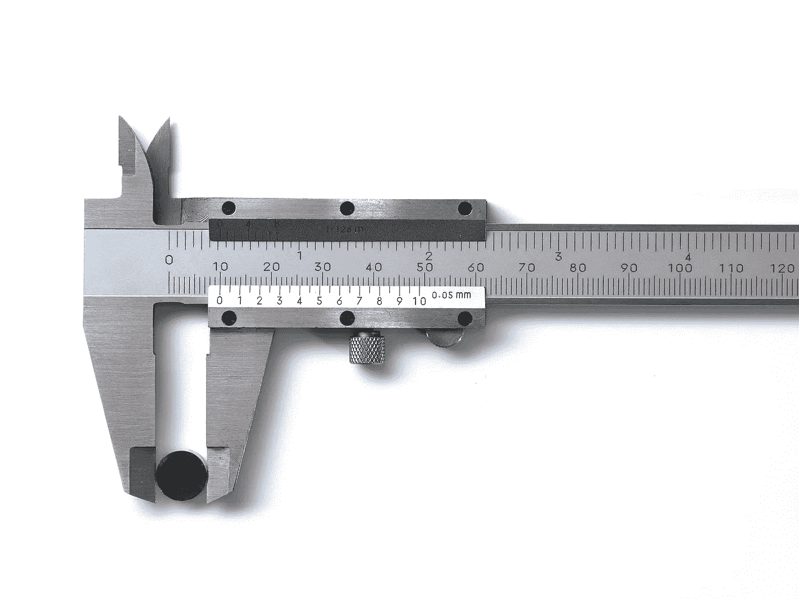
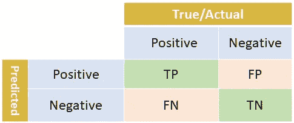
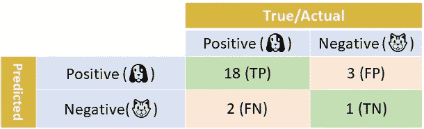
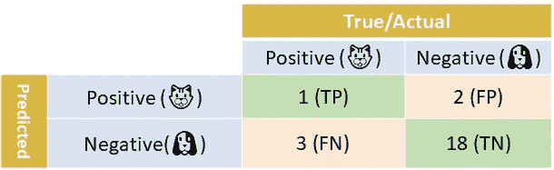
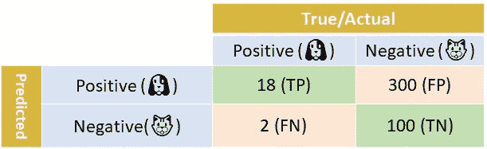
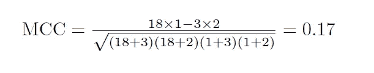
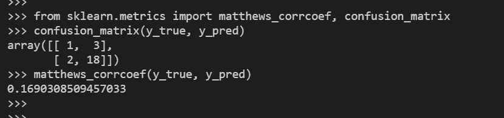

# 马修斯相关系数是你从未听说过的最好的分类标准

> 原文：<https://towardsdatascience.com/the-best-classification-metric-youve-never-heard-of-the-matthews-correlation-coefficient-3bf50a2f3e9a?source=collection_archive---------2----------------------->

恭喜你！你已经建立了一个二进制分类器——一个使用 128 个 GPU 及其专用发电站的花哨的神经网络，或者一个在你的旧 ThinkPad 上运行的健壮的逻辑回归模型。你设计了模型，输入了数据；现在终于到了衡量分类器性能的时候了。

不要误会:ROC 曲线是比较模型的最佳选择。然而，标量指标在机器学习社区中仍然很受欢迎，其中四个最常见的是*准确度*、*召回*、*精确度*和 *F1 分数*。标量度量在教科书、网络文章、在线课程中无处不在，它们是大多数数据科学家熟悉的度量。但是几周前，我偶然发现了另一个用于二进制分类的标量度量:马修斯相关系数(MCC)。在我的“发现”之后，我四处询问，惊讶地发现这个领域的许多人并不熟悉这个分类标准。作为一个重生的信徒，我是来传播福音的！

让我们从“著名的四个”指标的快速概述开始，包括讨论为什么它们有时不是非常有用，甚至完全误导。接下来，我将介绍另一个指标。

提醒一下，在二元分类法中，我们有两类:所谓的正类和负类。使用混淆矩阵来讨论分类度量是有用的，我们在为我们的二元分类器设置分类阈值之后对混淆矩阵进行计数。(不熟悉混淆矩阵？查看[我的另一篇帖子](/multi-class-metrics-made-simple-part-i-precision-and-recall-9250280bddc2)。混淆矩阵有 4 个值，对应于真实类别和预测类别的 4 种组合。下面是一个典型的混淆矩阵，TP，FP，FN，TN 代表四种组合。

Confusion Matrix

让我们看一个玩具例子:我们的数据是宠物的图像，或者是一只狗(🐶)，或者一只猫(🐱).我们的分类器在每张照片中检测到一只宠物，我们想测量它的性能。

这是我们的照片分类器的混淆矩阵。我们一共 24 张照片，18+2= **20** 狗狗照片，3+1= **4** 猫咪照片。

Dogs are “positive”

# 精确度、召回率和 F1 分数

再回顾一下*，precision* 是所有检测到的阳性中真正阳性的比例，或者简称为 TP/(TP+FP)。在我们的例子中，狗照片是积极的类别，18+3 张被归类为狗的照片中有 18 张实际上包含狗。因此，精度是 18/21=86%。*召回*是被正确分类的真阳性的数量(TP/(TP+FN))。从上面的矩阵很容易看出有 20 个真阳性，其中 18 个被成功检测到。因此，召回率为 18/(18+2)，即 90%。

最后，F1 分数是精确度和召回率的调和平均值。这算起来有 88%。奇妙的分类器，对吧？沉住气。再看一下矩阵，特别是猫照片的分类。只有 1/4 的猫照片被成功检测到。而且，被归类为猫的 3 张照片中，有 2 张其实是狗。那么为什么 F1 的分数这么高呢？

精确度和召回率(以及 F1 分数，它是两者的函数)认为一个类，正面类，是我们感兴趣的类。他们只使用混淆矩阵中的三个值:TP、FP 和 FN。第四个值——TN——没有在这些指标中使用。您可以在 TN 单元格中输入任何值—0、100、无穷大—精度、召回率和 F1 值都不会改变。

作为练习，现在让我们翻转混淆矩阵。让我们认为“猫”是一个积极的类，也就是我们感兴趣的类。爱猫人士，欢喜！这是新的混淆矩阵。请记住，这是*与之前的*完全相同的分类器。

Cats are “positive”

快速计算显示，现在准确率为 33%，召回率为 25%，F1 得分为 29% —哎呀！我们的分类器在给猫分类方面很糟糕。让我们继续下去，看看整体的准确性——也许这将是我们的救赎。话说回来，也许不是。

# 准确(性)

准确度是被正确分类的样本的比例。让我们再次看看我们最初的混淆矩阵:

总共有(TP+FP)+(FN+TN)=20+4= **24** 个样本，TP+TN= **19** 被正确分类。因此，准确率达到了惊人的 79%。但是这是相当误导的，因为尽管 90%的狗被准确地分类，但是对猫来说只有 25%。如果你平均 90%和 25%，你会得到 57.5%的平均准确率，这比分类器的准确率 79%低得多。原因是什么？在我们的数据集中，狗的样本比猫的样本多得多。班级不平衡。

为了查看类别不平衡如何影响准确性，想象现在不是 4 张猫照片，而是我们有 100 组这 4 张照片，总共 400 张照片。由于我们使用相同的分类器，400 张照片中的 100 张将被正确分类，300 张将被错误分类。下面是相应的混淆矩阵:

So many cats!

快速计算表明，现在的准确度低得多(100+18)/(400+20)=28%，因为猫现在是多数类。新的类别比例也会影响精度(但不会影响召回率——检查！)，因此 F1 的分数。

# 马修斯救援相关系数

到目前为止，我们已经看到了经典度量的一些问题:准确性对类别不平衡很敏感；精确度、召回率和 F1 分数是不对称的。那么该怎么办呢？如果对这两个类都感兴趣，可以将二进制分类问题视为具有两个类的*多类*问题，然后计算相应的多类度量:微观或宏观平均精度、召回率和 F1 分数。(要了解更多关于多级指标的信息，请查看我的**多级指标简化版**系列、[第一部分](/multi-class-metrics-made-simple-part-i-precision-and-recall-9250280bddc2)和[第二部分](/multi-class-metrics-made-simple-part-ii-the-f1-score-ebe8b2c2ca1)；另外，请看我关于 [kappa 分数的帖子，也被称为科恩的 kappa 系数](/multi-class-metrics-made-simple-the-kappa-score-aka-cohens-kappa-coefficient-bdea137af09c)

对于二进制分类，还有另一个(也可以说是更优雅的)解决方案:将真实类和预测类视为两个(二进制)变量，并计算它们的*相关系数*(以类似于计算任何两个变量之间的相关系数的方式)。真实值和预测值之间的相关性越高，预测就越好。这是应用于分类器时的*φ系数* (φ)，改名为**马修斯相关系数** ( **MCC)** 。计算 MCC 不是火箭科学:

MCC 的一些好的性质可以容易地从这个公式中导出:当分类器是完美的(FP = FN = 0)时，MCC 的值是 1，表示完美的正相关。相反，当分类器总是误分类(TP = TN = 0)时，我们得到的值为-1，代表完美的负相关(在这种情况下，您可以简单地反转分类器的结果，以获得理想的分类器)。事实上，MCC 值总是在-1 和 1 之间，0 表示分类器不比一个公平硬币的随机投掷好。MCC 也是完全*对称的*，所以没有哪个类比另一个更重要；如果你转换正负，你仍然会得到相同的值。

MCC 考虑混淆矩阵中的所有四个值，并且*高值(接近 1)意味着两个类别都被很好地预测*、*、*，即使一个类别被不成比例地欠(或过)代表。

我们现在都准备好了！让我们为我们的原始分类器计算 MCC。这是混淆矩阵:

输入数字，我们发现:

哎哟！0.17 的相关性表示预测类和真实类是弱相关的。我们知道确切的原因。我们的分类器不擅长给猫分类。

最后，您不需要编写自己的 MCC 函数——它的[已经包含在 scikit-learn 的](https://scikit-learn.org/stable/modules/generated/sklearn.metrics.matthews_corrcoef.html)中。下面是验证上述计算的代码片段:

就是这样。那是邮件。您现在拥有了另一个指标。明智地使用它！

希望你觉得这篇文章有趣、有用并且容易理解。

*喊出*[蒂林娜](https://towardsdatascience.com/@chaturangarajapakshe) *。正是由于他和他非常有用和优雅的* [*简单变形金刚*](/simple-transformers-introducing-the-easiest-bert-roberta-xlnet-and-xlm-library-58bf8c59b2a3) *库，我接触到了这个度量。*