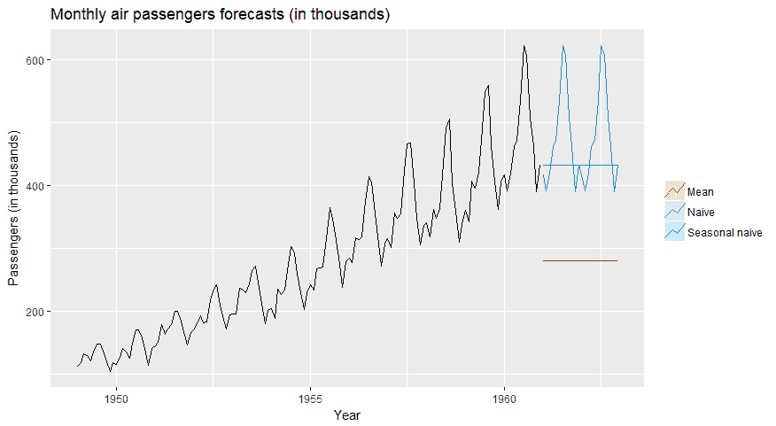
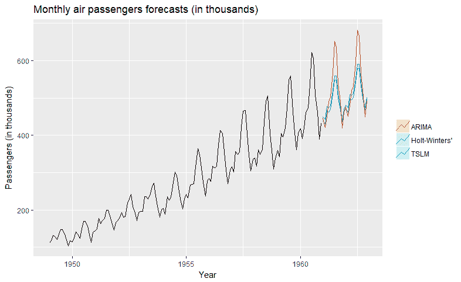

# 最佳预测技术或如何根据时间序列数据进行预测

> 原文：<https://towardsdatascience.com/the-best-forecast-techniques-or-how-to-predict-from-time-series-data-967221811981?source=collection_archive---------2----------------------->

时间序列预测在工业或商业的许多分支中有许多应用。它允许预测产品需求(从而优化生产和仓库存储)，预测销售收入(调整公司开支)或预测股票价格的未来值。在本文中，我将尝试目前的基本方法来实现这一目标。我们将从描述最流行的模型开始，然后转移到模型评估，这表明了给定预测问题的最佳方法。

## **工具**

有很多种软件可以用于时间序列预测——使用 Python、R、Matlab 和许多其他语言都可以轻松完成。在我们这里使用的 R 中，也有相当多的软件包使预测变得更简单，[预测](https://cran.r-project.org/web/packages/forecast/index.html)，[预言家](https://cran.r-project.org/web/packages/prophet/index.html)，或者 [xts](https://cran.r-project.org/web/packages/xts/index.html) ，这里仅举几个例子。包的完整列表及其描述可在[时间序列 CRAN 任务视图](https://cran.r-project.org/web/views/TimeSeries.html)中找到。

## **时间序列模型**

在进入复杂的时间序列模型之前，我们将讨论一些简单的模型，它们构成了进一步预测的基础。如果一个复杂的方法不能提供更好的结果，那么使用它们是没有意义的。

1.  平均值-预测值等于时间序列的平均值。
2.  Naive 预测值等于时间序列的最后一个值。
3.  季节性简单预测-给定季节的预测值等于该季节前一个完整周期的值，例如，2019 年 1 月的预测值等于 2018 年 1 月的时间序列值。

*图:航空公司月度乘客基线预测。*

时间序列线性模型(TSLM)只是一个线性回归模型，它根据一些预测因素(最常见的是线性趋势和季节性)来预测所需的值:

> yt =a1x1，t+a2x2，t+…+anxn，t+b+et，

其中 *xi，t* 是一些预测值， *ai* 和 *b* 是要估计的回归系数。两个最常用的预测指标是趋势和季节性。前者只是对数据的线性趋势进行建模，只有趋势预测值的模型可以写成:

> yt = at +b+et。

季节性预测因子是虚拟变量，表示进行预测的时期(如月、季度)。

指数平滑是另一种预测时间序列的有用方法。基本思想是将时间序列的未来值预测为过去观测值的加权平均值，其中权重随时间呈指数下降-观测值越老，对预测的影响越小。该方法可以扩展到包括趋势([霍尔特的](https://otexts.com/fpp2/holt.html)方法，又名双指数平滑)或趋势和季节性([霍尔特-温特斯](https://grisha.org/blog/2016/01/29/triple-exponential-smoothing-forecasting/)方法)。在这些模型中，趋势和季节性系数也被计算为一些表达式的加权平均值。指数平滑法是预测时间序列的有效方法。基本思想是将时间序列的未来值预测为过去观测值的加权平均值，其中权重随时间呈指数下降:

> yt = a yt-1+a(1-a)yt-2+a(1-a)2yt-3+…，

其中 a(0，1)是应该被估计的平滑参数。上述方法可以扩展到包括趋势(霍尔特的方法，又名双指数平滑)或趋势和季节性(霍尔特-温特斯的方法，又名三指数平滑)。在这些模型中，趋势和季节性系数也被计算为一些表达式的加权平均值。尽管这个想法很简单，但是公式更复杂，我们就不讨论技术细节了。感兴趣的读者可以参考 Hyndman 和 Athanasopoulos 的关于时间序列预测的书[1]。

(自回归综合移动平均)模型使用完全不同的方法。自回归( *AR* )部分考虑了先前值对预测值的影响:

> yt=a1yt-1+a2yt-2+et，

而移动平均( *MA* )模拟噪声对未来值的影响。

> yt=et+b1et-1+b2et-2，

其中 *et* 为随机噪声项。在上面的例子中，每个噪声项影响三个连续的 *yt* 值。实际上，这种噪声术语可能反映了一些意外事件，例如影响股票市场的政治家声明。

实际上，这种噪声术语可能反映了一些意外事件，例如影响股票市场的政治家声明。

AR 和 MA 模型可以简单地合并成 ARMA 模型，如下所示:

> yt = et+b1et-1+b2et-2+a1yt-1+a2yt-2。

ARIMA 的*集成*部分对应的是 ARMA 模型如何拟合的技术问题。基本上，只有让它们符合平稳的时间序列才有意义。使非平稳数据平稳化的一种方法是从中减去滞后值(差值)。这就是 ARIMA 在拟合 ARMA 之前所做的——它对数据进行多次差分，直到得到足够平稳的数据。

*图航空公司月度旅客预测。*

## **评测**

[模型选择](https://addepto.com/automated-machine-learning-tasks-can-be-improved/)几乎是每个机器学习项目都会涉及到的问题。一种方法是将数据分成训练集和测试集，并在训练集上学习模型后在测试集上计算一些误差度量。然而，这个过程不同于机器学习中经常使用的随机训练测试分割。有了时间序列数据，我们不能简单地选择随机点，而是将一些分割点之前的所有观察值放入训练集，其余的放入测试集。这反映了我们的模型在现实中的应用——我们从历史数据中学习，然后预测未来。

另一种方法是使用时间序列交叉验证(也称为滚动预测起源过程)——我们创建许多具有不同分割点的训练测试分割，然后在每个分割上评估模型。

自然出现的问题是，我们应该使用什么样的指标来判断模型的表现。最受欢迎的是

*   平均绝对误差，它表明我们的预测平均与真实值相差多少，
*   平均绝对百分比误差，表示预测值与真实值相差的百分比。

## **结论**

我们已经解释了时间序列预测的基础知识。显然，每个问题都有自己的微妙之处，需要特殊的步骤(例如[适当的数据准备](https://addepto.com/process-huge-data-sets-using-big-data-technology/)，处理缺失值的方式，或者定义满足某些业务条件的评估指标)，因此不可能得出一个通用的方法。我们刚刚介绍了预测背后的核心思想。

[1] *Hyndman，R. J .，& Athanasopoulos，G. (2018)。预测:原理与实践。OTexts。*