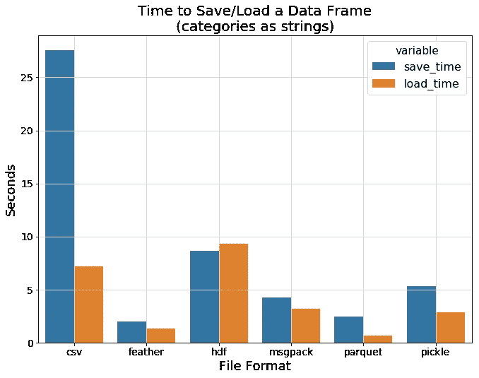
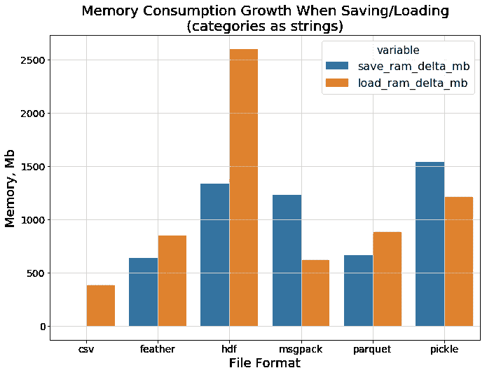
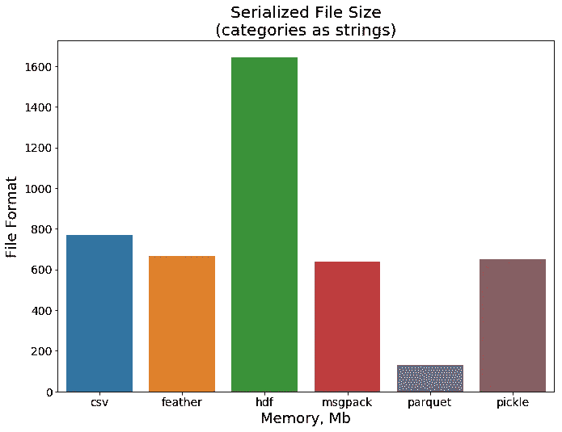
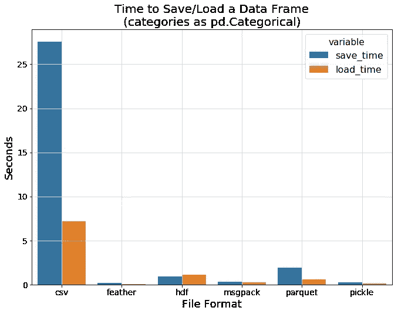
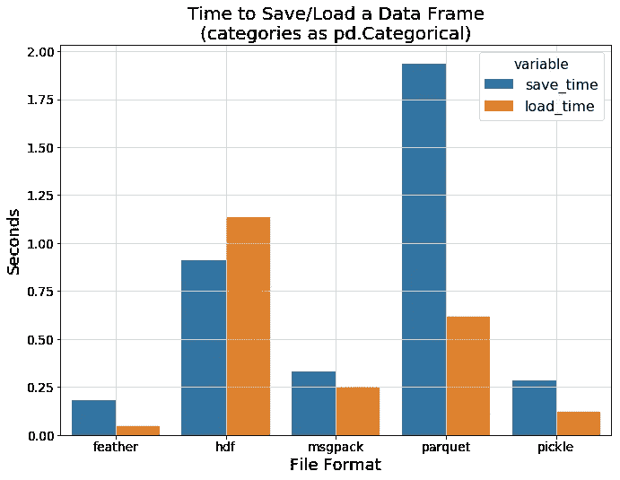
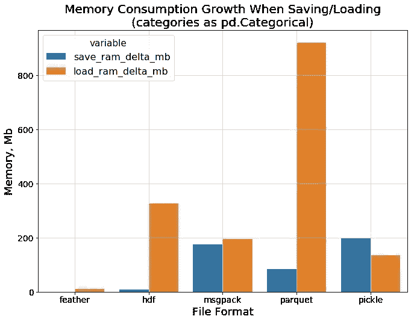
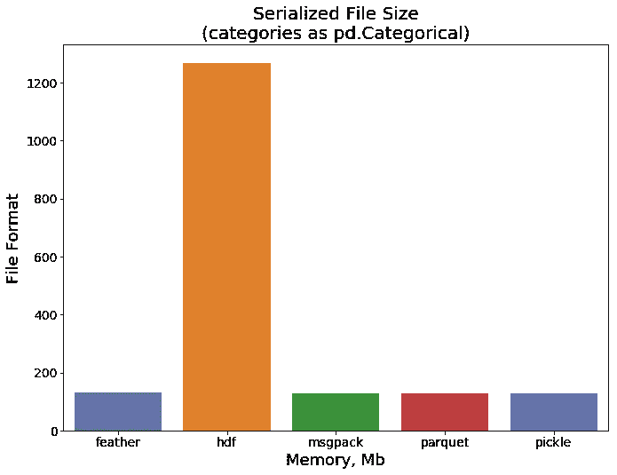

# 保存熊猫数据的最佳格式

> 原文：<https://towardsdatascience.com/the-best-format-to-save-pandas-data-414dca023e0d?source=collection_archive---------0----------------------->

## 将 pandas 数据帧序列化到持久存储的各种方法的比较

当从事数据分析项目时，我通常使用`Jupyter`笔记本和一个很棒的`pandas`库来处理和移动我的数据。对于中等大小的数据集，这是一个非常简单的过程，您可以将其存储为纯文本文件，而不会有太多的开销。

但是，当数据集中的观察值很多时，保存数据和将数据加载回内存的过程会变得更慢，现在每个内核的重新启动都会占用您的时间，迫使您等待数据重新加载。因此，最终，CSV 文件或任何其他纯文本格式都失去了吸引力。

我们可以做得更好。有大量的二进制格式来存储磁盘上的数据，其中许多是`pandas`支持的。我们如何知道哪一个更适合我们的目的？嗯，我们可以尝试其中的几个，比较一下！这就是我在这篇文章中决定做的:通过几种方法将`pandas.DataFrame`保存到磁盘上，看看哪种方法在 I/O 速度、消耗的内存和磁盘空间方面更好。在这篇文章中，我将展示我的小基准测试的结果[。](https://github.com/devforfu/pandas-formats-benchmark)

Photo by [Patrick Lindenberg](https://unsplash.com/@heapdump?utm_source=medium&utm_medium=referral) on [Unsplash](https://unsplash.com?utm_source=medium&utm_medium=referral)

# 要比较的格式

我们将考虑以下存储数据的格式。

*   纯文本 CSV —数据科学家的老朋友
*   pickle——Python 序列化事物的方式
*   message pack——它像 JSON，但是又快又小
*   [HD F5](https://en.wikipedia.org/wiki/Hierarchical_Data_Format)—一种旨在存储和组织大量数据的文件格式
*   [羽化](https://blog.cloudera.com/blog/2016/03/feather-a-fast-on-disk-format-for-data-frames-for-r-and-python-powered-by-apache-arrow/) —一种快速、轻量且易于使用的二进制文件格式，用于存储数据帧
*   [Parquet](https://parquet.apache.org)—Apache Hadoop 的柱状存储格式

当你做一些数据分析工作时，它们都被广泛使用(可能除了 MessagePack)并且经常遇到。

# 选择的指标

为了找到存储笔记本会话之间数据的最佳缓冲格式，我选择了以下指标进行比较。

*   `size_mb` —带有序列化数据帧的文件的大小(Mb)
*   `save_time` —将数据帧保存到磁盘上所需的时间
*   `load_time` —将之前转储的数据帧加载到内存中所需的时间
*   `save_ram_delta_mb` —数据帧保存过程中的最大内存消耗增长
*   `load_ram_delta_mb` —数据帧加载过程中的最大内存消耗增长

请注意，当我们使用高效压缩的二进制数据格式(如 Parquet)时，最后两个指标变得非常重要。它们可以帮助我们估计加载序列化数据所需的 RAM 数量，*此外还有*数据本身的大小。我们将在接下来的章节中更详细地讨论这个问题。

# 基准

我决定在测试中使用合成数据集，以便更好地控制序列化的数据结构和属性。此外，我在基准测试中使用了两种不同的方法:(a)将生成的分类变量保存为字符串，以及(b)在执行任何 I/O 之前，将它们转换为`pandas.Categorical`数据类型。

函数`generate_dataset`展示了我是如何在基准测试中生成数据集的。

CSV 文件保存和加载的性能作为基准。五个随机生成的百万次观察的数据集被转储到 CSV 中，并被读回到内存中以获得平均指标。每种二进制格式都在 20 个随机生成的具有相同行数的数据集上进行了测试。数据集由 15 个数值特征和 15 个分类特征组成。您可以在[这个资源库](https://github.com/devforfu/pandas-formats-benchmark)中找到带有基准测试功能的完整源代码。

## (a)作为字符串的分类特征

下图显示了每种数据格式的平均 I/O 时间。一个有趣的观察是`hdf`显示了比`csv`更慢的加载速度，而其他二进制格式表现明显更好。印象最深的两个是`feather`和`parquet`。

保存数据和从磁盘读取数据时的内存开销如何？下一张图片显示`hdf`再次表现不佳。果然，`csv`不需要太多额外的内存来保存/加载纯文本字符串，而`feather`和`parquet`彼此非常接近。

最后，让我们看看文件大小。这次`parquet`显示了一个令人印象深刻的结果，考虑到这种格式是为了高效存储大量数据而开发的，这并不奇怪。

## (b)转换的分类特征

在上一节中，我们没有尝试有效地存储我们的分类特征，而是使用普通字符串。我们来修正这个疏漏吧！这次我们使用专用的`pandas.Categorical`类型，而不是普通的字符串。

看看它现在和纯文本`csv`相比是什么样子！现在所有的二进制格式都显示了它们的真正威力。基线远远落后，所以让我们把它去掉，以便更清楚地看到各种二进制格式之间的差异。

`feather`和`pickle`显示出最佳的 I/O 速度，而`hdf`仍然显示出明显的开销。

现在是时候比较数据流程加载期间的内存消耗了。下面的条形图显示了我们之前提到的关于拼花地板格式的一个重要事实。

只要占用磁盘上的一点空间，就需要额外的资源来将数据解压缩回数据帧。您可能无法将文件加载到内存中，即使它需要永久存储磁盘上的中等容量。

最后一幅图显示了这些格式的文件大小。所有格式都显示出良好的效果，除了`hdf`仍然比其他格式需要更多的空间。

# 结论

正如我们的小测试所显示的，似乎`feather`格式是存储 Jupyter 会话之间数据的理想选择。它显示出很高的 I/O 速度，不会占用太多的磁盘内存，并且在加载回 RAM 时不需要任何拆包。

当然，这种比较并不意味着您应该在每种可能的情况下都使用这种格式。例如，`feather`格式[预计不会用作长期文件存储](https://stackoverflow.com/questions/48083405/what-are-the-differences-between-feather-and-parquet)。此外，它没有考虑到所有可能的情况，当其他格式可以显示他们最好的。然而，对于本文开头所述的目的来说，这似乎是一个极好的选择。

*你对 Python 语言感兴趣吗？离不开机器学习？看过网上的其他东西吗？*

*那么你可能会对我的博客* [*感兴趣，我的博客*](https://iliazaitsev.me/) *讨论了各种编程话题，并提供了我感兴趣的教科书和指南的链接。*