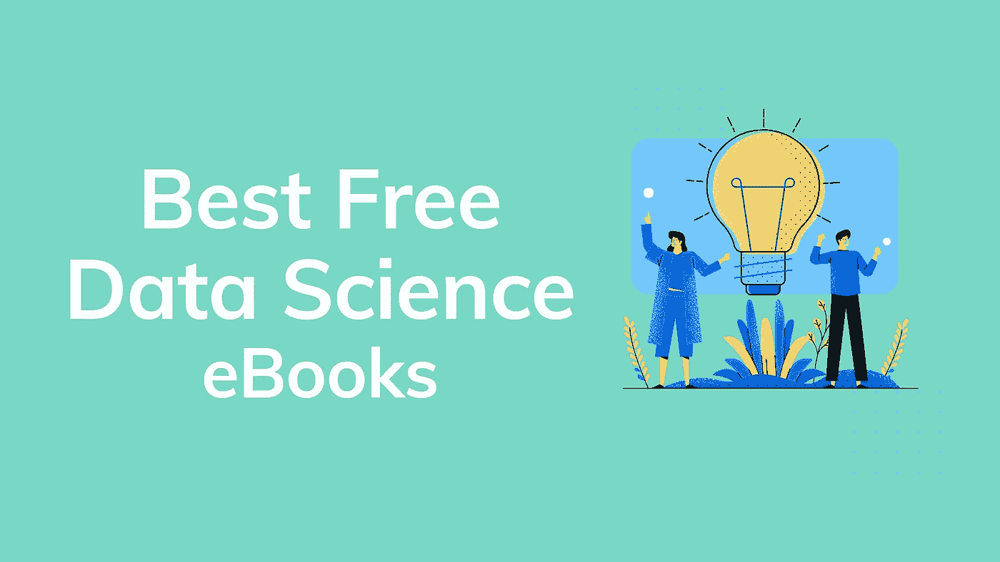

# 最佳免费数据科学电子书

> 原文：<https://towardsdatascience.com/the-best-free-data-science-ebooks-b671691e5231?source=collection_archive---------1----------------------->

## 有些包括代码和练习

> 被困在付费墙后面？给我发个 tuit 到**我会 dm 你我的好友链接。**

*这 25 本书集中的每一本书都是由数据科学领导者、导师、指导者推荐给我的，或者是我在某个特定项目上向他们寻求帮助。希望对你有帮助！*

**Python 是我的首选编程语言，这也是为什么大多数书籍都是基于 Python 的编程，但是如果你有其他语言的其他书籍的推荐，请在评论中分享它们，或者* [*给我发一条* tweet](https://twitter.com/brendahalih) *，我会添加它们。**

# *数学和统计学*

*   ***统计学习导论**作者:Gareth James、Daniela Witten、Trevor Hastie 和 Robert Tibshirani。*

* [## 统计学习导论

### 加雷思·詹姆斯、丹妮拉·威滕、特雷弗·哈斯蒂和罗伯特·蒂布拉尼家中的应用程序

faculty.marshall.usc.edu](http://faculty.marshall.usc.edu/gareth-james/ISL/) 

*描述:本书提供了统计学习方法的介绍。它面向非数学科学领域的高年级本科生、硕士生和博士生。这本书还包含一些 R labs，详细解释了如何在现实生活中实施各种方法，应该是数据科学家的宝贵资源。*

*   艾伦·b·唐尼的《T21》

 [## 想想统计 2e

### 艾伦·b·唐尼。下载 PDF 格式的这本书。代码示例和解决方案可从这个 GitHub 资源库获得…

greenteapress.com](https://greenteapress.com/wp/think-stats-2e/?source=post_page-----2d4f32793a51----------------------) 

描述:Think Stats 强调你可以用来探索真实数据集和回答有趣问题的简单技术。这本书介绍了一个使用美国国立卫生研究院数据的案例研究。鼓励读者使用真实数据集进行项目工作。

*   加雷斯·詹姆斯、丹妮拉·威滕、特雷弗·哈斯蒂和罗伯特·蒂布拉尼的《统计学习的要素》

 [## 统计学习的要素:数据挖掘、推理和预测。第二版。

### 编辑描述

web.stanford.edu](https://web.stanford.edu/~hastie/ElemStatLearn/) 

描述:虽然这种方法是统计学的，但重点是概念而不是数学。给出了许多例子，大量使用了彩色图形。对于统计学家和任何对科学或工业中的数据挖掘感兴趣的人来说，它应该是一个有价值的资源。这本书的覆盖面很广，从监督学习(预测)到非监督学习。许多主题包括神经网络、支持向量机、分类树和 boosting——这是任何书籍中第一次全面讨论这一主题。

*   **艾伦·b·唐尼使贝叶斯统计变得简单**

 [## 想想贝叶斯

### 贝叶斯统计变得简单。阅读 HTML 中的思维贝叶斯。顺序思考…

greenteapress.com](https://greenteapress.com/wp/think-bayes/) 

*描述:大多数关于贝叶斯统计的书籍使用数学符号，并以数学概念如微积分的形式提出观点。这本书用 Python 代码代替数学，用离散逼近代替连续数学。结果，数学书上的积分变成了求和，大多数概率分布的运算都是简单的循环。*

*   **概率编程&黑客的贝叶斯方法**作者:Cam Davidson-Pilon

 [## 黑客的贝叶斯方法

### 贝叶斯方法是推理的自然方法，但它隐藏在慢…

camdavidsonpilon.github.io](http://camdavidsonpilon.github.io/Probabilistic-Programming-and-Bayesian-Methods-for-Hackers/) 

*描述:面向黑客的贝叶斯方法旨在从计算/理解第一，数学第二的角度介绍贝叶斯推理。当然，作为一本入门书，我们也只能到此为止:一本入门书。对于受过数学训练的人来说，他们可能会对这篇文章产生的好奇心和其他用数学分析设计的文章产生兴趣。对于数学背景较少的爱好者或对数学不感兴趣而只是简单地练习贝叶斯方法的人来说，这篇文章应该是足够的和有趣的。*

*   布拉德利·埃夫隆和特雷弗·哈斯蒂的《计算机时代的统计推断》

 [## 计算机时代的统计推断:算法、证据和数据科学

### 21 世纪见证了统计方法在范围和影响上惊人的扩张…

web.stanford.edu](http://web.stanford.edu/~hastie/CASI/) 

描述:这本书带领我们经历了 20 世纪 50 年代引入电子计算后的数据分析革命。从经典推理理论开始——贝叶斯、频率主义者、费雪主义者——个别章节讨论了一系列有影响的主题:生存分析、逻辑回归、经验贝叶斯、折叠刀和自助、随机森林、神经网络、马尔可夫链蒙特卡罗、模型选择后的推理，等等。这本书将方法论和算法与统计推断相结合，并以对统计学和数据科学的未来方向的推测结束。

# **分析**

*   **Jeffrey Leek 的《数据分析风格的要素》**

 [## 数据分析风格的要素

### 想要分析数据的人的指南。免费！数据分析既是科学，也是艺术。这本书是…

leanpub.com](https://leanpub.com/datastyle) 

*描述:这本书关注的是数据分析的细节，这些细节有时会被传统的统计学课程和教科书遗漏。这本书作为数据科学或数据分析的入门课程的伴侣是有用的。对于负责阅读和评论数据分析的人来说，它也是一个有用的参考工具。*

# **数据挖掘**

*   Ron Zacharsk 的《数据挖掘程序员指南》

 [## 古老的数字艺术

### 第 1 章:简介 2:推荐系统 3:基于项目的过滤 4:分类 5:关于分类的更多内容…

guidetodatamining.com](http://guidetodatamining.com/) 

*描述:如果你是一个对学习一点数据挖掘感兴趣的程序员，你可能会对初学者实践指南感兴趣。这就是这本书所提供的。本指南遵循边做边学的方法。*

*   **社交媒体挖掘**剑桥大学出版社

 [## 下载图书

### 《社交媒体挖掘》一书由剑桥大学出版社于 2014 年出版。请查看剑桥大学的网页…

dmml.asu.edu](http://dmml.asu.edu/smm/book/) 

*描述:社交媒体挖掘集成了社交媒体、社交网络分析和数据挖掘，为学生、从业者、研究人员和项目经理了解社交媒体挖掘的基础和潜力提供了一个方便和连贯的平台。它介绍了由社交媒体数据产生的独特问题，并提出了网络分析和数据挖掘的基本概念，新出现的问题和有效的算法。适合用于先进的本科和研究生开始课程以及专业短期课程，文本包含不同难度的练习，以提高理解，并有助于在社交媒体挖掘的各种场景中应用概念，原则和方法。*

# 数据科学的非技术性介绍

*   **数据科学的艺术**Roger d . Peng 和 Elizabeth Matsui

 [## 数据科学的艺术

### 这本书描述了分析数据的过程。作者有丰富的经验，既管理数据分析师…

leanpub.com](https://leanpub.com/artofdatascience) 

*描述:这本书描述了分析数据的过程。作者在管理数据分析师和进行他们自己的数据分析方面都有丰富的经验，这本书是他们经验的精华，适用于数据科学的从业者和管理者。*

*   **数据科学手册**作者:卡尔、马克斯、亨利和威尔

 [## 数据科学手册

### 查看数据科学手册！帕兰蒂尔优步顶尖数据科学家的采访汇编…

www.thedatasciencehandbook.com](https://www.thedatasciencehandbook.com/) 

*描述:《数据科学手册》汇集了对 25 位杰出数据科学家的深度采访，他们在其中分享了自己的见解、故事和建议。*

*   Roger D. Peng 和 Hilary Parker 关于数据科学的对话

 [## 数据科学对话

### 罗杰·彭和希拉里·帕克在 2015 年创办了“不那么标准偏差”播客，专门讨论…

leanpub.com](https://leanpub.com/conversationsondatascience) 

*描述:Roger Peng 和 Hilary Parker 在 2015 年创建了“不那么标准偏差”播客，该播客致力于讨论学术界和工业界数据科学家的背景故事和日常生活。这本书收集了他们关于数据科学以及它在现实世界中如何工作(有时不工作)的许多对话。*

# **面向数据科学的 Python 编程**

*   **Ashwin Pajankar 和 Sushant Garg 的 Python 面向对象编程**(图片不匹配，但链接正确)

 [## 用 Python 进行面向对象编程

### 这本书是 Python 3 面向对象编程的简单而权威的指南。其他类似的书…

leanpub.com](https://leanpub.com/PythonOOP) 

*描述:这本书是 Python 3 面向对象编程的简单而权威的指南。其他类似类型的书籍利用复杂的写作风格和例子向读者介绍 Python 3 中的 OOP。然而，这本书用简单的语言来解释概念。它面向已经了解 Python 的中级学习者。*

*   **用 Python 自动化枯燥的东西**作者:Al Sweigart

 [## 用 Python 自动化枯燥的东西

### 完全初学者实用编程。作者阿尔·斯威加特。如果你曾经花了几个小时重命名文件或…

automatetheboringstuff.com](https://automatetheboringstuff.com/) 

*描述:你将学习如何使用 Python 编写程序，在几分钟内完成手工需要几个小时才能完成的事情——不需要任何编程经验。一旦你掌握了编程的基础知识*

*   杰克·范德普拉斯的《Python 数据科学手册》

 [## Python 数据科学手册

### 对于许多研究人员来说，Python 是一流的工具，这主要是因为它的库用于存储、操作和…

shop.oreilly.com](http://shop.oreilly.com/product/0636920034919.do) 

*描述:熟悉阅读和编写 Python 代码的工作科学家和数据处理人员会发现这份全面的案头参考非常适合处理日常问题:操纵、转换和清理数据；可视化不同类型的数据；并使用数据建立统计或机器学习模型。很简单，这是 Python 中科学计算的必备参考。*

*   **学 Python，破 Python** 作者斯科特·格兰特

 [## 学 Python，破 Python

### 学习 Python，Break Python 是一个关于 Python 编程语言的实践性介绍，是为那些已经…

learnpythonbreakpython.com](https://learnpythonbreakpython.com/) 

*简介:学习 Python，突破 Python 从温和的编程入门开始。慢慢地，通过例子和练习，我们引入了更复杂的程序元素，并展示了它们可以用在哪里，以及我们如何破坏它们，从而达到了一个舒适的水平。通过以这种方式积累知识，我们希望给予你一定程度的舒适，让你在尝试新事物和冒险时感到舒适；简而言之，我们希望你能熟练编程。*

*   Steven Bird、Ewan Klein 和 Edward Loper 的《Python 的自然语言处理》

 [## NLTK 图书

### Steven Bird、Ewan Klein 和 Edward Loper 这本书的 NLTK 版本针对 Python 3 和 NLTK 3 进行了更新。第一个…

www.nltk.org](https://www.nltk.org/book/) 

*描述:这本书提供了自然语言处理的简单介绍，该领域支持多种语言技术，从预测文本和电子邮件过滤到自动摘要和翻译。通过它，您将学习如何编写处理大量非结构化文本的 Python 程序。您将使用广泛的语言数据结构访问丰富的注释数据集，并且您将理解用于分析书面交流的内容和结构的主要算法。*

*   **生产中的数据科学**本·G·韦伯著

 [## 生产中的数据科学

### 从初创公司到数万亿美元的公司，数据科学在帮助组织最大化…

leanpub.com](https://leanpub.com/ProductionDataScience) 

*描述:从初创公司到价值数万亿美元的公司，数据科学在帮助组织最大化其数据价值方面发挥着重要作用。本书面向希望在多个云环境中构建数据产品并培养应用数据科学技能的分析从业者。*

*   **数据驱动**主持人希拉里·梅森，DJ 帕蒂尔

 [## 数据驱动

### 成功处理数据不仅仅是把 Hadoop 放在你的机房里，或者雇佣一些疯狂的物理学家…

www.oreilly.com](https://www.oreilly.com/library/view/data-driven/9781491925454/) 

描述:谷歌、LinkedIn 和脸书如何使用他们的数据的例子，以及沃尔玛、UPS 和其他组织在大数据出现之前如何利用这一资源的例子。无论你如何处理，建立数据文化是 21 世纪成功的关键。

# 机器学习

*   **用 Scikit-Learn 和 TensorFlow**
    进行机器实践学习

 [## ageron/handson-ml

### 这个项目旨在教你 python 中机器学习的基础。它包含示例代码和…

github.com](https://github.com/ageron/handson-ml) 

*描述:作者 Aurélien Géron 通过使用具体的示例、最小化理论和两个生产就绪的 Python 框架——scikit-learn 和 tensor flow——帮助您直观地理解构建智能系统的概念和工具。您将学习一系列技术，从简单的线性回归开始，逐步发展到深度神经网络。*

*   理解机器学习:从理论到算法

[https://www . CSE . huji . AC . il/~ shais/understanding machine learning/index . html](https://www.cse.huji.ac.il/~shais/UnderstandingMachineLearning/index.html)

*描述:这些包括学习的计算复杂性以及凸性和稳定性概念的讨论；重要的算法范例包括随机梯度下降、神经网络和结构化输出学习；以及新兴的理论概念，如 PAC-Bayes 方法和基于压缩的界限。*

*   **强化学习:理查德·萨顿
    和安德鲁·巴尔托**的介绍

 [## 强化学习:导论

### 从亚马逊购买勘误表和说明完整的 Pdf 格式，没有利润代码解决方案-发送您的解决方案中的一章，获得…

incompleteideas.net](http://incompleteideas.net/book/the-book.html) 

*描述:在《强化学习》中，理查德·萨顿和安德鲁·巴尔托对该领域的关键思想和算法提供了清晰而简单的描述。这第二版已经被显著地扩展和更新，提出新的主题和更新其他主题的范围。*

*   **深度学习**麻省理工学院出版社出版

 [## 深度学习

### 深度学习教材是一个资源，旨在帮助学生和从业人员进入机器领域…

www.deeplearningbook.org](http://www.deeplearningbook.org/) 

*描述:深度学习教材是一种资源，旨在帮助学生和从业者进入一般的机器学习领域，特别是深度学习领域。*

*   **机器学习向往** by deeplearning.ai

 [## 机器学习向往- deeplearning.ai

### 人工智能正在改变众多行业。来自吴恩达的免费电子书《机器学习向往》教你如何…

www.deeplearning.ai](https://www.deeplearning.ai/machine-learning-yearning/) 

描述:人工智能正在改变无数的行业。来自吴恩达的免费电子书《机器学习向往》教你如何构建机器学习项目。这本书的重点不是教你 ML 算法，而是如何让 ML 算法工作。

## 数据可视化

*   马尔科姆·麦克莱恩的《D3 技巧和诀窍》

 [## D3 技巧和窍门 v3.x

### 超过 600 页的使用 d3.js 的提示和技巧，D3 . js 是领先的 web 数据可视化工具之一。这是……

leanpub.com](https://leanpub.com/D3-Tips-and-Tricks) 

*描述:超过 600 页的使用 d3.js 的提示和技巧，D3 . js 是领先的 web 数据可视化工具之一。它旨在让你开始并推动你前进。包括 50 多个可下载的代码示例。*

有没有另一本电子书必须在这个列表中？在评论里分享给我我会补充的！*