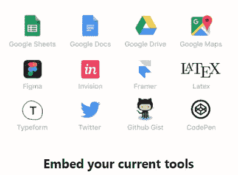
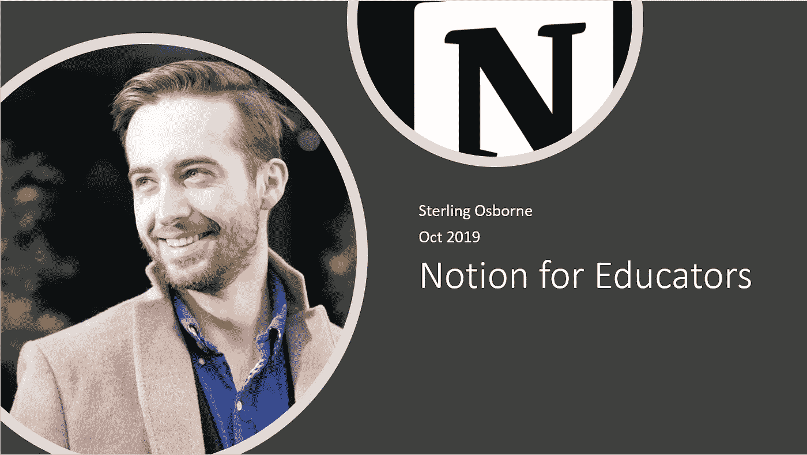

# 学生和教育工作者最好的免费笔记软件！—视频

> 原文：<https://towardsdatascience.com/the-best-free-note-taking-software-for-students-and-educators-video-ce8366d18b55?source=collection_archive---------15----------------------->

Notion for Educators Video

# 问题是

我经常回想起我读完本科时学习有多差；在不理解讲师所说的任何内容的情况下做笔记，并一遍又一遍地重写笔记，希望其中一些内容能被理解。

如今，笔记软件的进步极大地改善了学生记录和组织笔记的方式。然而，教育工作者仍然经常以“讲座内容到个人笔记”的静态格式提供内容。人们认为，理解和运用好的学习理念，剖析教育者提供的内容，是每个学生的个人责任。但是这是为什么，为什么教育工作者(总的来说)没有改变他们提供课程的媒介？

在与研究同事讨论过这个问题后，似乎有几个基本问题促使他做出改变:

1.  向学生提供内容的网站是有限的(例如黑板)，并且只能允许静态的。pdf 文件
2.  学生的参与度很低，因此对教育工作者来说益处并不明显
3.  它与作为大学课程基本组成部分的授课形式相一致

然而，我认为现在比以往任何时候都有机会更新向学生提供内容的格式基准。特别是依赖于代码/编程的课程，它们将从更具互动性的学习过程中受益。

# 概念总结

为此，我想介绍一下[概念](https://www.notion.so/product)，这是一个笔记应用程序，它集成了许多功能，使其成为这些问题的强大解决方案。此外，**个人计划现在对学生和教育工作者完全免费**，而其他解决方案可能很难证明其成本合理或为商业团队设计。

简而言之，主要优势是:

1.  用 LaTeX(数学)和代码块做笔记
2.  任务和项目管理
3.  知识库可以用表格建立，并可以在线参考
4.  导出到。pdf 和。csv 文件
5.  带通知的桌面和移动应用程序
6.  每页上的讨论和评论
7.  嵌入功能的综合列表

上面的演示视频更详细地展示了这些为学生构建内容的功能。这是对前一篇文章“ [**数据科学研究项目的最佳笔记/任务管理应用**](/the-best-note-taking-task-manager-app-for-data-science-research-projects-ddc82afaa509) ”的直接跟进，该文章展示了如何将概念用于个人项目。

我还应该指出，我与概念的创造者没有任何关系，我只是对教育和新工具充满热情。

如果您想注册试用该应用程序，请使用下面的链接:

 [## 为您的笔记、任务、维基和数据库提供一体化的工作空间——概念

### 注册时获得 10 美元的信用点数

www . opinion . so](https://www.notion.so/?r=d322470fd7fc4f61a29918c476cc9c81) 

谢谢

英国货币