# 最周密的计划

> 原文：<https://towardsdatascience.com/the-best-laid-plans-7eb3a22ffbc1?source=collection_archive---------21----------------------->

## 设计和数据可视化

## 想象也门的隐形战争

Commemorative stamp, Mutawakkilite Kingdom of Yemen, 1965

*此片改编自我于 2019 年 6 月 20 日在微软反应堆伦敦举行的可视化数据会议上发表的一篇* [*演讲*](https://www.youtube.com/watch?v=YenoaVWHV80) *。*

我经历了一次奇怪的数据新闻之旅。事情大概是这样的——五年前，我被盒子包围着，结束了我作为 Embarq 的设计顾问的角色，Embarq 是班加罗尔的一个可持续交通和研究实验室。四年前，我在温莎城堡看女王私人收藏的波斯手稿——我暂时离开了设计行业，在库陶尔德攻读艺术史硕士学位，专攻波斯艺术。三年前，我住在一个手提箱里，开始了我在伦敦的第一份工作，在小型媒体基金会(Small Media Foundation)工作，这是一家与中东民间社会组织合作的媒体和研究实验室。两年前——更多的箱子，更多的手提箱，更多的移动——但现在我正在贝鲁特帮助组织一个 [DATA4CHANGE](http://www.data4chan.ge) 工作坊，为那些不熟悉 DATA4CHANGE 的人准备——data 4 change 是一个工作坊，它将设计师和开发者以及人权组织聚集在一起，发起宣传活动。最后，我们来到一年前，当时我正在完成也门和平项目和 DATA4CHANGE 的一个项目，致力于[可视化也门的隐形战争](http://www.yemenpeaceproject.org/invisible) ，这是我们去年 12 月启动的项目。这样一来，我就可以直接进入项目，了解相关的过程，它是如何发展的，以及最终的结果

该项目的最初想法来自于 2016 年贝鲁特的 DATA4CHANGE 研讨会，我作为参与者参加了该研讨会。

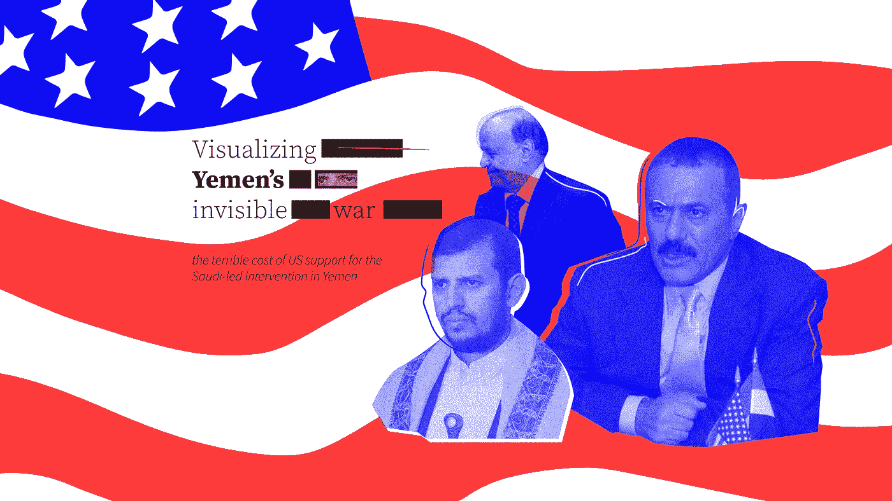

Cover image

仅提供一些背景信息——2015 年，也门总统在一场政变中被推翻，自那以来，由沙特阿拉伯领导的国际联盟支持的政权与美国政府支持的北也门激进组织之间一直在进行内战。如果你真的想要所有的细节，你可以访问[项目链接](https://www.yemenpeaceproject.org/invisible)——正如我希望解释的那样，我们已经做了一些非常好的事情，使数据更容易访问。

我们使用了一个数据集，记录了也门的空袭数量以及目标地点的类型、地点和时间。

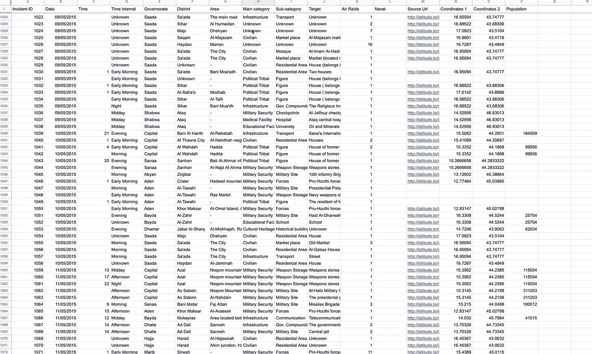

A screen grab of the data we were working with

我们在 2016 年研讨会期间使用的初始数据集记录了从 2015 年 3 月到 2016 年 8 月的空袭，这是整个国家近 18 个月的无休止空袭。最初，这个项目进展相当缓慢。在 2016 年的研讨会之后，我们在 2017 年底重启了该项目。该项目旨在与带来数据集的原始组织合作，创建一个互动故事，描绘也门三个主要城市的空袭地图和对居民的视频采访。

但是这个项目经历了许多实施过程。2018 年 3 月，在恢复该项目六个月后，我们的主要合作伙伴——一对来自也门的记者和电影制作人——由于个人原因不得不退出。这对他们来说是不幸的，对我们来说是令人沮丧的。这意味着要么取消项目。又来了。或者迅速找到一个新的合作伙伴，重新调整他们的时间表和目标，同时确保已经完成的工作没有浪费，同时仍然给他们足够的空间来发挥创造性的领导作用。没什么大不了的。

令人欣慰的是，离职的组织在电子邮件和半提及中留下了一些线索，让我们相当容易地找到了新的合作伙伴。

2018 年 9 月，我们与一家总部位于 DC 的倡导组织合作，该组织专门致力于也门事务和美也关系。这是幸运的一击！这确实意味着尽管整个项目的想法改变了。。。

与此同时，我经历了十几轮的数据更新、整理和清理。在早期，我在管理项目时努力跟上快速更新的数据集。

我们得到的第一个数据集记录了 2015 年 3 月至 2016 年 8 月的空袭。当我们在 2017 年底重新启动该项目时，数据集已经增长到 15846 行，并详细列出了从 2015 年 3 月到 2017 年 12 月的空袭，这是 28 个月的空袭数据。然后我们得到了另一个更新的版本，记录了截至 2018 年 3 月的空袭-这意味着我们正在处理 33 个月的空袭数据-这几乎是三年，你可以在那段时间开始并完成你的本科学位-可悲的是，冲突仍在继续。随着项目工作的进展，数据集再次更新，以包括截至 2018 年 8 月的记录——所以这又是八个月——这是一个实习！2018 年 12 月，当我们发布这个故事时，数据有 18714 行，记录了截至 2018 年 11 月 5 日的空袭。这意味着最终的故事比实时数据少了大约六周。

为了补充数据集，我和一些同事搜集了各省的地理空间坐标以及最近记录的人口。这意味着我们现在可以在地图上找到三年来的空袭数据。老实说，我们当时可能已经停止了……这本身就是一个令人信服的故事。但是我们没有。

然后我定位并添加了被轰炸的特定地点的卫星图像。

这是一个重要的视觉效果，提醒我们和用户，数据集中的数字是真实的人和真实的地方。

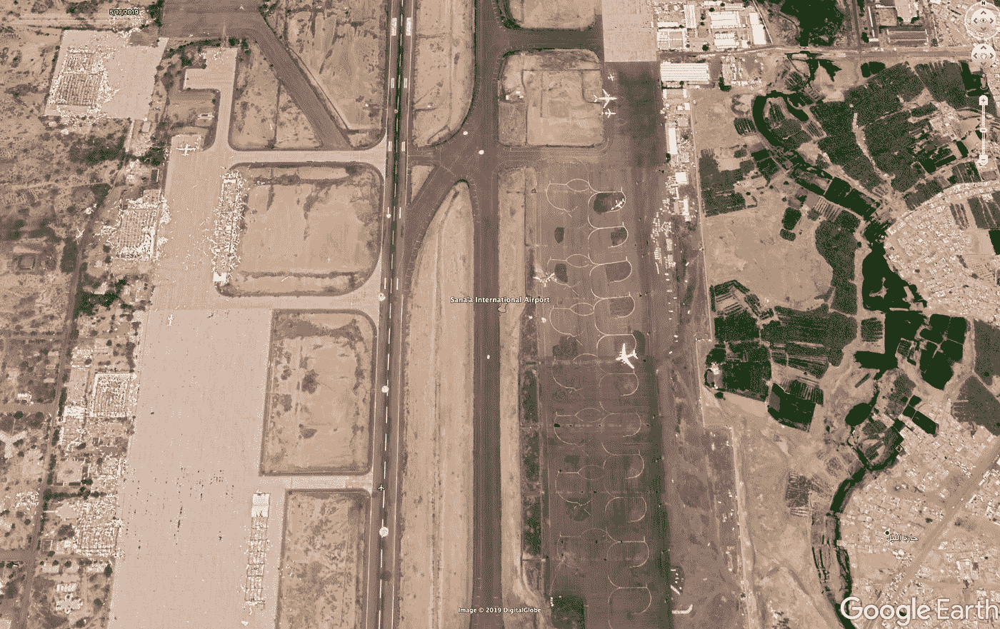

Sana’a International Airport

在从事这项工作并于 2018 年 9 月与也门和平项目合作的同时，他们告诉我们，他们希望在参众两院提交要求结束空袭行动或至少结束美国参与其中的立法之前，将此作为游说和告知 DC 代表、读者和关键决策者的工具。这些动议将在 11 月至 1 月间提出。我们很快就收到了行动号召和迫在眉睫的最后期限！

错误的开始和起伏确保了在这个阶段我没有这个项目的视觉形象，或者任何实质性的设计工作，更不用说精确的可视化了。

如果你还没有注意到的话，我努力成为事实上的数据集专家，管理项目，同时作为设计者并致力于数据可视化。作为一名设计师，我习惯以“你知道什么是很酷的尝试”开始，等待项目经理说“是的，让我们尝试一下，但是它是可扩展的吗，我们能在时间表内完成吗？ “你为什么用那种字体”…我不得不与自己进行太多这样的对话，最终有点累了——所以如果你认为这篇文章可能是关于我展示一些超级酷的高科技可视化，我很抱歉给你带来了坏消息——主要是我抱怨这有多困难。

所以在这个阶段，我有一个选定的格式——一个长篇故事，我有一个干净和最新的数据集，我有一个行动呼吁，要求其读者写信给他们的当地代表，要求就立法采取行动，这显然是一个截止日期，但我仍然不完全相信我迄今为止尝试的数据可视化，以及它们是否符合我们决定的方向。

我最初摆弄原始图形——一个开源数据可视化框架——我们有一些很有潜力的有趣的输出。

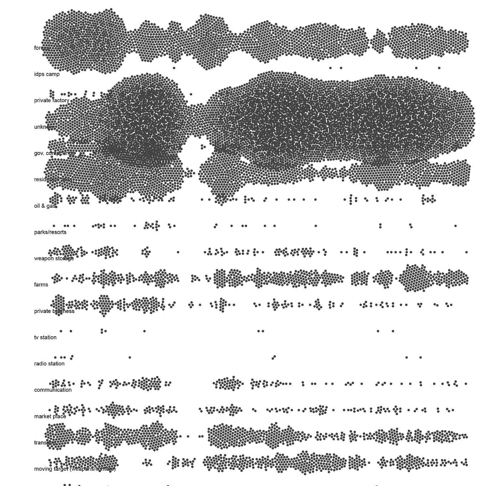

Bee swarm graph

我用蜂群图绘制了按目标分类的空袭。我非常喜欢这个画面，以及如何用密集的点来表示空袭的数量。

然后，我用桑基图显示空袭次数多的省份，以及哪些地点成为目标。稍加努力，就能写出一个故事，但这不是最鼓舞人心的选择。

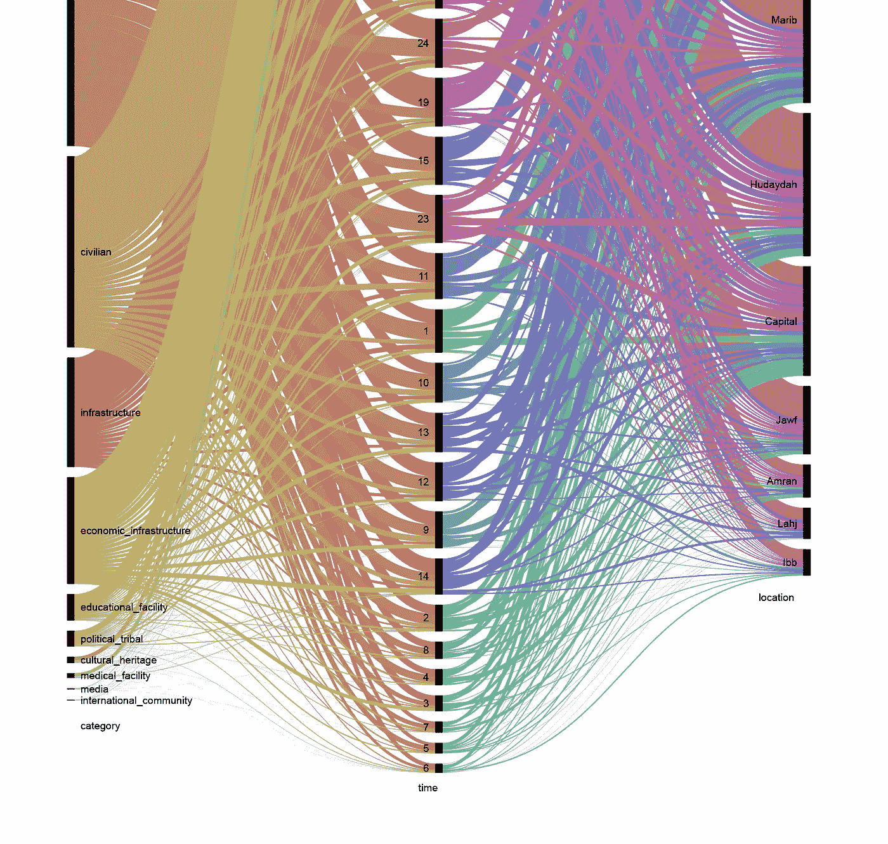

Sankey graph

我也在努力嵌入这些视觉化的东西，非常想念隐藏在桑基图的每一条线或蜜蜂群的每一个点下的额外信息。它也非常慢，数据集太重，对于这个平台来说不是一个可行的选择。另外，每次数据集添加新行时，我几乎不能更新它。

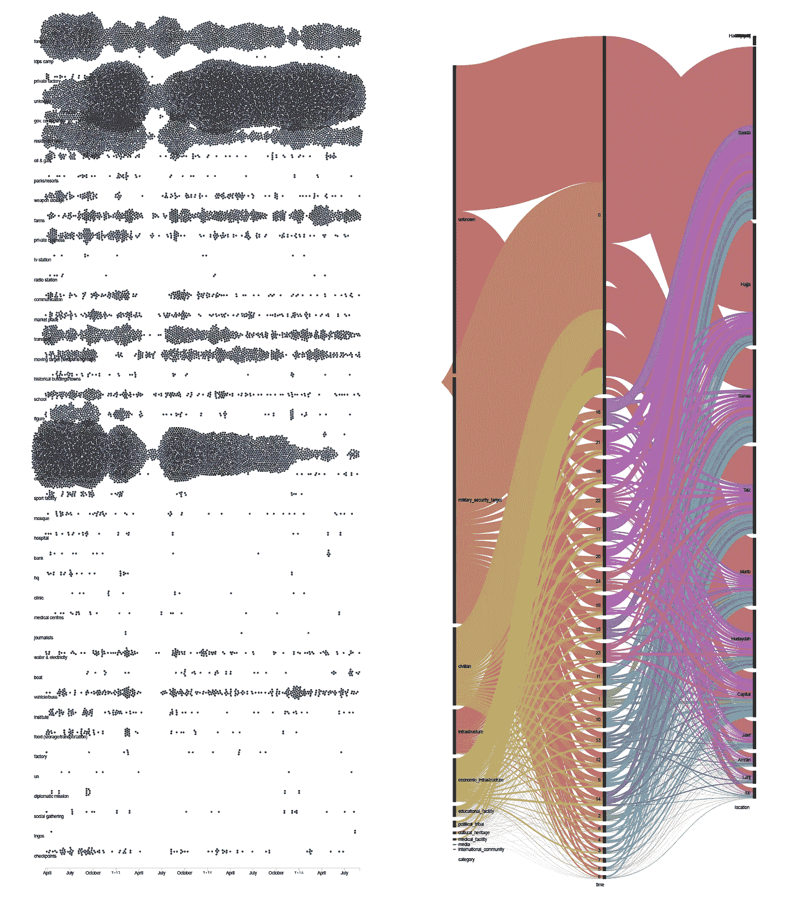

这时我想起了 Tableau——我几乎没用过它——我有点害怕用它！这是我第一次认真地使用 Tableau 这样的野兽，有一个陡峭的学习曲线。更糟糕的是，我有一个很紧的截止日期——在方向改变后，整个项目必须在 3 个月内启动并运行——必须在关键立法到达参议院之前完成。

我很快就爱上了 Tableau。对于我们需要用数据集实现的视觉效果来说，这是绝对完美的。不透明的界面成了我的朋友，不断登录以保存文件，当然我可以习惯这一点——我现在所要做的就是快速创建一个可视化，可能有助于游说参议员和众议员结束也门战争。没有压力。

我非常想试试我们收集的坐标数据。在最初努力将其与主数据集合并后…

也门有 21 个省，每个省至少有五种不同的拼法。慢慢地，但肯定地，我设法用正确的坐标排列好一切，并将数据集导入 Tableau。

现在我想要一张地图。因此，在导入数据后，摆弄一些设置，我想象的最基本的设置，并设法创建一个三年空袭数据的回放。颜色的强度是最近的……变成白色，圆圈的大小代表在那个特定位置的撞击次数。

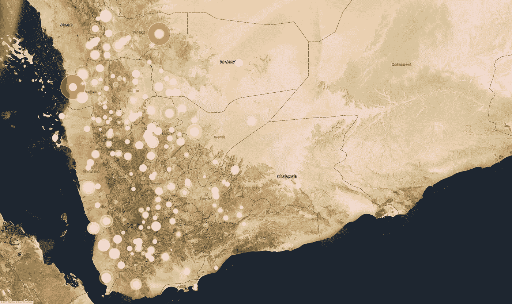

Screen grab of the map with air strike data being played

然后，我尝试了一个更经典的时间线，其中每个点都是按目标类型分类的空袭次数，并用颜色编码。

看到它变得栩栩如生——能够与数据互动——真是太棒了，但每次我想起那个数据集是关于什么的，我都感到害怕。

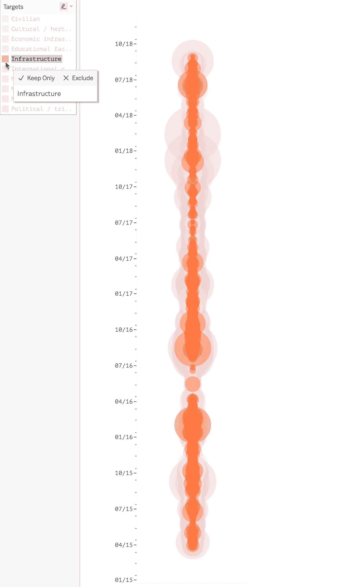

然后，我用一个树状图来查看哪种类型的建筑或地区遭到了最多的空袭。确切地告诉我这一点是很好的，但是提供不充分的信息会占用很多空间。你还必须记住，许多空袭目标是未知的，当你在图表中看到未知的时候，兴趣就会减弱…但是未知目标的数量如此之多，你肯定不能忽视它们，这是一个很好的平衡…

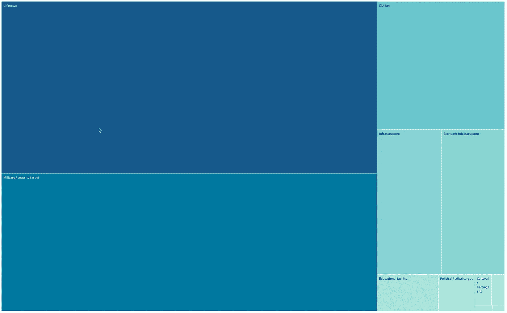

按照叙述的方式，我们有理由创建一个网站，在那里可以快速访问大量数据——一个页面可以提供数据集的概览，同时还可以提供细节——这样的东西在与参议员、众议员和其他官员交谈时会很有用。我们真的需要能够快速有效地传达我们的信息——这就是我决定创建一个仪表板的原因。

这个仪表板可以连接到一个动态表，并不断更新-解决快速增长的数据集的问题。它可以快速地给人们提供具体的数字，比如目标、空袭次数以及这些年的进展。它还可以用来创作几十个故事，任何人都可以从这里开始寻找有关也门空袭的信息。

为了到达仪表板，我回到了时间线——第一个版本是正确的，但是我把它进一步分解了。

我创建了一个精细的时间表，其中每一天都是可见的，每个方块的大小代表当天空袭的次数，颜色表示类别的类型。

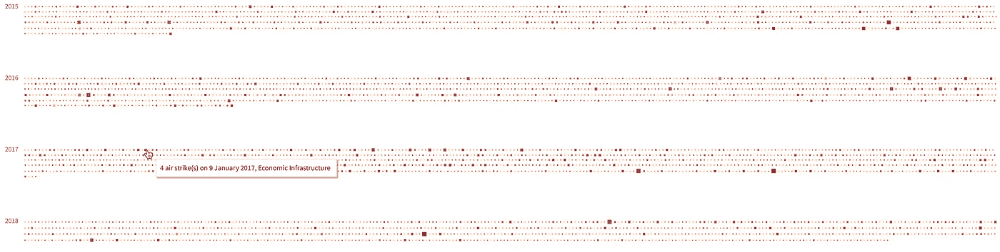

The granular timeline

我决定将仪表板嵌入到文章的末尾——如果有人正在阅读这个故事，他们可以从导航中选择它，或者如果他们没有失去兴趣，他们会自然得到它。如果它被用来游说特定的个人，那么即使是正确视图的屏幕截图也会有助于激起某人的兴趣。

在叙事本身，我想包括较小的咬大小的图形。这些视觉化很大程度上是两页的内容，我将它们提取出来并放入 excel，然后允许我进行两次视觉化。

第一份记录了美国出售的武器和装备的种类以及由此带来的经济收益。

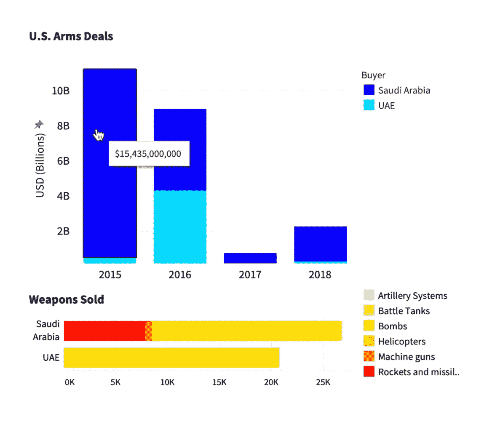

这一画面很重要，它显示了也门冲突对美国经济有多么有利可图，这不仅仅是对联盟领导人天真的错误信任。

第二个互动图形更详细地显示了 2015 年至 2018 年对民用场所的空袭次数，显示了空袭异常激烈的时期。

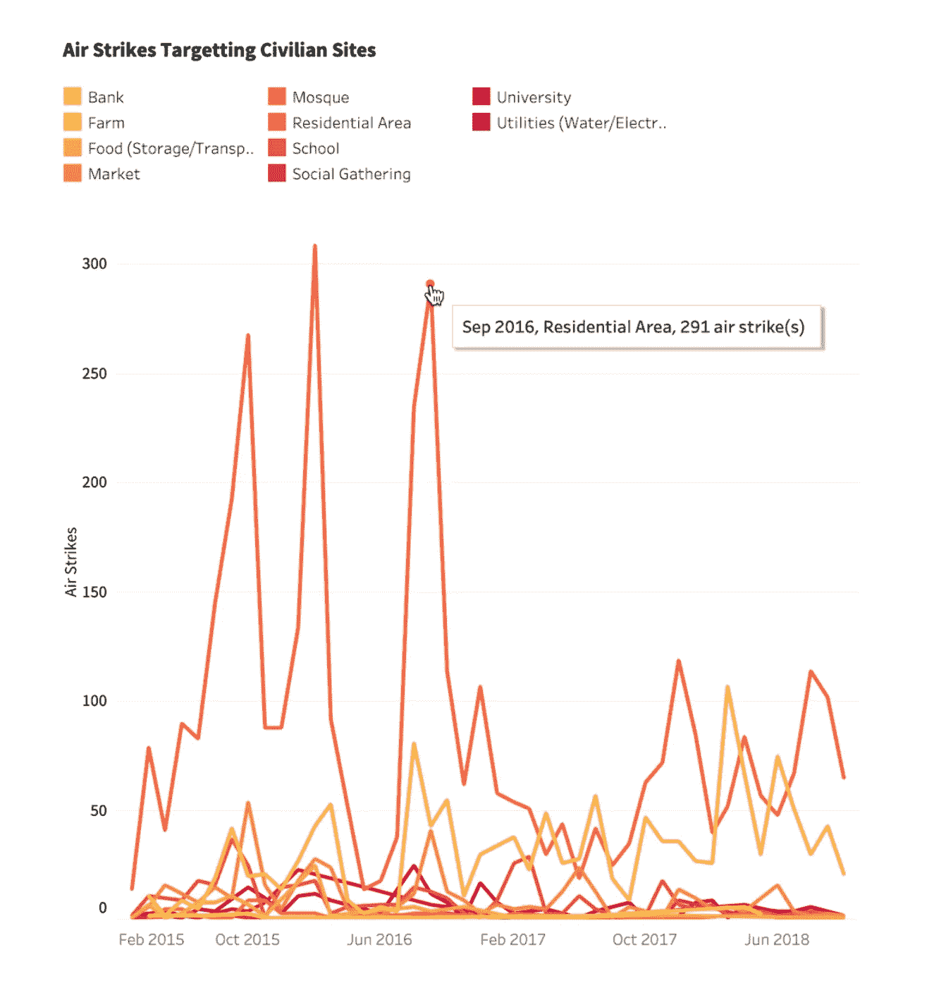

有了主内容中的这两个迷你可视化，我可以返回到仪表板。

在仪表盘中，我添加了一个摘要数字，增加了一些选项，用户可以选择年份，按类别过滤，悬停并获得详细信息，在获得概览的同时突出显示特定事件，然后最后添加注释，虽然不是最优雅的，但足以添加更多背景信息，突出显示媒体报道的特定事件和时刻，或者关于也门冲突的关键决策是何时做出的。

一旦我们有了一个可用的仪表盘，我就制作了一个带有相关断点的移动和平板版本的可视化。

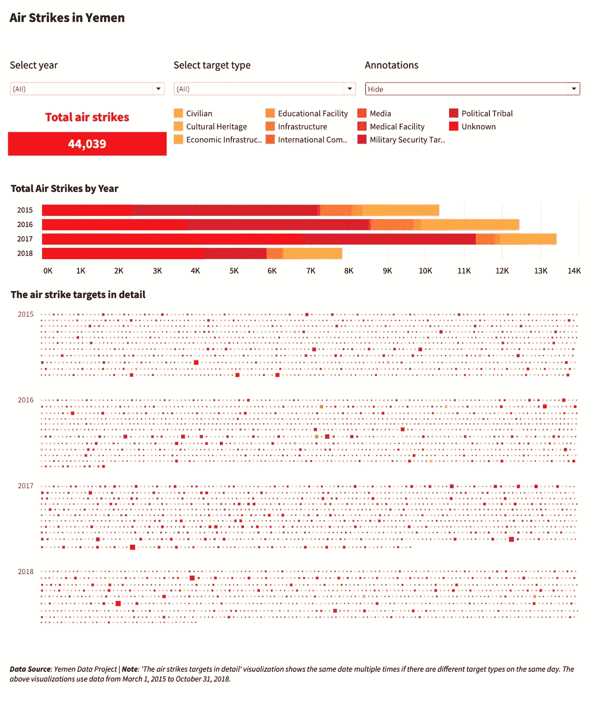

我们有一个可行的故事！！

这个故事是建立在速记的基础上的，一旦我设法获得足够的数据，视觉语言开始成形。

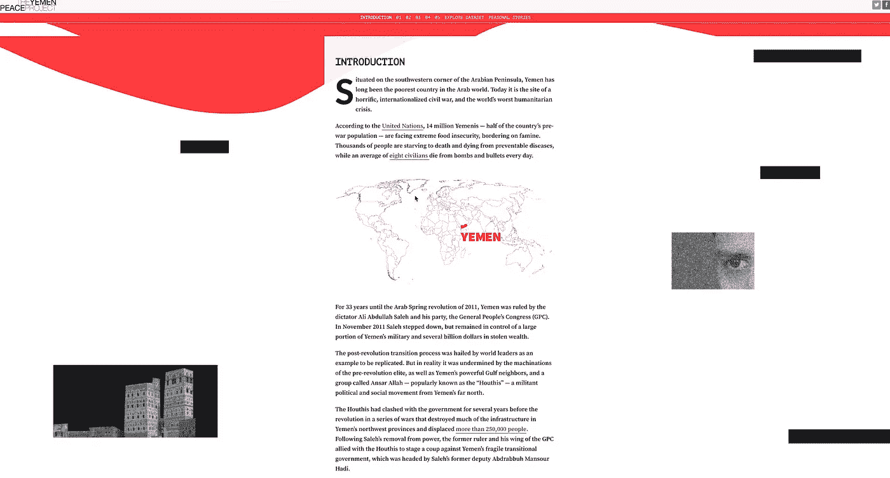

这个故事很大程度上是关于美国对也门的政策，非常详细地描述了视觉语言、图形、颜色、字体和照片…

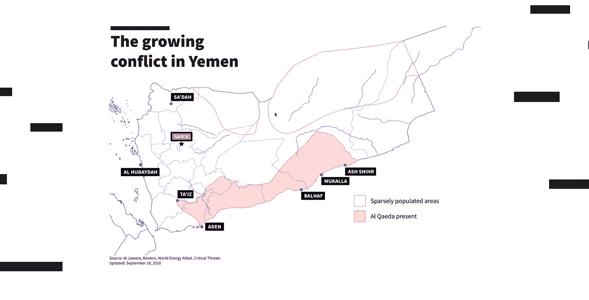

就竞选以来形势的发展而言:2018 年 12 月，参议院通过了一项重要决议，限制美国对沙特联盟的支持——这项决议于今年 4 月在众议院获得通过，但不幸的是，也许可以预见的是，特朗普阻止了这项决议。

这将是一项正在进行的工作。尤其是在冲突持续的时候。

您可以在 tableau 网站[这里](https://tabsoft.co/2RqlPce)查看仪表盘，在这里查看故事[。](http://www.yemenpeaceproject.org/invisible)

如果有人想访问数据或工作簿，请随时联系！