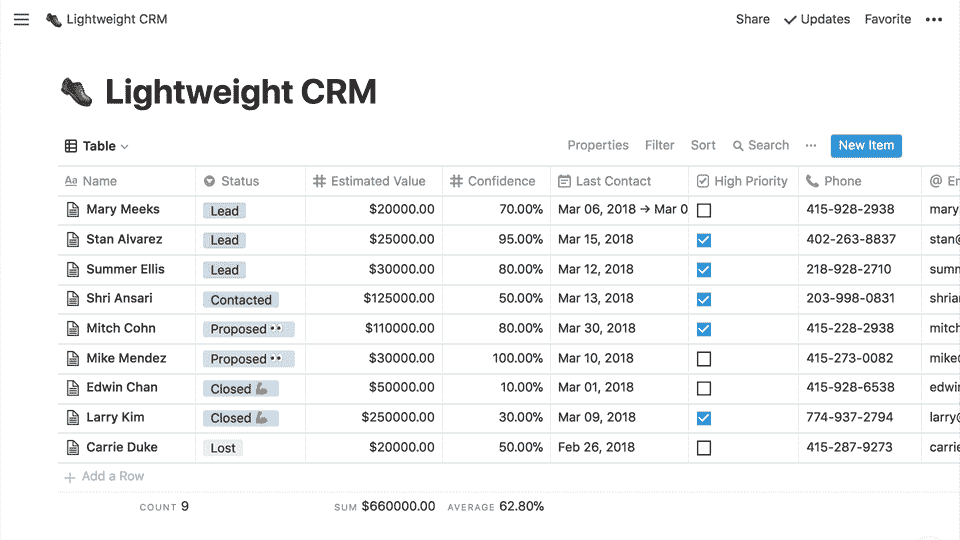
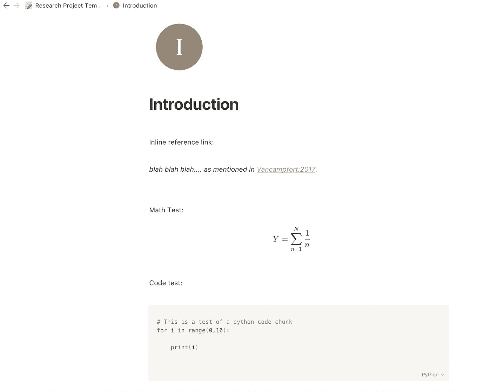
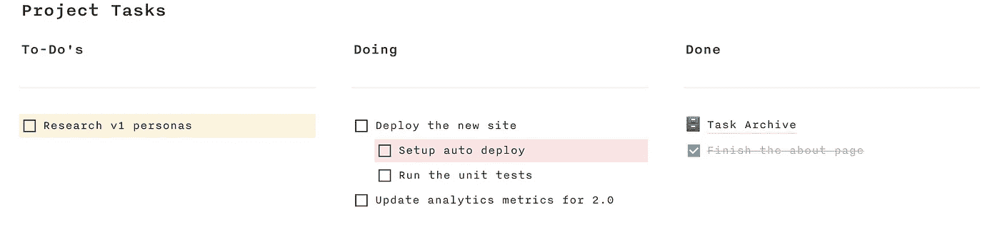
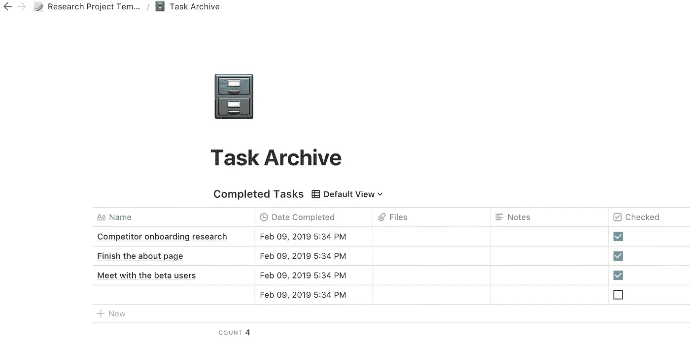
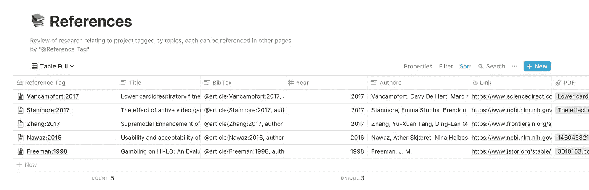
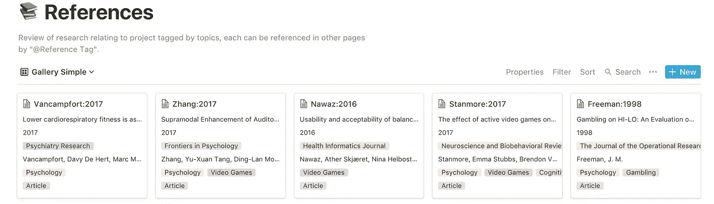
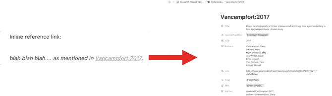

# 数据科学研究项目的最佳笔记/任务管理器应用程序

> 原文：<https://towardsdatascience.com/the-best-note-taking-task-manager-app-for-data-science-research-projects-ddc82afaa509?source=collection_archive---------6----------------------->

[**概念**](https://www.notion.so/) 起初看起来像任何其他笔记应用程序，但很快就变得很明显，其中的一些功能使它脱颖而出。

这是我发现的第一款将笔记、任务管理和项目规划以惊人的方式结合在一起的应用。最重要的是，没有任何功能被锁定在付费墙后面。我仍在学习使用所有的功能，但我想展示它是如何帮助我改进我的研究项目的。

Source: [Verge](https://www.theverge.com/2018/6/7/17434754/notion-android-app-notes-productivity-review)

**到目前为止我发现的最好的特性:**

*   支持 LaTeX 数学和代码单元格的 Markdown 注释
*   可用于任务管理、会议日志和文件存档
*   我见过的做这么多事情的最好的定价模型
*   文献综述/参考表格的多种格式
*   页面和内容可以链接，这是惊人的跟踪参考和来源！

只是要注意，我没有任何方式附属于该应用程序，只是有人对一些独特的功能感到兴奋。除了用文字展示之外，我还通过视频展示了这一点。我是第一次以这种方式展示，所以感谢任何反馈。 [**显示的模板可在此处公开获取。**](https://www.notion.so/sterlingosborne/Research-Project-Template-907609cc8ae64e9586cced401e17e901)

# 关键特征

## 1.减价说明

不同于一些为作者创建的编辑器，笔记可以用 markdown 编写，这包括 LaTeX math 和 code 单元格。其他嵌入也可以包括谷歌地图，推文，Github 回购，视频和更多！

Markdown Page Demo

## 2.任务管理

检查表可用于跟踪项目中要完成的任务。我还利用了一个存档，其中保存了所有已完成的任务，以便在稍后召开回顾会议时，我可以轻松演示我完成的每项任务。

Task Management

Archiving Tasks

## 3.文献综述、参考文献和链接页面

concept 最好的特性之一是，我可以用它来跟踪我对一个项目的各种格式的所有引用。我总是发现一个简单的表格(例如使用 Excel)可能是有效的，但有时它有助于以董事会的方式查看它。

此外，我可以添加标签，用于跟踪论文的主题、提交的出版物和参考类型(如文章、书籍、链接等)。然后，这些标签可以用于过滤或排序，这可以更容易地找到我需要的特定部分的资源。

最后，通过给每个引用一个“引用标签”,我们可以在其他地方的文本中链接这些引用。这个链接是内嵌的，但也可以打开来显示参考的完整信息，包括我做的任何笔记。这可以用于我创建的任何内容，包括其他笔记、会议和文件。

Reference Table

Reference as Gallery View

Inline Reference with Page Link

这些仅仅是使 idea 脱颖而出的主要特性，但还有更多，我建议你亲自尝试一下。

希望对你有用！

谢谢

英国货币