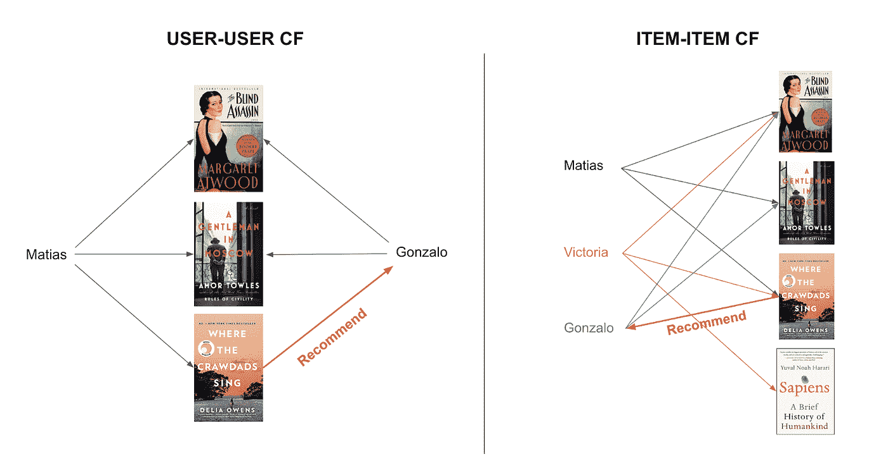
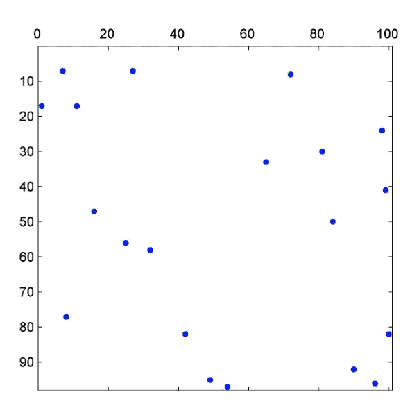
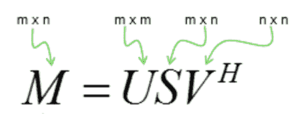
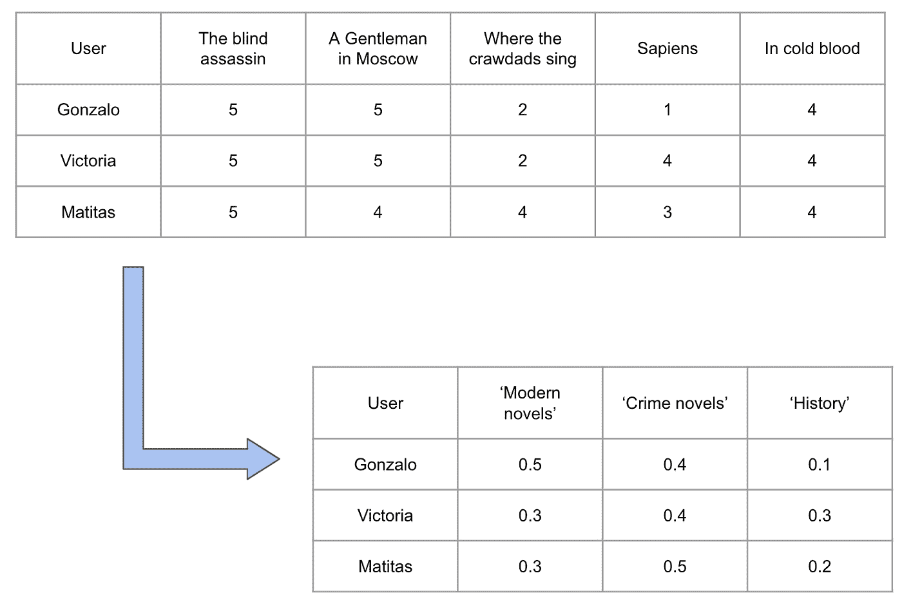
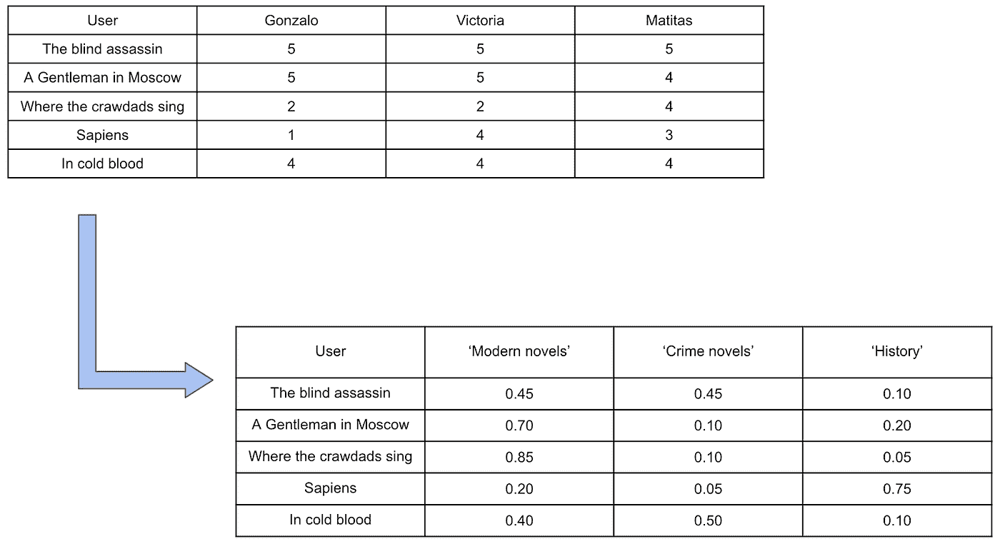
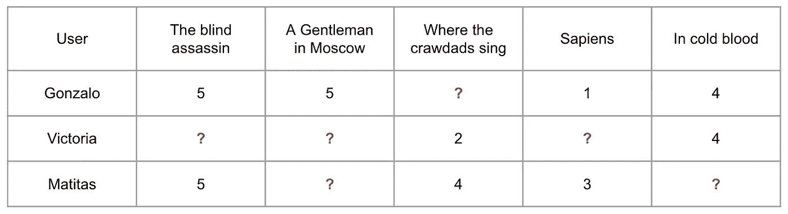

# 更好的推荐系统的最佳工具

> 原文：<https://towardsdatascience.com/the-best-tool-for-better-recommendations-systems-e57142b45f11?source=collection_archive---------25----------------------->

## 奇异值分解背后的直觉:一种基于简单英语主成分分析的工具，无需数学

# 介绍

在介绍推荐系统的前一篇文章[中，我们看到这个工具在过去的一年中有了巨大的发展。成为维护网站或应用程序受众参与和使用其服务的工具。通常，推荐系统使用我们以前的活动为我们做出具体的推荐(这被称为基于内容的过滤)。现在，如果我们第一次访问一个电子商务，它对我们一无所知，那么它怎么能给我们推荐呢？最基本的解决方案是推荐最畅销的产品、最新发布的产品、经典产品，例如，如果我们谈论的是电影或书籍，或者我们甚至可以推荐给企业带来最大利润的产品。](/a-gentle-introduction-to-recommendation-systems-eaddcbde07ce)

然而，这种方法已经过时了，因为许多电子商务已经开始使用基于协同过滤的推荐系统。让我们记住它是如何工作的:假设我喜欢以下几本书:《盲人刺客》和《莫斯科的绅士》。我的朋友马蒂亚斯也喜欢《盲人刺客》和《莫斯科绅士》，但也喜欢《小龙虾歌唱的地方》。看来我们俩有相同的兴趣。所以你可能会肯定我也喜欢《小龙虾歌唱的地方》,尽管我没有读过。

此外，在协同过滤(CF)领域，我们可以实现用户-用户或项目-项目协同过滤。关于这两种技术的更多细节，它们背后的数学逻辑以及如何在机器学习中实现它们，可以在我以前的一篇文章中找到，但简而言之，下图总结了这两种工具:

*   **用户-用户 CF** :这是我们之前例子的情况。因为马蒂亚斯和我都喜欢《盲人刺客》和《莫斯科绅士》，我们可以推断我也会喜欢马蒂亚斯读的第三本书:《小龙虾歌唱的地方》
*   **Item-item CF** :在这种情况下，算法会再次向我推荐《小龙虾歌唱的地方》，但只是因为马蒂亚斯、维多利亚和我，我们三个人都喜欢《盲刺客》，而《小龙虾歌唱的地方》是马蒂亚斯和维多利亚都喜欢的唯一一部电影，但我不喜欢。

# 协同过滤的问题是

开发一个基于用户-用户或项目-项目协同过滤的推荐系统是很棒的，并且肯定是为我们的用户提供更好的建议的第一步。然而，这两种工具都有其局限性，这也是事实。

如果要进行用户-用户 CF，考虑公司的用户数量和项目将非常重要。许多商业模式意味着拥有比商品多得多的用户，在大多数情况下，这些用户只会购买一些可用的产品。想想你自己:你买过多少亚马逊的产品？可能只是其中很小的一部分。现在想象成千上万像你一样的用户在一个用户和产品的矩阵中…这听起来像是很多空白，对吗？这就是所谓的**数据稀疏性**，对于推荐系统来说，这可能是一个严重的问题。正如《T2 网络技术和应用》一书所解释的:

> *数据稀疏可能导致两个用户之间的共同评价项目数量少或没有，导致相似性信息不可靠或不可用，进而导致推荐质量差。然而，这种分析过程往往没有经过实验验证。*

在一个有 100 个客户和 100 种产品的企业中，评论或购买任何产品的客户的稀疏矩阵甚至可以是这样的:

想象一下，与每个用户向量一起工作来找到它们的相似性…并没有真正的帮助，对吗？

另一方面，使用项目-项目 CF 时，考虑业务的性质是很重要的。对于电子商务，选择这个选项可能是好的。事实上，亚马逊自己开发了一个使用项目-项目 CF 的推荐系统，声称它比用户-用户方法更快，并且它可以帮助人们找到他们感兴趣的产品。然而，对于一个娱乐平台，如网飞或 Spotify，它可能不是一个非常三叶草的选择，因为项目-项目 CF 往往会给出更明显的建议，它缺乏大胆的建议和预测。

在这种情况下，两种选择都有其局限性，一些更复杂的工具开始流行起来。在接下来的章节中，我们将会看到其中的一个。

# 奇异值分解

奇异值分解是使用[主成分分析](https://en.wikipedia.org/wiki/Principal_component_analysis) (PCA)的一种方式，根据维基百科，这是一种非常复杂的统计程序，它使用正交变换将一组可能相关变量的观察值转换为一组称为主成分的线性不相关变量的值。这种变换的定义方式是，第一个主分量具有最大的可能方差(即，尽可能多地解释数据中的可变性)，而每个后续分量在与前面分量正交的约束下又具有最大的可能方差。得到的向量(每个向量都是变量的线性组合，并且包含与原始数据相同数量的观察值)是不相关的正交基集。

PCA 背后的本质数学实际上非常复杂，不幸的是，这超出了本文的范围(也可能超出了我用简单英语解释的范围)。然而，如果前一段听起来像胡言乱语，不要惊慌。希望接下来的几行能让你更好地理解奇异值分解是如何工作的，即使你没有经历 PCA 的所有数学运算。

奇异值分解可以方便地处理稀疏性，不仅在处理推荐系统时，而且在任何使用充满缺失数据的大型矩阵的 ML 工具中，因为 PCA 可以将我们的原始数据集减少到一个更小的特征集，该特征集描述了我们数据中的方差。因此，奇异值分解将矩阵分解成如下三个分量:

通常，这种分解的 U 和 V 元素代表了人类已经学会与我们试图推荐的任何东西相关联的特征。例如，请允许我回到我们之前的书籍示例，让我们再添加几个标题:

用户的潜在特征

这个矩阵是 U，它描述了每个用户与我们创造的潜在特征的接近程度。例如，我们在用户评级矩阵中使用主成分分析来查找“用户类型”，我们可以翻转矩阵并运行主成分分析来查找典型书籍类型的简介，转置我们的原始矩阵，并获得如下结果:

项目中的潜在特征

应用主成分分析后得到的矩阵将会是 v，让我们回想一下:我们的主成分分析对书籍一无所知，但它可以对书籍进行分类。正如我们之前看到的，我们最初的用户和项目矩阵是潜在特征的 U 和 V 矩阵的结果。所以如果我们有 M 和 U，我们可以重建 R，用这种方式来填补我们没有的评级的空白。这被称为矩阵分解

当然，这一切还涉及到更多的概念。基础数学中的关键概念是特征向量和特征值。然而，即使对此一无所知，一旦我们有了 U 和 V，我们就可以预测任何用户-项目组合的评分，只需将 U 中对应的用户行与 V 中对应的项目列相乘即可。最漂亮和最令人兴奋的是，我们甚至不需要担心计算，因为当在 Python 中使用奇异值分解时，我们正在做的是一次找到我们之前看到的方程的所有组成部分。因此，SVM 正在做的是对用户和商品都应用主成分分析，并给我们矩阵，我们需要得到我们想要的评级。

显然，我们不能用缺失值做矩阵运算，对吗？因此，我们需要一个完整的表来使用主成分分析。一开始，人们只是开始用平均值或其他合理的值来填充缺失的单元格。然而，有一种更好的方法。假设以下场景:

一个典型的矩阵，由于缺乏审查而缺少值

知道维多利亚对“智人”的评级可以作为乘法的结果找到，我们的支持向量机算法将把这视为优化问题，当我们试图为那些不完整的行和列找到最佳可能值时，试图最小化误差。

所有这些的 Python 实现并不像它的解释听起来那么混乱。你可以使用 [surprise](http://surpriselib.com/) 很容易地做到这一点，这是推荐系统的一个特定包。然而，你可以用它做很多事情，不幸的是，这篇文章已经离开了我，所以我将不得不把它留到另一个场合。

同时，如果你有兴趣看到所有这些的应用程序，请记住我的 GitHub 帐户有几个关于这些和其他东西的存储库。如果你愿意，欢迎在 GitHub 和 Medium 上关注我。另外，**如果你想直接在你的邮箱里收到我的最新文章，只需** [**订阅我的简讯**](https://gmail.us3.list-manage.com/subscribe?u=8190cded0d5e26657d9bc54d7&id=3e942158a2) **:)**

一如既往的感谢阅读！特别感谢我在整篇文章中使用的以下信息来源:

*   [http://www.sharetechnote.com/](http://www.sharetechnote.com/)
*   [https://en.wikipedia.org/wiki/Principal_component_analysis](https://en.wikipedia.org/wiki/Principal_component_analysis)
*   [https://sundog-education.com/](https://sundog-education.com/)
*   [来自我在大会数据科学沉浸式课程的材料](https://generalassemb.ly/education/data-science-immersive/)