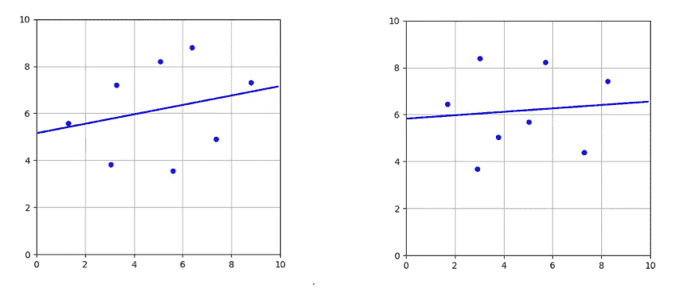
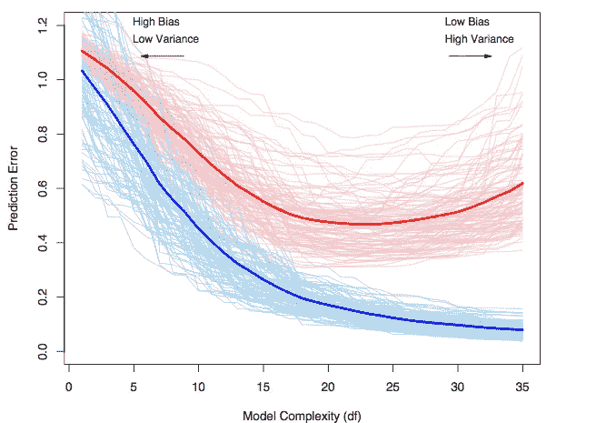

# 偏差-方差权衡:解释与演示

> 原文：<https://towardsdatascience.com/the-bias-variance-trade-off-explanation-and-demo-8f462f8d6326?source=collection_archive---------9----------------------->

偏差-方差权衡是数据科学和机器学习领域中一个基本但重要的概念。通常，我们会遇到这样的陈述:“较简单的模型具有高偏差和低方差，而较复杂或复杂的模型具有低偏差和高方差”或“高偏差导致欠拟合，高方差导致过拟合”。但是偏差和方差实际上意味着什么，它们与模型的准确性和性能有什么关系？

在本文中，我将解释偏差和方差的直观和数学含义，展示偏差、方差和模型性能之间的数学关系，最后通过一个小示例演示改变模型复杂性对偏差和方差的影响。

# 开始时的假设

偏差和方差是统计学术语，可用于各种情况。然而，在本文中，它们将根据试图拟合/解释/估计一些未知数据分布的估计器来讨论。

在我们深入研究估计量的偏差和方差之前，让我们做如下假设

1.  有一个数据发生器，Y = f(X) + ϵ，它产生数据(x，y)，其中ϵ是添加的随机高斯噪声，以原点为中心，有一些标准偏差σ，即 E[ϵ] = 0，Var(ϵ) = σ。请注意，数据可以从生成器中重复采样，产生不同的样本集，如 Xᵢ、Yᵢ和 iᵗʰ迭代。
2.  我们正在尝试使用一个估计器来估计(拟合曲线)我们从生成器获得的样本集。估计量通常是一类模型，如岭回归、决策树或支持向量回归等。一类模型可以表示为 g(X/θ)，其中θ是参数。对于不同的θ值，我们在该特定类别的模型中得到不同的模型，并且我们尝试改变θ以找到最适合我们的样本集的模型。

# 偏差和方差的含义

估计值的偏差是其估计值和数据中真实值之间的“预期”差异。直观地说，它是估计量与估计量试图估计的实际数据点的“接近”(或远离)程度的度量。请注意，我使用了“预期”一词，这意味着我们正在仔细考虑这种差异，请记住，我们将无限次地进行这个模型训练实验。这些模型中的每一个都将在真实数据的不同样本集 Xᵢ、Yᵢ上训练，导致它们的参数采用不同的θ值，以试图最好地解释/拟合/估计该特定样本。

最终，对于某个测试点 xₒ，这个估计量 g(X)的偏差在数学上可以表示为

bias[g(xₒ)]=e[g(xₒ)]-f(xₒ)

它实际上是估计量在该点的[期望值](https://en.wikipedia.org/wiki/Expected_value)和在该点的真实值之差。

自然地，当一个不同的数据样本集被抛向它时，如果一个估计量没有摆动或改变太多，它将在一个测试点具有**高偏差**(因此总体上也在极限内)。当估计器没有足够的“能力”来充分拟合固有的数据生成函数时，通常会出现这种情况。因此，与更复杂的模型相比，更简单的模型具有更高的偏差。

*保持这些想法*，我们将在文章的后面再次回到它们。现在，这里有一个数字来帮助巩固他们。

Linear Regression fits for two different samples of size 8\. Notice how curve has not changed too much although the sample sets are totally disjoint

**估计值的方差**是一个模型的估计值与估计值的“预期”值之间的平方差的“预期”值(在估计值的所有模型上)。*太复杂，一次看不懂？让我们把那个句子分解一下..*

假设我们使用不同的数据样本集来训练∞模型。然后在测试点 xₒ，所有这些模型的期望值就是 E[g(xₒ)].此外，对于所有模型中的任何一个模型，该模型在该点的估计是 g(xₒ).这两者的区别可以写成 g(xₒ)——e[g(xₒ)].方差是所有模型中该距离平方的期望值。因此，在测试点 xₒ，估计量的方差可以用数学方法表示为

var[g(xₒ)]=e[(g(xₒ)——e[g(xₒ)]

根据这个等式，我们可以说，当估计器在任何数据点“变化”或改变其估计值很多时，当它在数据的不同样本集上被训练时，估计器具有**高方差**。另一种说法是，估计器足够灵活/复杂，或者具有很高的“能力”来完美地拟合/解释/估计提供给它的训练样本集，因此它在其他点的值波动很大。

Support Vector Regressor fits for the same sample sets. Notice how the curve changed drastically in this case. SVR is a high capacity estimator compared to Linear Regression hence higher variance

请注意，这种对高方差含义的解释与具有高偏差的估计量的解释完全相反。这意味着**估计量的偏差和方差是互补的，即偏差较大的估计量变化较小(方差较小)，而方差较大的估计量偏差较小(因为偏差较大可以拟合/解释/估计数据点)**。

# 偏差-方差分解

在这一节中，我们将看到估计量的偏差和方差在数学上是如何相互关联的，以及如何与估计量的性能相关联的。我们首先将估算者在测试点的误差定义为真实值和估算者的估算值之间的“预期”平方差。

到目前为止，应该相当清楚的是，每当我们谈论期望值时，我们指的是对所有可能模型的期望，对来自数据生成器的所有可能数据样本进行单独训练。对于任何看不见的测试点 xₒ，我们有:-

err(xₒ)= e[(g(xₒ))| x =xₒ]

为了符号的简单，我将 f(xₒ和 g(xₒ分别称为 f 和 g，并跳过了 x 上的条件:-

err(xₒ)= e[(g(xₒ])]

= e[(f+ϵg)]

=e[ϵ]+e[(f g)]+2。埃[(g)ϵ)

=e[(ϵ0)]+e[(f e[g]+e[g]]+2。e[fϵ]2。E[gϵ]

=e[(ϵe[ϵ]]+e[(f e[g]+e[g]]+0 0

=var(ϵ)+e[(g e[g])]+e[(e[g]f)]+2。E[(g E[g])(E[g]f)]

= Var(ϵ) + Var(g) + Bias(g) + 2。{ E[g]E[gf]E[g]+E[gf]}

= σ + Var(g) + Bias(g)

1.  因此，在未知数据样本 xₒ下估计器的误差(以及因此的精度)可以分解为数据中噪声的方差、偏差和估计器的方差。这意味着偏差和方差都是估计量的误差来源。
2.  此外，在上一节中，我们已经看到，估计量的偏差和方差是互补的，即增加其中一个意味着减少另一个，反之亦然。

现在暂停一下，试着想一想这两个事实结合在一起对评估者意味着什么。

# 偏差-方差权衡

从偏差和方差的互补性质以及分解为偏差和方差的估计器误差来看，很明显，当涉及到估计器的性能时，在偏差和方差之间有一个折衷。

如果估计量具有非常高的偏差和低的方差，即当它根本不能适应样本集中的数据点时，它将具有高误差。在另一个极端，如果估计量具有非常高的方差和低的偏差，即当它非常好地适应样本集中的所有数据点(样本集是真实数据的不完整表示)时，估计量也将具有高误差，因此不能概括其他看不见的样本，并且最终不能概括真实数据集。

在偏差和方差之间取得平衡的估计器比那些生活在极端的估计器能够更好地最小化误差。虽然这超出了本文的范围，但是可以使用基本的微分学证明这一点。

Courtesy : The Elements of Statistical Learning by Jerome H. Friedman, Robert Tibshirani, and Trevor Hastie. Blue curves show the training errors on 100 samples of size 50\. Red curves are the corresponding test set errors

这个数字来自 ESLR，它很好地解释了这种权衡。在这个例子中，100 个大小为 50 的样本集被用于训练 100 个相同类别的模型，每个模型的复杂度/容量从左到右增加。每条浅蓝色曲线都属于一个模型，并演示了模型的训练集误差如何随着模型复杂性的增加而变化。浅红色曲线上的每一点依次是通用测试集上的模型误差，随着模型复杂性的变化而追踪曲线。最后，较暗的曲线是各自的平均(趋向于极限中的期望值)训练和测试集误差。我们可以看到，在偏差和方差之间取得平衡的模型能够概括出最好的结果，并且比那些具有高偏差或高方差的模型表现得好得多。

# 演示

我放了一个小演示来展示我在这篇文章中谈到的所有内容。如果所有这些都有意义，并且你想自己尝试一下，那就看看下面吧！我比较了岭回归和 K-最近邻回归之间的偏差-方差权衡，K = 1。

请记住，KNN 回归器 K = 1 完全符合训练集，因此当训练集发生变化而岭回归器没有变化时，它会“变化”很多。

Demo comparing bias-variance between KNN and Ridge Regressors

我希望这篇文章很好地解释了这个概念，并且读起来很有趣！如果你有任何后续问题，请发表评论，我会尽力回答。