# 偏差-方差权衡

> 原文：<https://towardsdatascience.com/the-bias-variance-tradeoff-8818f41e39e9?source=collection_archive---------3----------------------->

在这篇文章中，我们将解释偏差-方差权衡，这是机器学习中的一个基本概念，并展示它在实践中的意义。我们将表明，一个看不见的(测试)点的均方误差是两种竞争力量(偏差/方差)和问题本身固有噪声的结果。

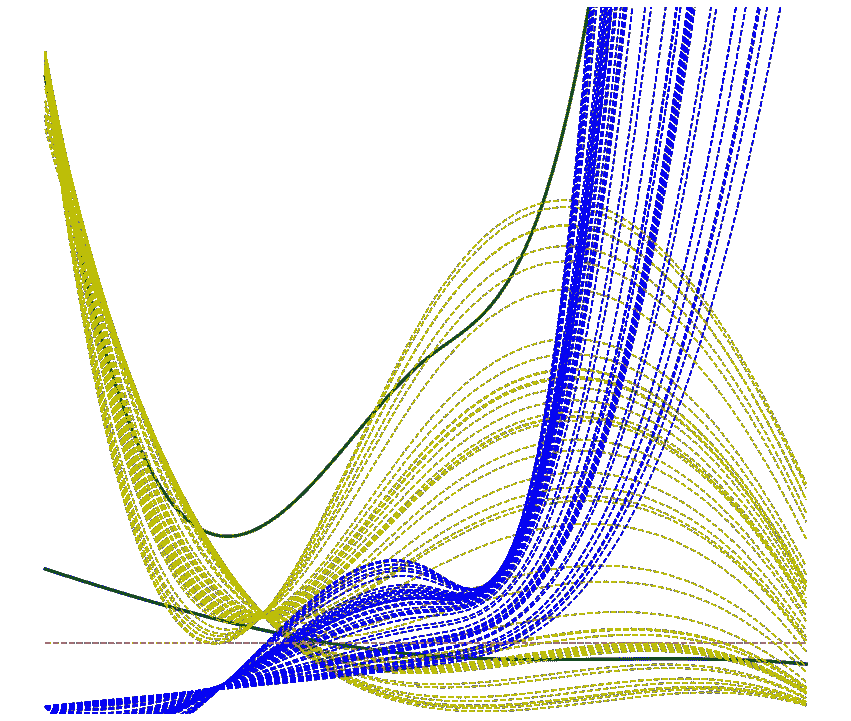

# 动机

我们经常在机器学习教科书中看到下图描述了泛化(测试)错误及其与模型复杂性的联系。泛化(测试)误差，即看不见的数据中的误差，可以分解为*偏倚误差*(错误的模型假设产生的误差)、方差(对训练数据小波动的敏感性产生的误差)和不可约误差(问题本身固有的噪声)。

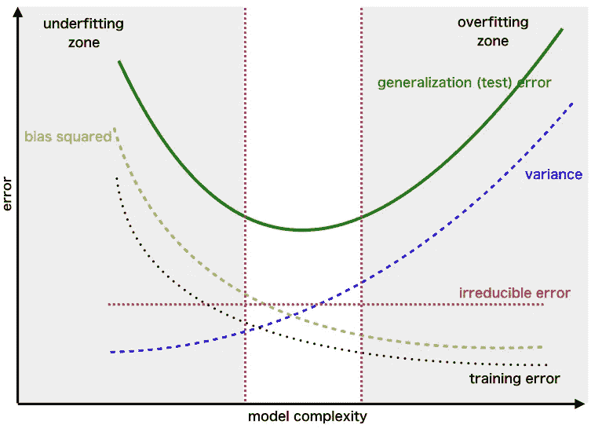

高偏差通常源于过于简化的模型假设，而高方差则源于过于复杂的假设。顾名思义，不可约误差与底层模型无关，而是与问题中的固有噪声有关。这种噪声可以表示来自数据质量的噪声(例如，数据收集或报告中的不准确性)、来自描述现实问题的真实函数的仅近似知识的噪声、来自潜在现象的非确定性行为的噪声，并且一般来说，是不能容易地定义的任何类型的噪声。当我们的模型遭受高偏差时，模型的平均响应远离真实值，我们称之为*欠拟合*。当我们的模型遭受高方差时，这通常是因为它无法在训练数据之外进行推广，我们称之为*过度拟合*。我们的目标是建立一个模型，实现偏差和方差之间的平衡，使这两种竞争力量的综合误差最小*。这是上图中的中间区域！

*通常，随着模型复杂性的增加，传统的机器算法(如回归算法、梯度提升树、支持向量机等)会遇到偏差-方差权衡的问题。然而，深度学习的最新进展质疑了只要有大量训练数据，模型复杂度就会增加的既定概念。

# 问题定义

让我们从定义一些关键概念开始。我们假设自变量 *x* 通过确定性或非确定性关系影响因变量 *y* 的值。我们说*非确定性*是因为 *y* 的值也会受到无法明确建模的噪声的影响。让我们通过函数 *f* 来表示 *y* 对 *x* 的依赖关系，这实质上代表了 *x* 和 *y* 之间真实的底层关系。在真实情况下，当然很难——如果不是不可能的话——知道这种关系，但是我们将假设 *f* 是固定的，即使它是未知的。在这种情况下， *y* 是 *x* 和随机噪声的结果，由公式给出:

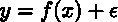

噪声由具有零均值和方差σϵ的随机变量ϵ建模。方差的大小代表了潜在现象的不确定性水平。我们的不确定性越大，σϵ的价值就越大。在数学上，ϵ具有以下特性:

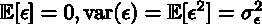

现在，当我们试图对潜在的现实生活问题建模时，这实际上意味着我们试图找到一个函数 *f̂* ，使得它尽可能接近真实的(但我们未知的)函数 *f* 。函数 *f̂* 在回归情况下可以采用系数的形式，在支持向量机(SVMs)的情况下可以采用支持向量和对偶系数的形式，并且它是从训练数据中学习的。生成训练数据的基础分布越接近生成测试(看不见的)数据的基础分布，由函数 *f̂* 表示的模型将越好地推广到看不见的数据。函数 *f̂* 通过最小化损失函数来学习，其目标是使训练数据的预测尽可能接近它们的观察值: *y ≈ f̂(x)* 。

M *ean 平方误差*(简称 MSE)是一个预测 *f̂(x)* 与其真值 *y* 的均方差。它被定义为:

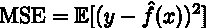

*偏差*被定义为对于给定的不可见(测试)点 *x* 的预测平均值(*在训练数据*的不同实现上)与真实底层函数 *f(x)* 的差异。

让我们花一些时间来解释一下我们所说的“*训练数据的不同实现”*是什么意思。假设我们想要监控某个社区的家庭收入水平和房屋销售价格之间的关系。如果我们能够获得每家每户的数据，我们就能够训练出一个非常精确的模型。但是，由于获取数据可能成本高昂、耗时，或者受到隐私问题的影响，大多数时候我们无法获得底层人群的所有数据。一个*实现*意味着我们只能访问一部分底层数据作为我们的*训练数据*。这种认识可能不代表潜在人口(例如，如果我们只调查某个家庭有一定教育水平的房屋)或具有代表性(如果没有种族、教育、年龄或其他类型的偏见)。因此，当我们说期望𝔼[*【f̂(x】**是针对训练数据的不同实现时，这可以被认为是我们有机会从基础总体中投票选出一个样本，在这个样本上训练我们的模型 *f̂* ，计算 *f̂(x)* 并重复多次(每次使用不同的训练样本)。预测的平均值将代表𝔼[*【f̂(x】**。*在这里， *f̂(x)* 即使 *x* 是*固定*也是变化的，仅仅是因为 *f̂依赖于训练数据。* **所以， *f̂* 对于训练数据的不同实现会有所不同。**用更数学的术语来说， *f̂* 是一个随机变量，受我们获取训练数据的随机性影响。*

**方差*定义为 *f̂(x)* 与其期望值𝔼[*f̂(x)**在训练数据的不同实现上的均方偏差。**

****

**将测试 MSE 与偏差、方差和不可约误差联系起来的公式为:**

**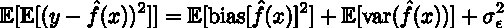**

**术语𝔼[𝔼[(*y*—*f̂(x*)]]中的第一个期望是未知(测试)点的分布 *x* ，而第二个期望是训练数据和随机变量ϵ.的分布因为 *f̂* 依赖于训练数据，我们也可以说第二次期望已经超过了 *f̂、* ϵ.如果我们把上面的公式写得更明确一点，那就是:**

**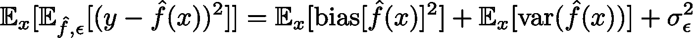**

**但是为了简单起见，我们将跳过期望标识符。右边的三项都是非负的，不可约误差不受模型选择的影响。这意味着测试 MSE 不能低于σϵ。我们现在将推导出给定测试点 x 的公式。因为它适用于给定的测试点 x，所以它适用于任何看不见的测试点的分布。**

# **偏差-方差分解的证明**

**提醒一下，我们假设 *x* 是一个看不见的(测试)点， *f* 是潜在的真函数(规定了 *x* 和 *y* 之间的关系)，它是未知但固定的，ϵ代表问题中的固有噪声。测试 MSE，𝔼[(*y*—*f̂(x)*]*是对训练数据和随机变量ϵ *:* 的不同实现***

**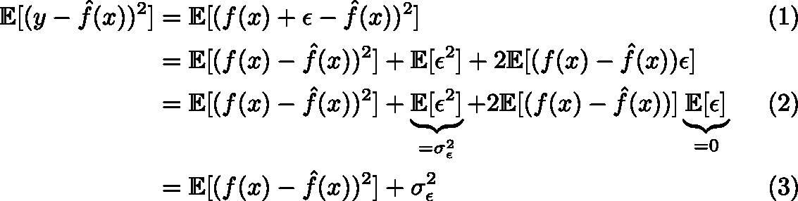**

**(1)是因为 *y = f(x)* + ϵ，(2)是因为平方展开、期望的线性性质和随机变量ϵ的独立性 *f̂* 。记住，当两个随机变量独立时，它们乘积的期望等于它们期望的乘积。在 Eq 中。(3)我们看到测试 MSE 如何分解成不可约误差σϵ和𝔼[(*f(x)*—*f̂(x)*】。现在让我们看看如何进一步分析后一项。**

**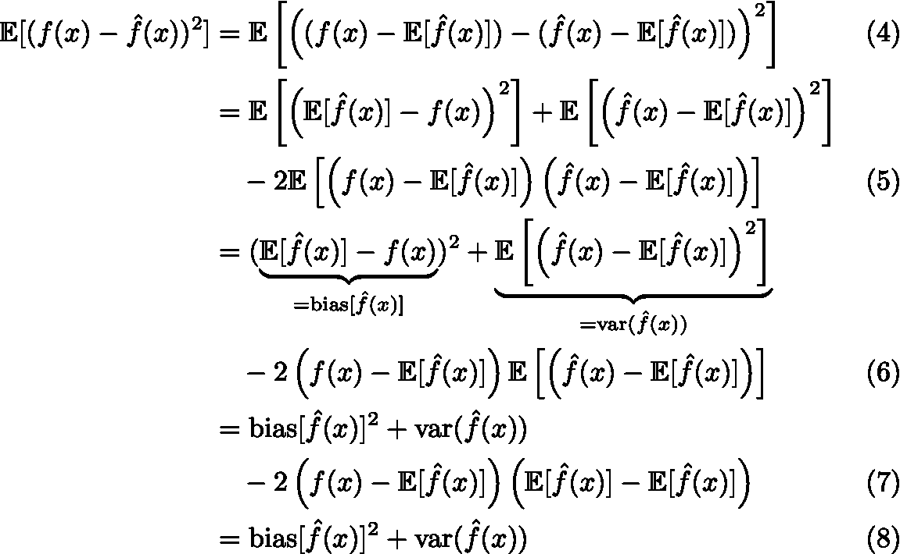**

**在 Eq 中。(4)我们通过𝔼[*【f̂(x】**和等式中的加减。(5)我们展开正方形内的项。偏置𝔼[*f̂(x)*-*f(x)*只是一个常数，因为我们从𝔼[ *f̂(x)* 中减去 *f(x)* (一个常数)，后者也是一个常数。因此，将期望应用于平方偏差，(𝔼[*f̂(x)**f(x)*)没有任何效果。换句话说，𝔼[(𝔼[*f̂(x)*—*f(x)*)=(𝔼[*f̂(x)*—*f(x)*)。在 Eq 中。(6)我们能够把 *f(x)* −𝔼[ *f̂(x)* 拉出预期，因为正如我们提到的它只是一个常数。最后，由于期望的线性，(7)成立。因此，我们在(8)中看到，𝔼[(*f(x)*—*f̂(x)*]是偏差和方差的平方和。当我们结合等式。(3)和(8)，我们最后得到:***

**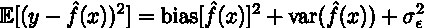**

**这是针对给定的测试点 *x* 的，但是我们通常有一组测试点，这可以转换成我们在上一节中给出的公式。**

****

**(期望𝔼在右手边是测试数据的分布。)**

# **在实践中显示偏差-方差权衡**

**在我们推导出偏差-方差分解公式之后，我们将展示它在实践中的意义。假设，规定 *x* 和 *y* 之间关系的基础真函数 *f* 为:**

**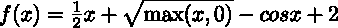**

**并且噪声由具有零均值和标准偏差 1 的高斯模型(ϵ ~𝒩(0，1)来建模。提醒一下， *y = f(x)* + ϵ.如果我们从这个过程中随机产生 1000 个点，我们会得到下面的图。**

**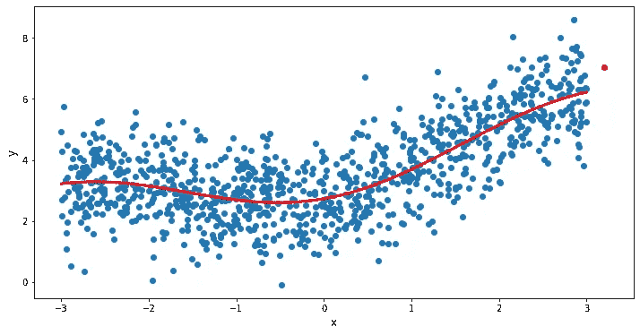**

**蓝点代表( *x* 、 *y* )对，红线是底层真函数 *f(x)* 。红点是我们要预测的看不见的(测试)点。我们看到 *f* 遵循非线性模式，因为在函数定义中增加了平方根和余弦。出于我们的目的，这 1，000 个点代表了整个潜在人群。下面是重现这个情节的代码。**

**我们将用不同复杂程度的多项式回归来模拟这个问题。提醒一下，在多项式回归中，我们试图拟合 *x* 和 *y* 之间的非线性关系。**

**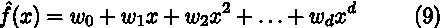**

**换句话说，我们试图用 *f̂(x)* 来近似 *y* ，如等式所示。(9).我们将不详细讨论如何学习模型参数 w₀、w₁、…、wd，因为这超出了本文的范围，但是让我们假设它们是通过最小化损失函数来评估的，该函数试图使*f̂(x*尽可能接近*y**。***

**现在，假设我们只能使用 20 个点(1000 个点中的 20 个)来训练我们的多项式回归模型，我们考虑四个不同的回归模型，一个具有度 *d* =1(简单直线)，一个具有 *d* =2、 *d* =3 和 *d* =5。如果我们从潜在人群中随机抽取 20 个点，并重复这个实验 6 次，这就是我们可能得到的结果。**

**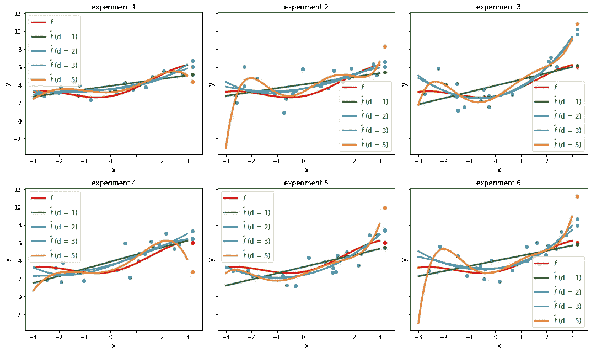**

**蓝点代表特定实现(实验)的 20 个训练数据点。红线是潜在的(我们未知的)真实函数 *f* ，其他线代表四种不同模型对训练数据的不同实现*的拟合。绿色、紫色、青色、橙色点代表每个模型下测试(未显示)点 *x* 的预测*f̂(x】*。正如我们所看到的，复杂度较低的代码行差异较小。以 *d* =1(简单直线)为例。在不同的实验中，直线的斜率没有太大的变化。另一方面，更复杂的模型( *d* =5)对训练数据*中的*小波动更敏感。例如，看实验 1 和实验 6 之间的橙色线( *d* =5)的差异，以及这如何影响预测 *f̂(x).*这就是我们前面提到的*方差*问题。一个简单的模型对训练数据的变化非常稳健，但一个更复杂的模型则不然。另一方面，平均而言， *f̂(x)* 与 *f(x)* 的偏差*偏差*对于更简单的模型来说更大，因为我们的假设不能代表潜在的真实关系 *f* 。以下是上述情节的代码。***

*现在，假设我们*模拟* 10，000 个不同的实验，每次从底层人群中随机抽取 20 个点作为我们的训练数据。在每次实验中，我们都会学到与实验训练数据相关的不同的 f̂。如果对于一个给定的看不见的测试点 x，我们为每个实验评估 *f̂(x)* ，我们将为 *f̂(x).收集 10，000 个值*对于线性( *d* =1)和二次( *d* =2)回归模型，我们这样做。如果我们记录这 10，000 个值，我们会得到下面的图。 *(* 注意，在代码和图中，测试点用 *x_* 表示，训练数据用 *x* _train 表示。换句话说，尽管我们在本文中用 *x* 来表示测试点，但是在代码中，为了避免混淆，我们用变量*x _*test)*来表示。**

**

*正如我们看到的，黑线代表的 *f̂(x、* 𝔼[ *f̂(x)* 的均值，对于线性回归模型来说比二次回归模型(紫色 hist)更远离真实 *f(x)* (红线)。这就是*偏差*，换句话说，当我们的模型假设过于简单时，与真实模型的偏差。另一方面， *f̂(x、* var( *f̂(x)* )的方差在二次模型上比线性模型上更大，正如我们从底部(紫色)直方图的更大分布中看到的。这就是*方差*问题，换句话说， *f̂(x)* 对训练数据的小波动的依赖性较大。下面是再现直方图的代码。*

*现在让我们考虑 1000 个测试点，并计算平均测试 MSE(在这些点上)。我们还计算平均平方偏差(在这 1000 个测试点上)和平均方差。如果我们对五个模型这样做，从度数 *d* =0(水平线)一直到度数 *d* =4，我们得到下面的图。*

*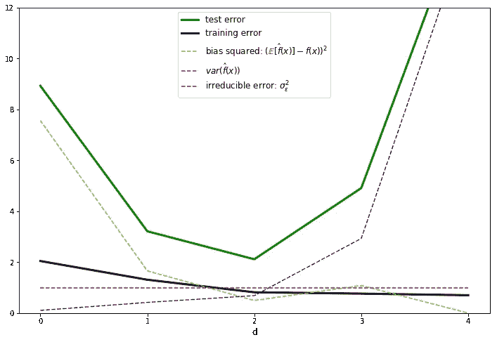*

*如果我们把黄色(偏差的平方)、蓝色(方差)和红色(不可约误差)的线加在一起，我们得到绿色的线(测试误差)。这是我们熟悉的偏差-方差公式！*

*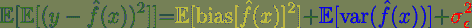*

*黑线代表训练 MSE，它随着模型复杂性而降低，因为更复杂的模型往往更适合训练数据。在这个特定的例子中，我们看到潜在问题的最佳模型是二次模型( *d* =2)，因为它实现了最小的测试误差。上述情节的代码发布在下面。*

*如果你有兴趣了解更多关于偏差-方差的问题，这里有一个非常有用的吴恩达的教程。*

# *结论*

*在本文中，我们提出了偏差-方差问题。我们继续进行数学推导，并举例说明偏差方差在实践中的真正含义。我们证明了模型选择必须与两种竞争力量作战:偏差和方差。一个好的模型应该在这两者之间取得平衡，但是由于不可约误差的存在，我们永远不可能达到零测试误差。我们的模型不应该过于简单，但也不应该过于复杂，这样它就可以很好地推广到以前看不到的数据。*