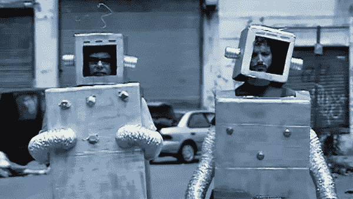

# 未来十年最大的人工智能风险不是机器人起义

> 原文：<https://towardsdatascience.com/the-biggest-ai-risk-of-the-next-decade-is-not-a-robot-uprising-efb9f6bf2d31?source=collection_archive---------18----------------------->

## 关于人工智能未来影响的大概括掩盖了我们今天面临的更紧迫的问题。

Finally, robotic beings rule the world — pictures of the Terminator and HAL are just played out at this point. (Flight of The Conchords, Robots)

过去十年，科技领域出现了许多有趣且令人印象深刻的发展([，但也不乏失败的例子](https://medium.com/pcmag-access/the-biggest-tech-product-flops-of-the-2010s-6f8f3501bb81))。人工智能的研究和开发在过去十年中有了巨大的增长，部分原因是大型数据集的可访问性和更强的计算能力促进了[深度学习革命](https://medium.com/digital-catapult/why-the-ai-revolution-is-really-a-deep-learning-revolution-23e45da2ba3a)。随着人工智能的使用越来越普及，我们对未来十年有什么期待？

先前对“2020 年愿景”的技术预测相当不靠谱——从完全错误到尚未实现。人工智能的未来是最未知的领域之一，许多人工智能专家不愿意给出任何具体的预测。在 2016 年的一项调查中，67%的人工智能研究人员表示，人工超级智能是可能的，但只会在超过 25 年后出现。25%的人说这根本不可能。

虽然对人工智能的普遍担忧是基于消灭人类的超级智能机器人起义，但在不久的将来，我们有更紧迫的担忧。这被称为[伟大的人工智能悖论](https://medium.com/mit-technology-review/the-great-ai-paradox-441da8f8747c)——担心遥远的存在性人工智能风险实际上是误导，分散了对人工智能在未来十年可能引发的真正问题的注意力。这篇文章的想法是强调我们目前拥有的人工智能的潜在(错误)用途，以及它与人类终结超级智能的不同之处。然而，讽刺的是，这篇文章也可能是一长串历史上不可靠的人工智能预测的一部分…

# 过去十年的 AI…

过去的十年是人工智能研究非常激动人心的时期。2012 年见证了 AlexNet 的推出，这是一种深度卷积网络，在 ImageNet 竞赛(一种常用的评估自动图像分类的基准)中表现相当好。[原始论文](https://papers.nips.cc/paper/4824-imagenet-classification-with-deep-convolutional-neural-networks.pdf)对谷歌学术的引用超过 53，000 次，可以被认为是深度学习革命的开始，这场革命启动了人工智能研究和应用的复兴。

> 专家预测，围棋的超人表现至少还需要 10 年时间。

这个深度学习跳板为许多进一步的人工智能应用打开了大门。DeepMind 开发了用于玩游戏的[革命性模型，并在 2016 年实现了围棋超人类表现的里程碑，当时专家预测这至少还需要十年。自然语言处理在过去十年中也取得了重大进展，2018 年 BERT 的](/deepmind-unveils-muzero-a-new-agent-that-mastered-chess-shogi-atari-and-go-without-knowing-the-d755dc80ff08)[开发](/understanding-bert-is-it-a-game-changer-in-nlp-7cca943cf3ad)重新定义了该领域的艺术起点，让计算机能够更好地理解我们的语言和言语。

许多技术领域现在都在利用人工智能——自动驾驶汽车、语言翻译、手机——人工智能研究在过去十年中的重要性通过它在不同行业中的应用速度得到了证明。的确，AI 界有三位大佬获得了 [2018 图灵奖](https://www.nytimes.com/2019/03/27/technology/turing-award-ai.html)(诺贝尔计算奖)，可见过去十年 AI 研究的意义。

深度学习的概念其实是一个相当古老的想法；从 80 年代就有了。然而，只有当计算能力赶上来，并且我们拥有可以满足数据饥渴算法的大规模标记数据集时，它的真正利用才是可能的。虽然深度学习已经让我们做了许多令人印象深刻的事情，但我们仍然依赖于一个 30 年前的想法— [我们会不会开始发现深度学习的局限性，需要一些新的东西？](https://www.technologyreview.com/s/608911/is-ai-riding-a-one-trick-pony/)

# …以及未来十年的人工智能

那么，未来十年我们可以期待看到什么呢？有许多关于人工智能将如何影响 2020 年及以后的工业的预测，其中大部分是过去几年的研究，并以新的方式应用。我们已经看到[增强了某些行业](/how-machine-learning-is-helping-doctors-nurses-bankers-transport-workers-and-manufacturers-9108fa0ceca5)，随着数据变得越来越丰富，这种情况可能会继续下去。

> 我们目前的人工智能在某些领域明显缺乏，距离一般智能还有很长的路要走。

所有这些新的创新仍然处于狭义人工智能的领域；只能胜任一项特定任务的程序(你的下棋人工智能不会擅长在餐馆订桌，反之亦然)。即使其中一些可以被认为是专家人工智能，在人类或超人的水平上执行，他们仍然从根本上严重缺乏人工一般智能(AGI)。即使是围棋中令人印象深刻的壮举，一些被预测为至少 10 年后的事情，仍然停留在狭隘/专业的人工智能领域。

我们目前的狭义人工智能在某些领域严重不足。它们的样本效率非常低:在深度学习系统能够准确分类之前，必须向它展示很多很多的例子(相比之下，我们人类只能从少数例子中学习)。他们没有常识，无法理解我们认为理所当然的事情，尽管[正在努力将常识理解嵌入我们当前的系统](https://www.wired.com/story/how-to-teach-artificial-intelligence-common-sense/)。深度学习系统也非常脆弱；他们操作环境的微小变化会导致灾难性的失败，甚至会被恶意攻击利用。

# 我们不需要太担心 AGI

既然 AGI 似乎离我们还有很长的路要走，我们应该为此担心吗？AI 可能受制于[安国定律](https://www.technologyreview.com/s/609048/the-seven-deadly-sins-of-ai-predictions/):

> “我们往往会高估一项技术在短期内的效果，而低估其长期效果。”

人工智能在未来十年的预测影响可能被夸大了(特别是如果我们达到深度学习的极限)，发展 AGI 的后果可能比我们甚至可以想象的更大。如果是这样的话，我们当然应该考虑如何安全地开发 AGI，但不能忽视我们当前的人工智能系统可能出现的越来越多的问题。[用吴恩达的话说](https://www.theregister.co.uk/2015/03/19/andrew_ng_baidu_ai/):

> “在遥远的未来，可能会有一场机器人杀手的竞赛，但我今天不致力于不让人工智能变得邪恶，原因与我不担心火星上人口过剩的问题一样。”

围绕人工智能安全研究的必要性有不同的观点。马斯克的开放人工智能是基于安全 AGI 的发展，尽管他对人工智能的未来相当[宿命论。这与布赖恩·考克斯的观点形成对比，他同意大多数人工智能专家的观点，认为](https://youtu.be/Ra3fv8gl6NE?t=643) [AGI 还有很长的路要走。关于 AGI 的未来影响及其存在风险的笼统概括的问题在于，它将注意力从我们今天面临的更紧迫的问题上转移开了。](https://youtu.be/kc-e7H0eSWU)

这并不是说人工智能安全研究是一个毫无意义的研究领域。通过在正常人工智能研究的同时发展人工智能安全研究，我们可以确保当(如果)AGI 最终到来时，我们已经做好了准备。它甚至可能有助于提高我们人工智能系统的性能。对于那些对人工智能安全感兴趣的人来说，一个很好的资源是罗伯特·迈尔斯的 YouTube 频道。

AGI 作为一种生存风险的另一面是，它也提供了“生存的希望”——这可能是人类有史以来最好的事情。与核灾难等其他生存风险不同，AGI 对人类的毁灭伴随着乌托邦的诱惑。然而，我们离终结世界的人工智能场景还有一段路要走，但这并不意味着它在此期间不会有破坏性。

# 那么我们应该担心什么呢…

我们目前拥有的人工智能可能会出很多问题，即使不担心 AGI。虽然人工智能在未来十年将如何影响我们的社会和经济仍有很多不确定性，但它很可能会继续渗透到工业的大部分领域。以下是对未来十年人工智能使用的三点担忧。

## 1.对就业和平等的影响

人工智能对就业的影响是一个激烈辩论的话题。一些人大大夸大了人工智能自动化大量劳动力的能力，但其他人认为它将创造更多的工作岗位。人工智能的主要影响将是我们所做工作类型的转变——人工智能可以接管工作中的世俗元素，允许人类工人以互补的方式使用他们的创造力和技能，这些都超出了我们当前人工智能的范围。然而，这并不是没有自己的一套压力，仍然会造成破坏；人们将需要在工作中欣然接受更多技术，并接受重新培训，以便与新的人工智能同行一起工作。

也有人担心因人工智能的使用而加剧的[平等问题。公司可以通过使用自动化系统代替人工来节省资金，这在短期内通过降低成本(并可能增加产量)给他们带来巨大的好处。这不仅扩大了经济不平等，也是一个坏的长期战略，因为消费者剩下的钱更少，无法使用这些公司提供的服务。需要采取措施确保人工智能提供的好处不被掌握权力的少数人所独享。](https://onezero.medium.com/a-i-fuels-inequality-and-climate-change-a-new-report-warns-f28a15f43587)

## 2.不道德和非法使用

虽然人工智能可以用在许多有用和有益的方面，但它也有可能被用于不道德和道德上有问题的用途。自主武器([和人工智能在军队中的广泛应用](https://futureoflife.org/2019/05/09/state-of-ai/))是人工智能如何被用于一些人可能会反对的方式的一个主要例子。谷歌在项目 Maven(其与美国国防部签订的开发人工智能软件以分析无人机镜头的合同)上受到了很多反对。军事人工智能不一定是终结者式的杀手机器人；有许多方法可以应用它。随着人工智能的不断发展，我们将继续看到人工智能系统在军队中更广泛的使用和越来越强的能力。

I need your clothes, your boots, and your motorcycle. AI-powered DeepFakes are a powerful tool for video manipulation and spreading misinformation. ([Ctrl Shift Face](https://www.youtube.com/channel/UCKpH0CKltc73e4wh0_pgL3g))

除了物理战争，人工智能还通过社交媒体和错误信息的传播进行不道德的使用。这十年最令人担忧的发展之一是 DeepFakes 的兴起，以及他们如何通过高科技伪造视频和声音来传播错误信息。虽然这项技术还不成熟，而且在仔细检查下仍然有可能发现假货，但随着时间的推移，假货只会越来越好。通过使用人工智能系统传播错误信息的潜在便利性和有效性可能会产生深远而极具破坏性的后果，其背后的技术仍然建立在深度学习的基础上，而无需跳到 AGI。

## 3.缺乏理解

随着人工智能系统得到更广泛的使用和持续的研究，人们希望我们能够很好地掌握这些系统如何学习和做出决定。不幸的是，今天大多数人工智能背后的深度学习方法从根本上来说是[黑盒模型](/the-black-box-metaphor-in-machine-learning-4e57a3a1d2b0)——我们很难窥视引擎盖下的情况，看看他们实际上在做什么。模型的复杂性(通常有数百万个参数)远远超出了人类的理解能力，系统本身也无法解释它们是如何做出决策的。这非常令人担忧，尤其是当这些系统部署在可能直接影响我们的环境中时，例如无人驾驶汽车或医疗应用。

> “指标只是代表您真正关心的东西，不假思索地优化指标可能会导致意想不到的负面结果。”— [瑞秋·托马斯](https://medium.com/@racheltho/im-an-ai-researcher-and-here-is-what-scares-me-about-ai-909a406e4a71)

我们不仅不确定我们当前的人工智能系统是如何做出决策的，它们有时还会学到错误的东西。使用度量标准来训练和评估人工智能系统往往会产生误导，这往往会追溯到人工智能系统缺乏常识的问题。例如，一个人工智能学会了一种在视频游戏中最大化分数的[古怪而高效的方法，而没有真正赢得比赛。它完全优化了它被告知要做的事情，然而设计者*实际上*希望它赢得比赛。虽然这是一个微不足道、无关紧要的例子，但不需要太多的想象力就可以看出这在现实世界中会产生重大的负面影响。](https://openai.com/blog/faulty-reward-functions/)

# …对此我们能做些什么？

好消息是，我们已经在研究当前和未来人工智能的潜在影响。像[机器智能研究所](https://intelligence.org/)和牛津[人类未来研究所](https://www.fhi.ox.ac.uk/)这样的组织正在研究人工智能将如何改变我们的未来(无论是好是坏)。人工智能技术的持续发展将需要克服当前的一些问题(缺乏可解释性，偏见问题等)。)并包括提高人工智能系统安全性的研究。

除了技术发展，未来十年还需要见多识广的政策制定者听取专家的建议，对人工智能进行监管。也有必要更好地告知公众关于人工智能的信息，并开始讨论人工智能可能将人类带向的未来方向。通过将我们的努力重新聚焦于短期人工智能影响，我们可以确保人工智能在未来十年的崛起尽可能有益。