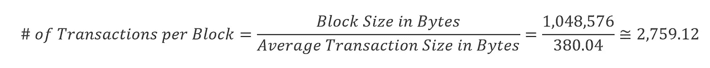
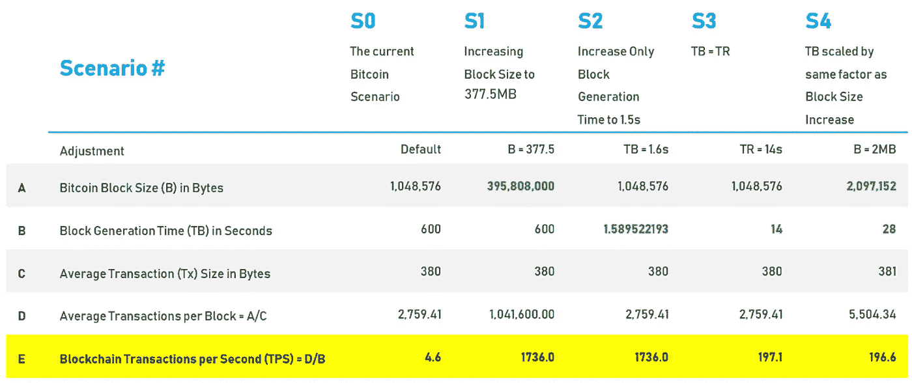
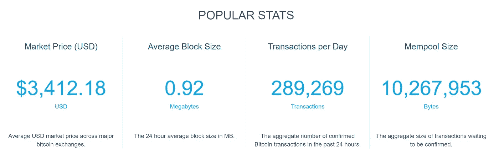
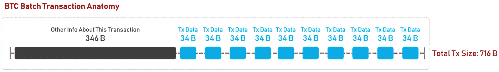
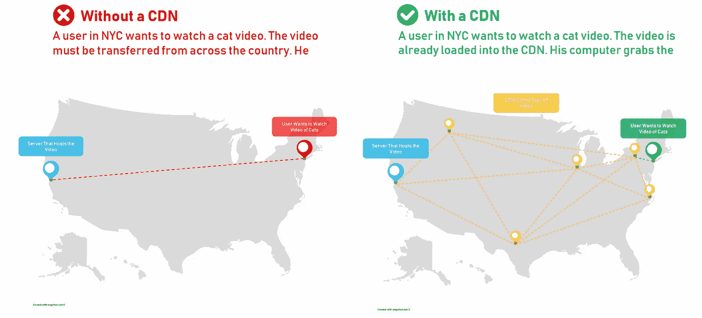

# 区块链的可扩展性问题&类似 Visa 的交易速度竞赛

> 原文：<https://towardsdatascience.com/the-blockchain-scalability-problem-the-race-for-visa-like-transaction-speed-5cce48f9d44?source=collection_archive---------0----------------------->

## [区块链系列的未来](https://medium.com/tag/the-future-of-blockchain)

## 是的，区块链有一个可扩展性问题。这就是问题所在，这就是人们正在解决的问题。

对可扩展解决方案的争夺是区块链的登月竞赛。比特币每秒处理 4.6 笔交易。Visa 平均每秒处理大约[1700 笔交易](https://usa.visa.com/run-your-business/small-business-tools/retail.html)(根据官方声称的每天超过 1.5 亿笔交易计算得出)。采用的可能性是存在的，但是目前受到可伸缩性的限制。

Tata Communications 在 2018 年[发表的一项研究显示，在其调查中，44%的组织正在采用区块链](https://www.tatacommunications.com/press-release/tata-communications-discovers-digital-transformation-disparity-in-new-study/)，但也暗示了部署新技术带来的普遍问题。从架构层面来看，未解决的可伸缩性问题正在成为区块链采用和实际应用的瓶颈。

正如 Deloitte Insights 所说,“区块链的系统相对较慢。区块链缓慢的交易速度是依赖高性能遗留交易处理系统的企业的主要担忧。”世界在 2017 年和 2018 年尝到了可扩展性问题的滋味:比特币网络上严重的[传输延迟和高昂的费用](https://www.newsbtc.com/2018/01/07/another-weekend-full-delayed-bitcoin-transactions/)，以及臭名昭著的 [Cryptokitties 应用程序，它使以太坊区块链网络](https://qz.com/1145833/cryptokitties-is-causing-ethereum-network-congestion/)(数千个分散的应用程序依赖的网络)拥塞。

# 如今的区块链扩展性到底有多差？

为了扩展区块链，通过降低哈希复杂度来增加块大小或减少块时间是不够的。无论采用哪种方法，在达到与 Visa 这样的企业竞争所需的交易量之前，扩展能力都会达到一个上限，Visa "[平均每天处理 1.5 亿笔交易](https://usa.visa.com/run-your-business/small-business-tools/retail.html)"或每秒约 1，736 笔交易(TPS)。

相比之下，比特币的交易速度要低得多。目前，块大小设置为 1MB (1，048，576 字节——尽管通过 SegWit，该大小可以扩展到理论上的 4MB ),并且[平均事务大小为 380.04](https://tradeblock.com/bitcoin/historical/1h-f-tsize_per_avg-01101) 字节(假设每个事务都是从一个钱包到 x 个其他钱包——因此批量事务将被计为一个事务。稍后我会更多地谈论批量交易以及我为什么这样标记它)并且[似乎在上升](https://tradeblock.com/blog/analysis-of-bitcoin-transaction-size-trends/)。因此，目前一个比特币区块可以容纳的平均交易量计算如下:

目前比特币区块生成时间为 10 分钟；即每十分钟开采一个新的区块。十分钟(600 秒)内，基于之前的假设，比特币平均可以交易 2759.12 笔左右。换句话说，比特币区块链目前只能保证每秒 4.6 次交易。

## 增加块大小或减少块生成时间并不能解决问题:看看非 SegWit TPS

*可扩展性问题与区块链的价值主张打包在一起；因此，不能简单地通过改变区块链中的参数来提高可伸缩性。*

比特币社区可以调整两个变量来尝试增加 TPS。一个变量是块大小(B)，目前硬编码为 1MB。理想情况下，应该增加 B 来增加 TPS。另一个变量是块生成时间(TB)，它可以通过改变哈希难题的复杂性来调整。理想情况下，应该减少 TB 来增加 TPS。

Table 1: the different scenarios for increasing TPS will be examined in the section below. Only in S1 and S2 can the Bitcoin blockchain achieve Visa-like TPS, but both scenarios are impossible due to transaction propagation time, which will be discussed in this section as well.

***场景 1 &场景 2***

为了从 4.4 增长到 Visa 的 1736，比特币需要将其 TPS 扩大 377.5 倍。换句话说，B 需要从 1MB 增加到 377.5MB(表 1，s 1)，或者 TB 需要从 10 分钟减少到 1.6 秒(表 1，S2)。第三种情况是两者都调整。由于第三个不可控因素，这三种情况中的任何一种都无法在区块链上实现:向比特币网络上的每个节点广播一个新块所需的中继时间(TR)。

目前，比特币网络中估计有 10，198 个节点。通过对等网络传输 1MB (1，048，576 字节)需要一些时间。卡尔斯鲁厄理工学院测量了比特币的块传播时间，2019 年 1 月 17 日报告的平均块传播时间为 13989.42 毫秒，即传播到 99%的网络大约需要 14 秒。TB 不能低于 TR (TR99)=14 的 99%,因为如果这样，那么在网络中的大多数块接收到旧块之前，将会产生新块。TB 越接近 TR99，分叉、孤立块和链重组以及(在极端情况下)双重开销攻击等安全漏洞就越多。

***场景三***

即使 TB = TR99 = 14，块大小为 1MB，比特币区块链也只能将其速度提高到 188 TPS(表 1，S3)。虽然这一规模代表着 TPS 增长了 188 倍，但与 TPS 签证每天 1，736 次的处理量相去甚远；此外，它增加了上述风险。另一个变量 B 可以重新调整，但不会影响 TR，这会影响 TR99，从而影响 TB 的下限。

***场景四***

例如，通过将 B 的大小增加一倍(从 1MB 增加到 2MB)，网络上每个节点下载一个新块的时间 TR 也会增加—大约 2 倍；因此，在 2MB 时，TR99 = 28s，所以 TB 的下限也应该是 28s。通过将 B 增加任何因子，然后将 TR 增加相同的因子，净 TPS 将保持不变——在这种情况下，大约为 188 TPS(表 1，S4)。降低 TR 对 B 的影响的一个解决方案是增加比特币网络中所有节点的带宽。不幸的是，因为它是一个 P2P 网络，这个责任落在网络中每个对等体的肩上。

## 赛格维特的出现

2017 年，隔离见证(SegWit)在所有比特币节点生效。*注意——我不会深入 SegWit 的所有细节，但如果你想了解它的历史及其在比特币现金硬分叉出现中的作用，请看看这篇文章:*

 [## 通往 SegWit 的漫长道路:比特币最大的协议升级如何成为现实

### 隔离证人(SegWit)已在比特币上激活。截至今天，比特币网络上所有支持 SegWit 的节点都是…

bitcoinmagazine.com](https://bitcoinmagazine.com/articles/long-road-segwit-how-bitcoins-biggest-protocol-upgrade-became-reality/) 

顾名思义，它将每个事务的见证部分与实际的事务数据分离开来。它作为一个软分支出现，所以它的建立对现有的区块链网络和代码没有任何重大影响。由于见证交易的加权方式，新的支持 SegWit 的比特币块理论上可以增加到 4MB，而不改变比特币块的大小。

我说理论上是因为还有其他因素影响 SegWit 块的最终大小。事实上，如果你[查看比特币区块链浏览器](https://www.blockchain.com/charts)，你会发现(至少在这篇文章发表的时候)平均块大小仍然低于 1MB。

Source: [https://www.blockchain.com/charts](https://www.blockchain.com/charts)

但这并不是说块不能超过 1MB。在 2018 年初，我们见证了最大的(可能仍然是最大的)块大小之一，[重量约为 2.1MB](https://www.blockchain.com/btc/block-index/1667740/0000000000000000001bbb529c64ddf55edec8f4ebc0a0ccf1d3bb21c278bfa7) 。SegWit 的软分叉有助于在不改变核心代码的情况下改善块大小，但它仍然没有以可伸缩的方式改善 TPS。

当在工作验证共识下检查之前的四个场景时，我们看到，简单地增加块大小或降低挖掘复杂性只能让我们到此为止。由于事务传播时间的原因，即使是这两者的组合也会受到限制。试图挖掘比旧块传播速度更快的新块将导致一些相当大的安全问题。与此同时，SegWit 帮助缓解了一些 TPS 问题，但仍需要一个更具可扩展性的解决方案来实现类似 Visa 的 TPS。

似乎在区块链拼图中，将任何一个棋子移动到适当的位置来增加 TPS，都会将另一个棋子移出适当的位置；无论如何，有一些项目和初创公司正在努力实现将区块链的采用推向可扩展阶段所需的 TPS 答案。

# 解决可扩展性的现有和未来方法

在寻找可伸缩性问题的潜在答案时，会出现许多其他问题。例如，如果答案只适用于一个特定的区块链，那么它依赖于一个假设，即特定的区块链将是未来需要可伸缩性的那个；否则，这种努力就是不适当的或错误的。另一个考虑是要了解权衡可能是什么。目前，所有可用的解决方案都有局限性。

## 1.一次交易批量付款

*优点:通过将多个事务放入一个事务中来减少事务记录的大小，允许每个块中有更多的事务，这可以在一定程度上提高 TPS。*

*缺点:不能批量处理多个钱包的交易；隐私风险*

批量支付一直是比特币的一个特点(因此，比特币的分支包括 Digibyte、Dogecoin、比特币现金等。)通过 RPC *发送许多*。交易所已经这样做了，当你试图在区块链浏览器上查找你的交易 ID 时，你就能看到。您最终可能会看到一个钱包发送给多个不同的钱包。[这样的话，就是批量交易](https://bitcointechtalk.com/saving-up-to-80-on-bitcoin-transaction-fees-by-batching-payments-4147ab7009fb)。

这样做的好处是，将它放在一个事务中意味着 1)您只需支付一笔事务费，2)您不必为每个事务编写一个完整的事务，如我前面所述，大约 380 字节。事实上，在事务可能的 380 个字节中，只有 34 个字节可能是事务信息。

Only a small portion of a transaction record on the block actually talks about the transaction.

例如，如果我想一次发送十个事务，并且我将它们作为单独的事务发送，那么我将在一个块上占用 380 x 10 = 3，800 字节的空间。另一方面，如果我将事务一起批处理，块中的第一个事务将包含在 380 个字节中，接下来的 9 个事务每个都是 34 个字节；即 380+(34×9)= 686 字节，小了 5.5 倍。

If these transactions weren’t batched, then the size of this would be: **10 transactions x 380 bytes per transaction = 3,800 bytes**

不过，它也有局限性；不同钱包的不同交易不能批量处理。换句话说，如果有 10 个人排队买咖啡，那 10 个人不可能把他们所有的交易放在一起，然后从星巴克送出。每个人都必须产生一个单独的交易。批量交易仅限于一对多，不能多对一。例如，在支付账单(电费、互联网费、电话费、网飞、Hulu、保险费等)时，批量交易会非常有用。)立刻。

此外，出于隐私考虑，您可能不想进行批量交易。正如 [David A. Harding](https://medium.com/u/33f6cf986fe3?source=post_page-----5cce48f9d44--------------------------------) 在他关于[比特币批量交易](https://bitcointechtalk.com/saving-up-to-80-on-bitcoin-transaction-fees-by-batching-payments-4147ab7009fb)的文章中提到的，如果你要做工资单，批量交易中的一个隐私问题可能会出现——任何人都可以检查他们的交易，并查看其他员工发送了什么钱包。

## 2.比特币现金

*优点:可以在一个块中存储比比特币更多的交易，这增加了有能力的 TPS*

缺点:这只是一个临时解决方案，因为它的 TPS 仍然远远低于 Visa 平均每天 1700 次的全球 TPS。该解决方案也仅限于比特币现金，因此它不能成为其他区块链的解决方案。

如果您回头看看我之前提出的从理论上扩展 TPS 的场景，场景 1 可能听起来很熟悉。这是因为对它的尝试已经发生了——即 2017 年 8 月发生的比特币现金硬分叉。硬分叉的主要动机是将块大小从 1MB 非 SegWit 比特币块增加到 8MB(增加了 8 倍)。

但是在最好的情况下，这个解决方案仍然远远没有达到人们在可伸缩性方面所寻求的答案。

比特币现金是比特币的一个硬分支，旨在作为比特币的替代品，具有更快交易的附加值主张。它主要增加块大小(B)；尽管与比特币相比，它的交易速度有所提高，但它仍然没有足够的 TPS 来参与全球交易领域的竞争。

## 3.闪电网络

*优点:双方之间近乎即时的交易，没有任何费用*

*缺点:交易发生在链外，需要用户有一个闪电节点，并且仅限于基于比特币核心的区块链(如比特币现金、莱特币、Digibyte、Dogecoin)*

对于本文来说，深入了解 Lightning 网络如何在粒度级别上工作的细节有点太详细了，但是有大量的资源以我认为容易理解的方式指导您。简而言之，闪电网络让你可以将比特币带出区块链，与另一方私下交易。例如，我可能计划下个月每天早上喝咖啡。我想用比特币交易，但我不想像一个不知道闪电网络是什么的呆子一样，站在咖啡柜台前等待我的大宗交易确认。

所以我做的是，我可以在闪电网络上创建一个所谓的支付通道。这种新的支付渠道不通过比特币区块链进行交易，而是将其视为一种储备。我存了，比如说 0.5 BTC，这是一笔储备金，然后我可以用它来支付我在闪电网络上联系到的任何人。

一旦我完成了，我回到区块链并告诉它，“嘿，我在一个月的过程中给星巴克 0.1 BTC 买咖啡，只要从我最初投入的余额中扣除它。”那么我还剩 0.4 BTC。当然，这是解释实际情况的一种非常简单的方式，所以如果您想了解 Lightning 网络的特性，一定要看看其他资源。

不幸的是，这是一个比特币专用的离线交易解决方案，可用于比特币和比特币分叉的区块链，如 Digibyte 和 Litecoin。闪电网络提供的优势是即时和零费用交易，这使得微交易以及购买咖啡的能力无需等待。

然而，在目前阶段，创建支付渠道需要的知识比普通比特币买家可能熟悉的知识多一点，而且它仍然需要用户闪电节点生命周期前后的链上交易。因此，闪电网络对于比特币和类似比特币的加密货币来说是一个很好的解决方案，但它只解决了链外问题。

## 4.EOS 和其他高性能区块链

*优点:高理论可扩展性*

*缺点:中央集权会导致(历史上也曾导致)审查*

高绩效区块链项目使用不同的共识机制。工作证明(PoW)最受欢迎的替代方法之一是股份证明(PoS)。最近的一个项目，EOS，使用了它所谓的委托利益证明(dPoS)，这是 PoS 的一个修改版本。在 dpo 中，像你我这样的用户实际上并不是虚拟化采矿过程的一部分；相反，我们投票决定谁是。EO 使用授权 PoS(dpo)来申请多达 3，996 个 TP，但代价是集中化，这赋予了关键利益相关方比机构群体其他成员更多的权力。

EOS 只有 21 个节点(区块生产者)，2018 年 6 月，[那些区块生产者冻结了 7 个 EOS 账号](https://steemit.com/eosio/@eos42/eos42-statement-on-block-producer-decision-to-freeze-7-eos-accounts)。虽然冻结背后的理由可能是合理的，但它表明了一个组织对整个区块链的权力，以及他们执行这一权力的能力。

区块链社区需要可伸缩性，这是 EOS 受欢迎的原因，但代价是中央集权带来的审查和控制。关于其他可能损害 EOS 完整性的其他缺陷的列表，请看看这篇文章: [EOS 不是区块链，而是一种美化的云计算服务](https://thenextweb.com/hardfork/2018/11/01/eos-blockchain-benchmark/)(声明:该研究由 Consensys 资助，Consensys 的创始人是以太坊的联合创始人)。

## 5.bloXroute

*优点:它是一个链上解决方案，不受区块链限制，因此它可能是所有区块链的可伸缩性的答案*

*缺点:它仍在开发中，建设/运营全球 CDN 是一项昂贵的壮举，在区块链领域尚未完成*

在区块链特定的项目之外，初创公司开始出现，以更大的规模解决这个问题。到目前为止，我在这个领域看到的最有趣的项目之一是一家名为 [bloXroute](http://www.bloxroute.com) 的初创公司。上周，我在研究区块链领域时发现了这家公司。该公司背后的想法是将内容交付网络(CDN)移植到区块链网络上，以解决可扩展性问题。

***什么是 CDN？***

cdn 是今天提高网速的工具。这就是为什么当你打开下一个 YouTube 视频时，它不再需要向你显示加载微调器，让你等三分钟才能观看一分钟的视频。如果你以前从未经历过这些问题，你只是太年轻了，无法理解。

内容分发网络听起来复杂而奇特，虽然建立一个比你想象的更复杂，但想法很简单——将大容量内容放在靠近人群的计算机(称为服务器)上，这样，无论何时，比如说，曼哈顿的某人想要下载一段内容来观看，他们都不需要从加州圣克拉拉的某台计算机上下载；相反，在纽约附近的某个地方保存着一个更接近的版本。CDN 领域最大的公司是 [Akamai](https://www.akamai.com/) 【纳斯达克股票代码:AKAM】，它是作为一个减少互联网上大文件延迟的解决方案而创建的。

出于同样的考虑，bloXroute 打算将 CDN 的概念作为区块链分布式网络(BDN)应用于区块链空间；毕竟，如果数据块的大小最终达到千兆字节，传输速度将成为一个问题。

bloXroute 计划于 2019 年在 Q1 试运行其 BDN。这项试验的结果将让我们更好地了解它在构建区块链全球网络方面的进展。此外，它还打算发行一种向股东支付股息的证券——BLXR。红利来自交易费，在 bloXroute 每区块链超过 100 TPS 后，将对每笔交易收取交易费。在我的后续文章中，我将更深入地研究 bloXroute。

# 后续步骤

在过去的几周里，我一直在阅读文章，与社区中的人们交谈，并试图尽可能多地了解区块链的可伸缩性问题，但这只是皮毛。在我的后续文章中，我将发布更多关于可伸缩性和可伸缩性解决方案的信息，以及我在这个领域看到的有趣的公司/项目。

有什么要补充的吗？我是不是想错了什么？请让我知道！

## 进一步阅读

读完这篇文章后，你可能会有比开始时更多的问题。这是有道理的——除非你准备好阅读一本书，否则我不可能详细讨论每一个话题。但是我在这篇文章中留下了我阅读的不同文章和论文的链接。如果你有时间并且希望你的问题得到解答，我强烈推荐你通读一遍。对于每个主题，他们比我讲得更详细。

*   [EOS:不要相信](https://medium.com/@matteoleibowitz/eos-dont-believe-the-hype-c472b821e4bf) [Matteo Leibowitz](https://medium.com/u/79921b07b948?source=post_page-----5cce48f9d44--------------------------------) 的宣传——他谈到了可伸缩性三难困境(思考区块链可伸缩性时的核心概念)以及 EOS 的解决方案如何造成不平衡。
*   通过 [Hasu](https://medium.com/u/90326a938400?source=post_page-----5cce48f9d44--------------------------------) : [一篇关于比特币批量化](https://medium.com/@hasufly/an-analysis-of-batching-in-bitcoin-9bdf81a394e0)的分析文章，了解更多关于比特币批量化交易的信息。 [David A. Harding](https://medium.com/u/33f6cf986fe3?source=post_page-----5cce48f9d44--------------------------------) 也在上面写了一篇惊人的文章:[通过分批支付节省高达 80%的比特币交易费用](https://bitcointechtalk.com/saving-up-to-80-on-bitcoin-transaction-fees-by-batching-payments-4147ab7009fb)。
*   预计 SegWit 将如何[影响比特币区块链未来的块大小](https://coinmetrics.io/what-should-we-expect-from-bitcoins-block-size-in-the-coming-years/)。
*   如果你想知道更多关于隔离证人如何“隔离”证人数据的细节，请阅读这篇详细的文章。