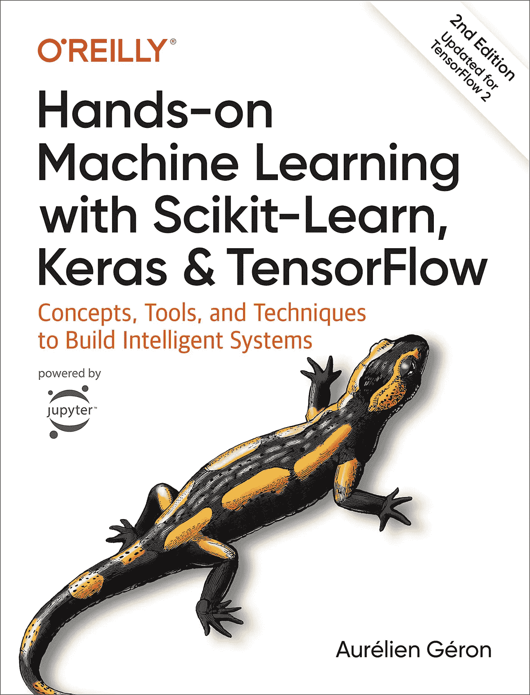
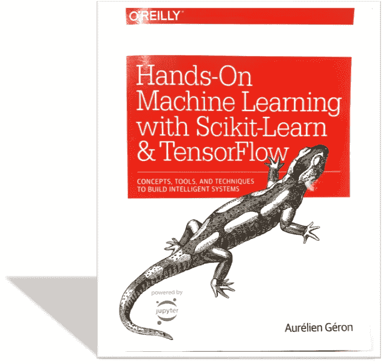
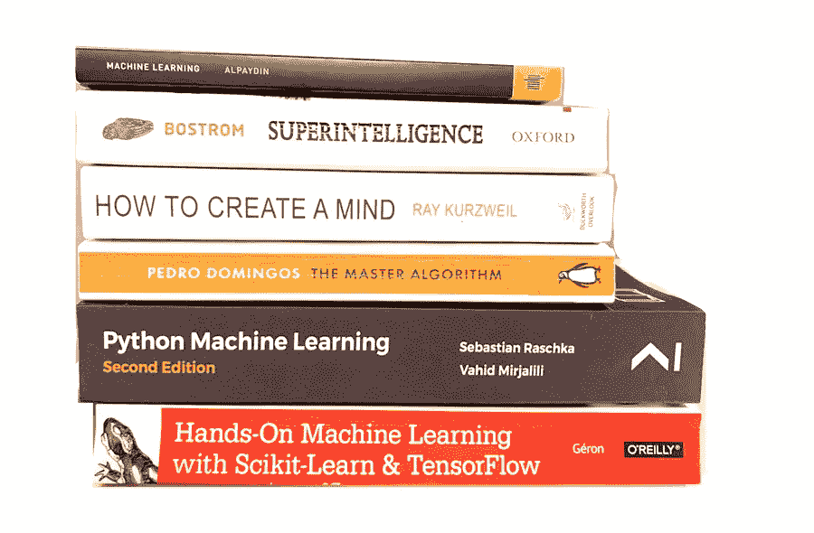

# 让你开始机器学习的书

> 原文：<https://towardsdatascience.com/the-book-to-really-start-you-on-machine-learning-47632059fd0e?source=collection_archive---------6----------------------->

## 让你的机器学习知识更上一层楼

Cover of the Book.

许多 ML 从业者经常被问到的一个问题是:*“我能做些什么来开始真正建立机器学习项目和解决方案？”*

外面有太多的信息——好的和坏的——以至于很难知道从哪里开始。此外，人们来自非常不同的背景，因此起点可能会有很大差异。例如，对我来说，我是通过观看计算机科学频道关于神经网络的理论视频进入 ML 世界的，随着我越来越感兴趣，我开始阅读关于该主题的文章、新闻和博客。

然而，通过这样做，我只对机器学习最肤浅的部分有了模糊的理解，我根本无法独自解决一个项目。了解到这一点，我决定参加一些负担得起的 [Udemy 机器学习课程](https://www.udemy.com/course/python-for-data-science-and-machine-learning-bootcamp/)。诸如此类的课程很有帮助，因为它们丰富和提高了我的知识，还涵盖了不同算法和模型的一些 Python 实现。

尽管如此，这些课程并没有让我满足于 a 所知道的东西，我想更深入地了解每一次对话，了解算法的精髓，并了解如何自己构建一个端到端的机器学习项目。我希望能够有一个想法，建立或下载一个数据集，并执行它。

***这就是我要讲的这本书的由来。***

*注意:这篇文章包含附属链接，这样你就可以轻松地购买任何一本书，而不需要额外付费，同时有助于创建更多像这样的帖子。*

不久前我读了这本书，但是随着它的新版本的出版，我认为分享我对它的想法是个好主意。

Old edition of the Book.

本书是“ [***用 Scikit 动手机器学习——学习&tensor flow***](https://amzn.to/36sDOI9)*。这是一本最初于 2017 年出版的书，但在我看来，每一个新的版本都已经成为通过实践学习机器学习的最佳深度资源之一的更好版本。*

# *这本书是给谁的？*

*[**这本书**](https://amzn.to/36sDOI9) **是为机器学习**的初学者设计的，他们正在寻找一种实用的学习方法，通过构建项目并在特定的环境下研究不同的机器学习算法。完成整本书后，你应该准备好自己面对一个项目，并适应这个过程中的不同步骤。*

*尽管这是一本相当有创意的书，但它也将为中级机器学习从业者的工具箱添加一些工具。*

*这本书假设你有一定的 Python 编程经验，并且知道如何使用主要的科学库: *Numpy、Pandas 和 Matplotlib* 。*

*此外，如果你想最大限度地利用它，最好有一些基本的数学，代数和统计知识。除此之外，如果你愿意努力，你可以在很少或没有初步理解或机器学习的情况下轻松完成它。*

*一切都解释得非常清楚，有代码片段、注释和示例。*

# *它包括什么？*

*正如我前面提到的，这是一本非常实用的书，第二章已经让你开始工作并编写项目代码。在此之前，它描述了机器学习是什么，不是什么，它的基本原理，以及它的主要应用和优势。*

*它展示了如何实现不同的机器学习算法，并涵盖了你所知道的关于它们的理论，而不必深入研究它，用数百万个复杂的方程来折磨你。最新版本由 19 章组成，分为两大块:*

*   ***第一部分**、解释了分类、回归、降维和无监督学习技术的主要概念，以及传统的机器学习算法，如线性回归、逻辑回归、支持向量机、决策树或集成模型。*
*   ***第二部分**，专注于使用 Tensorflow 和 Keras 的人工神经网络和深度学习。卷积神经网络和递归神经网络的解释，随着自动编码器，甚至有一章关于强化学习。*

*每一章都被进一步划分为一个更精细的结构，带我们一步一步地看完它，这本书还包含各种附录。*

*这些章节如下:*

*   ***第一部分** : 1。机器学习的前景，2。端到端机器学习项目，3。分类，4。训练模型，5。支持向量机，6。决策树，7。集成学习和随机森林，8。降维，9。无监督学习技术。*
*   *第二部分 : 10。介绍人工神经网络与 Keras，11。训练深度神经网络，12。用 Tensorflow 定制模型和训练，13。用 Tensorflow 加载和预处理数据，14。使用卷积神经网络的深度计算机视觉，15。使用 RNNs 和 CNN 处理序列，16。使用 RNNs 和注意力的自然语言处理，17。使用自动编码器和 GANs 的表示学习和生成学习，18。强化学习，19。大规模训练和部署张量流模型。*

*正如我前面提到的，在每一章中，我们都会找到代码片段和旁注来补充解释，以及图形、图像和图表，在每一章的结尾都有一组问题和练习，这些问题和练习可以在其中一个附录中解决。*

*此外，一个非常有用的补充是在一个常见的机器学习项目中一步一步做什么的清单。*

# *这本书怎么读？*

*每个人都是不同的，但对我来说，最有效的方法是一边在纸上读[这本书](https://amzn.to/36sDOI9)，一边写笔记。与此同时，我会试着浏览代码，每次在这一章结束时，我会花时间回答问题和做小练习。如果我遇到困难或者不知道怎么做，我会重读这一章的某些部分或者在网上寻找信息。*

# *这本书会对我产生什么影响？*

*如果你刚开始学习机器学习，[这本书](https://amzn.to/36sDOI9)会把你所掌握的理论知识，进行相当程度的提升，然后在一些实际项目中运用。很多时候，我们无法测试我们对某事了解多少，直到我们试图把它付诸实践。通过阅读这本书，你将完全准备好从事你感兴趣的项目。*

*如果你已经了解机器学习，并参与过一些项目，这本书将总结你的理论知识，教你一些你可能忽略的实用技巧，并建议你如何以最佳方式构建你的项目。这是一本很棒的书，可以回答你日常工作中可能出现的具体问题。*

# *下一步做什么？*

*在你读完这本书之后，我会鼓励你想出几个你想用机器学习做的项目，并把这本书放在身边，试着去执行它们。这将测试你在现实世界中的问题，让你面对机器学习项目的一些困难，并且你将建立一个解决问题的组合，这对你的学习和你未来成为机器学习工程师或数据科学家具有很高的价值。*

**

*Other Machine Learning books from my library*

*一旦你对处理这类项目感到舒适，如果你想更进一步，更接近专家，你可以尝试你用这本书做的同样的程序，但是用一个更高级的，像下面的一个:*

*   *[*塞巴斯蒂安·拉什卡的 Python 机器学习。*](https://www.amazon.com/gp/product/B07VBLX2W7/ref=as_li_tl?ie=UTF8&camp=1789&creative=9325&creativeASIN=B07VBLX2W7&linkCode=as2&tag=jaimezorno0b-20&linkId=cade2800e3360308879ed7159a550d12)*
*   *[*Francois Chollet 用 Python 深度学习。*](https://www.amazon.com/gp/product/1617294438/ref=as_li_tl?ie=UTF8&camp=1789&creative=9325&creativeASIN=1617294438&linkCode=as2&tag=jaimezorno0b-20&linkId=bb3f83ec897f1450ad20780af0ed9377)*

*或者，如果你对技术性较低的书籍感兴趣，并希望探索人工智能的好奇心、危险性和影响范围，你可以阅读以下书籍:*

* [## 关于人工智能和机器学习的三本顶级书籍

### 三本令人难以置信的人工智能书籍，让你的思维开窍，思维活跃。

towardsdatascience.com](/three-top-books-about-artificial-intelligence-and-machine-learning-b48ff2fa3548) 

此外，如果你想专攻机器学习的某个特定领域，你可以找一本关于这个主题的书，甚至是更专业的在线课程。

# 结束语

一如既往，我希望你喜欢这篇文章，并且我已经说服你去读这本书。

在这里您可以找到最新版本的链接:

*   [***用 Scikit 动手机器学习——Learn&tensor flow。***](https://amzn.to/3nJFKTj)

*如果你喜欢这篇文章，请在@ jaimezorno**Twitter 上关注我。还有，你可以看看我其他关于数据科学和机器学习的帖子* [*这里*](https://medium.com/@jaimezornoza?source=post_page---------------------------) *。好好读！*

*有关机器学习和数据科学的更多资源，请查看以下资源库:* [***如何学习机器学习***](https://howtolearnmachinelearning.com/books/machine-learning-books/) *！有关职业资源(工作、事件、技能测试)，请访问*[***AIgents.co——数据科学家职业社区&机器学习工程师***](https://aigents.co/) *。*

*如果你想了解更多关于机器学习和人工智能的知识* ***请在 Medium*** *上关注我，敬请关注我的下一篇帖子！*

在那之前，保重，享受人工智能！*