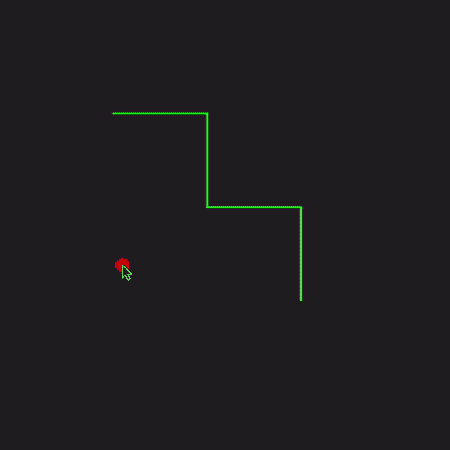
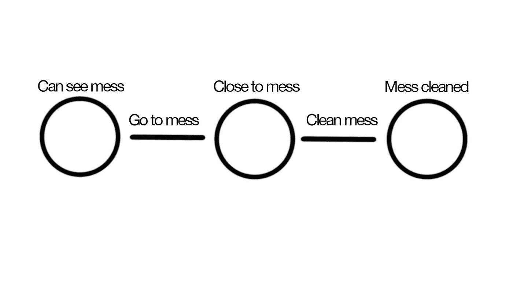

# 游戏中的大脑:电子游戏人工智能

> 原文：<https://towardsdatascience.com/the-brains-in-games-video-game-ai-d0f601ccdf46?source=collection_archive---------8----------------------->

## 计算机如何思考:第五部分

到目前为止，我们探索的人工智能大多局限于转换和操纵数据的领域——进行预测、计算相似度和推导含义。计算能力的低成本，以及通过互联网大规模收集数据的能力，为以迄今为止不可能的方式部署这些算法创造了新的机会，而正是这些算法被在线平台用来挖掘用户的数据，以获取有价值的碎片，如数字页岩油。

但是还有另一种类型的人工智能，几乎与我们目前探索的完全无关。这种智力也许更普遍，当然也更明显，尽管它在很大程度上局限于大多数人生活中的一小部分。这就是电子游戏的人工智能。视频游戏采用算法来智能地响应玩家的输入。从《太空入侵者》中外星飞船的可预测模式，到《吃豆人》中反应灵敏得多的幽灵，最早的视频游戏使用数学过程来模仿有思维生物的行为。随着时间的推移，这些技术已经进化得非常复杂，产生了难以置信的复杂行为。就像我们之前看到的数据操作技术一样，它们的核心是一些令人惊讶的简单几何技巧。

在这篇文章中，我们将了解构成视频游戏功能的三类算法，它们是“转向”，控制简单的运动模式，“寻路”，在复杂环境中导航路径，以及“目标导向的行动规划”，这是制定更复杂行为的一种方式。

# 引导

“转向”是控制视频游戏中实体运动的一类算法的名称。每当计算机控制的角色移动时，它都会响应转向算法的指令，这是一系列的数学步骤，可以读取游戏的状态，计算每个元素的位置，并将其转换为向特定方向移动的指令。

为了帮助我们探索这些算法，我想向你们介绍一个我为此创造的小家伙。他没什么好看的，只是黑色背景上的一个红点，现在他根本不知道该怎么做。但是我们可以教他，并希望在这个过程中学到一些东西。

A close-up of our boy. He doesn’t do much right now.

第一个也是最基本的转向行为叫做“寻找”。没有目标，我们的男孩只是坐在一个地方。为了让他动起来，我们需要给他一些渴望的东西。首先，我们会给他灌输一种想要靠近鼠标指针的迫切愿望。这将让我们操纵他，看他如何改变方向。“seek”算法非常简单。男孩计算出到达目标的方向，并朝那个方向尽可能快地加速。

尽管他只不过是几行代码和屏幕上的一个红点，但一旦他活了过来，开始在屏幕上飞奔，我就不可能不去想象他身上一些不足的人格碎片。我的第一次迭代让这个男孩移动得太快，他的位置总是和鼠标指针完全匹配。这个版本的男孩没有任何个性——他只是鼠标指针的延伸，一个物体。但是一旦我让他慢下来，让他努力跟上指针，他就变得与众不同，一个有自己权利的人，一个我能感同身受的人。

男孩愉快地在屏幕上缩放，急切地追逐鼠标指针，并随着目标的移动而转向。但是当他达到目标时，奇怪的事情发生了。他跑过鼠标指针，然后像一只兴奋的小狗，在他的目标上来回跳舞。我们的“搜索”算法有问题。因为男孩总是朝着他的目标尽可能快地加速，当他到达目标时，他注定会超调。像一个反向的坦塔罗斯，他永远不能达到他的目标，只能超过它。要解决这个问题，我们必须给他多一个行为:“到达”。

“到达”几乎和“寻找”一样简单。男孩计算到目标的距离，如果距离很短，他就减小加速度。当他站在目标的正上方时，他的加速度减小到零。这让我们的男孩正好停在他的目标上。有了这两种行为，我们的小男孩高兴地跟着鼠标指针在屏幕上缩放，当他到达指针时，聪明地停下来。

I spent an unreasonable amount of time doing this

“寻求”的反义词是“逃离”，在许多方面甚至更简单。和以前一样，男孩计算着他的目标的方向，但是他没有朝目标加速，而是加速离开了。利用这种行为，我们快乐的小男孩变成了一个懦夫，从鼠标指针旁跑开，躲在一个角落里。只有当鼠标指针在他周围移动，并在另一个方向追逐他时，他才会离开这个藏身之处。

如果说我为那个追着鼠标指针跑的男孩感到高兴，那我就更被这个懦弱的版本迷住了。他可怜的恐惧，以及当他被困在角落里时，如果鼠标指针靠近他，他会颤抖的样子，唤起了我巨大的同情。理智上，我知道那个男孩只是一些代码行，一个响应一些输入参数确定一个角度的几何计算，并相应地在我的屏幕上移动一个点。但在情感上，不可能不把“逃离”算法的完全确定性输出解读为一种情感的表达。

这个男孩倾向于直接撞上障碍物，并坚持在那里直到他的目标移动，这是我们男孩行为中一个明显的缺陷。在开阔的地面上，他看起来很聪明，选择一条直接的路线到达目标。但是在他的路径上放一堵墙，他的寻找和逃离算法的简单性就变得显而易见了。他径直撞上了墙，并继续尽他最大的努力去推它，忘记了他对目标的缺乏进展。这可不行。为了帮助他，我们需要给他多一种行为，比我们到目前为止看到的更复杂一些。这就叫“忌”。

“避免”让我们的孩子转向以避开他路上的障碍，但要做到这一点，我们需要扩大孩子对周围世界的了解。到目前为止，他只知道关于这个世界的两个事实——他自己的位置和他的目标的位置。现在，我们需要他向前看，找出任何阻碍他前进的东西。这是用简单的几何图形完成的。我们在他的行进方向上画了一条线，距离由男孩移动的速度决定——他走得越快，他必须越早开始转弯以避开目标。如果我们画的线与一个障碍物相交，比如一堵墙，那么这个男孩知道他必须改变路线，否则就会相撞。他必须改变路线的方向是由与障碍物的投影交点决定的。我们在障碍物的中心和男孩预计会与障碍物碰撞的点之间画一条线。这条线，或者说“矢量”，正指向男孩必须急转弯以避开障碍物的确切方向。运用矢量数学，我们可以把这两条线加在一起，得到的矢量代表了我们孩子新的、修正过的路径，指引他安全地脱离危险。

有了这种新知识，我们的孩子可以在屏幕上飞奔，每当有障碍出现在他和他的目标之间，他就巧妙地绕过它。

Our boy is growing up!

在这套“驾驶”算法中还有最后一个行为，它处理的是根本没有目标的情况。让他自己的设备，没有目标逃跑或寻找，我们的男孩坐着不动。但是如果我们想让他有自己的，自我激励的运动呢？当他没有其他目标时，我们希望他自己蹒跚学步，没有特定的方向，而是或多或少随机地探索世界。这种行为被称为“徘徊”,是我们迄今为止见过的最复杂的算法。

“漫步”最简单的实现方式是让我们的孩子完全随机地选择每一步的方向，而不考虑他在哪里或去过哪里。但是这产生了一个不令人满意的结果。男孩战战兢兢地站在原地，朝任何方向都没有取得进展。这个男孩不再是一个在屏幕上跑来跑去的热切的年轻人，而是一个焦虑的残骸，在现场瑟瑟发抖。

另一种方法是让男孩随机选择一个目标，朝着这个目标前进，只有当他达到这个目标时才选择一个新的目标。这让男孩看起来更有目的，但还是不尽如人意。这个男孩会跑过屏幕的一半，然后掉头朝另一个方向跑去，就好像他刚刚发现自己忘记了什么。他跑向墙壁，虽然“躲避”行为阻止了他与墙壁相撞，但这让他的行为看起来很奇怪，像机器人一样。

创造一种令人信服的“漫步”行为出人意料地困难，而且选择更多地是由美学而不是数学来引导的。没有一个正确的选择，而是我们必须以我们的品味为导向——什么对我们来说是自然的？我选择的算法是让这个男孩沿着一条直线行进，但偶尔会稍微调整一下他的路线。结果是这个男孩愉快地四处游荡，不时地转来转去，忙着探索这个世界，有点像一只寻找食物的蚂蚁。

“寻找”、“逃离”和“徘徊”行为中的每一种都赋予了男孩独特的个性。当他寻找的时候，他热切而专注。当他逃跑时，他是胆怯和懦弱的。他流浪的时候，好奇而忙碌。如果我们给我们的孩子一些朋友，我们可以更清楚地看到这些性格。我们最初的男孩将继续追逐鼠标指针，使用“寻找”行为。他的第一个朋友我们称之为“懦弱的男孩”。利用“逃离”算法，他逃离任何靠近他的人——也许不是一个理想的朋友。我们将用下一个朋友“友好的男孩”来弥补这一点，他使用“寻找”来跟踪任何接近他的人。最后，我们将添加一个“忙碌的男孩”，他无视所有人，只是在屏幕上闲逛。

这四个小伙子都以特有的方式相互作用。我们最初的穿红衣服的男孩在鼠标指针后快速移动，把友好的黄色男孩拉在身后。如果这个热情的二人组靠近胆小的蓝衣男孩，他会冲进一个角落躲起来。与此同时，这个忙碌的男孩做着自己的事情，对这一切都浑然不觉，除非他碰巧徘徊在其他人的附近，在这种情况下，他的“避免”算法让他绕过他们。看着他们互相追逐，他们的个性更加明显，更难不把他们的动作想象成他们感情的表达，而不是简单的几何运算。当友好的男孩抓住懦弱的男孩，把他追到一个角落，忘记了他对同伴明显的厌恶，很难不同情懦弱的男孩，当友好的男孩在他身边蹦跳时，他在角落里发抖。

Poor yellow boy. Nobody wants to be his friend.

这些转向行为是游戏中更复杂的人工智能系统的构建模块，但它们几乎一点也不智能。它们远不如我们在前几章看到的最简单的算法复杂。但是令人着迷的是，虽然他们可能缺乏智力，但他们却拥有另一种更加无形的品质:个性。转向算法只不过是几何图形，但是当我看到我创造的小男孩跑来跑去的时候，我忍不住把动机和感觉归因于他。尽管我知道他的行为只不过是一些非常基本的代码行的输出，但我觉得肯定有更多的东西。他的个性不是这个男孩的品质，而是完全存在于我自己头脑中的东西。他变得不仅仅是他身体各部分的总和，他变成了一个人。但那个人只活在我的想象里。

为什么我很容易看出这个男孩有一些小的个性，而对于我们迄今为止看到的复杂得多的算法来说却不是这样？鼓励我同情这个男孩的品质是什么？这是“智力”，还是别的什么？当我看到更复杂的视频游戏智能系统时，我会回到这个问题。

# 寻路

我们的孩子很聪明！他可以在屏幕上缩放，追逐鼠标指针，甚至可以突然转向以避开挡路的障碍物。引导它运动的简单操纵算法产生了一种复杂的行为模式，给人一种“聪明”行为的错觉。但是有一个地方我们的孩子的简单大脑让他失望了。一堵直墙或另一个男孩在他的道路上并不会影响他——他只是转向一边，直到他清除了障碍。但是更复杂的形状——一个死胡同或者甚至一个深的角落——呈现出一个不可逾越的障碍。每当他不得不短暂地将*从目标处移开*以清除障碍时，这个男孩就完全被难住了。他被困在角落里，悲伤地用头撞墙，不知道如何前进。

为了帮助他，我们需要给他一些提前思考的方法——理解为了前进，他必须先向后看。我们要实现这个目标的方法叫做“寻路”。我们会给这个男孩一张假想的地图，让他画出一条通向目标的路线，避开中间的障碍物，并在他需要逃离死胡同时改变方向。

想象有一个看不见的网格覆盖在我们的孩子正在探索的世界上。这个网格由几十个节点组成，通过一根细线连接到它们的邻居。当这条线只穿过空白空间时，我们称之为网络中的“边”。但是当这条线被一个障碍物——一堵墙或者这个男孩的一个朋友——挡住时，我们就说这些节点是“不相连的”。结果是一种负空间版本的世界。在有开放空间的地方，网格是由节点和连接它们的边组成的规则网格。但是墙壁或其他障碍物会刺破网格，在网络中造成缺口。

这个格子是我们的孩子用来绘制路线的地图。男孩没有直接朝着自己的目标加速，而是更多的考虑。他找到网格中离自己最近的节点，以及离他的目标最近的节点。然后他计算出一条沿着网格边缘的路径，穿过所有的中间节点。在没有墙的地方，路径是通过那些直接在他和他的目标之间的节点的一条直线。但是在他前进的道路上有障碍的地方，网格的边缘不会跨越这些障碍。男孩的路径必须绕过网格中的这个缺口。有了这条路，男孩就能自信地找到自己的目标。他没有直接朝目标射击，而是朝着路径上的每个连续节点前进，确信因为有一条边连接着节点，所以在他的路上没有墙。

男孩如何通过节点和边构建路径是那些纯数学问题中的一个，对一组非常特定的人来说非常有趣，对其他人来说非常无聊，所以我在这里跳过这一点。可以说，这是一个经过充分探索的数学领域，可以以令人印象深刻的速度可靠地找到通过任意网格的或多或少的最优路径。这种令人印象深刻的速度意味着我们的男孩可以随着目标的移动重新计算他的路径，无缝地重新定向以绕过墙壁或完全改变方向，以准确无误地找到他的目标，无论它藏在哪里。即使遇到最险恶的迷宫，男孩也立即出发，从不拐错弯，毫不犹豫地穿过曲折的道路。

事实上，男孩解决迷宫的准确无误的技巧有一个有趣的，违反直觉的效果。以前，这个男孩对他的目标的热切追求，以及他轻率地走进角落和死胡同，有一种天真的魅力。他过于急切是可以理解的。现在，他毫不留情地追踪他的目标，毫不犹豫地避开路上的任何东西，消除了这种迷人的易错性。男孩拥有思想和欲望的幻想破灭了。我们有了一个不会思考的机器人，而不是一个渴望的男孩。讽刺的是，通过让这个男孩变得更聪明，我们让他看起来完全没有头脑。

问题是这个男孩已经被赋予了关于迷宫的完美知识，并且能够立刻准确无误地回忆起这些信息。我们不再能轻易地认同他的处境。为了让他的行为回到人类熟悉的领域，我们必须重新引入发现和错误的元素。这也需要我们增加大量的复杂性。

之前，这个男孩得到了一张迷宫地图——一个由节点和边组成的网络，显示出哪里有墙挡住了他的路。现在，我们给他一张白纸。他的节点和边的网络从完全连接开始，每个节点都有一条边连接到它的邻居。这个男孩相信任何地方都可以到达任何地方，直到他知道不是这样。这个学习过程由他记忆中的一系列已知的墙来控制。他知道的每一面墙都存放在那里。当男孩看到一堵新墙时，他会把它的尺寸存入记忆库，更新他对世界的理解。他在自己的世界地图上找到了与这面新墙相交的所有边，并从网格中剪掉了它们。然后，他重新计算他的目标路径。之前存在路径的地方，现在节点之间的边被移除，路径消失了。男孩必须找到一条新路线。当男孩在迷宫中移动时，他遇到了新的墙壁，并相应地更新了他的地图。当他发现他的路线尽头是一个死胡同时，他转身尝试另一条路。

Clever but a bit clumsy

当我们看着这个男孩用这种新算法穿越迷宫时，他又变得可爱了。他停下来，重新考虑，转身尝试新的方法。我们看着他转错弯，发现他的错误，然后回来尝试另一种方式。由于他的许多失误，他花了比以前长得多的时间来完成迷宫。但是，奇怪的是，他似乎更聪明，而不是更不聪明。他完成迷宫的速度较慢，但现在他真正地解决了一个难题，看着他，我们可以同情他。他从错误中学习，慢慢地成为穿越他所学的迷宫的专家。

我们的孩子现在相当老练了。他有记忆力，他可以看到周围世界的事情，他可以制定计划，并随着他对世界的理解的变化而更新计划。但是我们也发现了一些有趣的事情:让这个男孩看起来*聪明的不是他的过程有多复杂，或者他在完成任务方面有多擅长。“智力”是不那么有形的东西。这是关于这个男孩的行为和人类行为有多相似。而是看着他，我们是否能看到自己。*

# 面向目标的行动计划

我们就快搞定我们的孩子了。我们已经教他驾驶，所以他可以寻找或逃离一个目标，并避免沿途的障碍。我们教会了他寻路，这样他就能找到通往目标的路，即使这需要他走过一条复杂的道路。我们甚至给他一个基本的记忆——他可以记住他遇到的墙，并使用这些记忆更新他的计划以达到他的目标。但是所有这些追求目标的行为让人感觉有点目光短浅。我们的孩子在寻找银幕上的位置方面是一个世界级的天才，但是他不知道一旦他到了那里他要做什么。他有短期目标，但没有长期抱负。

让我们解决这个问题。让我们给我们的孩子一些制定计划的便利:“首先我要做这个，*然后*我要做那个”。我们会让他不仅在寻找目标方面更熟练，而且在解决实际的*问题上更熟练。举例来说，这使得动作视频游戏中的警卫可以在一个区域巡逻，并攻击他们发现的任何入侵者。这就是《T4》中的幽灵和《模拟人生》中的角色之间的区别，前者遵循各自简单的套路在迷宫中追逐玩家，后者过着复杂的生活，遵循复杂的套路，只需要人类玩家最起码的指导。*

有很多方法可以做到这一点，但我们要使用的方法是一种已经在许多流行的视频游戏中以某种形式使用的方法。它被称为“面向目标的行动规划”，它利用了一些我们已经了解过的相同的寻路算法。

想象你在一个锁着的房间里，你想出去。在房间里，你可以看到一把钥匙。在你的头脑中，你形成一个计划:去找钥匙，拿起钥匙，去开门，打开门，离开房间。这不是一个复杂的计划，但它相当重要。在你打开它之前，你不能打开门。除非你有钥匙，否则去开门是没有意义的。这些操作需要以特定的顺序执行才能成功。想象一个更复杂的场景:早上准备去上班。为了准时上班，穿好衣服，保持整洁，你需要采取一系列的行动。有些可以按任何顺序发生，有些有复杂的要求。要吃早餐，你需要去冰箱，拿出牛奶，去柜台，拿出一个碗，等等。要洗澡，你必须采取另外一系列的行动。但是你是先洗澡，还是先吃早餐，并不影响你最终工作的成功程度。面向目标的行动计划的关键在于，这些行动序列可以用我们用于寻路的相同的“节点和边”概念来表达。简单的锁定房间场景是一条直线路径。要到达“拾取密钥”，您必须通过“转到密钥”。要进入“解锁门”，您必须通过“拿起钥匙”和“进入门”。只有一种方法来排列顺序以达到最终目标。“准备工作”图要复杂得多。例如,“冰箱——柜台——碗——早餐”路径。但将这些联系起来是一个复杂的联系网络——事情可以以任何顺序发生——如果你愿意，你可以在洗澡时刷牙(尽管我觉得这是错误的)。你可以两只袜子都穿上，然后两只鞋子都穿上，或者完全完成一只脚的穿戴后再继续下一只(这在我看来也是错误的——就像一只脚短暂地过度穿戴)。

这一过长的题外话进入了我对早晨日常事务的看法，这是一种描述事物的复杂方式，在计算机的抽象语言中，可以通过两个相关联的概念来非常简单地表示:“状态”是关于世界的真实事物。你洗过澡了吗？你带牙刷了吗？“行动”是你能做的事情。“去洗澡”，“拿起你的牙刷”。行动有结果——它们改变世界的状态——它们也有要求——这些要求对于要采取的行动必须是真实的。在算法的语言中，状态是节点，动作是边——它们形成了一个“图形”，就像帮助我们的男孩导航迷宫的网格一样，但这一次是抽象概念的地图，而不是物理空间。为了制定一个计划，男孩通过这个状态和行动的网络计算出一条路径，直到他到达我们的“目标”状态。

这是我们的孩子已经知道如何做的事情！我们已经学习了寻路，以及构建表示物理路径的节点和边的网格。唯一的变化是在更抽象的状态领域中构建这个网格。为了帮助我们做到这一点，我们要给我们的孩子一份工作。像许多在这个世界上起步的年轻人一样，他的第一份工作将是在零售业。

首先我们要建立他的商店。我们将添加一些代表过道的墙，一个角落里的小房间代表储藏室，一个小盒子代表柜台。所有这些都是用和我们之前用来创建一个男孩可以导航的迷宫一样的概念创建的。男孩可以用完全相同的方式探索他的商店。目前，这个男孩只有一份工作，为顾客打扫卫生。像许多零售员工一样，这个男孩对于如何工作没有太多选择。他对世界的理解可以用一个非常简单的网络来表示:

每个圈是一个“状态”，圈与圈之间的线是“动作”。为了实现他的目标——达到“干净的混乱”状态，他必须采取“干净的混乱”行动。但他只有在“接近狼狈”的状态下才能采取那种行动。为了到达那里，他必须采取“去食堂”的行动，这只有在他处于“能看见食堂”的状态时才有可能。“目标导向的行动计划”所实现的是允许男孩通过这些状态和行动导航一条路径。他知道他必须采取适当行动的顺序。更重要的是，如果他在这些行动中被打断，他可以从他停止的地方继续。

实际情况是这样的:他漫无目的地四处游荡，直到发现一片狼藉，然后他开始一个简单的例行程序:去那片狼藉，清理干净。去食堂，男孩必须使用他的物理寻路和驾驶技能导航到正确的位置。为了清理，男孩可能会暂停一段时间。在更复杂的模拟中，我们可能会播放一个男孩疯狂拖地的动画。

多么苦差事啊！在这个阶段，男孩的行为并不比以前复杂多少。我们的孩子在浪费他的潜力！是他承担更大责任的时候了。他忠实地完成了一段时间的清洁工作后，让我们给他一个额外的任务。没有顾客就没有店铺功能，那就介绍一些吧。就像这个男孩一样，顾客有一系列他们可以采取的状态和行动——在商店里寻找一件商品，走向它，拿起它，把它拿到柜台，等待援助，为商品付款，然后离开商店。这个男孩得到了一组补充的状态和动作:如果一个顾客在柜台前，去柜台，把商品卖给他们。

现在他有两个优先事项。如果有顾客在柜台前等着，他就会去那里销售。如果车间里一片狼藉，他会跑去打扫干净。在这期间，他焦急地徘徊，寻找机会帮忙。由于底层决策架构的灵活性，我们能够非常容易地添加这样的新职责。每个状态和动作只是网格中的一个节点和一条边。给孩子设定新的目标就像确定哪些州需要实现目标一样简单。添加新动作就像描述它们的需求和结果一样简单。随着新的目标、行动和状态被添加到世界中，男孩可以通过这个行动网格无缝地绘制新的路径，通过组合一系列会导致实现所需状态的行动来找出如何实现他的新目标。

Our boy, hard at work

我们的男孩(忠实的红点)在商店里跑来跑去，寻找脏东西(绿点)，他通过来回奔跑来清理它们。顾客(橙色点)从左上角进入商店，寻找商品(灰色点)。当他们找到它们时，他们把它们捡起来，带到柜台(右下角)，在那里等待我们的男孩。当男孩看到他们时，他冲过去向他们推销商品，这时他们回到屏幕的左上角离开商店。

所有这些工作的结果是在我们的屏幕上，在男孩的商店里，一个复杂的互动之舞。顾客来来往往，忙着四处寻找他们需要的商品。男孩急切地追逐着商店地板上的食物，当他注意到顾客在等待时，他冲过去拿走他们的付款。尽管画面简陋，动作略显笨拙，但整个作品呈现出令人信服的生活场景。每个顾客都在按照自己简单的冲动行事，这个男孩并不比他更复杂，但是在一起互动时，我们观察到一个迷人的现象:*涌现。*“涌现”是指简单系统在大规模互动时产生复杂行为。由于目标设定行为，两个顾客为同一件商品相互竞争。男孩和顾客共享的“回避”转向导致他们在相遇时笨拙地绕着对方跳舞。最有趣的是，我们发现脏乱堆积在商店远离柜台的角落——男孩被拉回到柜台向顾客出售物品，然后才能走到远处的角落去打扫。这个男孩的行为变得难以预测。他的内部状态由几个不断变化的元素的位置决定，很难理解是什么决定了他的决策。我们的模拟，商店，足够简单，给定时间，我们*可以*根据控制男孩行为的简单算法来分解每个动作和反应，但是随着复杂性的增加，这样做变得越来越没用。几乎不可避免的是，用我们用来描述现实生活和人际交往的语言，根据男孩的欲望和偏好来解释他的行为开始变得很自然。“他把那位顾客推开，这样他就可以去收拾那些乱七八糟的东西”，“当一堵墙后面有一堆乱七八糟的东西时，他会感到困惑”。"直到那些顾客等了一会儿，他才看到他们"。“他懒得打扫整个商店”。

最近几篇文章关注的是人工智能的一个分支，这个分支与数据科学和机器学习的世界关系不大，这个领域最先进的研究都发生在那里。在许多方面，驱动视频游戏“机器人”的算法是微不足道的，与新兴的计算机智能领域没有太大的关联。但在另一种意义上，这些算法是与人类人工智能体验最相关的一些算法。与几乎任何其他类型的人工智能相比，视频游戏机器人处于人/计算机关系的最前沿——它们是同类中最“像人”的，尽管在数学上往往远没有那么复杂。这是来自这些算法的关键见解:它是*关联性*，而不是复杂性，它是*同理心，*而不是处理能力，它定义了我们认为什么是智能的，我们认为什么是“像我们一样”。

*本系列上一篇文章《* [*电影数学:计算机如何理解文字*](/movie-maths-how-computers-understand-text-5aeee693bd7a) *》，此处可用***。这篇文章的代码可以从我的 github，* [*这里*](https://github.com/SimonCarryer/video_game_ai) *。**

*这一系列的下一篇文章将于六月出版。*