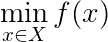
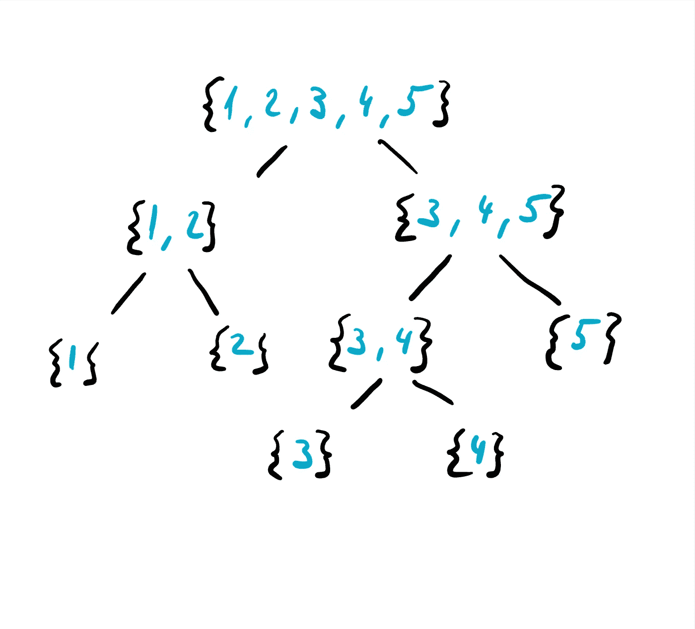
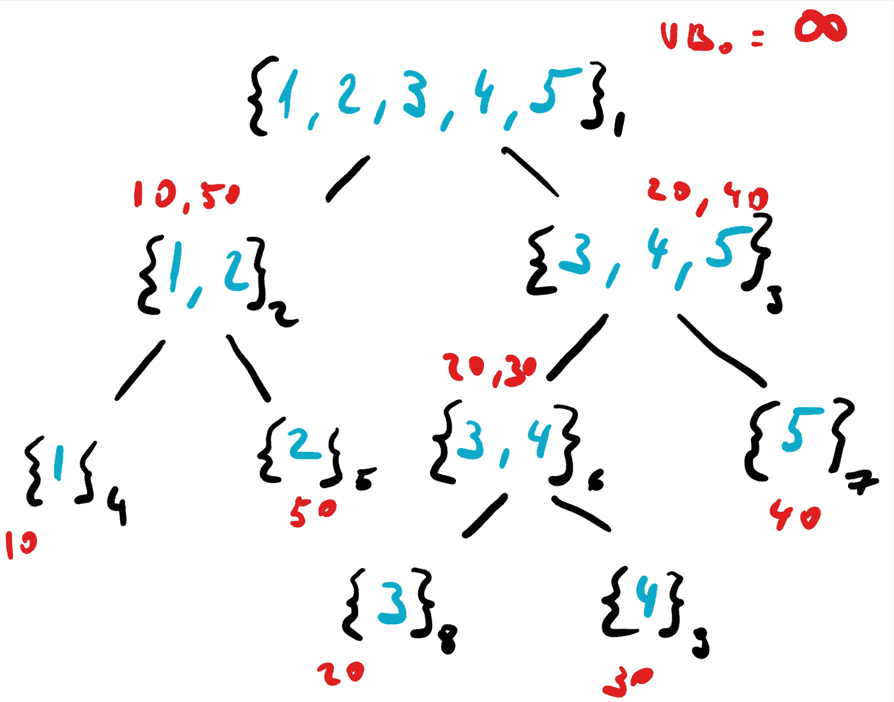

# 分支定界算法

> 原文：<https://towardsdatascience.com/the-branch-and-bound-algorithm-a7ae4d227a69?source=collection_archive---------4----------------------->

Photo by [Valeriy Andrushko](https://unsplash.com/@voodushevlyonniy?utm_source=medium&utm_medium=referral) on [Unsplash](https://unsplash.com?utm_source=medium&utm_medium=referral)

## 简单地说，这是优化中最常用的算法之一，是混合整数编程的支柱。

你们大多数人可能听说过混合整数编程，或者更一般的离散优化。在本文中，我们将讨论混合整数编程背后的驱动力算法，即分支定界算法。

首先，让我们一般地定义一个优化问题，这样我们就在同一页上了。优化问题可以非常简单地总结为一行:

在这个等式中，我们实际上是说，我们希望通过来自集合 **X.** 的 **x** 来最小化函数 **f** (也称为成本函数)。集合 **X** 可能是所有实数的集合，可能是整数的集合……也可能是包含实数和整数的向量的集合(这是混合整数编程的大多数情况)。需要记住的一点是 **X** 是**可行集**。所以我们只需要关心这个集合中的解。

分支定界算法的思想很简单。给定 **X** 的某些子集，它找到成本函数 **f** 的边界。我们如何准确地得到这些子集？例如，如果我们的解向量 **x** 的某些成员是整数，并且我们知道这些成员在 0 和 2 之间。然后，我们将从第一个成员开始，探索向量的该维度的每个值的解决方案。这种搜索过程产生如下所示的树形结构(假设不同的整数解在 1 和 5 之间枚举):

可行集的不同子集包含在花括号中。从逻辑上讲，我们希望以最有效的方式搜索这棵树，在每个叶节点评估函数 **f** 可能会非常昂贵，并且可能涉及优化问题的连续变量。幸运的是，我们可以使用一些技巧来智能地限制父节点的成本，防止我们将它们一直扩展到叶节点，从而导致更有效的搜索策略。

分支定界算法依赖于优化中的**边界原则**，这只是一个用来描述非常直观的事物的花哨术语。想象可行集的子集， **S1** 和 **S2** 。如果来自 **S1** 的解的上界低于 **S2** 的解的下界，那么显然不值得探究 **S2** 的解。这就是分支定界算法背后的全部魔力。从这一点开始，为了简洁起见，我将用 **UB** 表示上限，用 **LB** 表示下限，用 **GUB** 表示全局上限。现在是时候动手实践一下这个算法的具体例子了。

我们使用算法的方式如下。我们有一堆开放的节点，我们称之为**开放**。开放只是意味着它们还没有被完全探索。我们还跟踪全球上限 T21。在每一步中，我们从开集中取出一个节点并展开它，我们还评估它是否是叶节点。如果节点有子节点，我们查看子节点的 **LB** 和 **UB** 。如果子节点的 **LB** 低于 **GUB** ，那么我们把它加到 **OPEN** 栈，如果高于全局 **UB** 那么就不值得探究了。此外，如果节点的 **UB** 低于全局 **UB** ，那么我们将全局 **UB** 更新为节点的 **UB** 。

让我们给上图一些上下限来说明这一点:

我们从一个无限的 GUB 开始。红色表示每个节点的成本，此外，为了简单起见，我们用一个数字(黑色)枚举树的每个节点。那么，应用分支定界会发生什么呢？首先， **OPEN** 栈将包含节点 1，因为它是根节点。我们从堆栈中弹出一个节点并展开它。我们现在看节点 2 和 3。我们看到节点 3 具有比当前 **GUB** 更低的 **UB** ，我们将 **GUB** 设置为 40 并将其添加到 **OPEN** 。节点 2 的 **LB** 仍然低于 **GUB** ，因此我们将其添加到 **OPEN** 堆栈中。我们再次从堆栈中弹出一个节点并查看子节点，现在我们查看节点 2 的子节点，我们看到节点 4 是一个叶节点，开销为 10。我们现在可以将 **GUB** 更新为 10 并进一步观察。节点 5 太贵了，所以没有提到。我们再次从堆栈中弹出一个节点(节点 3)，但是我们看到节点 3 的 **LB** 高于当前的 **GUB** (10)，因此我们不做任何事情。

在这一点上，算法完成，我们设法修剪所有的解决方案，将导致从节点 3。自然地，在实践具有数千个节点的分支和界限算法时，这个例子在这里说明了它的机制。神奇之处在于有效地导出解集的上下界，这本身就是一个完整的研究领域。

关于分支定界算法的一个更有用的事实是，它以更紧的界限递增地给出更好的解。这意味着，当算法提前终止时，有时也会给出有意义的解。这通常用于优化，以有意义的起点引导其他一些方法。这篇文章的要点是:

> 如果下限大于全局上限，那么在那里寻找解决方案是没有好处的！

我希望我能够对分支和绑定的机制有所了解。继续优化！

