# 构建大规模、准确、新鲜的知识图谱

> 原文：<https://towardsdatascience.com/the-building-a-large-scale-accurate-and-fresh-knowledge-graph-71ebd912210e?source=collection_archive---------9----------------------->

## KDD 2018 知识图谱教程综述

Check out my other blogs [here](https://medium.com/@bramblexu)!

微软在 KDD 2018 上给出了一个关于知识图谱的精彩教程。如果你是机器学习工程师或者 NLP 工程师，我强烈推荐你看这个教程。它讨论了什么是知识图(KG)，大规模的 KG 构建挑战，以及通过参考文献应对挑战的方法。

这篇文章是教程的总结。你可以在这里找到幻灯片[。](https://kdd2018tutorialt39.azurewebsites.net)

# 第一部分:导言

有几个衡量标准来评估知识质量，**正确性，覆盖面，新鲜度，和使用**。

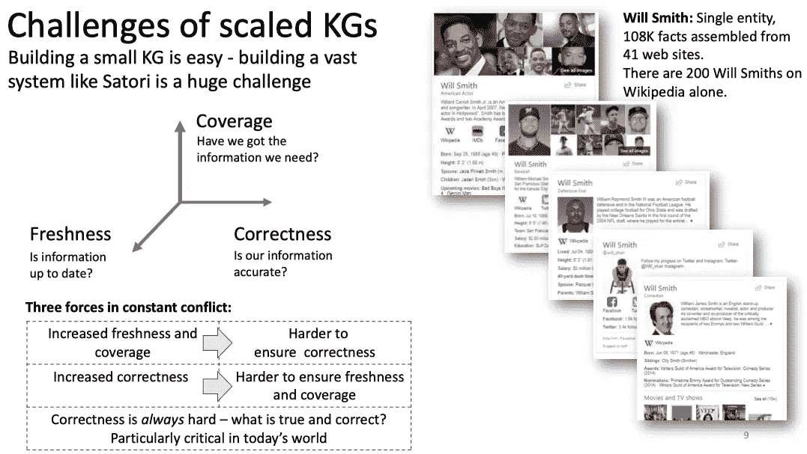

如何确保一个巨大的公斤的正确性，覆盖面，新鲜度是一个巨大的挑战。一个很常见的问题是有多个实体共享同一个名称，例如威尔·史密斯。如何将信息链接到正确的威尔·史密斯也是一个挑战(实体链接，EL)。

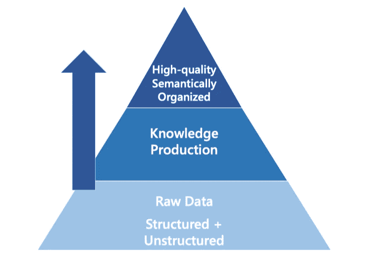

将原始数据转换成高质量的 KG 主要包括三个步骤:从结构化或非结构化数据源中提取数据，使用模式关联数据和关系，合并模式化的知识。

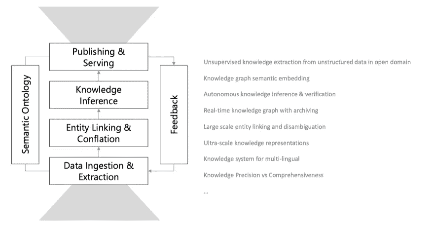

上图显示了与 KG 相关的积极研究和产品努力。KG 有很多研究方向。如果你想开始学习 KG，我建议从知识图构建开始，其中包括一些常见的自然语言处理技术，命名实体识别(NER)，关系抽取(RE)，端到端关系抽取。这些技术的目标是获得三元组数据。比如，(威尔·史密斯，职业，演员)是实体-属性-值三元数据。(威尔·史密斯，夫妇，贾达·萍克特·史密斯)是一个实体-关系-实体三元数据。

# 第二部分:在野外获取知识

这一部分列举了大量论文。我只是拿了一些。如果发现有什么感兴趣的，我推荐直接看教程。

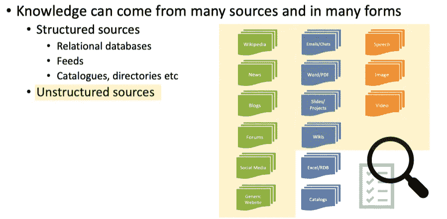

我们可以从众多的数据源中获取知识，这些数据源主要包括两类，结构化数据源和非结构化数据源。结构化来源的数量是有限的，所以我们需要通过许多自然语言处理技术来提取知识，如 NER、RE 等。

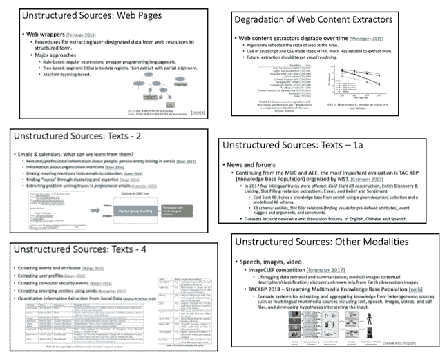

在第二部分，幻灯片列出了许多从不同来源提取知识的论文。这些论文涉及**从网络**提取数据【基于规则、基于树、基于机器学习】**从新闻和论坛****从电子邮件&日历****从社交媒体**。

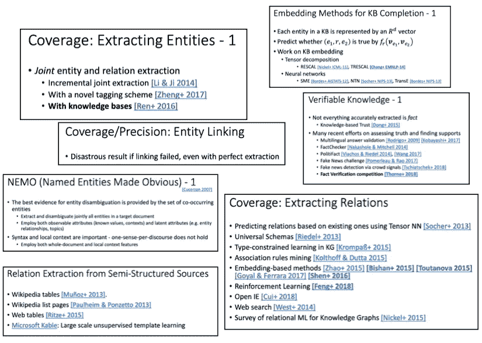

为了增加覆盖面，还列出了一些与 NER、关系抽取、实体链接、知识库嵌入相关的论文。

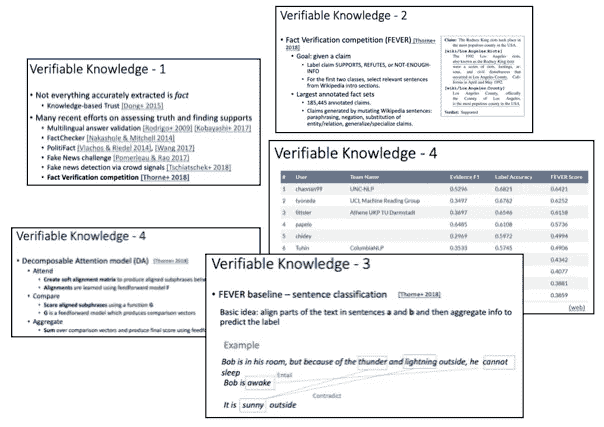

也有一些关于验证知识的作品。

除上述内容外，还包含与远程监管(DS)和众包相关的人工干预论文。

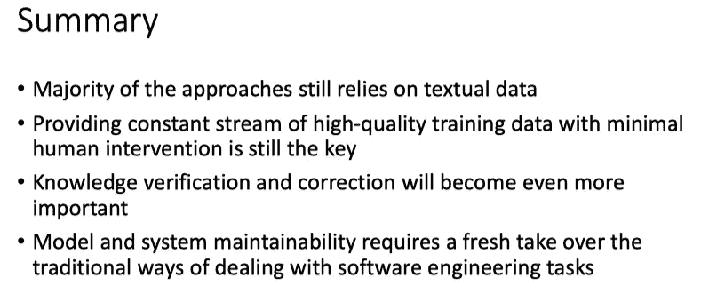

# 第三部分:构建知识图谱

这部分介绍微软如何建立 Satori 图。整个过程主要有四个阶段。

**阶段 1:数据接收**

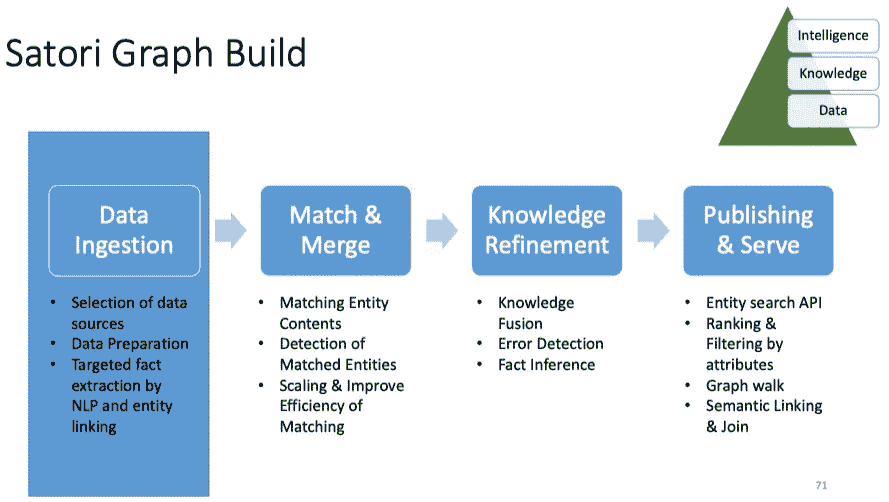

数据摄取，包括使用解析和标准化以统一的方式存储数据，并将提取的数据映射到 Microsoft 本体。

**第二阶段:比赛&合并**

该图显示了第二阶段(匹配和合并)的摄入流。

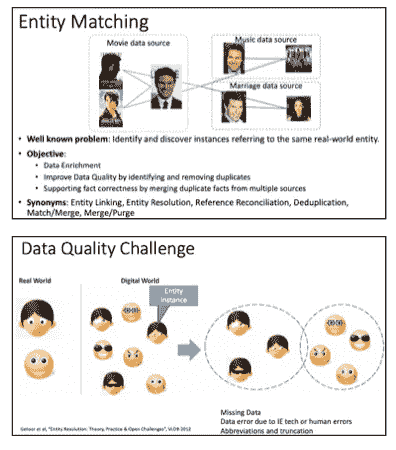

摄取流程中最大的问题是**实体匹配**，标识和发现引用相同现实世界实体的实例，以及**数据质量挑战**，丢失的数据可能是由人类信息提取技术或人类错误造成的。

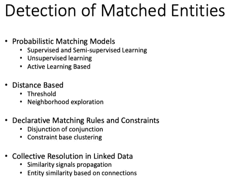

为了检测匹配的实体，作者介绍了几种方法。您可以在幻灯片中找到每种方法的推荐白皮书。

**第三阶段:知识提炼**

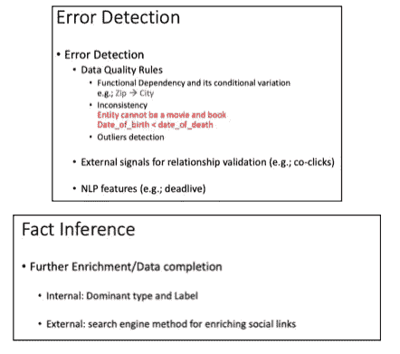

这一阶段是在第二阶段之后消除相互冲突的事实和联系，主要包括错误检测和事实推断。

**第四阶段:发布&服务**

这个阶段是下面独立的第四部分。

# 第四部分:为世界服务知识

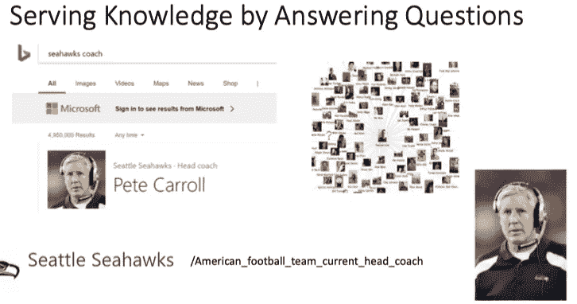

这部分主要讲的是如何为 QA 服务 KG。

主要有三个挑战，不同的语言、大的搜索空间和组合性。

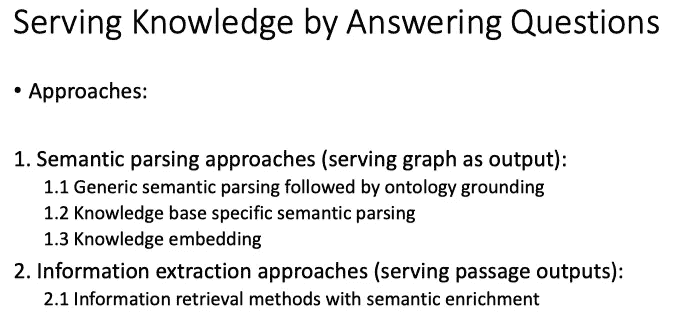

有两种主要的方法，语义解析方法和信息提取方法。

> ***查看我的其他帖子*** [***中等***](https://medium.com/@bramblexu) ***同*** [***一个分类查看***](https://bramblexu.com/posts/eb7bd472/) ***！
> GitHub:***[***bramble Xu***](https://github.com/BrambleXu) ***LinkedIn:***[***徐亮***](https://www.linkedin.com/in/xu-liang-99356891/) ***博客:***[***bramble Xu***【T64](https://bramblexu.com)