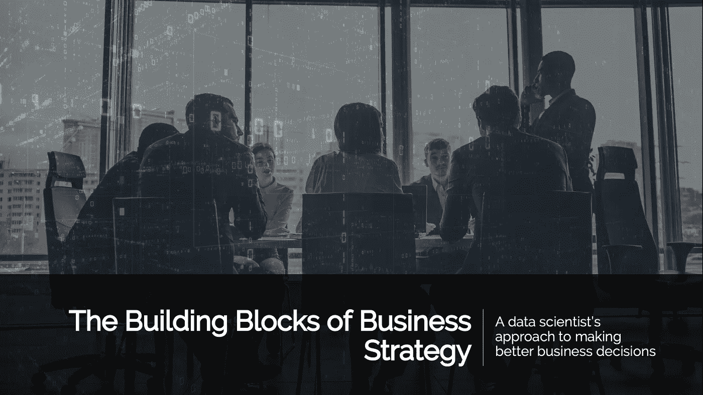
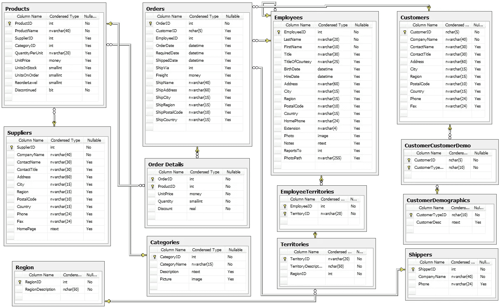
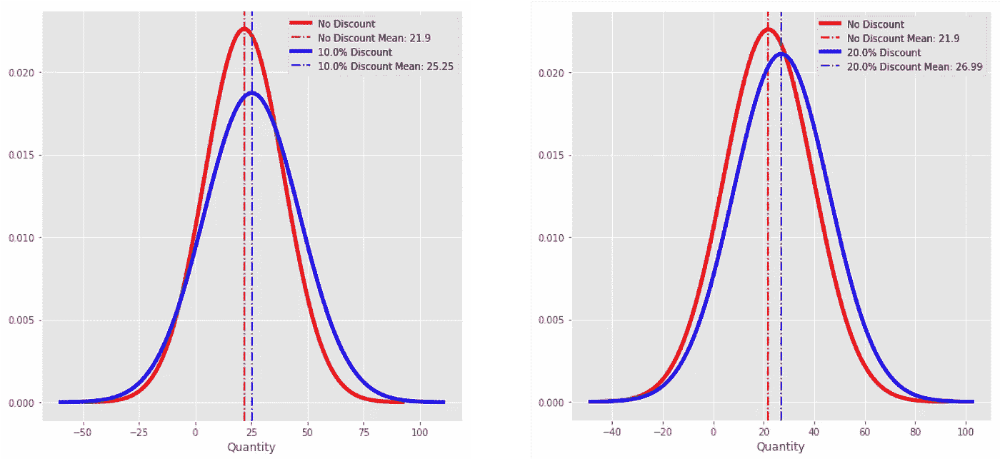
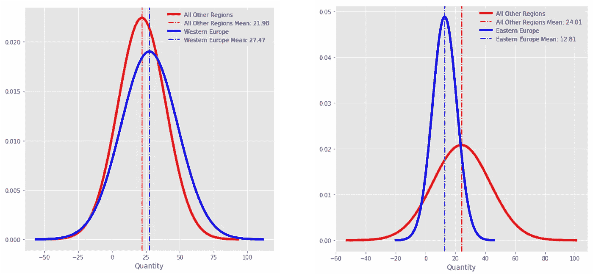
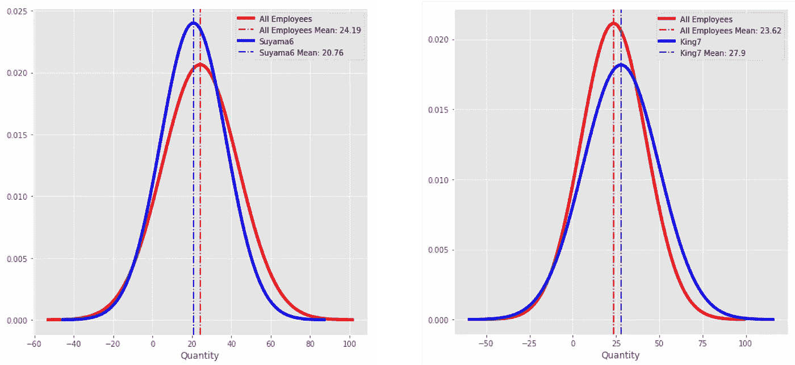

# 商业战略的基石

> 原文：<https://towardsdatascience.com/the-building-blocks-of-business-strategy-b5ae5c8461c8?source=collection_archive---------33----------------------->

## 数据科学家做出更好商业决策的方法。



说史蒂夫·乔布斯是我们这个时代最伟大的创新者之一是一种保守的说法。乔布斯的传记作者沃尔特·伊萨克森说得好:

> ”他的传奇是一个夸张的创业神话:史蒂夫·乔布斯 1976 年在父母的车库里共同创立了苹果公司，1985 年被赶下台，1997 年又回来拯救濒临破产的苹果公司，到他 2011 年 10 月去世时，已经把它打造成了世界上最有价值的公司。一路走来，他帮助改造了七个行业:个人电脑、动画电影、音乐、手机、平板电脑、零售店和数字出版。因此，他与托马斯·爱迪生、亨利·福特和华特·迪士尼一样，属于美国伟大创新者的行列。"

关于乔布斯的事情是，他不只是创新产品和小工具，而是管理和业务。即使在学校里学习了金融和 MBA 课程，你也很难避开一些涉及苹果和皮克斯的案例研究。我敢肯定，我们都曾有过一个想成为他那样的经理。每个人都在寻找正确的公式:通过创新获得商业成功的关键。不幸的是，创新的努力往往看起来像是目光短浅的尝试，将想法扔向墙壁，看看什么能坚持下去。如果这些活动仅限于集思广益会议，那就好了。但是，如果所有这样的经理听到的只是乔布斯本人的一句话，这可能会让他们重新思考他们的方法:

> “人们认为专注意味着对你必须专注的事情说是。但完全不是这个意思。这意味着对其他上百个好主意说不。你必须仔细挑选。实际上，我为我们没有做过的事情和我做过的事情一样感到自豪。创新就是对 1000 件事情说不。”

乔布斯与 1991 年电影《都市滑头》中的老牛仔卷毛没有什么不同，他给年轻得多的比利·克里斯托*提供生活建议。*“你知道生命的秘密是什么吗？…一件事。就一件事。”目瞪口呆的水晶想知道那是什么东西，但当他听到“那是你必须弄清楚的”时，他感到困惑和失望。


Jack Palance & Billy Crystal: City Slickers, 1991

那么，企业如何找出在战略上集中资源的地方呢？数据！

## 场景和目标

探索使用数据驱动业务决策和战略的最佳方式是使用一个具体的例子。在这种情况下，我们将使用 Northwind 数据库。Northwind Traders 是一家虚构的专业食品公司，在世界范围内销售其产品；数据库本身是由微软开发的，作为展示其 SQL Server 和 Access 产品功能的一种方式。在查看数据库结构之前，让我们快速定义一个业务问题。

作为一个在竞争激烈的市场中运营的成熟组织，Northwind 希望提高每笔交易的销售额。过去，该公司曾试图使用折扣，但结果喜忧参半。管理层还收到了提高产量的其他建议，其中包括:

1.  为表现不佳的销售人员制定并实施培训计划。
2.  在顾客已经倾向于购买更大数量的地区增加广告，从而把他们从竞争对手那里吸引过来。
3.  增加倾向于销量更大的产品的广告。

这些都是可行的选择，那么管理层往哪个方向走呢？他们是否实施了所有策略，并观察哪些策略有效？他们是只选择一种策略，还是选择多种策略？这些策略能以某种方式结合起来吗？这些策略是如何实施的？答案很明确:42。

等等，那是什么？

那些读过*银河系漫游指南*的人会理解这个参考，但它有效地归结为:即使你有正确的答案，也没有任何意义，除非你问了正确的问题。那么，让我们看看数据驱动的方法如何引导我们找到正确的问题和正确的答案。

有四个领域存在战略选择:折扣、销售培训、区域活动和产品活动。此外，还有一个目标产出需要最大化:销量。这导致了四个需要回答的简单问题:

1.  折扣对销量有统计意义上的显著影响吗？
2.  某些员工产生的结果是否比其他人大得多？
3.  某些地区的产品购买量是否明显高于世界其他地区？
4.  是否有任何产品类别的销量明显高于其他类别？

请注意，这些问题并不直接旨在决定做什么，而是旨在理解可以直接控制*(自变量)和只能间接控制*的目标(目标变量)之间关系的本质。人们的期望是，一旦获得了更高层次的理解，适当的策略就会显现出来。更重要的是，问题本身的陈述方式使得回答这些问题需要什么信息变得容易。现在是时候抓取数据了。**

## *了解数据库*

*对于任何现代企业来说，维护一个包含客户、供应商、产品、库存和订单信息的历史数据库都是必不可少的。这些信息可以出于分析和战略开发之外的各种原因进行存储，这意味着可能有许多与此目的无关的无关信息。所以我们的目标是获取需要的信息，而忽略其他的。*

*下面是 Northwind 数据的实体关系图(ERD)的副本。ERD 本质上是一个数据地图:它显示了数据库中存在的信息，以及如果您想要提取特定的元素，如何从 A 点到 B 点。一开始看起来有点让人不知所措，但是在导航的背后发展出一种直觉是可能的。*

**

*让我们用更实际的术语来描述:目标是在每次交易的基础上最大化销售量。因此，需要的第一条信息是订单列表和每个订单销售的产品数量，这是有意义的。环顾四周，我们可以看到一个*订单明细*表，其中包括*产品 ID、*和*数量。*数量将是我们的目标变量(我们希望最大化的东西)。您还会注意到, *ProductID* 的左侧有一个钥匙图标，这表示可以获得关于该产品的更多信息，从表格左侧伸出的线条指向左上角的 *Products* 表格。这很好，因为我们还想让产品类别弄清楚这是否会影响数量，并且 *CategoryID* 会导致一个单独的*类别*表。*

*这种相同的方法可以用于链接*订单、*订单，然后可以追溯到*员工、客户*和*区域。**

**

*有了所需数据在数据库中的位置的直观表示，现在就可以将它提取到单个表或数据帧中。有许多工具可以做到这一点，但是在这个例子中，我们将看看如何在 Python 中使用 SQL 查询来执行。*

## *提取数据*

*这一部分将会非常技术性，所以如果你正在寻找一个更概念性的概述，请随意跳到下一部分。*

*Python 和 R 通常是数据分析的首选语言，但它们存储信息的方式和目的与 SQLite 等大型数据库不同。因为 Northwind 数据库存储为 SQLite 数据库，所以需要一个对象关系映射器(ORM)。在这种情况下，由于我们使用的是 Python，SQLAlchemy 将成为 ORM 的选择，不仅可以连接到数据库，还可以从程序中运行适当的 SQL 查询。第一部分是实例化一个会话对象(它建立了允许与数据库通信的所有相关连接)并创建一个引擎(它只是向会话对象发送信息请求)。此外，还可以创建一个 inspector 对象，它可以提供关于数据库架构的信息。这将用于显示表名，以确保连接已正确建立，并验证表名是否与 ERD 匹配。在许多情况下，有些细微的变化会在代码中产生错误，所以这总是需要注意的。*

```
*OUTPUT:
['Category', 'Customer', 'CustomerCustomerDemo', 'CustomerDemographic', 'Employee', 'EmployeeTerritory', 'Order', 'OrderDetail', 'Product', 'Region', 'Shipper', 'Supplier', 'Territory']*
```

*如果对照图中的表名检查这些表名，将会观察到一些变化，因此所有的查询都应该相应地进行调整。另一个选项是显示每个表的列名和数据类型，以便稍后快速复查。下面的代码将打印结果，但是也可以修改代码，将其保存到不同视图的 dataframe 中。*

```
*OUTPUT (FIRST TABLE ONLY):Table Name: Category

Name: Id
Type: INTEGER

Name: CategoryName
Type: VARCHAR(8000)

Name: Description
Type: VARCHAR(8000)
--------------------------*
```

*因此，有了这些，运行适当的 SQL 查询并将其保存到数据帧的语法就简单得令人难以置信了:*

```
*df = pd.read_sql_query('''SQL QUERY HERE''', engine)*
```

*然而，查询本身可以根据您的选择简单或复杂。虽然可以对每条信息运行单独的查询，然后连接数据帧，但我们将一次性运行全部内容。*

*从这里可以看到，对于每个订单，都包含了相关的产品数量、员工、区域、类别和折扣级别。通过结合雇员姓名/id 进行一些检查和清理，并去掉一些无关的列，我们最终得到如下结果:*

## *假设检验概述*

*因此，我们有四个问题，询问折扣、销售人员、地区和类别对购买数量的影响有多大。每个自变量的默认假设(零假设)是它和目标变量之间不存在关系，我们计算给定数据时两者之间不存在关系的概率。如果概率足够低，可以说我们有足够的信心，关系确实存在。一般的经验法则是使用 95%的置信水平，这对于本分析来说应该足够了。请记住，不同的场景可能保证不同的置信水平，例如在医疗设备测试中，5%的失败率是不可接受的。*

*将进行两种一般类型的测试:*

1.  *方差分析(ANOVA):这将用来告诉我们是否有任何变量可以在一开始就被消除。*
2.  *学生的 T-检验:对于通过 ANOVA 检验的每个变量，将进行该检验以确定是否任何变量子集对数量的影响程度与其他变量显著不同。(例如，5%的折扣比其他级别的折扣对数量的影响更大吗？)*

*因为我们关心的是偏离标准的情况(更高和更低的性能都很重要)，所以所有的测试都是双尾测试。*

## *方差分析*

*ANOVA 测试将允许我们一次检查所有变量的显著性水平，并且它将为这些变量中的每一个吐出一些数字。为此，最重要的是 p 值。如果我们希望 95%确信我们的变量对数量有统计上的显著影响，那么 p 值之和需要小于 5%(100%–95%)，并且 p 值不能大于 1.25% (5% ÷ 4)。*

*Statsmodels 是一个 Python 库，它将为我们运行这个测试，p 值可以在结果的最右栏中找到。残差的最后一行也可以忽略。*

```
*OUTPUT:**variable_name           sum_sq      df          F        PR(>F)** C(Employee)        8259.303411     8.0   3.010143  2.313174e-03
C(Region)         40031.874384     8.0  14.589809  6.642581e-21
C(CategoryName)     959.751343     7.0   0.399755  9.028854e-01
Discount           6925.520310     1.0  20.192314  7.392950e-06
Residual         704133.930739  2053.0        NaN           NaN*
```

*查看最右栏中的结果 p 值，可以发现除了产品类别( *CategoryName* )之外，所有变量都具有统计学意义。也就是说，对于*员工、*和*折扣*水平，拒绝与数量没有显著关系的零假设(默认假设)。剩下的唯一问题是哪个级别的折扣、哪个员工以及哪个地区与其他地区有显著差异。*

## *t 检验*

*使用双尾 t 检验来比较总体均值之间的差异是一种相当简单的方法。与 ANOVA 检验一样，零假设是没有差异。通过检查均值的差异，并将其与数据的方差进行比较，我们可以确定这种差异是由随机机会引起的可能性有多大。这很容易做到。*

```
*scipy.stats.ttest_ind(group1, group2)*
```

*然而，这必须重复执行多次。对于每个地区(例如)，我们想知道该地区与世界其他地区之间的数量差异是否具有统计学意义，小于 5%的 p 值表示置信度为 95%。此外，我们希望寻找表现最佳和表现最差的区域。这可以通过一些功能迭代来实现:*

*当然，这可以与显示图表和跟踪结果的额外代码相结合，但这是该过程的本质。*

*在比较员工时，采用了相同的方法，但是对于折扣级别，将每个折扣级别与完全不提供折扣的情况进行比较。区域和雇员数量与剩余人口进行比较，而折扣水平与对照组进行比较。*

## *结果*

*在所有情况下，结果都是从均值和方差变化的角度来看的，采用传统的风险方法来衡量绩效。具体来说，人们的愿望不仅仅是增加数量，而是在一致的水平上这样做。最好的机会存在于平均数量增加的地方，但是数量水平的方差与总体的其余部分保持一致。当看一个具体的例子时，这将更有意义。*

**

*左边的图表比较了 10%折扣级别和无折扣级别的平均数量，右边的图表显示了 20%折扣级别的相同比较。没有折扣用红色表示。在这两种情况下，平均数量的增加是显著的，但是也观察到左边的蓝色曲线的形状更短更宽。这表明，虽然有效，但在 10%水平的结果不如在 20%水平的结果一致。理想情况下，我们希望找到蓝色图表保持与红色图表相同形状的结果，向右移动而不变宽。方差保持不变，但平均数量增加。在这种情况下，20%的折扣证明是最有效的。*

*让我们从数量上看一下最好和最差的地区:*

**

*西欧的采购量一直高于全球平均水平，采购率也略有不同。另一方面，东欧一直买得很少。当结果持续糟糕时，一致性不一定是件好事。这看起来是一个有增长空间的领域，折扣可能会带来很好的推动。*

*最后，让我们看看表现最好和最差的销售人员。*

**

*ID 为 King7 的员工绩效最高，而 Suyama6 的绩效最低。然而，考虑到这些个体代表了极端情况，与平均值的偏差非常小。很难断定销售培训会带来更好的业绩，除非可以证明整个团队表现不佳。*

## *制定战略*

*那么，什么是正确的策略呢？之前，我们有一些问题，直觉的偏离可能会让你在黑暗中乱猜。管理层表示，折扣的结果好坏参半，我们可以看到原因:这取决于折扣的水平。但是，让我们看看每一个建议，并利用这项研究来作出决定。*

1.  *员工培训:这可能会有所帮助，但与上述领域的机会相比，结果可能会乏善可陈。如果公司的表现远远落后于竞争对手，请外部人才来诊断问题，并展示重点培训的潜在领域。*
2.  ***地区焦点**:最大的机会空间在东欧。增加那里的广告，并把折扣集中在这个地区而不是其他地区。*
3.  ***产品类别焦点**:没有一个产品类别的销量明显高于另一个类别。促销特定产品的决策应基于其他因素(如库存水平或利润率)。*
4.  ***折扣**:在 20%的水平上可以实现对数量的最大影响。*

*正如我们所看到的，如果我们对我们的数据提出正确的问题，并应用一个健壮的过程来回答这些问题，那么设计策略的过程就会大大简化。这个过程并不一定要在这里结束:在区域基础上对折扣的影响进行额外的检查可能会产生更简洁的建议，尽管还需要进行额外的检查(特别是关于共线性)以确保结果的有效性。*

## *最后的想法*

*数据科学和统计学的使用曾经被认为是一种竞争优势，现在正迅速成为任何想要成功的企业的基本要求。随着越来越多的信息涌入市场，陆地将很快消失在地平线下，如果没有一个强大的导航器，一个组织是沉还是游的问题将变得无关紧要。*

## *参考*

*[Jupyter 笔记本](https://github.com/rwilleynyc/dsc-2-final-project-online-ds-sp-000/student.ipynb)和所有用于这个项目的资源都可以在 [Github](https://github.com/rwilleynyc/dsc-2-final-project-online-ds-sp-000) 上找到。*