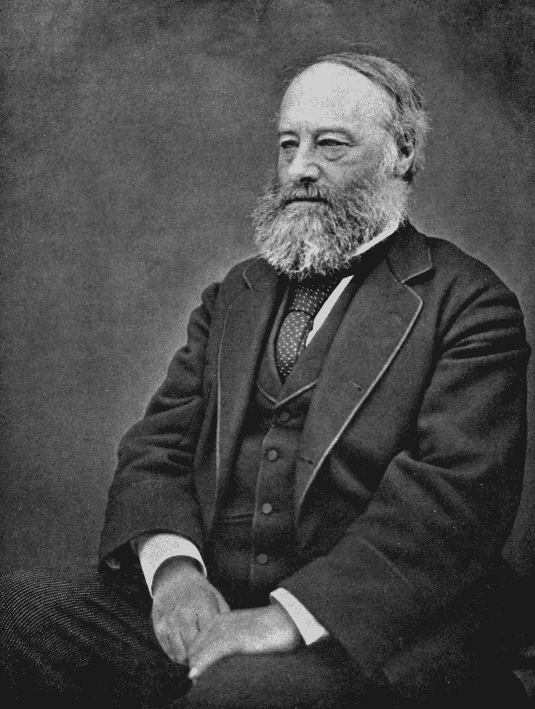
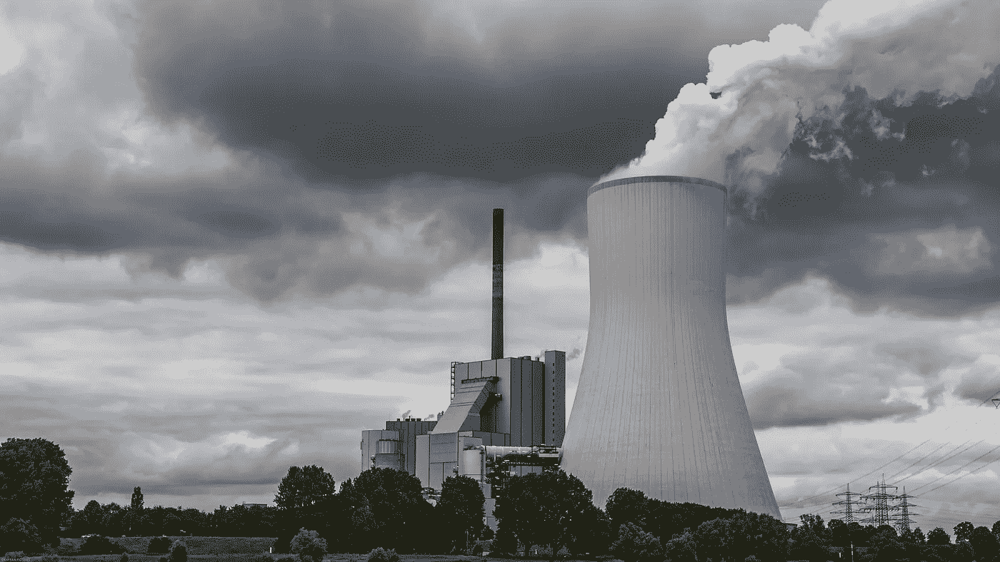

# 人工智能研究的碳足迹

> 原文：<https://towardsdatascience.com/the-carbon-footprint-of-ai-research-812d9c974a5c?source=collection_archive---------20----------------------->

Photo by [Lucas Benjamin](https://unsplash.com/@aznbokchoy?utm_source=medium&utm_medium=referral) on [Unsplash](https://unsplash.com?utm_source=medium&utm_medium=referral)

## 做好机器学习模型的成本是多少，做 AI 研究？让我们做一些粗略的信封计算。

面对现实吧，人工智能的研究是基于计算能力的。过去几年的大部分改进都重新使用了来自数学和机器学习的非常古老的思想，具有更强的计算能力。今天可用的计算能力是高效人工智能算法的驱动力，计算机视觉是从这一事实中受益匪浅的一个领域的主要例子。将一篇论文推向一个值得关注的会议的简单方法之一是采用一些著名的算法，并使模型更大，或数据更大，因此计算更大。这能让我们走多远？

所以，对于计算能力，我们显然需要能量。让我们先通过一点物理学来理解什么是能量。物理学中的能量定义为随时间施加的力，或者换句话说，牛顿-秒。能量的单位是**焦耳**【J】，定义为 1 秒内施加的 1 牛顿(力的单位)。现在，你们中的大多数人会理所当然地注意到，在计算机硬件产品、电费等方面没有焦耳的说法。对于电，我们有功率的度量单位，**瓦特**，实际上只有 J/s。因此，当你在电费账单上读到 X 千瓦时，这意味着你使用的能量，用焦耳表示，总计为 X*1000*60*60 焦耳。所以当我们谈论 kWh 的时候，我们实际上还是在谈论焦耳，牛顿-秒！谢谢你，焦耳。

既然我们在能源方面达成了一致，我们可以开始查看“深度学习”PC 的能耗，或者至少是一个粗略的估计。不一定，但你可能希望有一个好的 CPU，如英特尔 i7，或者更多的内核。但是让我们坚持以英特尔 i7 作为一个主要的例子。在产品页面上，它说处理器消耗 95W 的功率。你可能会经常使用这个处理器，一天 24 小时都在训练一些神经网络，运行一些计算等等。那么运行这个处理器一整天的能源成本就是 24*95 = **2.28 千瓦时。**

但是处理器对于深度学习来说还不够，我们需要更强大的东西，我们需要显卡。深度学习社区使用的最著名的型号之一 Nvidia 1080Ti 等显卡的能源成本是多少？在 Nvidia 页面上，它说 GPU 消耗的最大功率是 250 W。这大约是英特尔 CPU 的 2.5 倍。所以，再一次，让我们用一整天的千瓦时来计算，24*250 = **6 千瓦时**，一个不错的整数。

Obviously, cryptocurrencies are not helping the energy conundrum either.

对于家用电脑来说，这些数字相当不错，但事实是真正的计算发生在数据中心。那么，数据中心可以有多大呢？我听说过数据中心有 5000 个 GPU，一天 24 小时运行的故事。一个拥有 5000 个 GPU 的数据中心最有可能拥有至少 8 倍的 CPU 内核(这是非常适度的)。大约是 10k 的英特尔 i7 处理器。那么，根据我们之前的数据，这样一个数据中心每天需要消耗多少能源呢？5000*6 kWh 用于 GPU，2.28*10000 kWh 用于 CPU 内核，转换为 MWh，22.8 MWh + 30 MWh = **每天 52.8 MWh 兆瓦时**。可怕的数量。

现在，我们知道每天的能量规模为兆瓦，这些数据中心用来处理数字的能量来自哪里。我不想打断你，但它大多不是来自风车。一个风车，当一切顺利的时候，每年可以产生不超过 600 万千瓦时的风，根据我发现的统计数据，即每年 4500 兆瓦时，除以 365 等于**每天 12.32 兆瓦时**。这些能量可以为 400 到 500 个家庭供电。但不是数据中心，我们将需要 5 个风力涡轮机来为一个集群/数据中心供电。请注意，在我的计算**中，我没有考虑数据中心正常运行所需的冷却和其他硬件，这将显著增加功耗。**

世界上有多少个数据中心？我找到的数字超过 50 万。回到我们的计算。为了给所有这些处理数据的数据中心供电，我们需要 250 万台风力涡轮机。美国是世界上最大的能源消耗国，拥有 56 000 台风力涡轮机，但也有 40%的数据中心。相比之下，德国有 29 000 人。尽管如此，这些数字看起来并不乐观，美国和德国加起来还不到 10 万。

当我想到这一点时，有多少“无用的”计算时间被浪费在不必要的实验上，只是为了推出下一篇论文，该论文对社区中已经存在的方法仅提供了边际改进。作为一个研究团体，我们应该更加意识到“快速研究”的后果。这就像快餐，也许开始时味道不错，但长期影响却很糟糕。

Photo by [Andy Brunner](https://unsplash.com/@andy_brunner?utm_source=medium&utm_medium=referral) on [Unsplash](https://unsplash.com?utm_source=medium&utm_medium=referral)