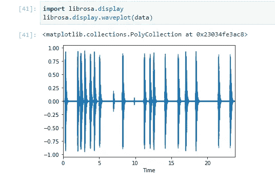

# 音频的心脏

> 原文：<https://towardsdatascience.com/the-cardio-of-audio-cbe310d94b48?source=collection_archive---------28----------------------->

# 仔细检查数据科学中的音频数据

# 介绍

大多数数据科学、机器学习或深度学习课程都是从分析和处理数字数据开始，然后转向图像数据。关于如何分析和处理音频数据，很少有好的资源。所以今天我们就来谈谈音频数据，讨论提取音频特征的方法。


## [使用这份数据科学备忘单完成伟大的壮举](https://docs.google.com/spreadsheets/d/1eNBLcKqCVN9zZQvfGUmm5bAzsETqB_ugVOlUtmvJGYU/edit#gid=910850616)

# **结构化与非结构化数据**

结构化数据通常存在于 RDBMS 或数据库中，您可以轻松地搜索记录、查看数字并进行比较。例如，记录可以包含姓名、id、出生日期、薪水、地址等。数据以类似结构化表格的格式排列，使用起来很简单。

非结构化数据包括音频、文本、图像等。大约 80%的企业数据以非结构化格式存储。使用它们并不容易，因为我们不能直接使用存储在图像或音频文件中的数据。在本文中，我们将主要关注音频数据。

# **音频数据**

人类的大脑不断地感知我们周围的声音。我们听到鸟儿啁啾，公路赛车，空气吹过，人们说话。我们有设备以各种格式存储所有这些数据，如 mp3、wav、WMA 等。现在，我们还能利用这些数据做些什么呢？

对于像这样的非结构化数据，深度学习技术是您的最佳选择。

首先，我们看看音频是什么样的。

音频以波的形式表示，其中波的振幅随时间而不同。


# **音频采样**

了解采样非常重要，因为声音是连续的模拟信号，当我们将它们转换为由信号中的离散数据点组成的数字信号时。这个过程称为采样，采样的速率称为采样率。它以赫兹(Heartz)为单位。采样率为 48kHz 的音频意味着每秒钟采样 48，000 个数据点。采样时，会丢失一点信息。


## [准备好，做这些令人惊叹的数据科学项目](https://data-flair.training/blogs/data-science-project-ideas/)

# **天秤座**

LibROSA 是用于音乐和音频分析的流行 python 包。它具有创建音乐信息检索的构件。

要安装带有 pip 的软件包，您可以在终端中运行该命令。

```
**pip install librosa**
```

## **加载音频文件**

我们将加载一段 23 秒的狗叫声音频文件。

```
**import librosa****data, sample_rate = librosa.load(“dog bark.wav”)**
```

librosa 的 load 方法获取音频文件的路径，并返回一个包含音频采样数据和采样率的元组。默认采样速率为 22050。您还可以在参数中指定自定义采样率。为了使用原始采样速率，我们使用 sr=None

```
**data, sample_rate = librosa.load(“dog bark.wav”, sr=None)**
```

**让我们看看数据中有什么-**

```
**print(data.shape, data)****print(sample_rate)**
```

**输出:**

(1049502,) [ 0.00019836 -0.00036621 0.00016785 …. 0.00099182 0.00161743 0.00135803]

44100

数据是一个有 1049502 个数据点的 numpy 数组。原始采样速率为 44100 Hz。降低采样速率会减少数据，我们可以更快地执行操作，但是降低太多也会导致一些信息丢失。

## **显示音频数据**

Librosa 有一个显示模块，可以给你绘制数据图表

```
**import librosa.display****librosa.display.waveplot(data)**
```

**输出:**



这就是狗叫的样子。现在有了采样数据和采样率，我们可以从音频中提取特征。

## [为什么数据科学是一份理想的工作？](https://data-flair.training/blogs/job-in-data-science-career/)

# **机器学习的特征提取**

有各种方法和技术来提取音频特征。这些是-

## **时域特征**

**过零率-** 如果您观察音频图像，我们会看到采样数据在-1 到 1 之间。过零率是这些符号的变化率，即从负值到正值的变化率。这在语音识别和音乐信息检索中被大量使用。

## **光谱特征**

**频谱质心-** 它表示给定声音的“亮度”。它代表了光谱重心。假设你正试图在手指上平衡一支铅笔。所以，谱形心就是平衡时你的手指接触铅笔的频率。

**频谱衰减-** 频谱衰减是指低于预定百分比(roll_percent)的频率，单位为赫兹，librosa 库中默认为 85%。
该特征在从非浊音信号中确定浊音信号时是有用的。通过将 roll_percent 设置为 1 或 0，也有助于逼近最小或最大频率。

## **感知特征**

**MFCC——梅尔——频率倒谱系数——** 每个人的声音听起来都不一样，因为声音是经过我们的声道过滤的，包括舌头、牙齿等。形状决定了它的声音，通过准确地确定形状，我们可以识别它将发出的声音。MFCC 的工作是确定声道的形状，并将其表示为功率谱。

MFCCs 是音频和语音识别中最常用的功能。它们是在 1980 年推出的，从那以后一直是最先进的。

# 结论

互联网上存在大量的非结构化数据。分析非结构化数据并不是一件容易的事情，因为我们必须对数据执行大量转换来提取特征。音频可以具有 3 种不同类别的特征时域、频谱和感知特征。

## [征服你的数据科学梦想](https://data-flair.training/blogs/data-science-interview-questions/)