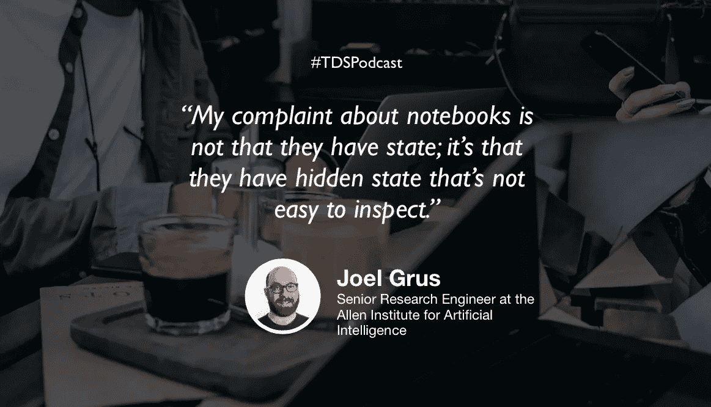

# 朱庇特笔记本的案子

> 原文：<https://towardsdatascience.com/the-case-against-the-jupyter-notebook-d4da17e97243?source=collection_archive---------13----------------------->

## [苹果](https://podcasts.apple.com/ca/podcast/towards-data-science/id1470952338?mt=2) | [谷歌](https://www.google.com/podcasts?feed=aHR0cHM6Ly9hbmNob3IuZm0vcy8zNmI0ODQ0L3BvZGNhc3QvcnNz) | [SPOTIFY](https://open.spotify.com/show/63diy2DtpHzQfeNVxAPZgU) | [其他](https://anchor.fm/towardsdatascience) | [剪辑](https://www.youtube.com/watch?v=1ISrRp6n2Tg)

## 乔尔·格鲁什在 TDS 播客上

🎧 [Clip](https://www.youtube.com/watch?v=1ISrRp6n2Tg)

*编者按:这是迈向数据科学播客“攀登数据科学阶梯”系列的第一集，由 Jeremie Harris、Edouard Harris 和 Russell Pollari 主持。他们一起经营一家名为*[*sharpes minds*](http://sharpestminds.com)*的数据科学导师创业公司。可以听下面的播客:*

对于大多数数据科学家来说，jupyter 笔记本是一个主要工具:这是他们学习诀窍的地方，这是他们建立原型模型或探索数据的地方-基本上，这是他们所有数据科学工作的默认场所。

但是乔尔·格鲁斯不像大多数数据科学家:他是前对冲基金经理和前谷歌员工，也是《从零开始的数据科学》一书的作者。他目前在艾伦人工智能研究所(T21)担任研究工程师，并拥有一个非常活跃的推特账户。

哦，他认为你应该停止使用 Jupyter 笔记本。现在。

当你问他为什么时，他会给出许多理由，但有几个很突出:

*   **隐藏状态:**假设你在笔记本的第一个单元格中定义了一个类似`a = 1`的变量。在后面的单元格中，你给它分配一个新值，比如说`a = 3`。只要你按照从上到下的顺序运行你的笔记本，这个结果是可以预测的。但是如果你不这样做——或者更糟的是，如果你运行`a = 3`单元并在以后删除它——很难或者不可能通过简单地检查笔记本来知道你的变量的真实状态。
*   **可复制性:**要确保运行可重复的数据科学实验，最重要的事情之一就是编写健壮的模块化代码。Jupyter 笔记本含蓄地阻止了这一点，因为它们没有被设计成模块化的(笨拙的黑客确实允许你将一个笔记本导入另一个，但是它们，嗯，很笨拙)。此外，要重现另一个人的结果，您需要首先重现他们的代码运行的环境。普通笔记本并没有给你一个好的方法来做到这一点。
*   **不利于教学:** Jupyter 笔记本让编写糟糕的教程变得非常容易——你知道，就是那种你漫不经心地按了一大堆“shift-enter”键，让你的电脑做一堆你实际上并不理解的事情？这导致了许多沮丧的学习者，甚至更糟的是，许多初学者认为他们了解如何编码，但实际上并不了解。

总的来说，Joel 对 Jupyter 笔记本的反对似乎很大程度上来自于他的哲学观点，即数据科学家应该遵循任何优秀软件工程师都会遵循的最佳实践。例如，Joel 强调了[编写单元测试](https://www.freecodecamp.org/news/learning-to-test-with-python-997ace2d8abe/?source=post_stats_page---------------------------)的重要性(即使对于数据科学代码来说也是如此)，并且是使用类型注释的强烈支持者(如果你不熟悉类型注释，你应该[在这里](https://medium.com/@shamir.stav_83310/the-other-great-benefit-of-python-type-annotations-896c7d077c6b)了解它)。

但即使是乔尔也认为 Jupyter 笔记本在数据科学中有一席之地:如果你正在研究一个熊猫数据框架来做一些基本的探索性数据分析，很难想到比可靠的 ol' Jupyter 笔记本更好的方式来即时制作有用的图表。

无论你站在朱庇特辩论的哪一边，都很难否认乔尔提出了一些令人信服的观点。我个人还没有关闭我的 Jupyter 内核，但我想我会在未来更频繁地启动我最喜欢的 IDE。

## [TDS 播客—剪辑](https://www.youtube.com/watch?v=1ISrRp6n2Tg&t=11s)

如果你在推特上，随时欢迎和我联系 [@jeremiecharris](https://twitter.com/jeremiecharris) ！

我们正在寻找能与我们的观众分享有价值的东西的客人。如果你碰巧知道谁是合适的人选，请在这里告诉我们:【publication@towardsdatascience.com】T4。