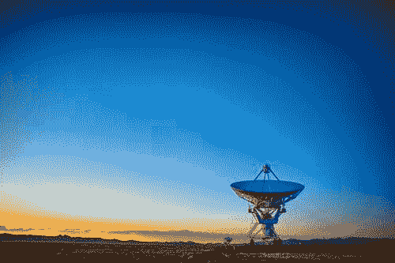

# 数据科学作为现代文科的案例

> 原文：<https://towardsdatascience.com/the-case-for-data-science-as-the-modern-liberal-arts-803c9f1e125a?source=collection_archive---------12----------------------->

## 文科汇集了各个领域的见解和数据。这正是现代数据科学对我们的要求。

博雅教育由来已久。回到我们对自然现象的理解有限的时代，需要跨艺术、科学和人文学科的综合训练才能理解这个世界。随着我们开始更多地了解特定领域，我们需要更深入的专业知识来在该领域取得进展。

现代科学已经从文科教育中受益。这就是为什么数据科学应该被认为是现代文科。数据科学家所需的专业知识范围经常被批评为根本不存在的那种培训。然而，在现实中，文科已经为世界各地的年轻人提供了广泛的综合教育，现代数据科学是一种新形式的文科职业的出现。

# 成为数据科学家的要求

数据科学已经被广泛认为是 21 世纪最热门的工作之一。要做好你的工作，你需要成为计算机科学、统计学、数据工程、数据可视化、管理演示和说服性写作方面的专家。世界对所有的期望都感到慌张，主要是因为他们期待所有这些方面的“专业知识”。技术世界正在接受的是，当你有如此广泛的应用时，你最终不知道在哪里应用你的技能。类似地，当你面对大量的数据时，你必须系统地挑选所有的数据来理解它们。

# 几十年来，文科教育一直在教授广度和综合

当我开始在普吉特湾[大学](https://www.pugetsound.edu/)上大学的时候，我走进了一个小的文理学院，却一点也不明白这意味着什么。四年后，我上了历史、写作、生物、化学、数学、计算机科学和技术&社会课。我甚至参加了一个名为“寻找外星智慧”的课程。

> *剧透:它被称为“搜索”,因为我们还没有找到它。*

文科的基本技能是阅读、综合和写作的能力。该死，说一个你可以到处应用的广泛技能。但是在训练如何磨练研究，筛选数千页的材料，然后建立一个有凝聚力和说服力的论点后，我开始变得很擅长。最终，我可以像讲述有机化学合成一样，轻松地讲述曼哈顿计划的文化规范。

# 文科及其与数据科学的关系

随着我们进一步进入数据驱动的科学，这个领域看起来越来越像文科。在过去，科学家们必须收集几乎所有的数据，才能做出“数据驱动”的决策。我们很大程度上是通过假设检验做到这一点的，就像我们在科学方法中做的一样。随着现代生活中数据的爆炸式增长，我们越来越需要探索已经存在的数据。

随着印刷机的出现，世界开始以书籍和文字的形式存储大量数据。为了理解所有这些，以及我们周围的自然世界，文科教授如何解释、综合和交流。

> 听起来熟悉吗？

每一天，我们都会写更多关于数据科学和有效沟通的[交集。我们如何解释、综合和有效地交流我们通过数据争论、机器学习和人工智能方法发现的所有伟大的东西？](https://hbr.org/2019/01/data-science-and-the-art-of-persuasion)

# 一个精心设计的文科学位是成为一名数据科学家的完美训练

我将冒险提出索赔。完美的数据科学学位应该看起来像英语学位，侧重于写作和阅读。它应该配有一个统计学/数学/计算机科学辅修专业和一个领域的第二个辅修专业，以提供领域知识(例如，生物学、化学、市场营销、物理学等)。

一旦学生掌握了有效写作的能力(代码或文章)，他们就有能力讲故事。有效的数据科学取决于我们交流结果的能力。一旦你将构思和撰写故事的能力与领域专业知识结合起来，你就获得了引导数据驱动决策的强大能力。

# 作为现代文科的数据科学

世界需要更多的数据科学家。然而，我们目前对谁是优秀的数据科学家的定义过于狭隘。让我们邀请历史和英语专业的学生，作家，工匠，以及那些用自己的神经元网络在海量数据中筛选的人。(不要和神经网络混淆)。我们花费大量的时间和精力来培训工程师更有效地沟通。让我们花同样多的精力训练文科专业的学生如何写代码和推导算法。

我叫亚历山大·泰特斯，我有旅行癖。我经常陷入沉思，迷失在树林中，而且经常同时迷失在两者之中。我的人生使命是重新定义职业成功，将个人和职业追求都包括在内。你可以在 [*LinkedIn*](https://www.linkedin.com/in/alexandertitus/) *和*[*Twitter*](https://twitter.com/1alexandertitus)*上找到我。*

*原载于 2019 年 8 月 11 日*[*https://alexandertitus.com*](https://alexandertitus.com/2019/08/11/the-case-for-data-science-as-the-modern-liberal-arts/)*。*