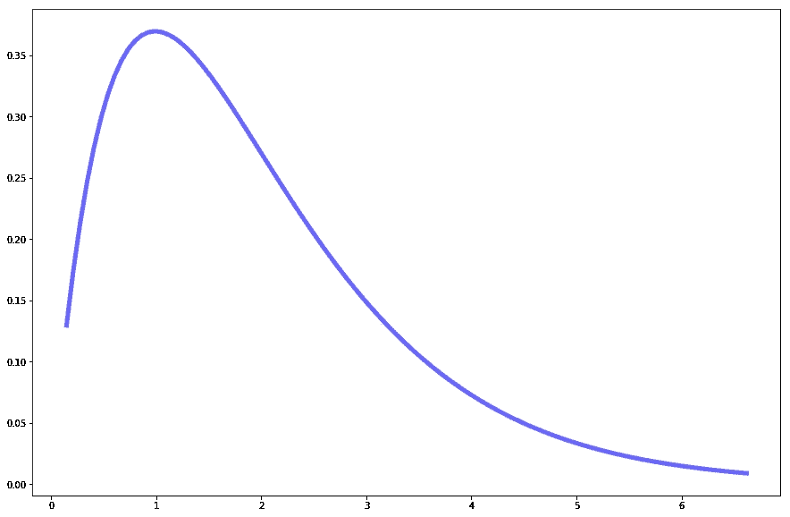
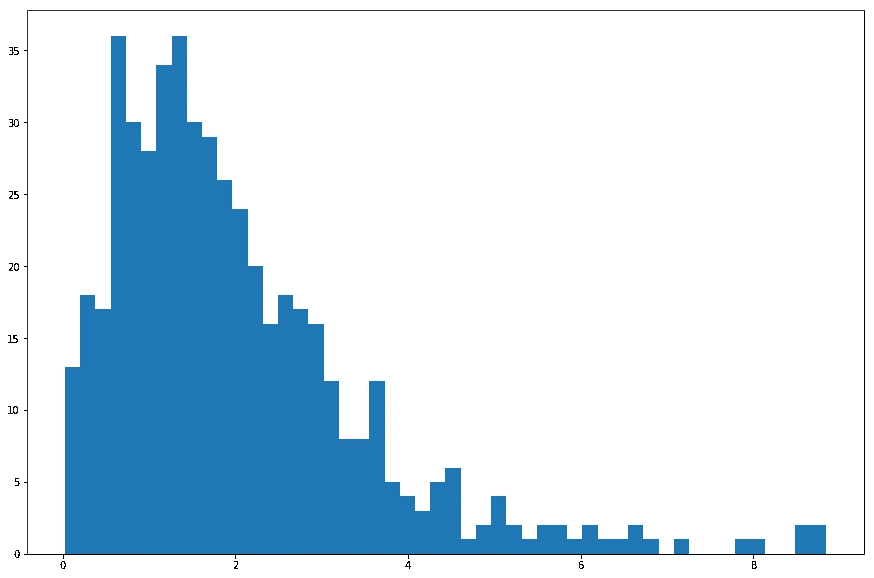
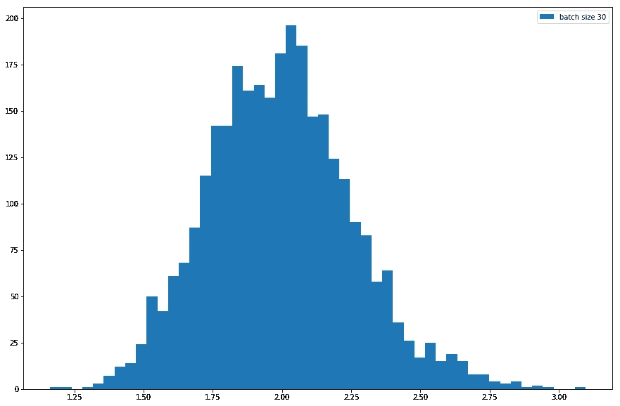
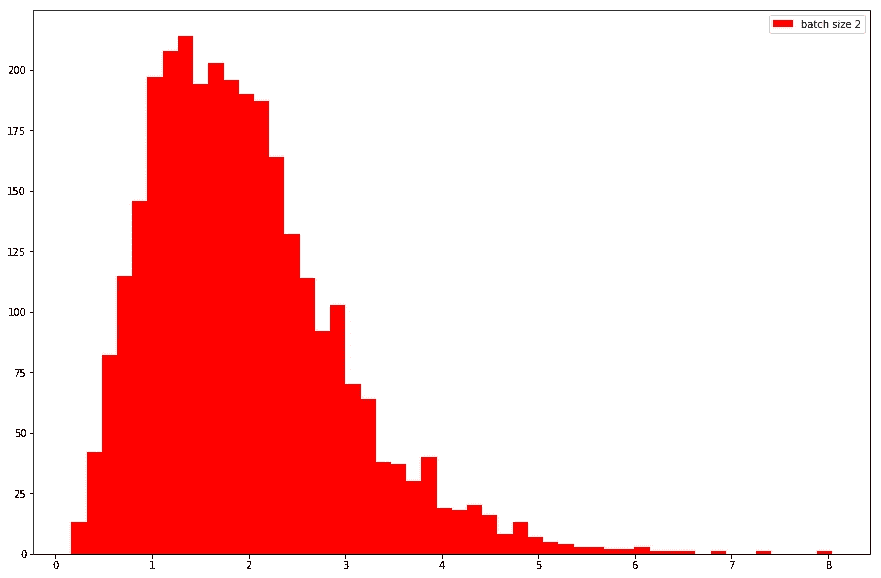
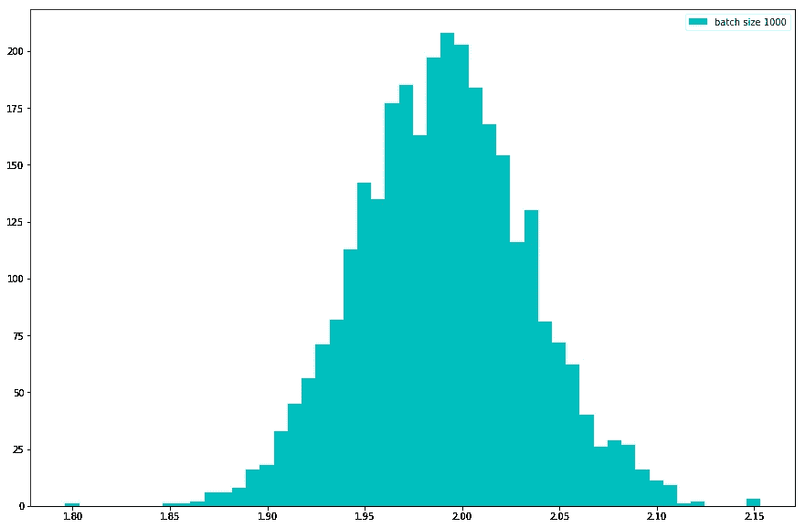
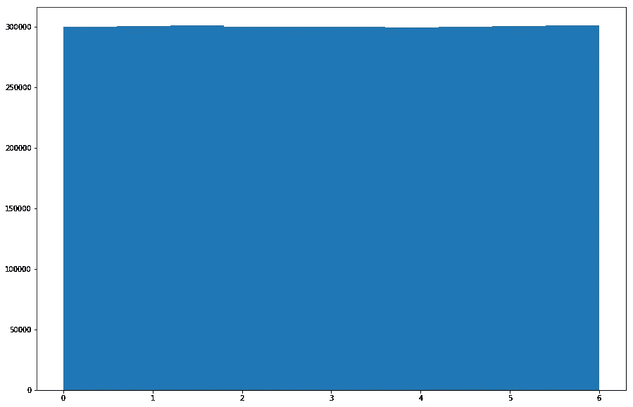
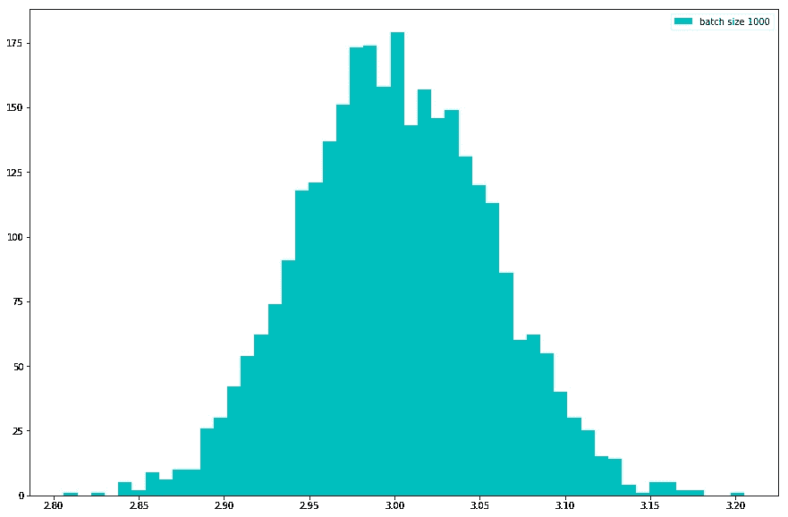
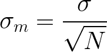
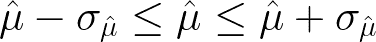

# 中心极限定理及其含义

> 原文：<https://towardsdatascience.com/the-central-limit-theorem-and-its-implications-4a7adac9d6de?source=collection_archive---------10----------------------->

Photo by [Joel Filipe](https://unsplash.com/@joelfilip?utm_source=medium&utm_medium=referral) on [Unsplash](https://unsplash.com?utm_source=medium&utm_medium=referral)

## 深入研究数据科学中最重要的定理

中心极限定理…是我们所有机器学习研究者和实践者的母亲。我们每天都在利用它，然而我们并不欣赏它。为什么那些讨厌的神经网络会汇聚到各种东西上？图像、时间序列等。我们可以学到很多东西，这一切都归功于这一点，乍一看很简单，但当你深入研究时，这是一个相对重要的概念。我们来解剖一下！

那么什么是中心极限定理呢？中心极限定理是这样的，用统计学术语加密:

> 无论总体分布的形状如何，随着样本量的增大，样本均值的抽样分布趋于正态分布。

或许让我们用简单的英语表述一下(抱歉，统计学家):

> 如果你从任何分布中抽取一批数据并取每批数据的平均值。那么平均值的分布将类似于高斯分布。(取总和也一样)

我不知道这个定义是否更容易理解(对我来说是的)。但也许让我们通过一个例子让它变得更具体。让我们采用高斯分布以外的分布，例如伽马分布。伽马分布基本上是这样的:

虽然当我们从数据中取样时，数据看起来很明显，但是让我们把它具体化。当从伽马分布中采样数据时，当我们绘制直方图时，数据看起来像这样:

从逻辑上讲，它类似于我们采样的伽马分布的密度函数。现在，让我们做我们在中心极限定理中陈述的事情。例如，让我们从大小为 30 的伽马分布中抽取 2000 批数据，取它们的平均值，看看会发生什么。

惊喜惊喜，这其实看起来像正态(高斯)分布。那么，如果我们改变样本的批量大小呢？让我们尝试以非常小的批量进行采样，比如说 2:

从逻辑上讲，我们又回到了看起来更像伽马分布的地方。如果我们对样本使用很大的批量，比如说 1000 个，会发生什么？

我们又看起来更正常了！所以，这有点太棒了。现在，只是为了好玩，让我们采取均匀分布，以便完全信服。均匀分布直方图如下所示:

很吵吧？现在，让我们做与伽马分布相同的事情，取样本的平均值并绘制最终分布:

再一次，它看起来像一个高斯！希望，如果你到现在还不相信，这个能说服你。

但是现在我们知道了这个很酷的事实，它实际上是如何有用的呢？让我们来看一下机器学习。正态分布的好处是它只需要两个参数来建模，均值和标准差。有了这些，基于中心极限定理，我们可以描述任意复杂的概率分布，看起来一点也不像正态分布。这让我们可以作弊，说我们可以在统计推断中无处不在地使用正态分布，尽管潜在的分布看起来一点也不像。

正态分布也有一些很好的属性，这使它很有用。例如，只取密度的对数(也称为对数似然)简化了机器学习中的许多事情，并自然扩展到均方误差，这是一种常用于回归任务的损失函数。实际上，表明使用均方误差相当于执行最大似然估计是相对微不足道的。此外，如果应用 L2 正则化，你可以表明，这相当于最大的高斯先验的 Aposteriori 近似，也很平凡。

回到中心极限定理，思考一下深度学习和随机梯度下降。随机梯度下降是如何执行的？我们通常从我们的训练集中抽取一批样本，然后计算这些样本的损失的平均值或总和。那么这种损失将如何分配呢？中心极限定理告诉我们，如果批量足够大，损失估计的最终分布将是高斯分布！下一步，我们将讨论置信区间以及它们如何在统计推断中发挥作用。

# 置信区间

从更具统计学意义的角度来看，高斯分布用于使用置信区间进行假设检验，或者查看实验结果的统计显著性。那么什么是确切的置信区间呢？让我们直接举个例子。假设我们想要估计我们平均睡眠时间的平均值。为此，我们取 200 天，取睡眠时间的平均值。这被称为均值的点估计。现在我们问自己，均值估计的分布是什么样的？我们已经知道，由于中心极限定理，它看起来像一个高斯函数，但是我们还可以知道其他的东西。我们可以计算平均估计值的标准偏差，也称为标准误差。也就是说，它等于以下内容:

所以我们要看的是样本标准差除以样本大小的平方根。请注意，当样本量趋于无穷大时，均值估计的标准偏差趋于零。这完全说得通，因为这样我们就有了对无限样本均值的完美估计。现在，我们如何构建一个置信区间？一个置信区间总是和一个概率绑定在一起的，也就是说当我们说一个 95%的置信区间时，例如，我们的意思是这个区间内的值“活”在 95%的密度内。或者换句话说，对于给定的分布，我们有 95%的概率确信采样值将落在这个范围内。所以，基本上，我们的置信区间(95%)是这样的:

一般来说，为了构建一个 X%的置信区间，统计学家通常使用一种叫做 Z 分数的东西。我不会在这里介绍具体的计算方法。但它相当于计算 Z 得分(实际上是特定值的平均值的标准化偏差)并在 Z 表中搜索特定概率，请注意，此操作也适用于其他方向(计算给定置信区间的值)

现在我们有了平均估计，我们有了 X%的置信区间。此时要问的正确问题是，这个置信区间说明了真实均值的什么，或者换句话说，我们离真实均值估计值有多远？如果你认为真实的平均值在这个区间内，概率为 X%，那你就错了。正确的解释是，我们知道如果我们继续以这种方式采样，X%的区间将包含真实的平均值。

这篇文章从理论上来说并不全面，不足以公正地处理中心极限定理，但是希望它能让你对它的有用性有一个(简洁的)了解。我敢说，在任何时间点，当你做统计推断，机器学习或你想叫它什么的时候。用中心极限定理来思考问题是有用的。很难用直观的方式解释 CLT，谁知道呢，也许如果你对关于中心极限定理的帖子进行足够的采样，你可能会得到对其真正意义的有效估计！