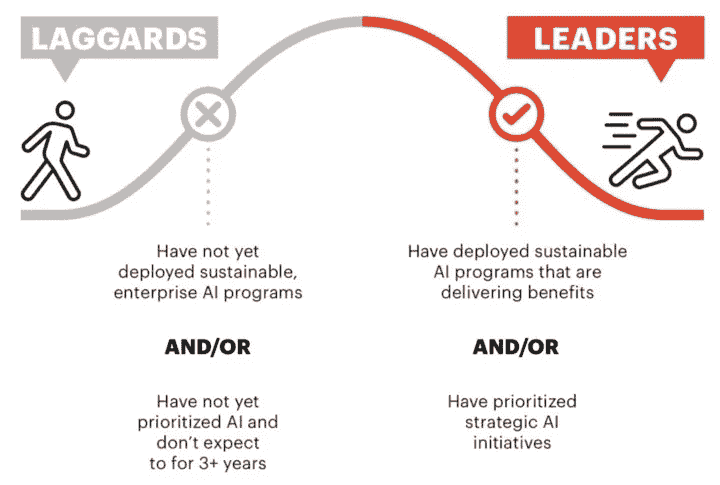
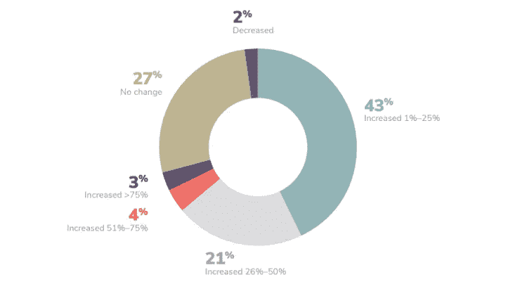

# 雇用人工智能专业人员的挑战

> 原文：<https://towardsdatascience.com/the-challenges-of-hiring-artificial-intelligence-professionals-fc691089bf41?source=collection_archive---------21----------------------->

Photo by [Clem Onojeghuo](https://unsplash.com/@clemono2?utm_source=medium&utm_medium=referral) on [Unsplash](https://unsplash.com?utm_source=medium&utm_medium=referral)

## 人力资源视角

前几天，我和我的经理边喝咖啡边聊天，话题转向了人工智能。在这个话题上，他评论说，“在人工智能领域，许多人只说不做”。虽然他说的总的来说是对的，但我觉得 AI 项目的成败是在 ***和*** 的招聘点上预先决定的。

# 富人越来越富，穷人越来越穷

在过去的几个月里，我一直在面试不同行业的不同公司的数据分析师，初级数据科学家或人工智能工程师职位。面试的时候，我注意到我面试的这些公司有很多不同之处。他们可以分为两类: *AI 领先者*和 *AI 落后者*。

Source from Accenture: The Momentum Mindset [1]

还存在一种“富人越来越富，穷人越来越穷”的现象，原因很简单。

在我开始之前，我们需要区分两组人:

## 业余爱好者

这群人对数据科学有着浓厚的兴趣，要么 1)正在转行，要么 2)刚刚转行，要么 3)已经有两年的工作经验。

这群人想弄脏自己的手。越脏越好。他们的重点是尽快提高自己的技能。这包括 1)能够与志同道合的人一起工作，2)有机会在工作中每天学习，3)接触生产级代码和端到端 ML 管道。

**专业人士**

这群人有着多年的 AI 工作经验。他们知道如何构建和部署 ML 模型，在给定的时间表内计划和执行 ML 项目，并且知道建立一个成功的数据科学团队的来龙去脉。

在他们职业生涯的这个阶段，这些人正在挣大钱。他们很受欢迎，他们要么是人工智能顾问，要么是大数据科学团队的经理。

“富人越来越富，穷人越来越穷”现象就是这样产生的。

试图涉足人工智能的落后者会做以下任一事情:

1.  **雇用一名专业人员来启动一切与数据科学相关的工作** —这尤其困难，因为专业人员的数量比业余人员少得多。还有，这些专业人士在各自的公司已经是高薪了；挖走一个人来启动数据科学计划将是极其昂贵的(因为所涉及的工作是巨大的)
2.  **在每个团队中加入一名业余选手** —由于缓慢的学习曲线，这通常会导致个人无法获得足够的满足感。由于个人缺乏经验，ML 模型不能进入生产。

最终，专业人士过度工作并离开公司，而业余人士由于缺乏工作满足感而离开。

然而，一个*人工智能领导者*将已经拥有相关的基础设施来建立和部署人工智能模型。数据管道中的每个团队都清楚自己的职责，吸引人才不是问题。

## 这如何转化为招聘？

如果说吸引人才对落后的*AI*来说还不够难的话，吸引合适的*人才就难上 100 倍了。*

落后的人工智能常常意识不到自己的需求。它不知道应该在哪里或如何部署它的努力。这通常会导致工作描述包括人类历史上基本上每一种编程语言，以及你能想到的每一种机器学习和计算机科学术语。它看起来像这样:

*   了解 Java、C++、C#、Python、SQL、Scala、PHP、Javascript、R、Tableau、Power BI、Azure、Spark、AWS、Hive、Pig、Matlab、Bash、Linux、Julia、Octave、SAS、Hadoop、Perl
*   计算机科学、数学或其他定量领域的硕士或博士
*   在预测建模、机器学习和高级分析方面拥有超过 8 年的学术/行业经验
*   对高级统计和现代机器学习预测技术有扎实的理解和经验，如 GLMs、决策树、森林、增强集成、神经网络、深度学习等
*   具有敏捷方法的经验(例如 Scrum、看板、开发/运营)
*   了解 JanusGraph、Apache Ranger、Apache Atlas 和基于图形的解决方案
*   优秀的沟通技巧，善于分析

是的，这个星球上基本上没有人。甚至连比尔·盖茨自己都不符合这个要求。

## 招聘人员缺乏相关知识

随着人工智能的持续繁荣，人才将继续短缺，因为需求超过了供应。技术招聘人员有可能解决公司的人才短缺问题，或者继续向采购公司扔出一张大网的候选人，希望有一个候选人奇迹般地通过筛选。

一个很适合的数据科学家不再是简历中匹配关键词如“ *Python* ”或“*机器学习*”的情况。数据生产管道包括数据工程师、数据分析师、数据科学家、AI 工程师、机器学习运营等。了解公司需要什么，知道这些角色之间的差异，将会区分优秀和平庸的技术招聘人员。

## AI 落伍者是注定的吗？

不，但是对他们来说爬出这个沟会很困难。如果公司不知道他们需要什么来开始，请一位顾问。根据我的经验，从长远来看，内部开发通常会胜出。让太多不同的供应商参与解决方案只会产生依赖性和局限性。

落后的大公司由于专注于成本和流程自动化而变得特别顽固，正如由解决企业 ML 主要趋势的 *Algorithmia* 进行的调查所表明的那样。

Source from Algorithmia: 2020 state of enterprise ML 2020 [2]

从图表中可以看出，人工智能预算全面增加，但部署率(在生产中)仍保持在 45%的低水平[2]。在人工智能采用方面相当年轻的公司应该非常关注他们需要的人才和技能类型。请记住，*Jupyter 笔记本模型在投入生产并产生商业价值之前没有任何意义*。

## 结束语

虽然我确实同意我的经理所说的，但我认为组织或团队最终效率低下或没有产出的原因归结于无效的领导。此外，组织越大，社交游手好闲的可能性就越大。在人工智能领域，我确实有一个天真的想法，因为我相信这个领域的个人有动力创造价值，因为他们看到了人工智能带来的价值。能够为这项工作雇用合适的人工智能专业人员只会变得更加困难，但希望随着时间的推移，事情会变得更好。

## 参考

[1]埃森哲:动量思维模式——[https://www . Accenture . com/_ ACN media/pdf-73/Accenture-strategy-ai-Momentum-mind-exec-summary-POV . pdf](https://www.accenture.com/_acnmedia/pdf-73/accenture-strategy-ai-momentum-mindset-exec-summary-pov.pdf)
[2]algorithm ia:2020 年企业机器学习状态——链接[此处](https://info.algorithmia.com/hubfs/2019/Whitepapers/The-State-of-Enterprise-ML-2020/Algorithmia_2020_State_of_Enterprise_ML.pdf?utm_campaign=The%20Batch&utm_source=hs_email&utm_medium=email&utm_content=80984419&_hsenc=p2ANqtz-_4Mt8ttCYUZcSKeW-RVd0tvDxAEMnIlgidVlf82c7g7WJmMQZt8JYwE-rsXMFOXn9VPMwuteAacos15D3D8yqkS2uDQg)