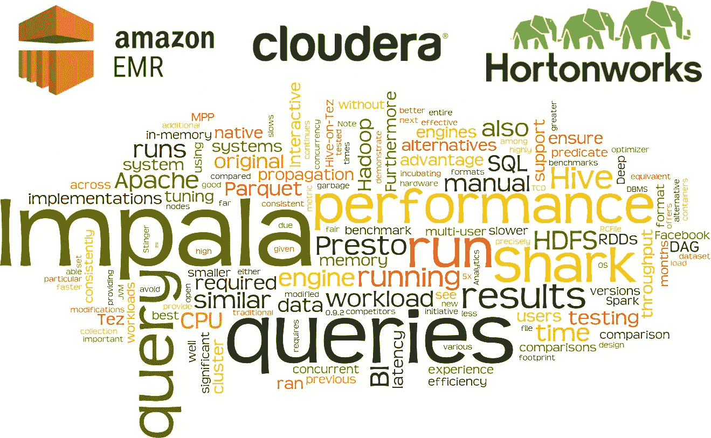

# 大数据平台的特征及其对数据探索的重要性

> 原文：<https://towardsdatascience.com/the-characteristics-of-big-data-platforms-and-their-importance-for-data-exploration-650ec45cec14?source=collection_archive---------16----------------------->

**引言:**近十年来，指数级增长的数据已经成为知识的关键。传统系统无法及时处理如此大量的数据。大数据技术和平台不仅可以生成信息，还可以及时生成有意义的见解。不仅仅是数据量，还有结构化或非结构化数据的多样性以及数据增长的速度，使得传统系统无法处理海量数据。基于摄取、预处理和处理的速度，数据的处理可以是不同种类的:批处理、实时、流式和交互式。日益增长的处理海量数据的需求导致了许多大数据平台的兴起，如 Cloudera 的 Hadoop 发行版(CDH)、Hortonworks 数据平台(HDP)、AWS Elastic Map-Reduce(AWS-EMR)等等。这些开源技术的每一个版本，如 Apache Hadoop、Hive、HBase、Sqoop 等。是一个统一的产品，用户不必花费时间将这些元素组装成一个单一的功能组件。本文将进一步讨论 CDH、HDP 和 AWS-EMR 的架构，并对它们进行比较，还将讨论这些架构对于数据探索和直觉生成的重要性。

**不同大数据平台的架构:**

1.  **Hortonworks 数据平台(HDP):** HDP 是开源技术的组合，旨在简化大数据技术的采用。HDP 最新的 3.1 版本支持批处理服务、流处理服务、实时处理服务以及机器学习和深度学习框架。它使用 Apache Ranger、Apache Knox 和 Apache Atlas 来实现对数据的一致和安全的访问以及元数据的管理，并使用 Apache Ambari 来协调集群的供应、管理和监控。Yarn 为集群进行所有的资源协商。HDP 现在是一个混合数据平台，即分析脚本可以在云存储(AWS S3，Azure ADLS)以及 HDFS 存储系统上运行。HDP 还支持分布式 Tensorflow，使用它可以在分布式集群上运行深度学习脚本。HDP 还支持 Docker 容器或 native Yarn 容器中的第三方应用程序。
2.  **2.2。Cloudera 的 Hadoop 发行版(CDH):** CDH 的愿景是为 Hadoop 和大数据带来分析查询和实时查询，这推动他们从事像 Impala、Kudu 这样的项目，这些项目后来被捐赠给了 Apache Software Foundation。Cloudera 根据数据的用途提出了不同的解决方案，即:数据仓库、数据科学、数据工程、运营数据库和混合云部署，根据客户的需求以不同的组合提供。CDH 也是一个混合数据平台。和 HDP 一样，CDH 也不支持 Jupyter IPython 笔记本。CDH 还支持 Apache Kite，它提供高级 API 和工具来在 Hadoop 集群中存储数据。
3.  **亚马逊 Web 服务—弹性映射还原(AWS-EMR):** 亚马逊 Web 服务已经是一个企业的完整解决方案，他们提供完整的云解决方案(基础设施、平台、软件)。他们通过 EMR 提供大数据分析。EMR 不是一个混合数据平台，但在分析方面与 S3 紧密相连。EMR 提供了巨大的成本节约，因为我们可以专门配置为一个作业启动一个集群，并在作业结束时立即关闭它，或者根据我们自己的选择连续运行一个集群。我们还可以在作业运行时动态扩展集群。AWS EMR 集群还支持 TensorFlow 和 MxNet 深度学习框架。

**不同大数据平台的数据探索**:大数据探索基本上遵循两个著名架构中的一个，要么是 Lambda，要么是 Kappa。Lambda 包括批处理层、流处理层和服务层，而在 Kappa 架构中，批处理层被跳过，实时和连续处理都在单个流中完成。每个大数据平台针对不同的处理类型使用不同的工具。因此，为了比较三个大数据平台，我们将在处理场景中对它们进行比较:

1.  **批处理:**三个平台都支持种类繁多的批处理工具，如 Apache Hadoop、Hive、Pig、Spark 其可用于批处理以及流处理。HDP 和 CDH 不支持 Flink，这是另一种混合处理工具，就像 Spark 一样，Flink 和 Presto 可与 AWS-EMR 一起使用，CDH 支持 Impala 作为批处理工具，提供非常快的吞吐量。
2.  **流处理:**对于流处理，所有三个平台都支持 Spark 和 Kafka。此外，AWS-EMR 支持 Apache Flink，HDP 支持 Apache Storm。Storm 是第一个真正的流处理引擎，而 Flink 在其核心是另一个真正的流处理引擎，支持几乎所有流处理的高级功能，如事件时间处理、水印等，并提供低延迟和高吞吐量。
3.  **服务层或实时处理:** Hbase 是所有平台的通用工具，当 CDH 支持 Kudu 时，它可以用来服务数据。HDP 支持 Druid，还有 Phoenix 和 Accumulo，AWS 提供 Hbase 和 Phoenix 来快速访问和查询数据。

**结论:**宇宙的数据分析启发了可以在生活的各个领域帮助人类的模式。Hadoop、Spark 等大数据技术。使得这种分析成为可能。大数据平台通过同时提供大数据技术，简化了大数据处理架构的实施:Lambda 和 Kappa。在比较 AWS-EMR、CDH 和 HDP 的架构时，我们注意到所有平台都带来了不同的技术融合，已经开始促进分布式深度学习框架，并且是独立完整的平台来执行任何类型的数据处理。

**参考文献:** 1。 [Hortonworks 数据平台](https://www.ibm.com/downloads/cas/DKWR4KZB)
2。[深入探讨基于 Hadoop 的大数据架构](https://www.researchgate.net/profile/Allae_Erraissi/publication/322686669_Digging_into_Hadoop-based_Big_Data_Architectures/links/5a68e1cea6fdcccd01a1943f/Digging-into-Hadoop-based -Big-Data-Architectures.pdf)
3。 [Hortonworks 数据平台](https://hortonworks.com/products/data-platforms/hdp/)
4。 [Cloudera 企业架构](https://www.cloudera.com/documentation/enterprise/6/6.1/topics/introduction.html)
5。[亚马逊电子病历架构](https://aws.amazon.com/emr/)
6。[德鲁伊 vs 库杜](http://druid.io/docs/latest/comparisons/druid-vs-kudu.html)7。[λ和κ](https://cs.uwaterloo.ca/~jimmylin/publications/Lin_IEEE2017b.pdf)和
8。[Spark Streaming vs Flink vs Storm vs Kafka Streams vs Samza:选择您的流处理框架](https://medium.com/@chandanbaranwal/spark-streaming-vs-flink-vs-storm-vs-kafka-streams-vs -samza-choose-your-stream-processing-91ea3f04675b)

我希望你能发现这篇文章内容丰富且简单易学，如果你有任何疑问，请随时拨打 info.ankitp@gmail.com[的电话联系我](mailto:info.ankitp@gmail.com)