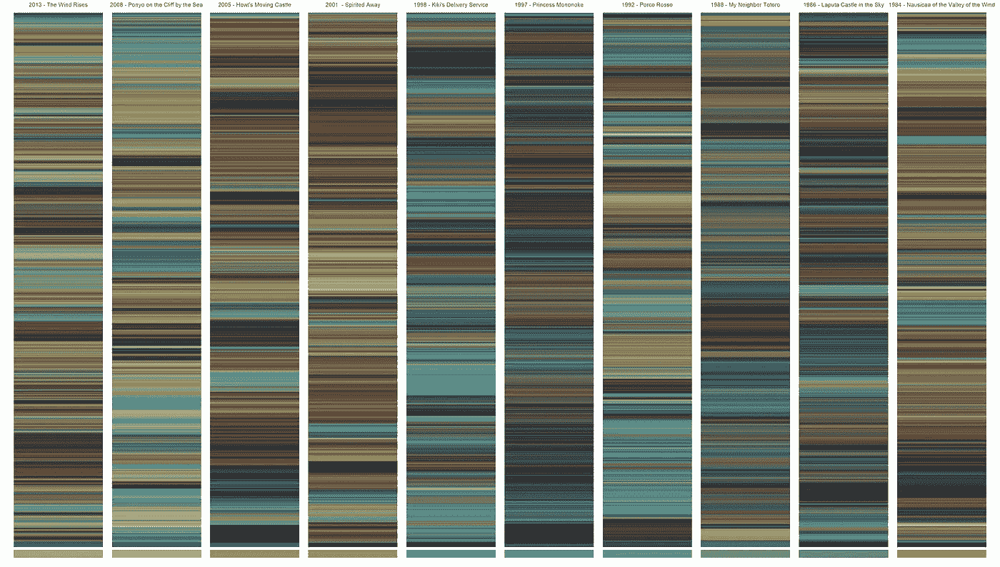
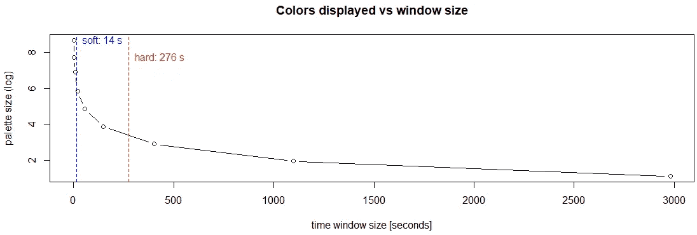
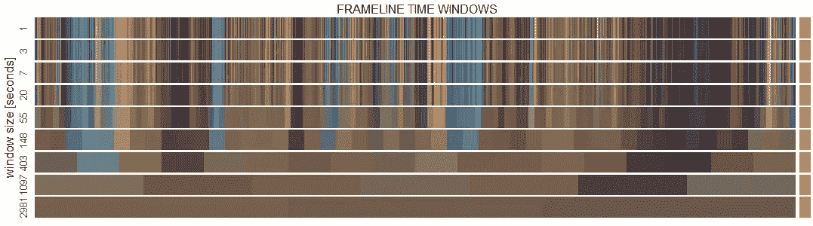
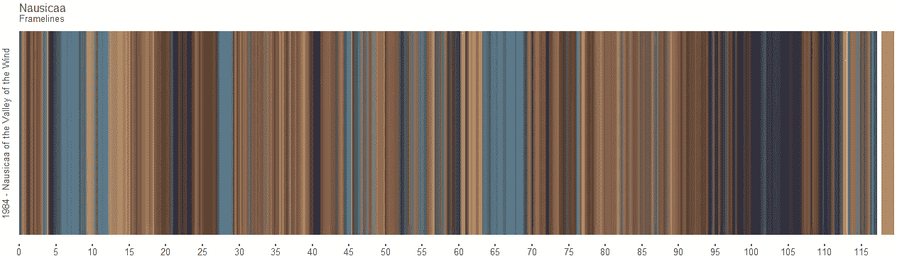
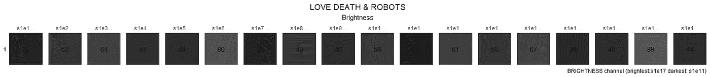
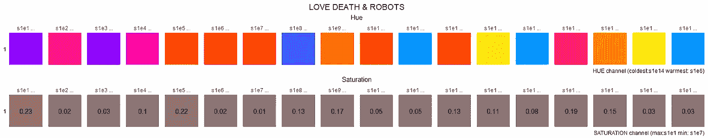
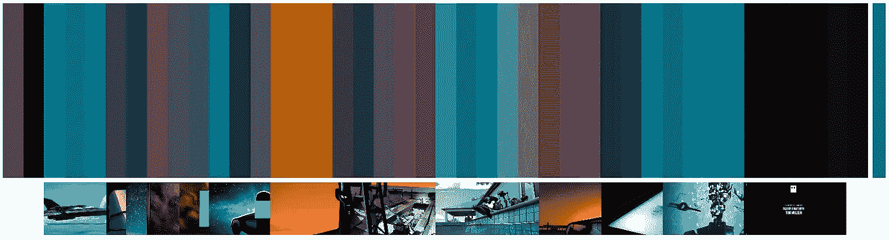
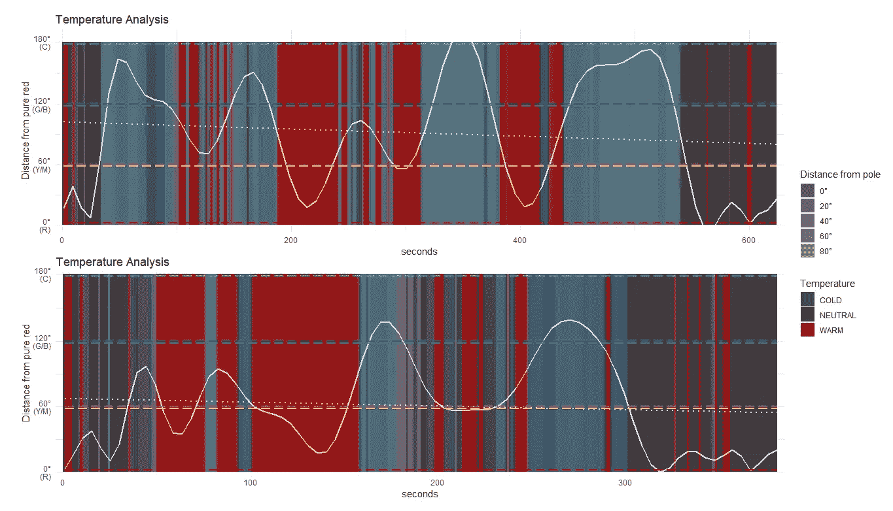
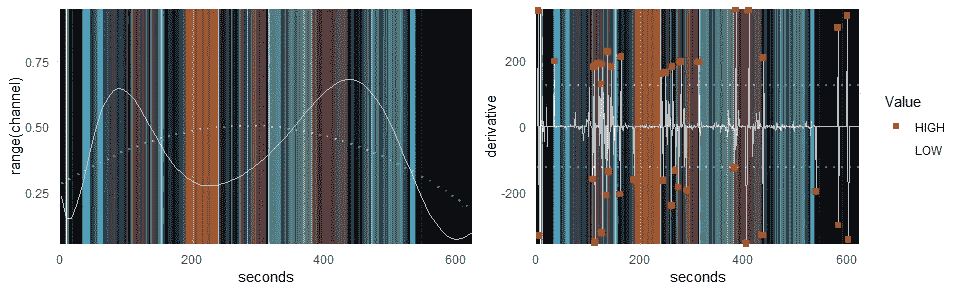
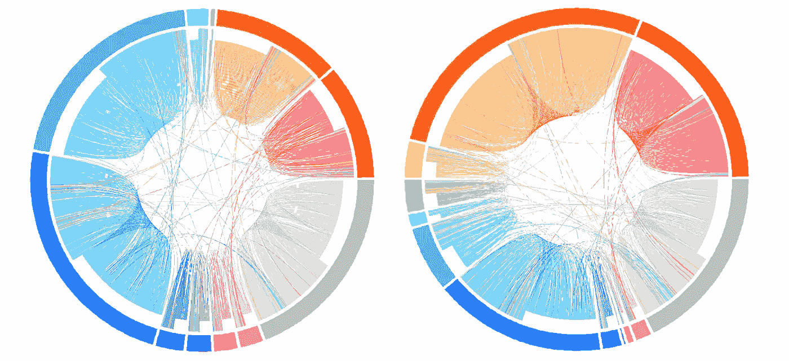

# 用 R 探索电影中的彩色故事:ChromaR 包

> 原文：<https://towardsdatascience.com/the-chromar-package-892b716ee2c9?source=collection_archive---------26----------------------->



## 关于如何生成电影框架线和许多其他彩色数据的实用见解

# 0.我们离开的地方

在这个多彩旅程的[**第一部分**中，我们探索了一些从著名电影中摘取的**有趣的半音阶例子** **，试图猜测导演们选择背后的原因，并通过 R 脚本挖掘可以做些什么。**](/exploring-chromatic-storytelling-with-r-part-1-8e9ddf8d4187)

[](/exploring-chromatic-storytelling-with-r-part-1-8e9ddf8d4187) [## 探索 R 电影中的彩色故事(上)

### 一次丰富多彩、数据驱动的电影色彩世界之旅

towardsdatascience.com](/exploring-chromatic-storytelling-with-r-part-1-8e9ddf8d4187) 

在第二部分**，**中，我们将讨论更多的技术细节，介绍 **ChromaR** 工具包，这是一个 R 包，允许我们渲染之前在第一部分(以及更多)中显示的所有彩色可视化。

# 1.设置好一切

## 安装 ChromaR

ChromaR 包托管在 GitHub 上，因此必须通过 **Devtools** 安装:

如果你想检查源代码，这里是 ChromaR Git 库:

[](https://github.com/detsutut/chroma) [## 清晰度/色度

### ChromaR 是一个实验性的 R 工具包，用于分析和探索电影或任何其他视频中的彩色故事…

github.com](https://github.com/detsutut/chroma) 

## 数据

正如在[第一部分](/exploring-chromatic-storytelling-with-r-part-1-8e9ddf8d4187)中提到的，在 R 中检索视频源的张量分量有点棘手，因此必须以其他方式实现。
然而，ChromaR 公开了两个现成的数据库，您可以用于实践目的。

```
 R     G     B     lum   duration  RGB     title          frameId
1 95.43 84.02 76.22 86.58 7020      #5F544C Nausicaa o...  1
2 70.16 72.72 70.92 71.76 7470      #464846 Laputa Cas...  2
3 75.58 82.22 74.08 79.34 5185      #4B524A My Neighbo...  3
4 85.45 93.22 88.66 90.39 5595      #555D58 Porco Rosso    4
5 58.40 65.24 61.49 62.77 7995      #3A413D Princess M...  5
6 77.02 87.91 91.37 85.03 6180      #4D575B Kiki's Del...  6
```

如果你已经有了自己的 csv RGB 文件，可以通过 *getFrames()* 导入。


Hayao Miyazaki and (some of) his colorful creations [© [Reel Anarchy](https://www.reelanarchy.com/hayao-miyazaki-back-at-studio-ghibli-working-on-two-movies/)]

# 2.得到我们的第一个框架

坚持使用宫崎骏的数据集*，*让我们为娜乌西卡检索一个框架，我们电影列表的第一个条目。通过**合并连续帧组**(即平均 RGB 通道阵列)生成帧线。
使用*组帧*功能将帧分组，并指定**时间窗口**的宽度。根据此参数，生成的框架线可能清晰或模糊。对于大多数电影来说，5 秒的窗口通常是合适的，但是您可以使用 *plotTimeWindows* 功能对其进行可视化调整。



*The algorithm suggests two different cutoffs: a soft one (sharp frameline, most of the color information is preserved) and a hard one (blurred frameline, defined by the time constant of the exponential decay)*



…or you can simply pick up your favorite window size by visual inspection

3 到 20 秒之间的一切似乎都很好，所以让我们选择第一个建议的窗口大小。 *plotFrameline* 函数将负责渲染。



如果您想在同一情节中渲染**多部电影，您可以将 *groupframe* 函数应用于列表中的每部电影，并将整个集合提供给 *plotFrameline* 函数。**

# 3.摘要图块

对整个季节或电影系列的色度研究可以集中在许多不同的特征上。现在让我们来考虑一下那块名为 ***爱情、死亡&机器人*** 的小金子，出自**网飞**。


“Three Robots”, one of the most loved episodes of Love, Death & Robots by Blow Studio (© Netflix)

广受好评的新网飞系列的每一集都是由不同的艺术家和工作室设计、导演和制作的。这种**异质性清楚地反映在剧集的色彩选择**中，可以使用 *plotSummaryTiles* 函数进行总结和比较。
例如，我们可以比较每一集的**亮度**来猜测哪一集是“最暗”的。
为了这样做，我们必须先拿到**摘要**。可以使用 *getSummary* 函数检索摘要。这些摘要必须输入到 *plotSummaryTiles* 函数中，指定我们感兴趣的特性。



Average Brightness value for each episode

结果显示《援助之手》是该剧最黑暗的一集。这不会让你感到惊讶，因为剧情完全是在**空间**设定的。银牌颁给了《超越阿奎拉裂谷》，如果你已经看过了，就不需要任何进一步的解释了。最精彩的一集**(到目前为止)反而是《交替历史》和《当酸奶掌权的时候》:光明一面统治世界一次！**

****

**“Helping Hand” vs “When the Yogurt Took Over” (© Netflix)**

**通过简单地将模式参数从 *lum* 切换到 *h* 或 *s* ，可以对饱和度和色调重复相同的过程。**

****

**Average Hue and Saturation values for each episode**

**不出所料，“**马孜蓝**”似乎是最冷的一集。在下一章，我们将用一组更具体的函数来更深入地研究它。**

****

**This frame from “Zima Blue” basically encapsulates the color palette of the whole episode (© Netflix)**

# **4.温度、通道和圆圈**

**作为一个有着重大意义的简单故事，这一集展现了与其他集相比**非常小的调色板**，却没有失去一点色彩力量。当对帧进行分组时，可以简单地通过应用宽时间窗口(15 s)来检索整个剧集的调色板。**

****

**“Zima Blue” palette and keyframes (© Netflix)**

**正如所料，**蓝色主导了这里的场景**。通过*温度*功能检查色调，我们可以清楚地看到这种趋势，该功能测量每帧色调与纯红色的**距离**。除了两节，全集都是**偏向蓝色/青色**。**

****

**Temperature comparison between “Zima Blue” (top) and “When the Yogurt Took Over” (bottom)**

**通过 *plotChannel* 函数检查色调通道趋势可以得出类似的结论，该函数除了通道图之外还返回**导数**趋势。与其他剧集相比，“马孜蓝”的导数在故事的相当大一部分几乎为零，这意味着**在同一个场景**内没有发生显著的色彩变化(这就是为什么我们有这么小的调色板)。**

****

**Hue channel trend and its derivative**

**毫无疑问，蓝色/青色是“马孜蓝”的主角。那其他几集呢？蓝真的代表性过高吗？让我们用 *colorCircle* 函数来比较一下，比如，这个系列的第五集《灵魂的吸盘》。该函数生成一个**弦图**，一个**显示** **数据**之间相互关系的图形化方法。每个帧围绕一个圆呈放射状排列，帧之间的**颜色过渡**绘制为连接源和端点的弧线。**

****

**Chord diagram of “Zima Blue” (left) and “Sucker of Souls” (right)**

**在这里，我们可以清楚地看到两集之间的青色/天蓝色和橙色百分比有多么不同。**这两种色调在色轮**上截然相反，因此它们的表现对传达温暖或寒冷具有决定性作用。运行下面的脚本，我们可以生成这些奇特的情节。**

# **结论**

**探索和分析电影中颜色的使用是很棒的，可能会带来意想不到的发现。这两个系列的文章仅仅触及了一个更加复杂的世界的表面，这个世界对于每一个对数据可视化感兴趣的数据科学家来说都是一个令人惊奇的体育馆。
在评论中留下你的想法和**查看** [**第三部分**](/r-color-palette-extraction-3850b3f56152) 如果你也喜欢这个！**

> **请注意，chromaR 包仍然是一个测试版，必须进行许多改进，以使其 100%可操作。因此，**请报告您遇到的任何错误**或问题！**

**[](/r-color-palette-extraction-3850b3f56152) [## 用 R 探索电影中的彩色故事:调色板提取

### 如何使用颜色量化理论和无监督机器学习从电影帧中提取调色板

towardsdatascience.com](/r-color-palette-extraction-3850b3f56152) [](https://www.linkedin.com/in/tbuonocore/) [## Tommaso Buonocore -作者-走向数据科学| LinkedIn

### 查看世界上最大的职业社区 LinkedIn 上 Tommaso Buonocore 的个人资料。托马索列出了 5 项工作…

www.linkedin.com](https://www.linkedin.com/in/tbuonocore/)**