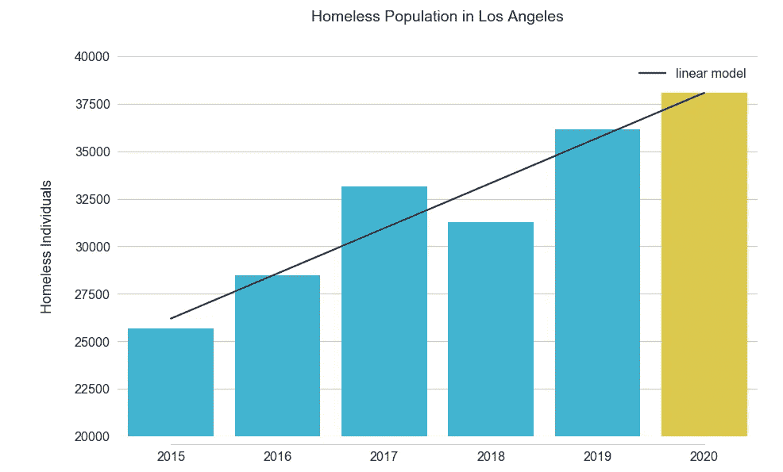
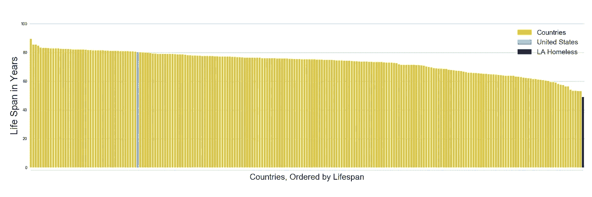
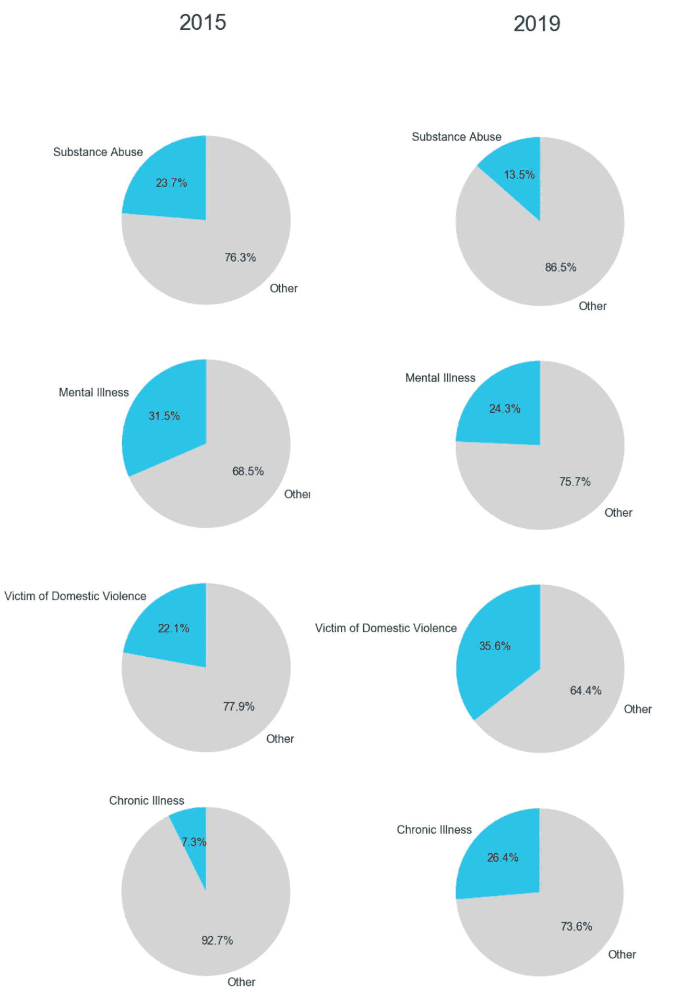
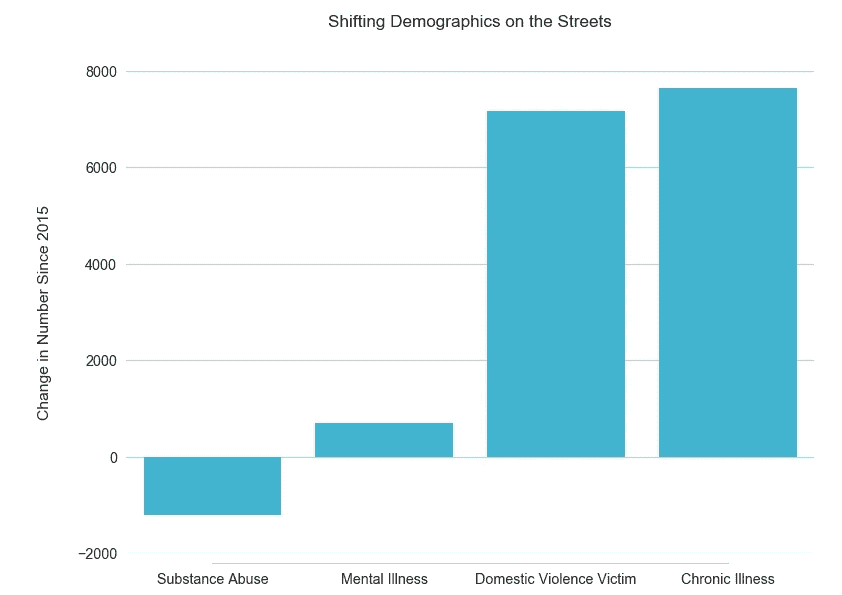

# 无家可归者的城市:洛杉矶街头的人道主义危机

> 原文：<https://towardsdatascience.com/the-city-of-the-homeless-humanitarian-crisis-on-the-streets-of-los-angeles-1bdbef345e6c?source=collection_archive---------16----------------------->

Credit: Jon Doe Forty ([https://flickr.com/photos/jondoeforty1/7477541122/in/album-72157630366754738/](https://flickr.com/photos/jondoeforty1/7477541122/in/album-72157630366754738/))

**城中之城**

这里的大多数人都会告诉你，天使之城是一座集多座城市于一身的城市。从韦斯特伍德到西亚当斯或从银湖到贫民窟，你会发现美国的缩影:140 个国家的美食、语言、文化和建筑，所有这些都来自同一个太阳，都来自洛杉矶。但是如果洛杉矶是许多城市中的一个，那并不意味着我们都生活在同一个*洛杉矶。这一事实在大都市区发展最快的城市之一——无家可归者之城——最为突出。*

按照加州的说法，无家可归者的城市不大不小。2019 年人口约 3.6 万，略大于比弗利山庄，略小于克莱尔蒙特。但是它正在经历人口激增:根据洛杉矶无家可归者服务机构的数据，洛杉矶无家可归者的数量在去年增长了 16%。作为一个参考，在洛杉矶 20 世纪 20 年代的人口激增期间，每年大约增长 8%。如果无家可归者的城市继续以这种速度增长，到 2021 年圣安娜到达时，超过 1%的洛杉矶人将无家可归。

Homeless population counts since 2015, as well as a projected value for 2020 based on simple linear regression. Source: LAHSA.

毫不夸张地说，这座无家可归者的城市正处于人道主义紧急状态。无家可归的人正在以创纪录的数量死去。LGBTQ+群体的成员和有色人种受到的影响更大，妇女也是如此——[她们中的许多人已经无家可归，而不是继续与虐待她们的配偶生活在一起。但是也许没有一个统计数据能像这样概括这种情况的严重性:如果无家可归者的城市是它自己的国家，它将是地球上预期寿命最低的国家:](https://www.downtownwomenscenter.org/violence-against-women/)

Source: CIA Factbook & USNews & World Report

关于谁露宿街头以及为什么帮助他们如此困难的主要说法是，无家可归的人都是吸毒者和/或严重的精神病患者。这种破坏性的叙述使无家可归的人失去人性，试图为无所作为辩护。但事实上这也是不正确的:根据最近的数据，无家可归者城市中大约 70%的人既没有严重的精神疾病，也没有物质滥用障碍。尽管**《洛杉矶时报》*最近[对这个数字](https://www.latimes.com/california/story/2019-10-07/homeless-population-mental-illness-disability)提出了质疑，但他们是通过篡改数据的方式做到这一点的，这种方式违背了合理的科学实践，我曾在其他地方[写过这方面的文章](https://medium.com/swlh/homelessness-when-data-doesnt-match-the-public-perception-9c28f79dfcf0)。*

*那么，这些数字是从哪里来的？自 2015 年以来，经历“慢性”无家可归的人数没有太大变化。退伍军人或脑外伤患者的数量也没有增加。一些最大的变化来自两个群体:(1)逃离家庭暴力的人和(2)患有慢性疾病的人。*

**

*Proportion of homeless population belonging to specific demographic groups in 2015 versus 2019\. Source: LAHSA*

*大量的人——主要是妇女——正在逃离暴力。显而易见的下一个问题是:最近家庭暴力/性暴力增加了吗？可惜，答案是肯定的。根据[司法统计局](https://www.bjs.gov/content/pub/pdf/cv18.pdf)和[加州司法部长办公室](http://www.laalmanac.com/crime/cr02.php)的数据，去年，洛杉矶县的强奸案发生率处于 1991 年以来的最高水平。在全国范围内，强奸、家庭暴力和亲密伴侣暴力的发生率在过去几年里都有所上升。这是为了将女性挤出稳定的住房。因为只有一小部分无家可归者的专用床位在女性收容所，一旦女性流落街头，她们的未来会迅速变得更加黑暗。*

**

*Source: LAHSA*

*除此之外，还有经济因素，比如越来越严重的经济适用房短缺。这造成了一种压力，大多数洛杉矶人都熟悉这种压力，这种压力由于 T2 越来越多地使用埃利斯法案驱逐租金受控制的租户而加剧。在医疗费用上涨和工资停滞的共同作用下，这种压力越来越迫使人们*不是陷入贫困，而是无家可归。这里有一个数据来支持这种说法:63%的人口第一次无家可归。他们中的大多数已经在这个地区生活了很多年。这些都不是陌生人；这些是你在杂货店、学校和镇上看到的人。**

*解决我们街道上的人道主义紧急情况有两种基本方法。一种方法是治标——换句话说，让无家可归的人回家。为了实现这一目标，该市正在努力将无家可归者安置在临时或永久性住房中。仅去年一年，就有近 22，000 人被安置在永久性住房中。这是一项英勇的成就，但显然还不够。展望未来，约有 1400 套公寓将在 2019 年至 2020 年间开放，总共约有 10，000 套正在筹备中。但这些数字不足以覆盖我们无家可归人口的逐年增长。*

*不幸的是，加快我们的建设承诺速度需要比许多城市政客所能忍受的更多的政治意愿:居民在他们的地区建造低收入或过渡性住房仍然非常不受欢迎，更不用说避难所了，原因包括认为这可能影响交通拥堵、房地产价值或当地安全。*

*解决我们的人道主义紧急情况的另一个方法是解决紧急情况的根源，这样人们就不会一开始就无家可归。我们不需要通过预测水晶球来理解这些根本原因。街上的人们已经告诉我们发生了什么:*

*他们在身体上和心理上都受到了如此严重的虐待，以至于他们认为自己在街上的机会更大。他们被房东和开发商赶出了自己的家园，他们正以创纪录的数量使用埃利斯法案将租户从租金控制的单元中驱逐出去。他们正被城市交通基础设施拖入经济困境，这些基础设施限制了他们获得经济和教育机会，使[变得危险，除了汽车 ***之外的任何手段都难以出行。随着生活费用和生病费用的增加，而工资却没有相应提高，他们在挣扎着维持生计。2019 年，这个城市的最低工资收入者将需要每周工作 79 小时才能买得起中等价位的一居室公寓。***](https://la.streetsblog.org/2019/10/29/vision-non-zero-the-human-and-financial-toll-of-los-angeles-dangerous-roads/)*

*简而言之，这些力量可能会形成一种恶性反馈循环，在这种循环中，处于边缘地位本身就会成为进一步边缘化的力量。*

*我们需要标本兼治。这样做需要大量的公众支持，重新定位我们如何看待无家可归者，并拒绝接受一个允许其居民生活在痛苦中并集体死去的城市。我们需要优先考虑洛杉矶人的生活，如果我们选出的官员没有做到这一点，我们需要追究他们的责任。*

*对于我们每个人来说，这最终可能是一个个人问题:尽管我们可能会遮住眼睛，但我们中的许多人距离自己流落街头只有一次医疗急救。这就是我们将会发现的:一个去年有 918 人死在公园长椅和人行道上的城市。仅在过去的几个月里，这座城市就有几个无家可归的人被活活烧死。*

*洛杉矶是一座罕见而美丽的城市。为了这座城市的灵魂，我们必须承认我们正面临一场真正的人道主义危机。我们必须明白，虽然我们可能不是点燃火柴的人，但由于我们的不作为，我们正在让我们的城市燃烧。*