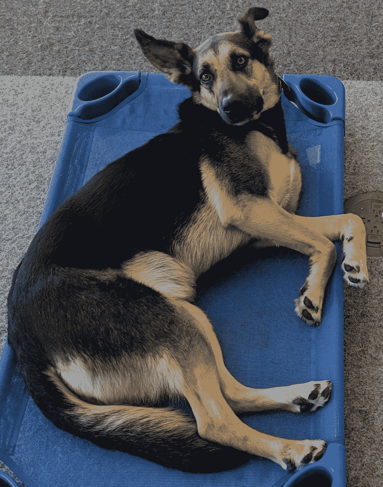
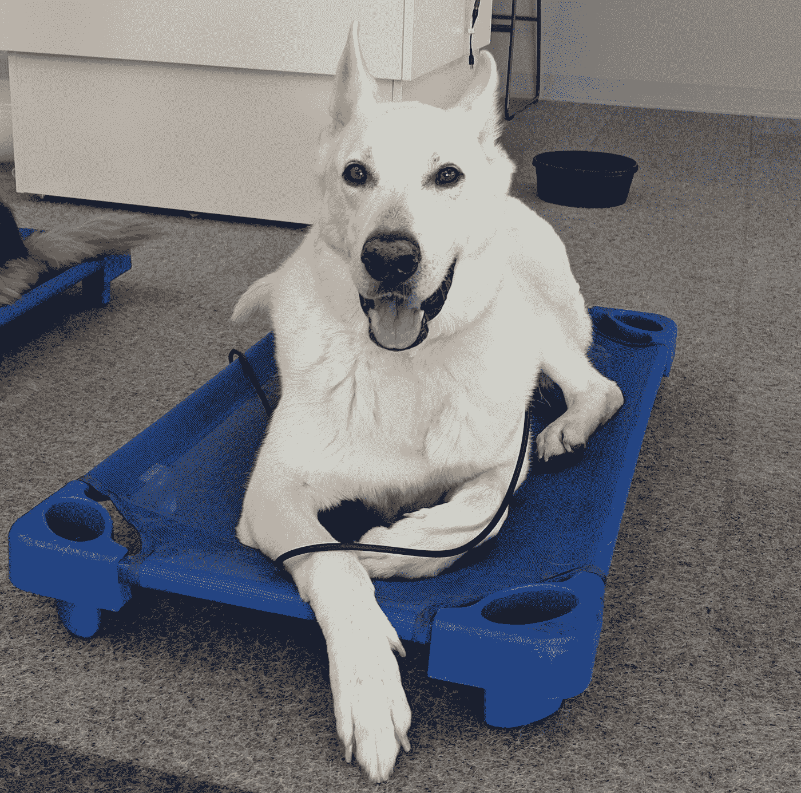
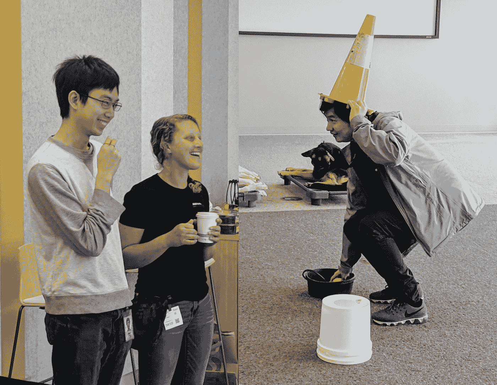

# 每个强化学习研究者应该上的课

> 原文：<https://towardsdatascience.com/the-class-every-reinforcement-learning-researcher-should-take-4a464bcd5586?source=collection_archive---------7----------------------->

## 什么训练狗可以教你关于 RL 的知识

我的团队刚刚花了一天时间和一些非常好的男孩和一些非常好的女孩在一起，都是以研究的名义。

One Very Good Girl, courtesy of [Dallas Hamilton](https://www.facebook.com/backtobalancek9/).

许多机器学习研究都声称从神经科学、心理学和儿童发展中获得灵感，宣扬希伯来人学习、好奇心驱动的探索或课程学习等概念，作为建筑设计或学习理论最新转折的理由——而且往往是一种后合理化。

这忽略了一个事实，即现代机器学习工具包既没有接近近似大脑神经生理学的基础，也没有甚至是小孩子的高水平意识或智力发展。

在对大脑神经结构的研究和对人类儿童的研究之间有一个有趣的中间地带，那就是观察动物的学习。关于简单生物体的实验已经写了很多，从[霉菌](https://www.quantamagazine.org/slime-molds-remember-but-do-they-learn-20180709/)到[昆虫](https://www.youtube.com/watch?v=TQeK3d83ybk)或[蝙蝠](https://www.michaelyartsev.com/research)。但这种研究通常仅限于“野外”学习，即环境以这种或那种方式施加压力，以引发特定的行为，而没有积极的教师干预。

> 然而，机器学习可以说更多的是设计一个更好的老师，而不是更好的学习者。

动物训练为这种情况增加了必要的附加层，动物思维能够引发非常复杂的行为，但受简单目标和动机(食物、游戏、友谊)的驱动，正在由具有数十年经验的人以有效、高效和可重复的方式引发正确的行为来塑造。与深度强化学习研究的相似之处很明显:与代理人交流奖励的渠道相对狭窄(主要是奖励和惩罚的变化范围)，复杂和模糊的输入，有能力但有点不透明的学习者，对呈现给它的任何激励都有反应的诀窍，要学习的复杂行为。也是我们希望尽可能提高效率的“老师”，他们的复杂性和独创性只受他们的想象力或对最佳部署策略的理解的限制。不可否认，当我们假设一只狗得到一份款待时，它的功能反应近似于一个服从反向传播的神经网络时，这种类比就显得太牵强了。

我第一次接触动物学习是在阅读《正确的东西》中关于早期太空计划中使用的黑猩猩的可怕故事。这本书(尽管如此，仍不失为一部精彩的读物)提出了这样一个案例:鉴于动物所处的极端条件，再多的积极奖励也无法弥补它们所承受的压力，所有的学习都是由消极奖励驱动的，即附在它们脚上的电动脚踏板。哼。

我们参加的班级当然没有这些，到处都是快乐的、可爱的、精力充沛的狗，它们对学习非常兴奋。因为这是今天的第一课:寻求奖励的行为和学习的品味，虽然在某种程度上是与生俱来的，通常由狗的个性决定，但也是首先要培养和发展的。行为和结果之间的联系是可以建立和加强的，随后的学习也是建立在这个基础上的。这个基本的构建模块基于经典的[巴甫洛夫反应](https://en.wikipedia.org/wiki/Classical_conditioning):获取一些原始的东西，比如对食物的渴望，并将其与一个人可以操纵的简单线索联系起来，比如使用响片或“乖孩子”作为替代奖励。利用与预期回报相关的多巴胺冲动是在输入和预期结果之间建立紧密耦合的关键因素。

One Very Good Boy, courtesy of [Michael Fraas](http://precisiondogsport.com/).

对于机器学习科学家来说，有趣的是，找到比真实奖励更灵活的代理奖励的问题会反复出现，如何确保系统在真实奖励和这些代理之间保持联系通常是一个真正的问题。这种代理奖励的另一个值得注意的用途是创造负面奖励，这种奖励本质上不是负面的(比如痛苦或不安)——我会回到这些。我发现有趣的是，这一阶段训练的一个关键因素是，这种多巴胺反应有一个促进迁移学习的关键属性:它与奖励本身无关，它与对奖励的*期望*有关。这使得即使在没有真正奖励的情况下，也可以替换代理人。此外，一个直接的后果是[多巴胺反应在回报最不确定的时候最强烈](https://www.youtube.com/watch?v=axrywDP9Ii0)。培训师利用这一知识，通过使奖励高度随机来放大奖励的效果:有时高，有时低，有时完全没有(我敢说[辍学](http://jmlr.org/papers/volume15/srivastava14a.old/srivastava14a.pdf)？).让受训者猜测是一种有效的方法，可以让他们保持寻求“完美”的渴望，从而获得最大的回报。

一旦建立了学习的渴望，很大程度上是为了引出有趣的行为，要么是狡猾的(挠狗的鼻子以刺激它，把它的爪子放在它身上，并从最初的奖励中“代理”出来，把它变成一个[“羞耻”的手势](https://www.petdoors.com/blog/teach-your-dog-to-cover-their-nose/))，要么是利用偶然的行为并奖励它们，就好像那些是最初的目标([后见之明经验回放](https://arxiv.org/abs/1707.01495)有人吗？).这种行为启发的一个关键方面是，一旦达到行为中的关键步骤，就给予你的受训者奖励，随后用较少的奖励让他们保持足够的参与，直到他们完美地重复它。这种奖励舞蹈很微妙，一点也不直观，但真正有趣的是，你可以通过简单地扮演狗和训练员的角色来练习它(不需要款待，只需要像响片或哨子这样的信号)。角色扮演是迄今为止培训中最有趣、最有启发性的部分，试图用语言表达你制定的让你的队友执行复杂任务并获得简单二元奖励的策略是不公平的。我建议你亲自体验一下。这基本上是一场[奖励塑造](https://people.eecs.berkeley.edu/~pabbeel/cs287-fa09/readings/NgHaradaRussell-shaping-ICML1999.pdf)的游戏。奖励形成的坏名声是非常具体的任务，因此很难变成强化学习的通用策略，但这次经历让我真正想到，我最终开发的策略并不是真正具体的任务，如果有正确的词汇，可以提炼为非常通用的规则，只要设置允许奖励可以访问代理的状态以及世界。这也让我相信，报酬的形成应该是动态的，并且取决于代理人的历史，而我并没有看到这种情况普遍发生。

[Alex Irpan](https://www.alexirpan.com/) and [Dallas Hamilton](https://www.facebook.com/backtobalancek9/) shaping [Jie Tan](http://www.jie-tan.net/)’s rewards.

培训的下一步是引入负面奖励。再说一次，“负面”体验只是代理的负面:一个产生嗡嗡电感的项圈被系在我们的手臂上，我们被告知认为它是“不好的”。同样，狗已经被训练通过一系列的练习将不满意与这种感觉联系起来，在这些练习中，只有在嗡嗡的感觉停止后才会给食物。负奖励的迷人之处在于，它们纯粹被培训师视为提高样本效率的一种方式，尽管他们当然不会以这种方式表达。引入负面奖励不会带来新的行为，只是通过缩小探索空间和抑制与手头任务无关的行为来加快学习。我们亲身经历了这一点:使用负面奖励来“引导”你的狗(或者，在我们的情况下，我们同事的代理狗)朝着正确的行为方向前进是非常诱人的，但我们很快发现，使用正面奖励和明智地修剪搜索空间，通过在代理偏离“有趣”的可能行动集时赶走它们，大部分引导是最好的。

或许从训狗中学到的东西还很多，而且大部分感觉就像那种只有亲身经历才能建立起来的直觉。对我来说，最直接的洞见是让我自己与奖励塑造相一致，并获得一些关于如何使它变得更加任务不可知的提示:也许这需要使塑造本身是动态的、有状态的，甚至可能是随机的。

对于一天的狗狗娱乐来说还不错。