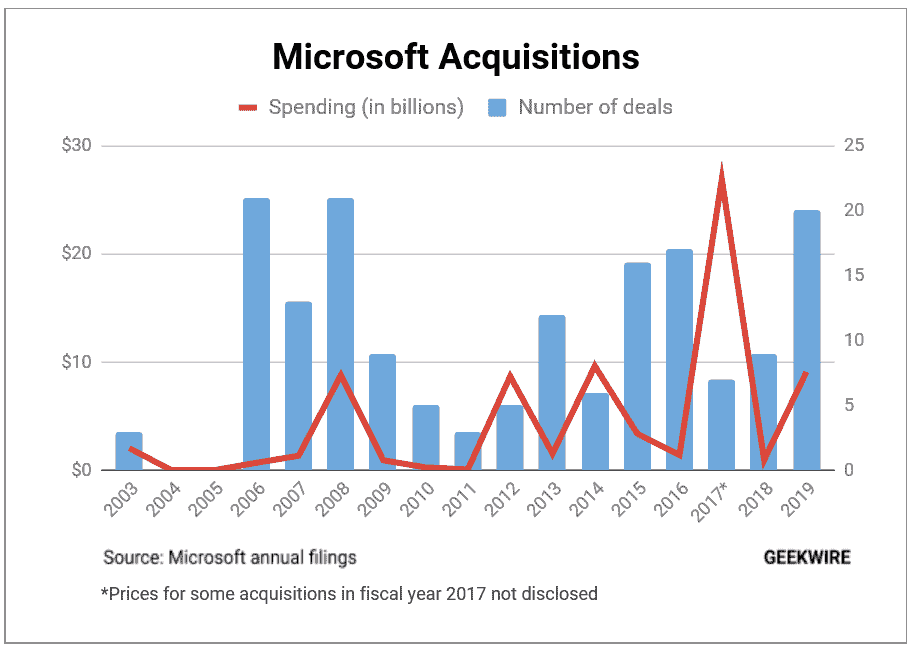
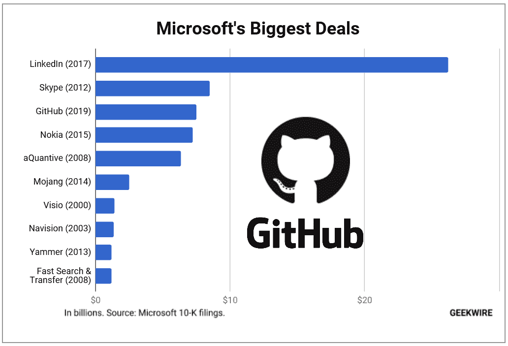
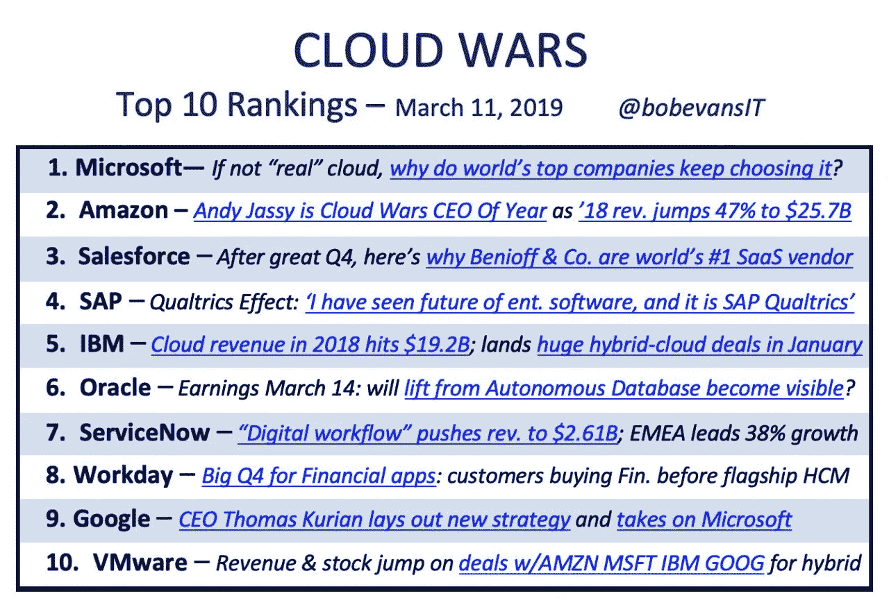
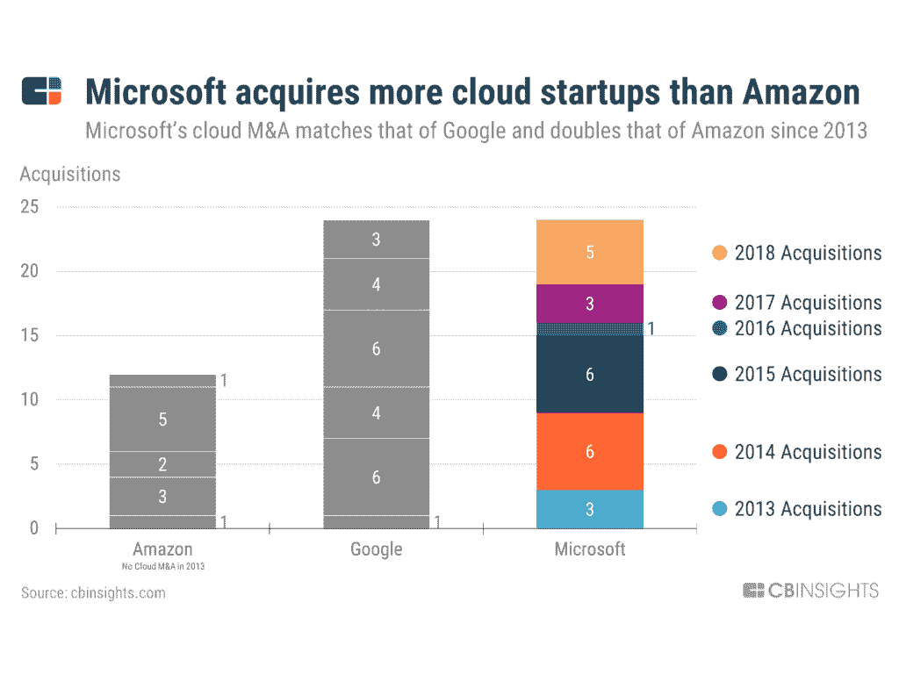
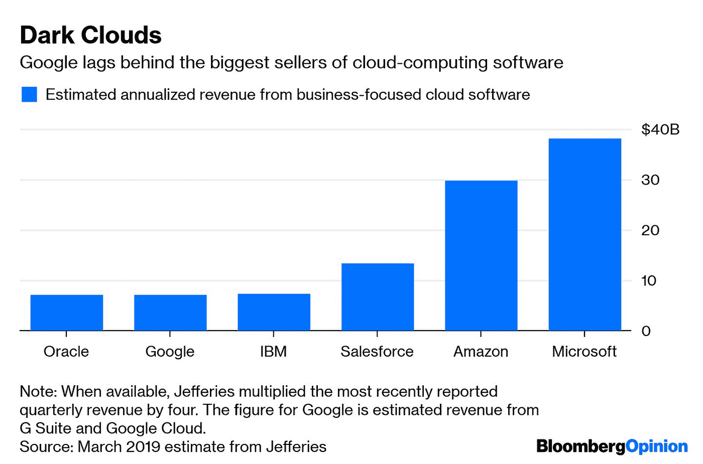
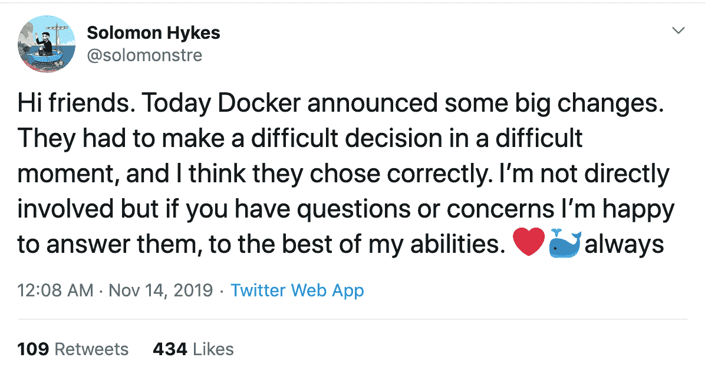

# 云收购玩法

> 原文：<https://towardsdatascience.com/the-cloud-acquisition-gameplay-9668bd0ea0a1?source=collection_archive---------26----------------------->

## 开发者们，是时候站出来前进了！

Image by Jonny Lindner from Pixabay

软件正在吞噬世界。随着软件开发领域发生的大量事情，是时候让软件驱动的公司承担起责任，在数字化转型的阶梯上前进了。DevOps 是当今的吸引力中心，每个公司都想拥抱它并向前发展。但是 DevOps 并不容易，传统公司有时会发现很难，而技术初创公司没有足够的资金来投资基础设施和所需的资源。

我们都同意云和 DevOps 与工具无关，但不知何故，当我们谈论当今的数字化转型时，工具成了焦点。今天的云公司正以这样或那样的方式影响着开发者的生活。就像 Jenkins 如何成为 DevOps 中 CI/CD 的实际工具一样，它有自己的社区，如果工具中有任何变化，开发者都会受到影响。

当采用新技术时，一些公司谨慎行事，而另一些公司则走出了他们的舒适区。并非所有公司都准备好接受云和 DevOps，但当他们这样做时，他们会保持对他们所相信的工具的信念和信任。最近的 DevOps 和云收购，如 Docker 被 Mirantis 收购，微软收购 GitHub，Travis CI 被 Idera 收购，都让开发者社区陷入混乱。

我们将在今天的文章中讨论这样的收购以及它们对开发者社区的影响。

# 云业务格局正在发生变化

云业务竞争更加激烈，每天都有更多的参与者涌现出来。客户有如此多的选择，但是评估合适的工具和技术变得越来越困难。随着人工智能、物联网、大数据等不断变化的技术进步，云公司的增长正成为一项挑战，而拥有所有能力的新公司给传统公司带来了困难。

## **近期云业务相关收购:**

*   **微软收购 GitHub**
*   ***米兰蒂斯收购 Docker***
*   ***IBM 收购 RedHat***
*   ***Salesforce 收购 Mulesoft***
*   ***VMware 收购 Pivotal 软件***
*   ***SAP 收购 CallidusCloud***
*   ***思科收购双安***

## 财富偏爱勇敢的人:微软

*   微软在 20 笔交易中花费了超过 91 亿美元，并以 GitHub 的轰动交易结束。

***来源演职员表:***[***geek wire***](https://www.geekwire.com/2019/microsofts-2019-acquisition-spree-20-deals-totaling-9-1b-led-blockbuster-github-buy/)

*   下图显示了微软迄今为止最大的几笔交易，

***来源演职员表:***[***geek wire***](https://www.geekwire.com/2018/heres-microsofts-github-acquisition-ranks-among-tech-giants-largest-deals/)

*   今天，微软也在云战争中领先，击败了所有其他主要参与者，如亚马逊、SAP、IBM 和谷歌。

**【cloudwars.co】**来源演员表:

*   *据 [CB Insights](https://www.cbinsights.com/research/report/microsoft-strategy-teardown/) 报道，微软已经收购了比亚马逊和谷歌更多的云初创公司，以丰富开发者社区。*

**

****来源演职员表:*** [***CB 洞见***](https://www.cbinsights.com/research/report/microsoft-strategy-teardown/)*

## ***所有的收购都不一样***

*这里要说的重要一点是，收购不一定意味着胜利。例如，尽管收购了如此多的技术公司，谷歌在云业务方面仍然落后于其竞争对手，如 AWS、微软和甲骨文。*

**

****来源演职员表:*** [***华盛顿邮报***](https://www.washingtonpost.com/business/google-cant-fix-its-cloud-with-acquisitions/2019/06/06/33909d14-8885-11e9-9d73-e2ba6bbf1b9b_story.html)*

*   *有些时候，当特定工具看起来不再工作时，最好将其关闭，这就是 ThoughtWorks 的 Snap CI 所发生的情况。据 ThoughtWorks 称，他们未能通过 Snap CI 对目标市场产生影响。他们说他们将继续关注咨询和另一个持续交付的产品， [Go CD](https://www.gocd.io/) 。现在，当品牌声誉面临风险时，放弃自己的产品/服务是一个明智的决定。用营销术语来说，这就是我们所说的[产品自相残杀](https://en.wikipedia.org/wiki/Cannibalization_(marketing))。*
*   *一个典型的收购失败的例子是，Idera 收购 Travis CI。希望你们都记得这一点，当 Idera 令人困惑地收购了软件行业著名的 CI 提供商之一 Travis CI 时，整个 DevOps 社区都疯了。Idera 本身由私人股本公司 TA Associates 拥有，除了获取尽可能多的利益并可能扼杀产品之外，别无他法。我在开发者社区看到了一些相关的文章/讨论。*

****下面一些有用的链接，****

 *[## Idera 收购 Travis CI 黑客新闻

### 我不认为特拉维斯在这方面，虽然在过去的几个月里，我开始看到循环 CI 徽章在这里弹出…

news.ycombinator.com](https://news.ycombinator.com/item?id=18978251)* * [## 注册会计师特拉维斯. CI。

### Travis CI，持续集成(CI)工具，是我们每天、每小时甚至每分钟例行工作的一部分…

medium.com](https://medium.com/@dirk.avery/r-i-p-travis-ci-347753c73775) 

由于这次收购，你知道接下来发生了什么，Idera 的所有者解雇了大部分工程师，包括一些高级管理人员。

*   [Business Insider](https://www.businessinsider.in/tech/enterprise/news/dell-owned-pivotal-is-preparing-for-as-many-as-150-layoffs-ahead-of-its-2-7-billion-acquisition-by-vmware-and-employees-are-openly-protesting-management-over-it/articleshow/72079944.cms) 报道称，在被 VMware 以 27 亿美元收购之前，Pivotal 正准备裁员，这引发了 Pivotal 员工的内部抗议，随后引发了公众抗议。根据该报告，员工开始传阅一封公开信，要求 VMware 和 Pivotal 领导层保留工作场所运营团队。
*   最近的一次收购是 [Sonatype 被私募股权公司 Vista Equity Partners](https://techcrunch.com/2019/11/18/sonatype-acquired/) 收购，就像 Travis CI 一样，收购后没有任何证据。从历史上看，一些私募股权公司的此类收购说明了一件事，产品/服务的质量，客户支持的水平，以及作为一个整体，公司在未来一年将不会是一样的。

此外，你可能已经看到这些私募股权公司在收购你的企业后会做什么，首先，他们会解雇现有的管理层，因为公司的目标发生了变化。然后，随着管理层的更替，整个战略业务方法也发生了变化；他们的目标是尽可能地摆脱现有的品牌和业务。

阅读下面这篇精彩的文章，

 [## 私募股权公司收购你的公司后会做的 6 件事

### 它们不是你必须做的事情。在今天的市场上，如果你打算卖掉你的公司…

www.inc.com](https://www.inc.com/jim-schleckser/the-6-things-a-private-equity-firm-will-do-after-they-buy-your-business.html) 

*   [IBM 收购 RedHat](https://www.cnbc.com/2019/07/09/ibm-closes-its-34-billion-acquisition-of-red-hat.html) 是一笔成功的交易；对他们来说，这次收购就像是试图控制一个企业的云生态系统的每一部分。这笔交易将使 IBM 进入混合云环境领域。在大多数专家看来，IBM 作为一家几十年来增长缓慢的公司，这是一个大胆而聪明的举动。关于为什么这是一个好的举措的详细解释可以在 YouTube 上找到， [IBM +红帽:这次云收购是赢家吗？](https://www.youtube.com/watch?v=W-b4K9GoF3c)'
*   从商业角度来看，CloudBees 收购 ElectricCloud 更有意义，这清楚地描绘了健康的协同效应。来自单一供应商的 CI/CD(持续集成&持续交付)在 DevOps 领域是一件好事。

CloudBees 在持续交付方面很有名，Jenkins automation platform 和 Electric Cloud 在应用程序发布自动化方面也很有名，所以这种协同作用非常明显，看起来很好。

*   [Docker 被 Mirantis 收购](https://techcrunch.com/2019/11/13/mirantis-acquires-docker-enterprise/)对开发者社区影响很大。Docker 给了集装箱化的概念一个新的含义，这让他们在 Docker 周围有了一个很大的社区。但是 Docker 面临的问题是赚不到足够的钱，这使得他们的业务增长停滞不前，他们不得不退出。他们的下一个选择是继续前进，成为已经在 Kubernetes 空间做得很好的人的一部分。Mirantis 帮助公司轻松运行 Kubernetes 和 OpenStack，Docker 的加入无疑是云原生领域的一个增强。但它也得出结论，Docker 将不再是 Docker，它出售了 Docker Trusted Registry，因此像所有收购一样，战略业务目标将发生变化，这也可能影响一些微服务开发者。
*   战略商业决策是通过 Docker Swarm 赚钱，但你知道接下来发生了什么。Kubernetes 接管并吃掉了几乎所有的市场份额，Docker 开始调整并推广 Kubernetes，然后， [Docker 因为没有赚到足够的钱而陷入困境](https://www.zdnet.com/article/docker-is-in-deep-trouble/)。

Docker 的联合创始人所罗门·海克斯(Solomon Hykes)在推特上表示，这对 Docker 来说是一个困难的时期，这是一个好的举措。

***来源演职员表:*** [***所罗门·海克斯推文***](https://twitter.com/solomonstre/status/1194686023931875329)

# 谁受影响最大？

## 开发商！！！

组织中的开发人员要对围绕技术栈和工具发生的大多数决策负责，因为他们是使用它们来改善公司的人。最糟糕的是，一些软件驱动的公司在为公司选择技术或技术流程时甚至不考虑开发人员的投票，这就是事情开始错位的地方。那就是责备游戏开始的时候；公司开始责怪开发者，反之亦然。

当一个新的工具或平台进入市场时，它要么被社区很好地接受，要么被拒绝。举个例子，Docker Swarm 它产生了巨大的影响，因为 Docker 已经有了一个社区，这对 Docker Swarm 的采用产生了巨大的影响，直到社区看到了 Kubernetes。Docker Swarm 对需要更多工作负载和编排的大公司没有太大影响，因此很快，Kubernetes 取代了 Docker Swarm，成为事实上的容器编排工具。但与 Docker Swarm 相比，Kubernetes 有着陡峭的学习曲线和复杂的设置。

当像 Docker 这样的公司被收购时，非常熟悉该工具的社区会受到影响，因为开发人员将无法确定公司的未来。反过来，它会影响使用这些技术的公司。Docker Swarm 已经被大多数公司所取代，整个开发者社区都在学习并有兴趣知道如何有效地使用 Kubernetes。

因此，当收购与社区不一致时，开发者会受到影响。随着他(开发人员)很久以前熟悉的工具和平台最终落入不同的人手中，生产力和士气下降。

# 是向前跃进的时候了

是时候授权给开发者社区了，是时候承担责任了，站出来[开发者需要采取行动](https://step-up.jfrog.com/):)

我们这里不是在谈论一些成功的收购；相反，我们谈论的是那些将对开发者社区产生不利影响的问题，就像 Travis CI 被 Idera 收购，Idera 本身由一家私募股权公司所有，以及类似的 Sonatype 收购。软件领域的任何人都可以很容易地猜测这是什么类型的收购，以及当这些被收购的公司被私募股权公司收购时，它们的未来会如何。如前所述，当这样的云公司被任何私募股权公司收购时，他们失去了所有的声誉，解雇了老员工，榨取了所有通过利用品牌剩下的钱。(例如:Travis CI)

无论如何，开发者社区应该发展并繁荣到新的高度。是时候让开发人员成为公司内部战略工程决策的一部分了，他们需要提出他们对整个公司长远利益的看法。

## **是时候采取行动了:)***