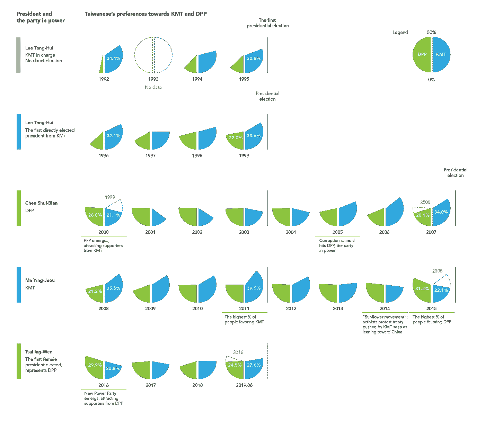
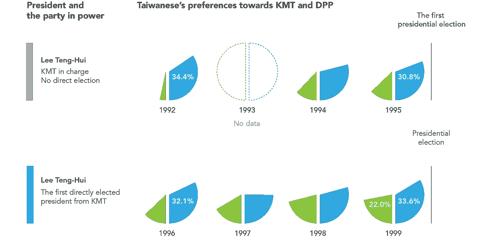
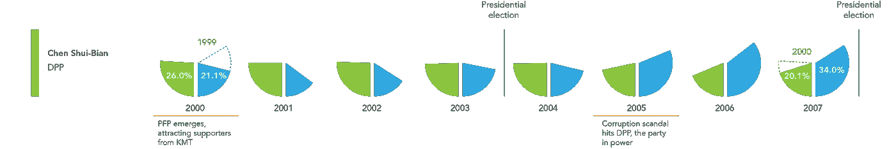
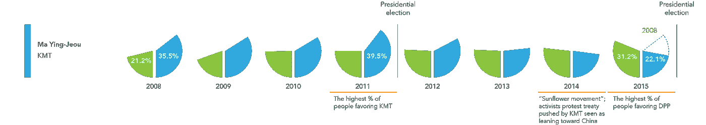
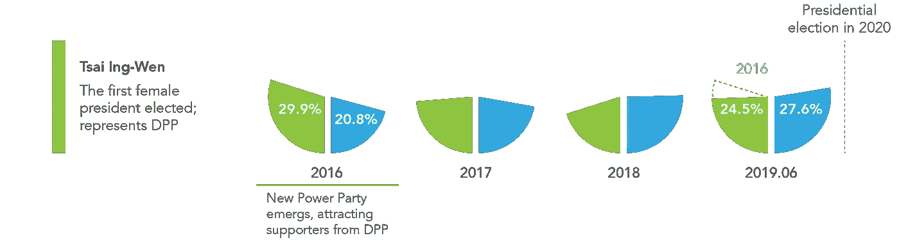

# 台湾的政治色彩

> 原文：<https://towardsdatascience.com/the-colors-of-politics-in-taiwan-9b05cc2be0a8?source=collection_archive---------21----------------------->

## 两个主要政党之间的斗争

在亚洲国家中，台湾拥有[最开放的公民空间](https://monitor.civicus.org/?fbclid=IwAR004gc8yP-IsHIR_3tGcCSrpSzM4BYQA64S8p_GsEQJhckEWahMEqV1RZU)。它被认为是一个进步的国家。台湾民众能够毫无畏惧地批评总统，台湾民众在 2016 年选出了他们的第一位女总统，台湾国会(立法院)在 5 月通过了同性婚姻法。然而，台湾的民主历史相对较短。

自 1948 年以来，台湾的政治主要由中国国民党控制。总统是该党的领袖。1996 年台湾人民第一次选举了台湾总统。从台湾人第一次投票选举总统到现在才 23 年。

在第一次总统选举后，另一个政党——民进党出现了。届时，台湾的政治分为蓝绿两种颜色。蓝色代表国民党，绿色代表民进党。国民党倾向中华人民共和国，而民进党不。

国立程池大学选举研究中心[发布的电话调查数据](https://esc.nccu.edu.tw/course/news.php?Sn=165)揭示了 1992 年 6 月至 2019 年 6 月间台湾人的政党偏好。国民党和民进党一直主导着台湾的政治，但根据数据显示，他们都没有赢得超过 50%的政党支持。

下面的数据聚焦于国民党和民进党从 1992 年至今的兴衰。可视化不包括其他政党和持独立立场和无回应的人的数据。

Data analysis and visualization by Shing-Yun Chiang

可视化显示了国民党和民进党获得和失去支持的时间。

# 国民党主席李登辉

在李明博总统的第一任期，民进党只是合并，没有总统直选。国民党在台湾拥有稳定且较高的支持率并不令人意外。该图表还显示，在第一次总统直选后，支持民进党的比例稳步上升。

# 陈水扁总统，民进党

民进党的陈水扁当选代表了台湾的一个里程碑——他是自 1948 年以来第一位非国民党的总统。当国民党的支持率从 33.6%下降到 21.1%时，民进党赢得了选举。造成下降的因素之一是亲民党的出现，该党在 2000 年获得了 9.1%的支持率。亲民党和国民党持有政治立场。

民进党的喜好度在陈第一任期间稳定，第二任期间明显下降。民进党的一系列丑闻导致偏好转向国民党。民进党的失败也导致了才真旺姆在 2008 年的选举。

# 国民党才真旺姆九主席

调查显示，2008 年，国民党以 35.5%的支持率重新执政。到马第一届任期的最后一年，失业率达到 39.5%的峰值。马英九在 2012 年再次当选，但在第二届任期结束时，支持率下滑了 17.4 个百分点。

在马英九的第二个总统任期内，学生领导的“太阳花运动”于 2014 年爆发。活动人士占领了立法院，抗议《海峡两岸服务贸易协议》未经逐条审查就获得通过。这场学生运动并没有直接导致国民党支持率的下降，但却帮助民进党在第二年达到了最高的 31.2%的支持率。

# 民进党主席蔡英文

2015 年，选举前一年，政坛几个后起之秀组织了新力量党，吸引了民进党的人支持。然而，民进党仍然赢得了这场比赛。但该党在从劳工政策到同性婚姻立法缓慢实施等一系列问题上失去了支持。蔡英文当选后，民进党的支持率立即下降，而前几任总统在第一任期内的支持率保持稳定。

为了挽回支持率并赢得下一届任期的选举，民进党推动通过了蔡英文承诺的同性婚姻立法。民进党的支持率在 2019 年略有上升，但国民党正在迎头赶上。

随着最近香港的抗议活动，民进党可能会赢得更多人的支持。随着 2020 年 1 月的选举，民进党和韩国国民党之间的竞争目前似乎难分胜负。由于复杂的国际和国内事务，台湾是否会成为(政治上的)蓝岛或绿岛还不清楚。