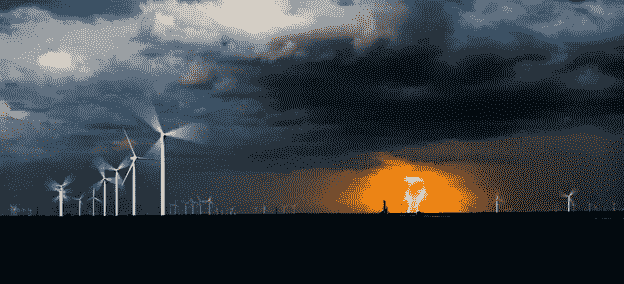
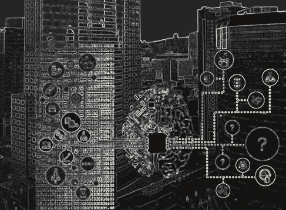
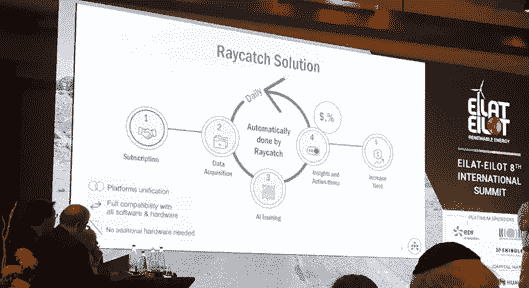
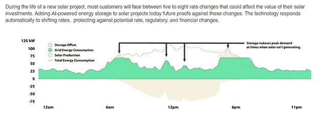
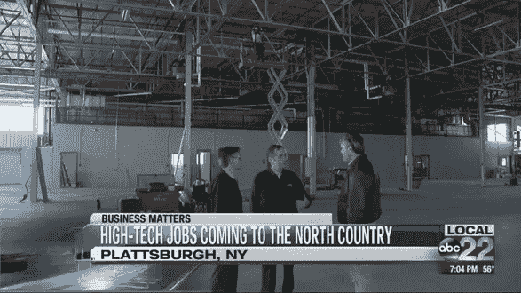
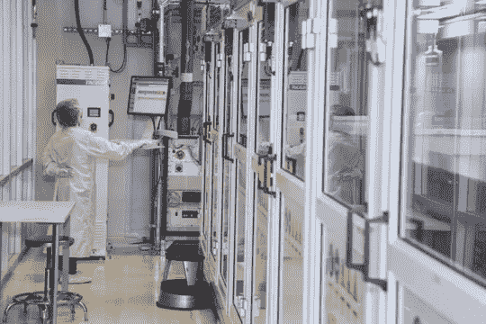

# 组合效应对抗蝴蝶效应

> 原文：<https://towardsdatascience.com/the-combo-effect-against-the-butterfly-effect-bf7dd7a507a0?source=collection_archive---------10----------------------->

## 人工智能促进能量存储，这将提高可再生能源生产的弹性和效率

Photo by [Cassie Boca](https://unsplash.com/photos/y_EsP2gbocQ?utm_source=unsplash&utm_medium=referral&utm_content=creditCopyText) on [Unsplash](https://unsplash.com/collections/137515/renewable-energy?utm_source=unsplash&utm_medium=referral&utm_content=creditCopyText)

在混沌理论中，蝴蝶效应是对初始条件的敏感依赖，其中一个状态(确定性非线性系统)的小变化会导致后面状态的大差异。截至今天，我们已经在地球上送来了成吨的“蝴蝶”，无论是我们发电或运输的二氧化碳排放，无论是在粗放(或过度)的农业生产面前正在消失的森林，还是从永久冻土中融化出来的甲烷或在海洋中分解的塑料“岛”。对于“非气候学家”来说，2 或 3 度可能看起来不大，但全球气温如此变化的影响将远远大于我们迄今所见。去年我们已经了解到，在气候变化加速到看起来像蝴蝶效应的所谓后期状态之前，我们还有大约十几年的时间。

无论你是否理解超强飓风、创纪录的炎热夏季和消失的冰川是不是气候变化的结果，你都不能反对清理地球，尤其是如果这样做有好处的话。

我们肯定需要找到方法来对抗这种“指数级”倍增效应。

# 组合效应

我们可以从游戏玩家的连击效果(圣歌、弥撒效果、暴风雪的炉石等)中得到启发。)或者吉他弹奏者确实知道并在许多环境中使用。比如《圣歌》中，“连击系统创造了一种动态的伤害敌人的方式。通过将某些能力相互结合使用，你可以创造一种组合攻击，对你的对手造成疯狂的伤害。”通过连续使用两种或两种以上的“异能”,每种异能的组合效果可以产生极大的增强效果。同样的“组合方法”也在吉他世界中使用，以产生特殊或疯狂的效果。

[https://www.gamerevolution.com/guides/500475-best-anthem-combos-what-are-primers-detonators](https://www.gamerevolution.com/guides/500475-best-anthem-combos-what-are-primers-detonators)

我坚信科学技术的力量不仅可以理解，而且可以解决人类面临的最大挑战。这就是为什么我建议我们使用科学版的组合效应，将主要的解决方案结合起来，对形势做出强有力的反应。这里的挑战(我们可以说是我们的对手)是我们需要在短时间内“疯狂”减少的二氧化碳排放量。这不仅仅是一个温和的减少，这显然是一个加强或促进的效果。事实上，这不是唯一需要的解决方案。但在一个“指数级”对手面前，它真的可以成为一个高效的对手。

让我们专注于建设性的东西，以及如何利用人工智能和能量存储的组合效应来改善可再生能源(RE)的影响。因此，对已经超过“不太清洁”能源的可再生能源的投资是显而易见的，因为综合效应推动的可再生能源可能变得更加经济合理，也因为这可能成为对抗气候变化的主要倡导者之一。

# 可再生能源的强大基础

继 2019 年可再生能源行业展望之后，有“三个有利趋势支撑的强劲基本面”。这些趋势包括支持可再生能源增长的新兴政策、扩大投资者对该领域的兴趣，以及提高风能和太阳能对电网、资产所有者和客户价值的技术进步。或许最重要的是，大多数细分市场的强劲需求。公用事业表现出强劲的“自愿需求”(52%的公用事业规模的太阳能项目在开发中，73%的项目在 2018 年上半年宣布，而不是我们过去看到的政策命令推动的需求)。2017 年，仅新的太阳能项目就占了 157 千兆瓦，[是](https://www.independent.co.uk/environment/solar-energy-world-investment-higher-coal-gas-nuclear-combined-2017-un-report-a8290051.html)煤、天然气和核能的两倍多。2018 年，企业对可再生能源快速增长的需求在一定程度上推动了自愿需求。

落基山研究所的一项研究表明，他们通过各种采购途径(【http://ow.ly/XCrP50r1Ha3】T4)购买了近 6.5 千兆瓦(GW)的可再生能源。

拯救地球从未如此有利可图；这是该行业成熟的又一标志。因此，话题现在转向了人工智能和能量存储如何改善可再生能源。事实上，工具的组合，组合效应，可以带来实质性的改进。这就是为什么我们不仅需要一套工具，还需要有效地集成它。

# 人工智能提高能源效率

在之前的一篇文章中，我们已经看到了一些关于人工智能和能量存储(通过智能能量存储或 IES)可能提高能源效率的可能方式的暗示:[https://towards data science . com/artificial-intelligence-in-a-no-choice-but-to-get-it-smart-Energy-industry-1bd 1396 a87 f 8](/artificial-intelligence-in-a-no-choice-but-to-get-it-smart-energy-industry-1bd1396a87f8)。在处理来自数十或数百个传感器的数据后，许多工具可用于人工智能和能量存储，以提高建筑物的能源效率。通过物联网(IoT)和人工智能，建筑物的能效可以得到大幅提高。物联网本质上是智能设备、建筑和其他物品与电子设备的联网，实现数据的收集和交换。事实证明，正确使用物联网可以提高能效。“事物”可以是简单的传感器(例如房间中的温度传感器)、更复杂的传感器(例如电功率测量设备)、致动器(例如 HVAC 房间控制器、电机)或复杂的设备(例如工业断路器、提供家庭、建筑或工业自动化的 PLC)。

Photo by [Zach Meaney](https://unsplash.com/photos/XQdcBNRM8IY?utm_source=unsplash&utm_medium=referral&utm_content=creditCopyText) on [Unsplash](https://unsplash.com/collections/4677821/smart-communities?utm_source=unsplash&utm_medium=referral&utm_content=creditCopyText)

物联网应用的范围可能从简单的监控应用(如测量建筑物内的温度)到复杂的应用(如提供完整的校园能源自动化)。只有当它变得复杂时，人工智能才能产生重大影响。只有当电力负荷和峰值相当大时，能量存储才是重要资产。那么，与物联网融合的 AI 和储能对能效有什么影响呢？都是关于数据的。

没错，物联网——连接到互联网的设备以及它们之间的网络——已经带来了(并将继续带来)海量数据。越来越多的大量信息在系统内更快、更独立地流通，从而更容易优化资源。怎么会？生产工厂内持续的数据流能够持续监控能源消耗。此外，在物联网互联系统中，借助人工智能，识别任何问题并在过度浪费发生之前进行干预变得更加容易，借助储能，我们可以控制何时对负载变化做出反应。更不用说减少维护时间了。

在大型建筑和制造业中，物联网和能效之间的联系是成正比的，投资物联网解决方案和能效变得至关重要。事实上，智能工程与物联网的结合有望降低智能建筑的公共事业账单，或者通过在工业规模的问题发生之前(如太阳能发电场停工或风力涡轮机故障)进行预测来节省成本。

从更大的角度来看，人工智能可能是小型(设施规模)或大型(社区或地区规模)智能电网背后的大脑，它将接受数千或数百万传感器的输入，以实时决定将能源资源分配到哪里。节能算法的一个非常著名的例子涉及谷歌，它使用由 DeepMind 开发的人工智能来阻止其世界各地的数据中心过热。科技巨头[将其数据中心的能源管理](https://www.forbes.com/sites/samshead/2018/08/18/google-trusts-deepmind-ai-to-manage-data-centre-cooling/#782b1a9068bd)移交给人工智能，人工智能在 2016 年首次帮助降低冷却所有计算机服务器的能耗。

# 人工智能将改善可再生能源运营

风能和太阳能提供了特别丰富的数据集，算法可以咀嚼这些数据集，以提供对当前问题的见解，预测可能出现的问题，改善能量存储或确定下一个大型太阳能发电场的最佳布局。

先说一些低挂的果子，比如怎么样。举个例子， [Raycatch](https://raycatch.com/) ，特拉维夫 2015 年的初创公司(已经筹集了**730 万美元**)正在开发可以诊断问题和优化太阳能电站运营的算法。Raycatch 提供了一种“基于人工智能的诊断和优化解决方案”，它可以将太阳能发电厂产生的所有数据转化为日常的实时行动计划，而无需安装任何额外的硬件。它甚至会计算其建议改进的投资回报率，并根据预测模型分析实际性能。

Raycatch’s AI platform can analyze potential improvements and predict the ROI of solar energy plants. Credit: Raycatch

# 人工智能设计可再生能源系统

考虑到设计一个太阳能发电厂不仅仅是看太阳能电池板的数量和它们朝向我们巨大的恒星太阳的方向。据我们所知，今天的大部分设计工作仍然是手工完成的，由来自各种专业的不同工程师组成的队伍——结构、电气等。—通常需要几个月的时间来为大型商业项目制定最佳布局。为什么不让 AI 以更快更全面的方式来做呢？这是 2013 年成立的洛杉矶高科技初创企业背后的商业理念: [HST Solar](http://www.hstsolar.com/) 。[福布斯](https://www.forbes.com/sites/peterdetwiler/2015/06/22/hst-solar-brings-high-powered-computing-to-solar-design/#59ca2d4a1eda)采访了这位联合创始人，了解更多细节。

人工智能平台在这里是如何开发的:在用户输入基本信息后，如站点位置和要安装的设备的详细信息，算法开始工作。该软件然后配置太阳能发电场拼图的每一块，下至每个太阳能电池板的特定方向和倾斜，以最大限度地增加能量，同时最大限度地减少强风等其他因素带来的问题。HST Solar 拥有这样一个平台，其专有软件可以在几个小时甚至几分钟内扫描任何潜在网站的数亿个可能的设计。目标是确定哪些设计将产生最高的投资回报和最低的太阳能发电成本。

[https://cleantechnica.com/2017/03/13/hst-solar-promotes-cost-reductions-advanced-technology/](https://cleantechnica.com/2017/03/13/hst-solar-promotes-cost-reductions-advanced-technology/)

HST Solar 的人工智能可以识别大多数人工工程师经常忽略的设计。其分析可以使项目更有利可图，并有助于吸引投资者的资本。在新兴和发展中市场，这种方法可以确保私人和政府对太阳能的投资最大化。该公司声称，与那些即将失业的工程师设计的系统相比，人工智能设计的太阳能农场可以将生产可再生能源的成本降低 10%至 20%。使用这种人工智能平台等工具可以帮助太阳能行业从目前每年 70 多千兆瓦的新安装太阳能增加到 2030 年世界每年需要的 1000 千兆瓦的水平，以便以有意义的方式应对气候变化。

# 可再生能源的人工智能天气预报

可再生能源，尤其是太阳能和风能，显然依赖于天气。正确的设计和操作依赖于准确的预测，如果这是人工智能驱动的太阳能/风能和储能计算的一部分，那就更重要了。但是，除了获得天气预报，获得能源预报不是更好吗？这就是总部位于巴塞罗纳的西班牙初创企业 [Nnergix](https://www.nnergix.com/) 背后的理念，这家成立 6 年的公司已经筹集了约**170 万**美元的公开融资。Nnergix 所做的是使用天气数据技术和机器学习来进行能源预测。它最近推出了一款名为 [Sentinel Weather](https://sentinel-weather.com/) 的产品，可以进行“天气分析”，并提供地球上任何地方的历史数据和天气预报。能源工程师将对该平台以 15 分钟的分辨率对单个工厂的太阳能和风能进行长达 18 小时的预测特别感兴趣。一周内每小时的电力预测是可能的。

# 用于可再生能源存储的人工智能

在可再生能源方面提到的另一个新兴趋势是从一开始就将太阳能和储能结合起来，这有助于为太阳能供应商和用户节省成本。太阳能项目可能成本高昂，尤其是考虑到政府对可再生能源投资补贴的波动性(甚至取消)。对冲价格波动的一种方法是有效储存能源，尤其是在低利率下，并在能源价格飙升时加以利用。 [Stem](https://www.stem.com/) 是一家夹在旧金山和硅谷之间的初创公司，它创建了一个名为 Athena 的人工智能平台，称它可以从包括太阳能在内的储能中获得最大价值。该公司成立于 2009 年，已经获得了 3.211 亿美元的巨额**。**

**Saving money with smart energy storage. Credit: Stem**

该公司表示， [Athena](https://www.stem.com/athena/) 可以“通过自动化、实时的能源优化，给予客户更大的能源决策控制权和灵活性”，从而让客户的太阳能投资“经得起未来考验”根据《另类能源》杂志的采访，雅典娜每秒钟吸收大量数据，从太阳能发电和负载行为到电费，甚至天气预报。然后，算法开始发挥作用，从能量存储中榨取价值，甚至创造出发电厂的虚拟网络，可以基于最有利的经济效益发送或存储电力。虽然该公司承认，增加太阳能存储可能会使系统成本增加 20%，但这些成本应该可以通过智能存储解决方案节省的 30%来抵消。

# 热电容量混合调节策略

利用这种联合/合作方法以及他们在车辆混合储能方面的工作， [Smart Phases (DBA Novacab)](http://www.novacab.com/) 开发了混合热能和电能储存系统。

该系统的控制是基于使用模糊逻辑和组合前馈加反馈控制的预期调节策略，其可以同时处理电能和太阳能的存储和回收。人工智能需要充分发挥这种方法的潜力。它考虑了多种运行条件，如负载、外部空气温度，并优化了电加热的关闭和开启时段。无论何时出现波动或干扰，该组合策略都可以显著改善简单反馈控制的性能。电能储存(EES)和热能储存(TES)已被整合为一种混合方法，以优化能源效率和负载均衡。这种集成使得医院、数据中心、军事、制造工厂和其他关键热电需求侧管理等关键应用的运行得到显著改善和稳定。

[Novacab 混合热能&电能储存系统](https://novacab.com/technology)最大限度地提高了电网设备的灵活性和整体性能。在建筑设置中，它可以提高性能和操作的可靠性。概括地说，对电网的影响也是巨大的:平滑负荷曲线和优化需求侧管理；提高能量分布的冗余度和可预测性。EESAT 会议之后，[能源部桑迪亚实验室发表的一篇论文强调了混合系统的集成和组合成果，包括现场运行数据、电力使用效率、可靠性和性能。这种“预测性”方法不仅可以更好地利用储能，还可以更好地整合 EES 和 TES，以最大限度地提高运行灵活性和稳定性、运行性能改善、需求侧管理的可预测性和运行可靠性。](http://bit.ly/2UZKhqb)

Smart Phases (DBA Novacab) new manufacturing facility for its Hyber Energy Storage technology. Credit: Novacab; *N.B. For full disclosure, I want to outline that I’m personally involved in this, but I’m thrilled to talk about this other option since it is very relevant to the main topic of this article.* [*Linkedin-Novacab-This plant will be equipped with hybrid energy storage*](http://bit.ly/2L4ovwV)

# R&D 可再生能源协会

正如所讨论的，人工智能越来越多地参与设计可再生能源和能源存储系统，分析它们的性能，以及预测未来的生产和存储需求。一些公司从一开始就在研发阶段利用机器学习，这是我们在其他研究和人工智能领域看到的趋势。

总部位于硅谷的 SunPower 公司最近建造了一个新的太阳能研究设施。这个价值 2500 万美元的新工厂的关键工具之一是对光伏电池制造过程的质量控制。人工智能用于分析过程，不仅确保产品质量，还提供新的[见解](https://us.sunpower.com/blog/2017/08/13/learn-about-new-silicon-valley-solar-facility/)以随着时间的推移改进技术。顺便提一下，SunPower 正在拥抱各种新兴技术，包括使用无人机调查潜在的太阳能发电场，以创造更有效的设计。工程师也可能在那里使用机器学习。

SunPower’s new research facility employs AI to analyze and develop its solar cell technology. Credit: SunPower

最后，西雅图一家名为 [Energsoft](https://energsoft.com/) 的小型初创公司已经通过公开融资筹集了大约**17 万美元**，该公司使用人工智能为可再生能源客户制造更好的电池，特别是为电动汽车和公用事业公司。该公司的人工智能平台可以自动收集数据，并识别设计问题，如材料选择甚至制造过程。Energsoft 成立于去年，它表示自己的软件可以降低开发成本，缩短上市时间。

可再生能源部门的长期可行性需要经济可扩展性，这意味着能够建设比非可再生能源更高效、更廉价的巨大能源系统。因此，人工智能加速的 R&D 将被要求在对抗气候变化的斗争中保持步伐。

# 结论

回到我们最初的想法，我们可以充满冲动或能力用组合效果来做所有这些。人工智能、储能和可再生能源的巧妙结合，似乎是新兴技术与成熟行业——能源行业——的完美结合。

这就是为什么我建议使用“工程”版本的组合效应，将主要解决方案结合起来，对我们需要在短时间内“疯狂”减少的全球挑战(蝴蝶般激增的二氧化碳排放和未来的风暴)做出强有力的回应。

通过将人工智能、物联网、能量储存的能力相互结合使用，我们可以创造出一个“有动力”的组合，从而大大提高可再生能源的利用率。这样，我们将最大限度地增加应对人类最大挑战——气候变化的机会，并在此过程中为精明的利益相关者创造一点财富。

在我们开始生产廉价、无限的核聚变能源之前(那对于解决紧迫的气候变化问题来说就太晚了)，我们需要找到节约资源的方法，让可再生能源系统的制造、安装和运行更加便宜、高效。人工智能驱动的 IES 解决方案在可再生能源供应链的许多方面的发展不仅使其更加便宜，还将使我们能够以新的清洁方式使用能源，例如大规模淡化水或为偏远或非常贫困的社区供电。这对所有人来说都意味着一个更光明的未来，如果不是太温暖的话。

Photo by [The Roaming Platypus](https://unsplash.com/photos/EJ4qfFp1g8Q?utm_source=unsplash&utm_medium=referral&utm_content=creditCopyText) on [Unsplash](https://unsplash.com/collections/4677821/smart-communities?utm_source=unsplash&utm_medium=referral&utm_content=creditCopyText)

这篇文章是 ing 的夏羽·比洛多的“人工智能和能量储存”系列文章的一部分。工程、哲学博士。你可以在这里找到另一篇文章:[https://towards data science . com/artificial-intelligence-in-a-no-choice-but-to-get-it-smart-energy-industry-1bd 1396 a87 f 8](/artificial-intelligence-in-a-no-choice-but-to-get-it-smart-energy-industry-1bd1396a87f8)