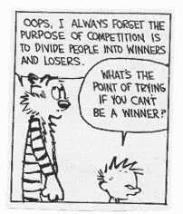
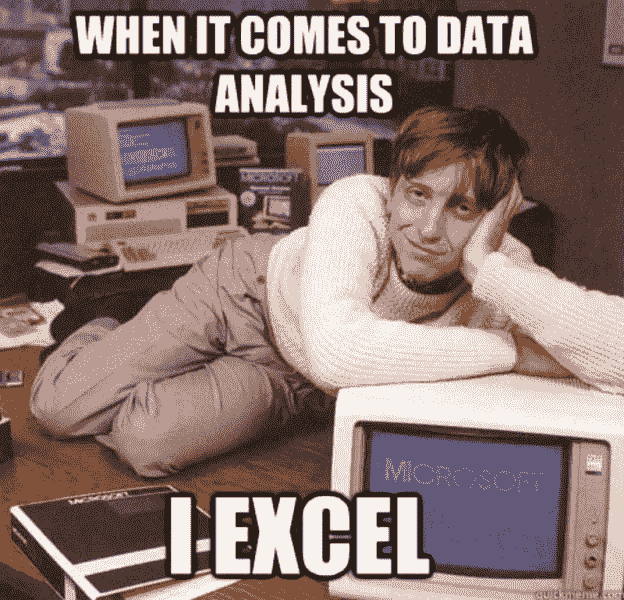

# 竞争心态:Kaggle 和现实生活中的数据科学如何产生分歧

> 原文：<https://towardsdatascience.com/the-competition-mindset-where-kaggle-and-industry-diverge-66e0548a5f32?source=collection_archive---------18----------------------->

## 真实世界不是一场数据竞赛——这里有三个原因。

非常感谢 Kaggle 的 Rachael 和 Will 对本文的评论和建议。

> TLDR: Kaggle 比赛对于机器学习教育来说非常棒。但它可能会对现实生活中的商业环境产生错误的预期。我讲述了行业环境中的数据科学不同于竞争对手的三个方面，以及将期望与数据科学工作的现实相结合是多么重要。

# 简介:竞争心态

Kaggle 是一个非常受欢迎的平台，非常适合有抱负的数据科学家学习应用机器学习的技能:预处理、流水线、算法优化。然而，我相信它也可以影响那些试图理解和学习现实世界数据科学的人。对于现实世界，我严格地说是指现实生活中的行业环境，其中数据科学被采用来满足业务目标。

许多求职者目前正试图进入数据科学领域。一些人通过 Kaggle 比赛来启动和引导他们新的 ML 旅程。鉴于这种趋势，我认为区分什么是 Kaggle 竞争，什么不是非常重要。虽然 Kaggle 有很大的教育益处，但我相信它也能培养我称之为**的竞争心态。**

> **竞争心态:**(名词)Kaggle 竞赛中优先考虑的技术、目标和流程反映了典型商业环境中的心态。

这种心态的最大挑战是，Kaggle 竞赛中使用的数据科学和行业环境中实践的数据科学之间存在核心的根本差异(我称之为*行业数据科学*)。我将探讨为什么会出现这种情况的三个具体原因，以及我们如何为那些即将进入这一领域的人设定正确的期望。

我用 Kaggle 作为一个更短的术语，特指 ***Kaggle 竞赛*** 。Kaggle.com 提供其他服务，如提供[数据集](https://www.kaggle.com/datasets)、[在线访谈](https://www.youtube.com/watch?v=7E8HXxzdM2U&t=802s)、讲座等。这是我在本文中没有考虑的。我是旧金山的一名数据科学家，但我试图将我的观点推广到世界其他地方。

# 卡格尔的 3 个分歧

Kaggle 不是行业数据科学有三大原因:

1.  *目标* **:** Kaggle 和行业数据科学拥有完全不同的目标和宗旨。
2.  *技术* **:** Kaggle 竞赛优先考虑工业中不容易利用的技术。
3.  *数据* **:** Kaggle 为您提供数据；现实世界不会。

## 1.卡格尔的目标

你可能有一个主观的原因去参加一个游戏比赛(例如:提高技能)。但归根结底，Kaggle 竞赛最终只是一场竞赛。这就是为什么 H2O.ai 的首席决策科学家说:“在 Kaggle 上有一个特定的任务或目标:目标是获胜。”

卡格勒人通过比他们的竞争对手得分高而获胜。比顶级竞争对手的得分高出 0.0001%。由于这个原因，参与者非常关注指标，可以通过设计最佳模型来优化指标。

[https://www.pinterest.com/pin/313633561524587800/](https://www.pinterest.com/pin/313633561524587800/)

这个焦点就是分歧的开始。数据科学的基本目标不是指标或模型。听听 Scikit-learn 的核心开发者 Andreas Muller 的看法。在我们的独家 TDS 采访中，Andreas 告诉我:

> *“作为一名数据科学从业者，你的目标从来都不是准确性，也不是 ROC-AUC。这不是你申请的内容。你应该考虑在你的应用环境中取得一个特定的结果意味着什么。一旦你有了这个目标，你就可以定义指标，并尝试不同的方法来最大化这些指标。”*

Andreas 阐明了指标不是数据科学的最终目标，而是服务于最终目标本身的工具。这是一个至关重要的区别，因为行业数据科学总是与业务环境联系在一起。因此，成为行业中的数据科学家意味着 A)为正确的业务成果定义相关指标，然后 B)在考虑业务环境的情况下优化这些指标。

这一优先原则也直接适用于建模过程。数据科学的目的不是设计最花哨、最复杂的 ML 算法。Patreon 数据科学主管 Maura Church 强调了这一观点。在我采访莫拉的时候，我问她:

> ***你见过的数据科学申请者常见的陷阱有哪些？***
> 
> **例如:候选人可能会进入 Tensorflow 并学习 Keras 和深度学习，对于他们遇到的任何问题，他们都会说“哦，让我将 Tensorflow 应用于此”。这是一个需要避免的非常重要的陷阱。你将要面对的一些问题可能需要一个简单的 excel 电子表格。*或者实际上解决问题的方法是让人们聚在一起讨论。因此，不考虑解决问题的正确方法是非常重要的陷阱。”***

**如果你有*的竞争心态*，我建议你听听莫拉关于马斯洛锤子的警示故事。请重新考虑一下，机器学习不是数据科学的最高优先级，而只是解决业务问题的众多工具之一。正如 Maura 所建议的，理解这种区别可能与你的职业成功直接相关。**

**此外，Maura 的观点论证了 Kaggle 工作流不是标准数据科学工作流的两个重要原因。首先，Kaggle 竞赛非常关注机器学习方法。在工业界，ML 只是数据科学家使用的一个可选工具。**

**第二，数据科学家很少得到现成的指标，尤其是在业务问题被明确定义之前。很多时候，数据科学家必须从头开始定义对业务成果有意义的正确指标。数据科学的分析部分尤其如此。**

**例子:有许多方法来定义概念，如流失、每月经常性收入(MRR)和用户/客户参与度，这些术语是许多企业密切跟踪的。如何定义这些术语取决于领域专业知识和对公司目标的谨慎理解。**

****

**[https://medium.com/@fmoe/excel-for-data-science-a82247670d7a](https://medium.com/@fmoe/excel-for-data-science-a82247670d7a)**

## **2.卡格尔的工具**

**由于 Kaggle 和行业数据科学致力于不同的目标，所以他们使用不同的技术工具来实现这些目标。**

**Kagglers 经常依赖复杂的、多层的 ML 和深度学习方法来进行竞争。具体来说，他们使用堆叠/混合，因为这仍然是赢得 Kaggle 比赛的最成功的策略。H2O.ai 的首席决策科学家 Erin LeDell 在她的一次研讨会上阐述了这一点:**

> ******Erin****:为什么有人想做【堆叠】？一个答案是，这基本上是目前赢得 Kaggle 的唯一方法。没错，有时候人不叠也能赢。但在很大程度上，这是人们获胜的方式。****
> 
> ****如果你看一下第一名和第二名的排名，小数点后第四位就是你要处理的差额。这就是你赢得卡格尔的方法。因此，如果您需要从数据中挤出所有的预测能力，堆叠是一个绝佳的机会。”****

***为什么这些 Kaggle-effective 技术不容易在工业中采用的一个主要原因是:模型的可解释性。在工业中，不仅模型的可解释性远比模型的复杂性重要，而且它们经常是相互对立的。***

***首先让我再次强调这一点:数据科学家的主要优先事项并不是真的“从你的数据中挤出所有的预测能力”。艾琳·莱德尔在接受 Kaggle 采访时也表达了同样的观点:“[Kaggle 竞赛中的表现] *并不总是与行业中的其他事情保持一致***。*****

***更重要的是，在 Kaggle 上构建复杂的模型会引发严重的模型可解释性问题。模型越花哨、越复杂，解释模型的内部工作就越有挑战性(又名:特征解释)。***

***所以你可能认为神经网络非常令人兴奋(确实如此)，但它在许多商业环境中经常无法使用，因为很难解释它们。(随着 LIME、SHAP 价值观和其他人工智能解释工具的出现，视觉和语言模型取得了长足的进步，但巨大的工作还在前面)。***

******

***from [The balance: Accuracy vs. Interpretability](/the-balance-accuracy-vs-interpretability-1b3861408062)***

***理解这一障碍是新数据科学家的基础。你需要说服公司内部和外部的利益相关者相信你的模型正在做什么，以及为什么你的解决方案是重要的。***

***假设你在一家 B2B 公司工作，你的一个客户问你:“你的 ML 为什么对我们公司做这个预测？”***

***如果你告诉他们，“因为这是军情六处说的”，那是行不通的。你的客户会要求每一个详尽的逻辑解释，以平息他们对自动化决策的焦虑，特别是如果 ML 与他们的利润和收入直接相关。***

***内部利益相关者，比如产品和工程经理，也需要对你的算法的内部机制有(再)保证。这是整个数据工作流中很重要的一部分，但并不经常被提及。这就是我在采访 Guido Maretto 博士(Flyr 的数据科学家和前经济学教授)时询问这个问题的原因。他解释说，说服多个利益相关方的需求是他在公司面临的最大挑战:***

> *****因为如果没有你的解决方案的自我宣传，你就不会实施它*，也不会对你公司的指标产生影响*。这最终将与你的职业联系在一起。*****

*** [## 教授变身数据科学家:为什么 Guido Maretto 博士离开学术界开始创业

### TDS 采访前教授(加州理工学院博士)为什么他离开了他的助理职位，以及如何加入行业后…

towardsdatascience.com](/professor-turned-data-scientist-why-dr-guido-maretto-left-academia-for-the-startup-life-da29102a8325) 

请记住，通常是产品团队将您的功能整合到公司的产品中，而工程师将在编程方面实现这一点。*** 

## ***3.卡格尔的数据***

******

***拼图的最后一块是数据。具体来说，Kaggle 和行业在收集数据的方式上存在分歧，这是定义业务问题后数据工作流的第一步。***

***简而言之，作为未来的数据科学家，你很少会得到现成的数据来轻松处理。与度量类似，您可能需要从头开始构建数据表。这样做需要仔细的过滤和明智的连接，以实现准确的数据检索。这需要 A)精通 SQL，B)对公司数据的专业知识。***

***你可以立即看到这个数据创建的过程与你在 Kaggle 比赛中所做的完全不同。在后一种情况下，数据以一种很好的 CSV 格式提供给你。你下载几个文件，使用 Pandas 功能将它们合并到共享 id 上，你就可以开始了。这个过程避免了在创建表的过程中面临的一些实际问题，例如:***

1.  *****SQL 运行时/内存错误:**使用临时表、自连接和其他方法有效地运行 SQL 查询，以防止在查询处理时间过长时出现内存错误。***
2.  *****目标标签创建:**监督学习的目标标签并不总是预定义的。如果您正在构建一个客户流失模型，那么您为 ML 优化定义客户流失的方式可能与其他人定义客户流失的方式不同。***
3.  *****精确的数据分段:**数据通常在分段的级别上提取，以针对/分析特定的(子)人群。正确的提取可能非常棘手，因为可能有多种方法来分割一个群体。***

***为了扩展第三点，假设要提取的细分市场是贵公司产品的新注册用户。为此，您可能需要考虑以下几点:***

***a) *免费试用*(是在试用前还是试用后才算新用户？)***

***b) *海归*(流失 3 个月后回来的是新用户吗？)***

***c) *交易类型*(应一次性购买，无需经常性付款(礼品等)。)被认为是新签的？).***

***这些情况会阻碍您想要分析的目标子群体的完全分类。要解决这个问题，你需要我上面提到的:SQL 和公司数据方面的专业知识。***

# ***结论:Kaggle 和行业有重叠吗？***

***简短的回答是肯定的，但是要加一些星号。Kaggle 比赛中使用的数据管理和前/后处理过程也是我在自己的公司经常使用的步骤。这里或那里可能有其他相似之处，但它们不会掩盖目标、技术和数据收集方面的三个核心差异。***

***这对你这个有抱负的数据科学家来说意味着什么？***

1.  ***如果你想更好地理解应用机器学习技术，一定要练习 Kaggle。但是要警惕竞争心态。***
2.  ***了解这些差异可能是你获得第一份数据科学工作的关键。Kaggle 的瑞秋·塔特曼在 [TDS 播客](/data-science-at-kaggle-9c1e17859d4b)中强调了优先级的重要性。她认为“花在模型性能上的时间通常没有与利益相关者交谈或其他事情重要。”***

***如果你喜欢这篇文章，请关注我的[媒体](https://medium.com/@haebichan)简介。一如既往，祝你好运！***

*** [## Haebichan Jung —中等

### 阅读容格在媒介上的作品。“走向数据科学”的项目负责人| Recurly(旧金山)的数据科学家

medium.com](https://medium.com/@haebichan)***