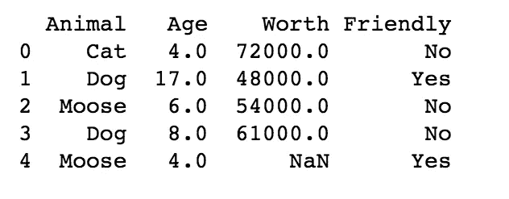
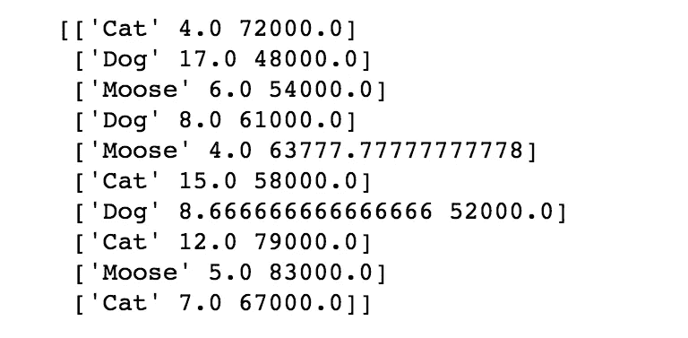
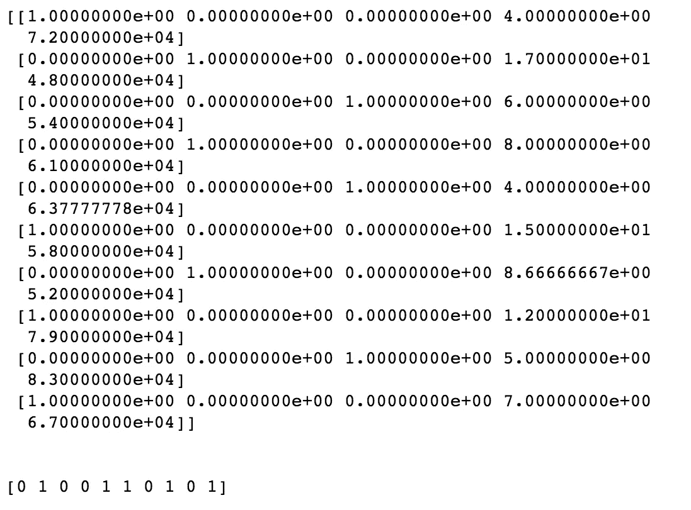

# 数据清理和预处理完全初学者指南

> 原文：<https://towardsdatascience.com/the-complete-beginners-guide-to-data-cleaning-and-preprocessing-2070b7d4c6d?source=collection_archive---------4----------------------->

## 如何在几分钟内为机器学习模型成功准备数据


数据预处理是建立工作机器学习模型的第一步(也可以说是最重要的一步)。很关键！

如果您的数据没有经过清理和预处理，那么您的模型就不起作用。

就这么简单。

数据预处理通常被认为是枯燥的部分。但这就是有准备和完全没有准备的区别。这就是看起来像专业人士和看起来很傻的区别。

有点像准备去度假。你可能不喜欢准备部分，但是提前确定细节可以让你免于一场噩梦般的旅行。

你必须去做，否则你就不能开始享受乐趣。

GIF via [GIPHY](https://giphy.com/gifs/poker-face-mlPUJrMgkEays)

但是你是怎么做到的呢？

> **本教程将带你了解为任何机器学习模型准备任何数据集的基本知识。**

## 进口第一！

我们希望从导入预处理数据所需的库开始。库实际上只是一个你可以使用的工具。你给库输入，库做它的工作，它给你你需要的输出。有很多可用的库，但是有三个是 Python 中的基本库。你几乎每次都会用到它们。使用 Python 时，三个最流行的库是 Numpy、Matplotlib 和 Pandas。 **Numpy** 是你需要的所有数学知识的图书馆。因为你的代码要在数学上运行，所以你要用这个。Matplotlib (特别是 Matplotlib.pyplot)是你想要制作图表的库。Pandas 是导入和管理数据集的最佳工具。熊猫和 Numpy 基本上是数据预处理必不可少的。

(如果你对这些都不熟悉，你可能想看看 NumPy 的终极初学者指南！)

[](/the-ultimate-beginners-guide-to-numpy-f5a2f99aef54) [## NumPy 初学者终极指南

### 开始使用 NumPy 需要知道的一切

towardsdatascience.com](/the-ultimate-beginners-guide-to-numpy-f5a2f99aef54) 

用一个快捷别名导入这些库是最有意义的，这样以后可以节省一点时间。这很简单，你可以这样做:

```
import numpy as np
import matplotlib.pyplot as plt
import pandas as pd
```

现在，您可以通过键入以下内容来读取数据集

```
dataset = pd.read_csv('my_data.csv')
```

这告诉 Pandas (pd)读入您的数据集。这些是我为本教程整理的数据集的前几行:



现在我们有了数据集，但是我们需要创建一个因变量矩阵和一个自变量向量。您可以通过键入以下内容来创建因变量矩阵:

```
X = dataset.iloc[:, :-1].values
```

第一个冒号( **:** )意味着我们想要获取数据集中的所有行。 **:-1** 表示我们要抓取除最后一列之外的所有数据列。的。**值**放在最后意味着我们要抓取所有的值。

现在我们需要一个因变量的向量，只包含最后一列的数据，所以我们可以键入

```
y = dataset.iloc[:, 3].values
```

请记住，当您查看数据集时，索引从 0 开始。如果你想计算列数，从 0 开始，而不是 1。 **[:，3]** 获得**动物**、**年龄**、**价值**栏。0 是动物栏，1 是年龄栏，2 是价值。如果你还没有习惯这个计数系统，你会习惯的！

## 如果我们有丢失的数据会怎么样？

这实际上一直都在发生。

GIF via [GIPHY](https://giphy.com/gifs/what-surprised-shock-ZHkVpDiI3vIiY)

我们可以删除丢失数据的行，但这真的不是最聪明的主意。这很容易引起问题。我们需要找到一个更好的主意！最常见的解决方案是取列的平均值来填充缺失的数据点。

使用 scikit-learn 的预处理模型中的 imputer 类可以很容易地做到这一点。如果你还不知道，scikit-learn 包含了惊人的机器学习模型，我强烈建议你去看看！)

当应用于机器学习时，您可能不习惯使用“**方法**、“**类**”和“**对象**”这样的术语。没问题！

一个**类**是我们想要构建的东西的模型。如果我们要搭建一个棚子，棚子的搭建方案就是上课。

一个**对象**是该类的一个实例。本例中的对象是我们按照施工计划搭建的棚子。同一个类可以有许多对象。这就像是说，你可以根据建筑计划建造很多棚子。

一个**方法**是一个我们可以在对象上使用的工具，或者一个应用于对象的函数，它接受一些输入并返回一些输出。这就像一个把手，当我们的小屋开始变得有点闷时，我们可以用它来打开窗户。


Photo by [Roman Kraft](https://unsplash.com/@romankraft?utm_source=medium&utm_medium=referral) on [Unsplash](https://unsplash.com?utm_source=medium&utm_medium=referral)

为了使用估算器，我们将运行类似这样的程序

```
from sklearn.preprocessing import Imputer
imputer = Imputer(missing_values = np.nan, strategy = ‘mean’, axis = 0)
```

Mean 是默认策略，所以您实际上不需要指定它，但是它在这里，所以您可以了解您想要包含什么信息。missing_values 的默认值是 nan。如果您的数据集有称为“NaN”的缺失值，您将坚持使用 np.nan。

现在，为了适应这个估算，我们键入

```
imputer = imputer.fit(X[:, 1:3])
```

我们只想将估算值拟合到缺少数据的列。第一个冒号意味着我们想要包含所有的行，而 **1:3** 意味着我们接受列索引 1 和 2。别担心。您很快就会习惯 Python 的计算方式！

现在我们想使用的方法将实际上取代丢失的数据。您可以通过键入

```
X[:, 1:3] = imputer.transform(X[:, 1:3])
```



用其他策略试试这个吧！您可能会发现，对于您的项目来说，用列的中间值填充缺失值更有意义。还是模式！像这样的决定看起来很小，但实际上却非常重要。

某样东西受欢迎并不一定就是正确的选择。数据点的平均值不一定是模型的最佳选择。

毕竟，几乎每个阅读这篇文章的人都有超过平均水平的手臂…


Photo by [Matthew Henry](https://unsplash.com/@matthewhenry?utm_source=medium&utm_medium=referral) on [Unsplash](https://unsplash.com?utm_source=medium&utm_medium=referral)

## 如果你有分类数据呢？

很棒的问题！你不能完全理解**猫**、**狗**和**驼鹿**的意思。我们能做什么？我们可以将分类值编码成数字！您需要从 sklearn.preprocessing 中获取标签编码器类。

从您想要对数据进行编码的一列开始，并调用标签编码器。然后将它放入您的数据中

```
from sklearn.preprocessing import LabelEncoder
labelencoder_X = LabelEncoder()
X[:, 0] = labelencoder_X.fit_transform(X[:, 0])
```

(还记得括号里的数字是怎么工作的吗？:表示我们想要处理所有的行，0 表示我们想要获取第一列。)

这就是用数字替换第一列中的分类变量的全部步骤。例如，不是驼鹿，而是“0”，不是“狗”，而是“2”，不是“猫”，而是“3”。

你看到潜在的问题了吗？

这种标注系统暗示了数据的等级值，这可能会影响您的模型。3 的值大于 0，但**猫**并不(一定……)大于**驼鹿**。


Photo by [Cel Lisboa](https://unsplash.com/@cellisboa?utm_source=medium&utm_medium=referral) on [Unsplash](https://unsplash.com?utm_source=medium&utm_medium=referral)

我们需要创建**虚拟变量**！

我们可以为猫创建一个列，为驼鹿创建一个列，以此类推。然后，我们将在列中填入 1 和 0(认为 1 =是，0 =否)。这意味着，如果您在原始列中有**猫**，现在您将在驼鹿列中有 0，在狗列中有 0，在猫列中有 1。

听起来很复杂。输入一个热编码器！

导入编码器，然后指定列的索引

```
from sklearn.preprocessing import OneHotEncoder
onehotencoder = OneHotEncoder(categorical_features = [0])
```

现在稍微适应和改变一下

```
X = onehotencoder.fit_transform(X).toarray()
```

瞧啊。您的单个列已被原始列中的每个分类变量替换为一个列，并用 1 和 0 替换分类变量。

很可爱，对吧？

如果我们有像“yes”和“no”这样的分类变量，我们可以继续对我们的 **y** 列使用标签编码器

```
labelencoder_y = LabelEncoder()
y = labelencoder_y.fit_transform(y)
```

这将把 y 拟合并转换成一个编码变量，1 表示是，0 表示否。



## 列车测试分离

此时，您可以继续将数据分成训练集和测试集。[我知道我已经在图像分类教程](/wtf-is-image-classification-8e78a8235acb)中说过了，但是请始终将您的数据分成训练和测试集，**永远不要**使用您的测试数据进行训练！你需要避免过度合身。(你可以把过度拟合想象成在没有理解信息的情况下，在一次考试前记忆超级具体的细节。当你记住细节的时候，你会在家里用你的抽认卡做得很好。然而，当你面对新的信息时，你会通不过任何真正的测试。)

现在，我们有一台需要学习的机器。它需要在数据上进行训练，并看看它对在单独数据上所学内容的理解程度。记忆训练集和学习不是一回事！您的模型在训练集上学习得越好，就越能预测测试集的结果。你永远不会想过度拟合你的模型。你真的想让它学会！


Photo by [Janko Ferlič](https://unsplash.com/@thepootphotographer?utm_source=medium&utm_medium=referral) on [Unsplash](https://unsplash.com?utm_source=medium&utm_medium=referral)

首先，我们进口

```
from sklearn.model_selection import train_test_split
```

现在我们可以创建 X_train 和 X_test 以及 y_train 和 y_test 集合。

```
X_train, X_test, y_train, y_test = train_test_split(X, y, test_size = 0.2, random_state = 0)
```

将数据进行 80/20 分割是非常常见的，80%的数据用于培训，20%用于测试。这就是我们将 test_size 指定为 0.2 的原因。你可以按你需要的方式分割它。你不需要设置一个随机状态，但我喜欢这样做，这样我们就可以准确地重现我们的结果。

## 现在进行特征缩放。

什么是特征缩放？我们为什么需要它？

好吧，看看我们的数据。我们有一列动物年龄从 4-17 岁，动物价值从 48，000 美元到 83，000 美元不等。不仅“价值”栏由比“年龄”栏高得多的数字组成，而且变量也覆盖了更广泛的数据范围。这意味着欧几里德距离将被**价值**所支配，并将最终支配**年龄**数据。

如果欧几里德距离在你的特定机器学习模型中不起作用怎么办？缩放要素仍会使模型速度更快，因此在预处理数据时，您可能需要包括此步骤。

有许多方法可以进行特征缩放。它们都意味着我们把我们所有的特征放在同一个尺度上，所以没有一个被另一个所支配。

从导入开始(您必须习惯这一点)

```
from sklearn.preprocessing import StandardScaler
```

然后创建一个我们要缩放的对象，称之为标准缩放器

```
sc_X = StandardScaler()
```

现在，我们直接拟合和转换数据集。抓取对象并应用方法。

```
X_train = sc_X.fit_transform(X_train)
X_test = sc_X.transform(X_test)
```

我们不需要让它适合我们的测试集，我们只需要一个转换。

```
sc_y = StandardScaler()
y_train = sc_y.fit_transform(y_train)
```

## **哑变量呢？需要对它们进行缩放吗？**

嗯，有些人说是，有些人说不是。这是一个你有多想坚持你的解释的问题。让我们所有的数据保持相同的比例是件好事。但是，如果我们对数据进行缩放，我们就失去了轻松解释哪些观察值属于哪个变量的能力。

那 **y** 呢？如果你有一个像 0 和 1 这样的因变量，你真的不需要应用特征缩放。这是一个具有绝对相关值的分类问题。但是如果你有很大范围的特征值，那么是的！您确实想应用缩放器！

## 你做到了！

就是这样！


Photo by [Roven Images](https://unsplash.com/@rovenimages_com?utm_source=medium&utm_medium=referral) on [Unsplash](https://unsplash.com?utm_source=medium&utm_medium=referral)

只需几行代码，您就已经完成了数据清理和预处理的基础工作！[想看的话可以看这里的](https://github.com/bonn0062/basic_data_preprocessing)代码。

在这一步，你肯定会有很多想法需要考虑。您需要考虑如何准确地填充缺失的数据。考虑是否需要缩放要素以及如何缩放。虚拟变量还是没有？你会对你的数据进行编码吗？你会编码你的虚拟变量吗？这里有大量的细节需要考虑。

也就是说，你有这个！

现在出去把数据准备好！

和往常一样，如果你用这些信息做了什么很酷的事情，请在下面的回复中让人们知道，或者随时在 LinkedIn [@annebonnerdata](https://www.linkedin.com/in/annebonnerdata/) 上联系！

如果你喜欢这篇文章，你可能也会对我的其他文章感兴趣:

[](/getting-started-with-git-and-github-6fcd0f2d4ac6) [## Git 和 GitHub 入门:完全初学者指南

### Git 和 GitHub 基础知识，供好奇和完全困惑的人使用(加上最简单的方法来为您的第一次公开…

towardsdatascience.com](/getting-started-with-git-and-github-6fcd0f2d4ac6) [](/simple-linear-regression-in-four-lines-of-code-d690fe4dba84) [## 机器学习完全入门指南:简单线性回归四行代码！

### 一个清晰而全面的蓝图，绝对适合任何想要构建简单机器学习模型的人

towardsdatascience.com](/simple-linear-regression-in-four-lines-of-code-d690fe4dba84) [](/getting-started-with-google-colab-f2fff97f594c) [## Google Colab 入门

### 沮丧和困惑的基本教程

towardsdatascience.com](/getting-started-with-google-colab-f2fff97f594c) [](/how-to-create-a-free-github-pages-website-53743d7524e1) [## 如何用 GitHub 毫不费力地免费创建一个网站

### GitHub Pages 入门:创建和发布免费作品集的快速简便指南…

towardsdatascience.com](/how-to-create-a-free-github-pages-website-53743d7524e1) [](/intro-to-deep-learning-c025efd92535) [## 深度学习简介

### 新手、新手和新手的神经网络。

towardsdatascience.com](/intro-to-deep-learning-c025efd92535) [](/wtf-is-image-classification-8e78a8235acb) [## WTF 是图像分类？

### 为好奇和困惑征服卷积神经网络

towardsdatascience.com](/wtf-is-image-classification-8e78a8235acb) [](https://medium.freecodecamp.org/how-to-build-the-best-image-classifier-3c72010b3d55) [## 如何构建准确率高于 97%的图像分类器

### 清晰完整的成功蓝图

medium.freecodecamp.org](https://medium.freecodecamp.org/how-to-build-the-best-image-classifier-3c72010b3d55) [](https://heartbeat.fritz.ai/brilliant-beginners-guide-to-model-deployment-133e158f6717) [## 出色的模型部署初学者指南

### 一个清晰简单的路线图，让你的机器学习模型在互联网上，做一些很酷的事情

heartbeat.fritz.ai](https://heartbeat.fritz.ai/brilliant-beginners-guide-to-model-deployment-133e158f6717) 

感谢阅读！