# Python 分类完全指南

> 原文：<https://towardsdatascience.com/the-complete-guide-to-classification-in-python-b0e34c92e455?source=collection_archive---------4----------------------->

## 深入探究逻辑回归、LDA 和 QDA 的内部工作原理，并在项目环境中实现每个算法。

# 介绍

本文可作为简单和复杂分类问题的参考。通过“简单”,我们指定一个二元分类问题，其中两个类别之间存在一个清晰的线性边界。更复杂的分类问题可能涉及两个以上的类别，或者边界是非线性的。

对于此类问题，**逻辑回归**、**线性判别分析** (LDA)和**二次判别分析** (QDA)等技术是应用最广泛的算法。

在本文中，我们将首先解释回归和分类问题之间的区别。然后，我们将深入研究逻辑回归、LDA 和 QDA 的理论。最后，我们将使用真实数据集在 Python 中实现每个算法。

我希望这篇文章对你有用，并且你可以回头参考它！我们开始吧！

> 关于机器学习、深度学习和人工智能的实践视频教程，请查看我的 [YouTube 频道](https://www.youtube.com/channel/UC-0lpiwlftqwC7znCcF83qg?view_as=subscriber)。

# 回归与分类问题

之前，我们看到[线性回归](/the-complete-guide-to-linear-regression-in-python-3d3f8f06bf8)假设响应变量是定量的。然而，在许多情况下，反应实际上是定性的，就像眼睛的颜色。这种类型的反应被称为**分类反应。**

分类是预测定性反应的过程。用于分类的方法通常预测定性变量的每个类别的概率，作为进行分类的基础。在某种程度上，它们的行为类似于回归方法。

通过分类，我们可以回答如下问题:

*   一个人有一系列症状，这些症状可以归因于三种医学状况中的一种。哪一个？
*   一笔交易是不是欺诈？

分类回答通常用词来表达。当然，我们不能用文字作为传统统计方法的输入数据。当我们实现算法的时候，我们会看到如何处理这个问题。

现在，让我们看看逻辑回归是如何工作的。

# 逻辑回归

当涉及到分类时，我们要确定一个观察值是否属于某一类的概率。因此，我们希望用 0 到 1 之间的值来表示概率。

接近 1 的概率意味着观察结果**很可能**属于该类别。

为了生成介于 0 和 1 之间的值，我们使用以下等式来表示概率:

Sigmoid function

上面的等式被定义为 **sigmoid 函数。**

画出这个方程，你会发现这个方程总是产生一个介于 0 和 1 之间的 S 形曲线。

Logistic regression curve

对上面的等式进行一些操作后，您会发现:

拿起*两边的圆木*；

上面的等式被称为*对数*。可以看到，它在 *X* 是线性的。这里，如果系数是正的，那么 *X* 的增加将导致更高的概率。

## 估计系数

与线性回归一样，我们需要一种方法来估计系数。为此，我们**最大化**的*似然函数*:

Likelihood function

这里的直觉是，我们希望系数使得预测的概率(在上面的等式中用撇号表示)尽可能接近观察到的状态。

与线性回归类似，我们使用 *p 值*来确定是否拒绝零假设。

*Z 统计*也被广泛使用。大的绝对 Z 统计量意味着零假设被拒绝。

请记住，零假设声明:特征和目标之间没有相关性。

## 多元逻辑回归

当然，逻辑回归可以很容易地扩展到容纳一个以上的预测因子:

Multiple logistic regression

请注意，使用多元逻辑回归可能会给出更好的结果，因为它可以考虑预测因素之间的相关性，这种现象被称为*混淆*。此外，很少仅有一个预测器就足以建立准确的预测模型。

# 线性判别分析

现在，我们明白了逻辑回归是如何工作的，但是像任何模型一样，它也存在一些缺陷:

*   当类被很好地分开时，从逻辑回归估计的参数往往是不稳定的
*   当数据集很小时，逻辑回归也是不稳定的
*   最好不要预测两个以上的类

这就是线性判别分析(LDA)派上用场的地方。它比逻辑回归更稳定，广泛用于预测两个以上的类别。

LDA 的特殊性在于，它分别对每个响应类别中预测值的分布进行建模，然后使用贝叶斯定理来估计概率。

好吧，这有点难以理解。我们来分解一下。

## 贝叶斯分类定理

*(抱歉，Medium 不支持数学方程。我尽了最大努力，尽可能的明确)。*

假设我们想要将一个观察值分类到 *K* 类中的一个，其中 *K* 大于或等于 2。然后，让 *pi-k* 成为一个观察值关联到第*个*类的总概率。然后，让 *f_k(X)* 表示 *X* 的密度函数，用于来自*第 k 个*类的观察。这意味着如果来自第*第 k 个*类的观测值具有 X = x 的概率，则 *f_k(X)* 是大的。然后，贝叶斯定理陈述:

Bayes’ theorem for classification

上面的等式可以简单地缩写为:

Abbreviated Bayes’ theorem for classification

希望这有一定的意义！

这里的挑战是估计密度函数。理论上，贝叶斯的分类错误率最低。因此，我们的分类器需要估计密度函数，以逼近贝叶斯分类器。

## 一个预测器的 LDA

假设我们只有一个预测值，并且密度函数是正态的。然后，您可以将密度函数表示为:

Normal distribution function

现在，我们要指定一个观察值 *X = x* ，对于这个观察值 *P_k(X)* 最大。如果你在 *P_k(X)* 中插入密度函数，取*对数*，你会发现你希望最大化:

Discriminant equation

上面的等式被称为**判别式。**如你所见，这是一个线性方程。因此得名:**线性判别分析**！

现在，假设只有两个具有相等分布的类，您会发现:

Boundary equation

这是边界方程。下图显示了图示。

Boundary line to separate 2 classes using LDA

当然，这代表了一种理想的解决方案。事实上，我们无法精确计算边界线。

因此，LDA 利用以下近似:

*   对于所有训练观察的平均值

Average of all training observations

*   对于每类样本方差的加权平均值

Weighted average of sample variances for each class

其中 *n* 是观察次数。

重要的是要知道 LDA 假设每个类别的**正态分布**，特定类别的**均值**，以及**共同方差**。

## 多个预测值的 LDA

现在扩展到多个预测值，我们必须假设 *X* 是从**多元高斯分布**中提取的，具有特定类别的均值向量和公共协方差矩阵。

相关和不相关高斯分布的示例如下所示。

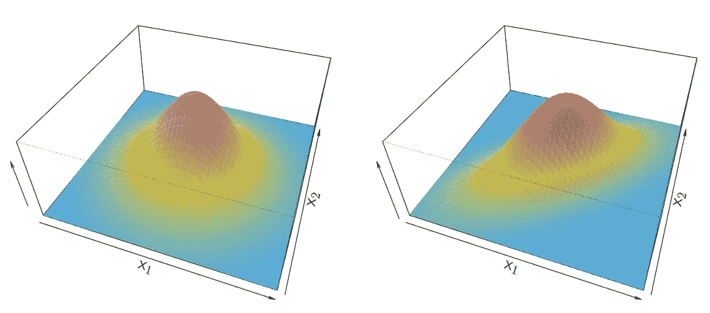

Left: Uncorrelated normal distribution. Right: correlated normal distribution

现在，用向量符号表示判别方程，我们得到:

Discriminant equation with matrix notation

如你所见，等式保持不变。只是这一次，我们使用向量符号来容纳许多预测值。

## 如何评估模型的性能

对于分类，有时使用准确性来评估模型的性能是不相关的。

考虑分析一个高度不平衡的数据集。例如，您试图确定一项交易是否是欺诈性的，但您的数据集只有 0.5%包含欺诈性交易。然后，您可以预测没有任何交易是欺诈性的，并有 99.5%的准确率得分！当然，这是一种非常幼稚的方法，无助于检测欺诈交易。

那么我们用什么呢？

通常，我们用**灵敏度**和**特异性**。

**灵敏度**是真正的阳性率:正确识别的实际阳性的比例。

**特异性**是真阴性率:实际阴性被正确识别的比例。

让我们给出一些背景来更好地理解。使用欺诈检测问题，**敏感度**是被识别为欺诈的欺诈交易的比例。**特异性**是被识别为非欺诈的非欺诈交易的比例。

因此，在理想情况下，我们需要高灵敏度和高特异性，尽管这可能会因环境而异。例如，银行可能希望优先考虑较高的敏感性而不是特异性，以确保识别欺诈性交易。

**ROC 曲线**(接收器工作特性)可以很好地显示上述两种误差指标。分类器的总体性能由 ROC 曲线下的面积给出( **AUC** )。理想情况下，它应该紧挨着图形的左上角，并且面积接近 1。

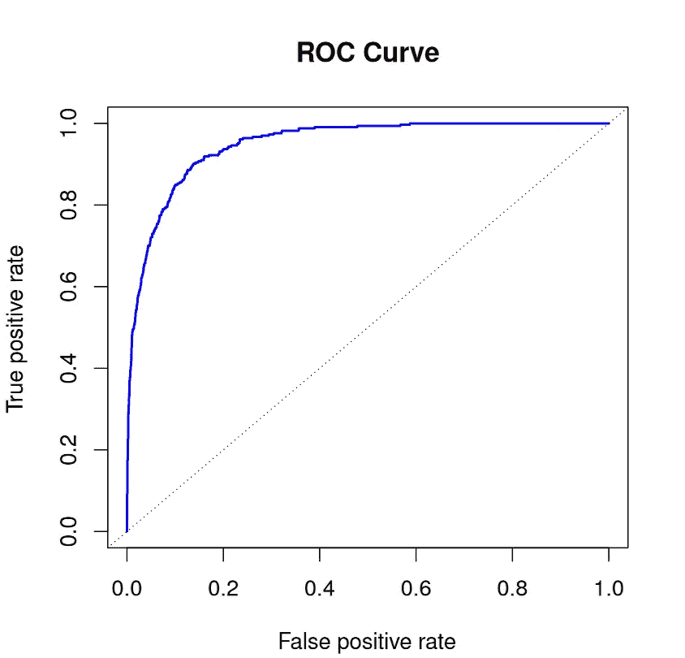

Example of a ROC curve. The straight line is a base model

# 二次判别分析(QDA)

这里，我们保持与 LDA 相同的假设，但是现在，来自第*个*类的每个观察值都有自己的协方差矩阵。

对于 QDA，判别式表示为:

Discriminant equation for QDA

毫无疑问，你会注意到这个方程现在是二次方程了。

但是，为什么选择 QDA 而不是 LDA？

对于大型数据集，QDA 是更好的选择，因为它倾向于具有更低的偏差和更高的方差。

另一方面，LDA 更适合于较小的数据集，它有较高的偏倚和较低的方差。

# 项目

太好了！既然我们已经深刻理解了逻辑回归、LDA 和 QDA 的工作原理，让我们应用每种算法来解决一个分类问题。

## 动机

蘑菇味道好极了！但是，仅在北美就有超过 10 000 种蘑菇，我们怎么知道哪些是可以食用的呢？

这是这个项目的目标。我们将构建一个分类器来确定某种蘑菇是可食用的还是有毒的。

我建议你抓住[数据集](https://www.kaggle.com/uciml/mushroom-classification)并继续。如果您曾经被卡住，请随意查阅[完整的笔记本](https://github.com/marcopeix/ISL-classification)。

我们开始吧！

A GIF of a coding mushroom… What are the odds of finding that!

## 探索性数据分析

我们将使用的[数据集](https://www.kaggle.com/uciml/mushroom-classification)包含具有 22 个特征的 8124 个蘑菇实例。其中，我们发现蘑菇的帽形、帽色、鳃色、面纱类型等。当然，它也告诉我们蘑菇是可食用的还是有毒的。

让我们导入一些库，这些库将帮助我们导入和操作数据。在您的笔记本中，运行以下代码:

数据科学项目的常见第一步是执行**探索性数据分析** (EDA)。这一步通常包括了解更多您正在处理的数据。您可能想知道数据集的**形状**(有多少行和列)、空值的数量以及数据的可视化部分，以更好地理解要素和目标之间的相关性。

导入数据，并使用以下代码查看前五列:

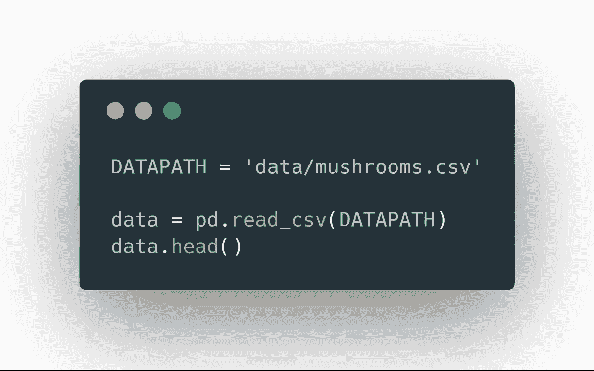

将数据集放在项目目录中的 *data* 文件夹中总是很好的。此外，我们将文件路径存储在一个变量中，这样，如果路径发生变化，我们只需要改变变量分配。

运行此代码单元格后，您应该会看到前五行。您会注意到，每个特征都是分类的，并且用一个字母来定义某个值。当然，分类器不能接受字母作为输入，所以我们最终必须改变它。

现在，让我们看看我们的数据集是否**不平衡。**不平衡数据集是指**一个类比另一个类**多得多。理想情况下，在分类的上下文中，我们希望每个类的实例数量相等。否则，需要采用先进的采样方法，如**少数过采样。**

就我们的情况而言，我们想看看数据集中是否有同等数量的有毒和可食用蘑菇。我们可以这样绘制每个类别的频率:

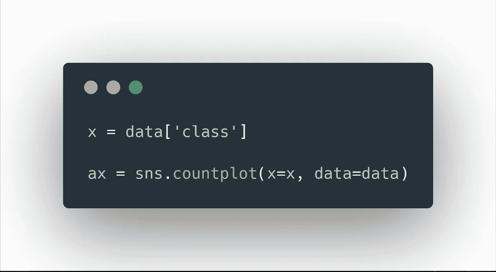

你会得到下图:

Count of each class

太棒了。它看起来像一个相当平衡的数据集，有几乎相等数量的有毒和可食用的蘑菇。

现在，我想看看每个功能是如何影响目标的。为了做到这一点，对于每一个特征，我制作了一个由蘑菇类分隔的所有可能值的条形图。对所有 22 个特性手动操作是没有意义的，所以我们构建了这个助手函数:

*色调*会给有毒和可食用类一个颜色代码。*数据*参数将包含除蘑菇类之外的所有特征。运行下面的单元代码:

您应该会得到一个包含 22 个地块的列表。下面是一个输出示例:

Cap surface

花些时间浏览所有的情节。

现在，让我们看看是否有丢失的值。运行这段代码:

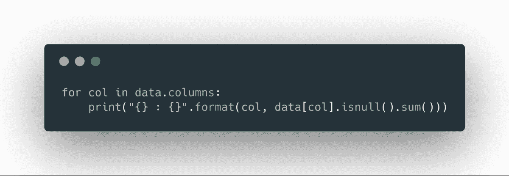

您应该看到每一列都有缺失值的数量。幸运的是，我们有一个没有缺失值的数据集。这很不常见，但我们不会抱怨。

## 为建模做准备

现在我们已经熟悉了数据，是时候为建模做准备了。如前所述，特性用字母来表示不同的可能值，但是我们需要将它们转换成数字。

为了实现这一点，我们将使用**标签编码**和**一键编码。**

让我们首先在目标列上使用标签编码。运行以下代码:

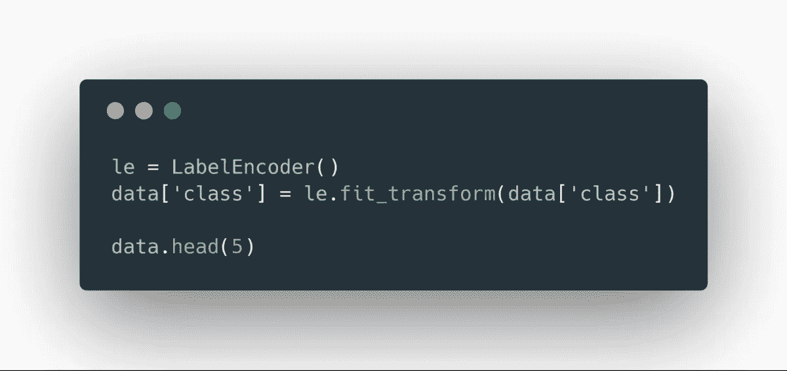

您会注意到现在该列包含 1 和 0。

Result of label encoding the ‘class’ column

现在，有毒的用 1 表示，可食用的用 0 表示。现在，我们可以把我们的分类器想成“有毒与否”。毒蘑菇得 1(真)，食用菌得 0(假)。

因此，**标签编码**会将分类特征转化为数字特征。但是，当有两个以上的可能值时，不建议使用标签编码。

为什么？

因为它会将每个值赋给 0、1 或 2。这是一个问题，因为“2”可能被认为是更重要的*，并且可能由此得出错误的相关性。*

*为了避免这个问题，我们在其他特性上使用**一键编码**。为了理解它的作用，让我们考虑一下第一个入口点的帽形。你可以看到它的值为“x ”,代表一个凸帽形状。然而，在数据集中总共记录了六种不同的帽形状。如果我们对特征进行一次性编码，我们应该得到:*

**

*One-hot encoding the “cap-shape” feature*

*如您所见，帽子形状现在是一个矢量。1 表示数据集中条目的实际帽形状值，其余部分用 0 填充。还是那句话，你可以把 1 想成*真*，把 0 想成*假。**

*一键编码的缺点是它向数据集引入了更多的列。在帽形的情况下，我们从一列到六列。对于非常大的数据集，这可能是一个问题，但是在我们的例子中，额外的列应该是可以管理的。*

*让我们继续对其余的功能进行一次性编码:*

**

*现在您应该可以看到:*

**

*One-hot encoded data set*

*你注意到我们从 23 列增加到 118 列。这是五倍的增长，但这个数字还不足以导致计算机内存问题。*

*既然我们的数据集只包含数字数据，我们就可以开始建模和预测了！*

## *训练/测试分割*

*在深入建模和进行预测之前，我们需要将数据集分成训练集和测试集。这样，我们可以在训练集上训练算法，并在测试集上进行预测。这种方式的误差度量将更加相关，因为该算法将对以前没有见过的数据进行预测。*

*我们可以像这样轻松地分割数据集:*

**

*这里， *y* 就是单纯的目标(有毒或可食用)。那么， *X* 就是简单的所有特征的数据集。最后，我们使用 *train_test_split* 函数。 *test_size* 参数对应于将用于测试的数据集部分。通常，我们使用 20%。然后， *random_state* 参数用于再现性。它可以设置为任何数字，但它将确保每次代码运行时，数据集将被相同地分割。如果没有提供 *random_state* ，那么训练集和测试集将会不同，因为函数会随机分割它。*

*好了，我们正式准备好开始建模和预测了！*

## *逻辑回归*

*我们将首先使用逻辑回归。在接下来的步骤中，我们将使用 ROC 曲线下的面积和混淆矩阵作为误差度量。*

*让我们先导入我们需要的所有内容:*

**

*然后，我们创建一个 *LogisticRegression* 对象的实例，并使模型适合训练集:*

*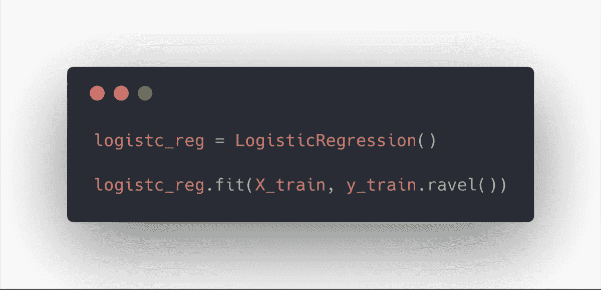*

*然后，我们预测蘑菇有毒的概率。记住，我们认为蘑菇有毒或无毒。*

*此外，必须提醒您，逻辑回归会返回一个概率。现在，让我们将阈值设置为 0.5，这样，如果概率大于 0.5，蘑菇将被分类为有毒。当然，如果概率小于阈值，蘑菇被分类为可食用。*

*这正是下面代码单元格中发生的情况:*

*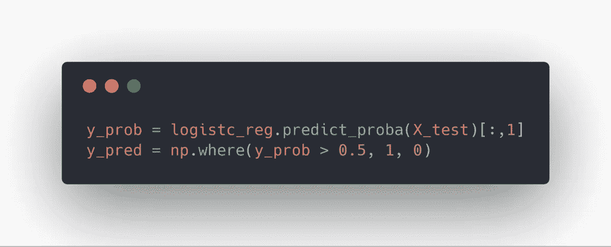*

*注意，我们是在测试集上计算概率的。*

*现在，让我们看看**混淆矩阵。**这将显示真实阳性率、真实阴性率、假阳性率和假阴性率。*

**

*Example of a confusion matrix*

*我们像这样输出我们的混淆矩阵:*

**

*您应该得到:*

**

*太神奇了！我们的分类器是完美的！从上面的混淆矩阵中，你可以看到我们的假阳性和假阴性率是 0，这意味着所有的蘑菇都被正确地分类为有毒或可食用！*

*让我们打印 ROC 曲线下的面积。如你所知，对于一个完美的分类器，它应该等于 1。*

**

*的确，上面的代码块输出 1！我们可以制作自己的函数来可视化 ROC 曲线:*

*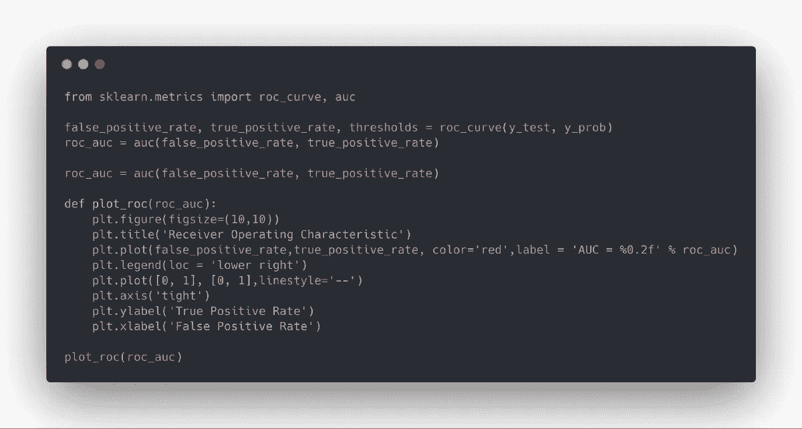*

*您应该会看到:*

*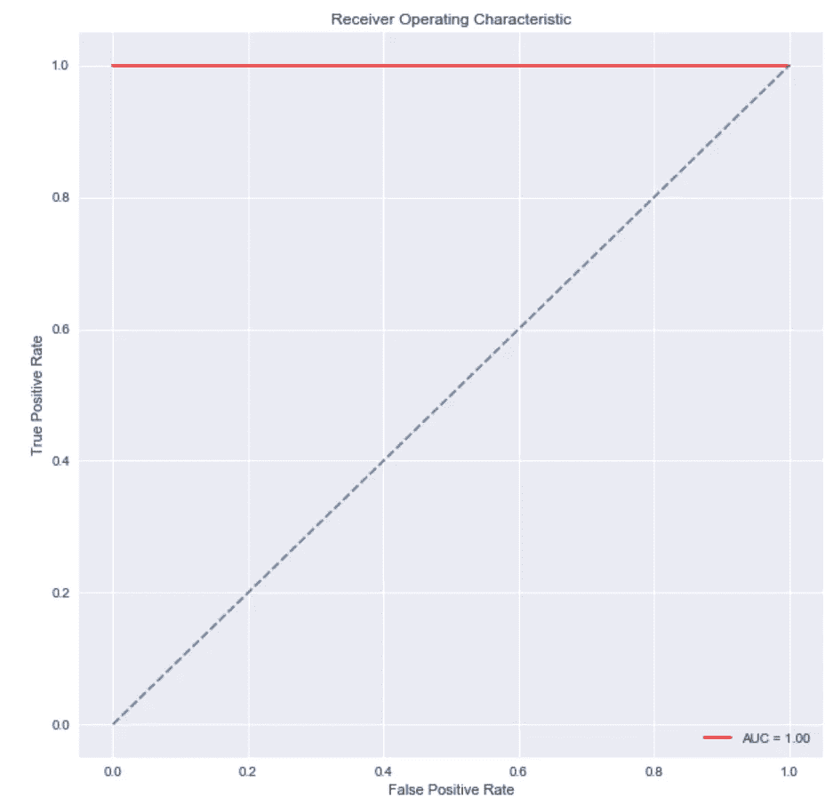*

*ROC curve*

*恭喜你！你用一个基本的逻辑回归模型建立了一个完美的分类器。*

*然而，为了获得更多的经验，让我们使用 ld a 和 QDA 建立一个分类器，看看我们是否得到类似的结果。*

## *LDA 分类器*

*遵循逻辑回归概述的相同步骤:*

*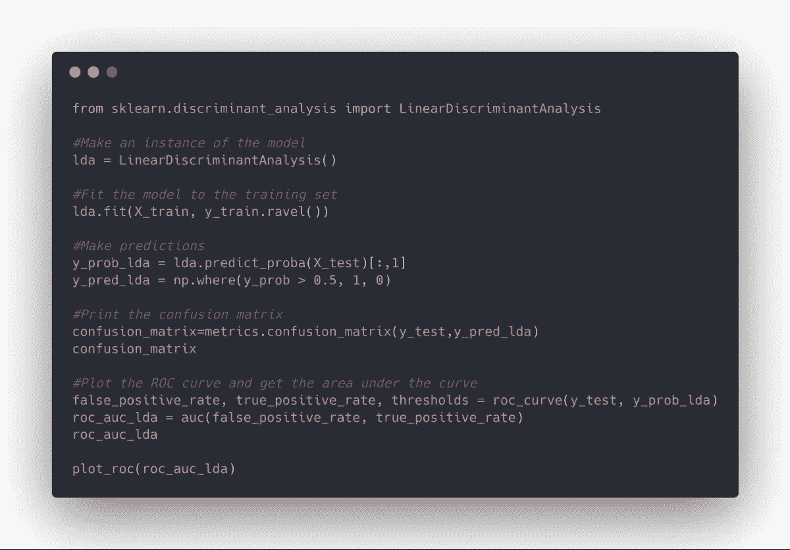*

*如果您运行上面的代码，您应该看到我们再次获得了一个完美的分类器，其结果与使用逻辑回归的分类器相同。*

## *QDA 分类器*

*现在，我们重复这个过程，但是使用 QDA:*

**

*同样，结果是一样的！*

*在本文中，您了解了用于分类的逻辑回归、LDA 和 QDA 的内部工作原理。*

*您还学习了如何用 Python 实现每个算法来解决分类问题。您经历了一个典型的分类工作流，其中必须对类进行编码，并且必须检查数据集是否不平衡。*

*我希望这篇文章对你有用。当你需要的时候，请随时查阅它！*

*干杯！*