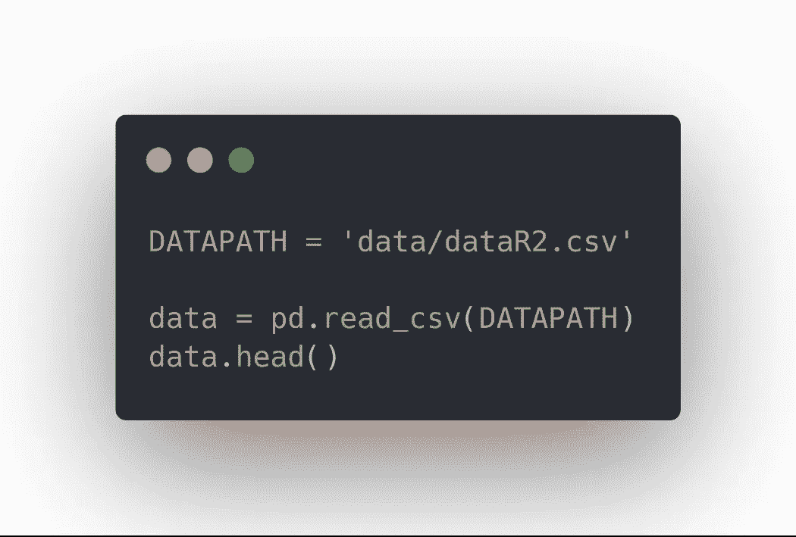

# 决策树完全指南

> 原文：<https://towardsdatascience.com/the-complete-guide-to-decision-trees-17a874301448?source=collection_archive---------15----------------------->

## 决策树的完整介绍，如何使用它们进行回归和分类，以及如何在项目设置中实现算法

They are… don’t even try something else

基于树的方法可用于回归或分类。它们包括将预测空间分割成许多简单的区域。分割规则的集合可以总结为一棵树，因此被命名为**决策树**方法。

单个决策树往往不如[线性回归](/linear-regression-understanding-the-theory-7e53ac2831b5)、[逻辑回归](https://becominghuman.ai/classification-part-1-intro-to-logistic-regression-f6258791d309)、 [LDA](/classification-part-2-linear-discriminant-analysis-ea60c45b9ee5) 等性能好。但是，通过引入 bagging、随机森林和 boosting，它可以显著提高预测的准确性，但会损失一些解释能力。

在这篇文章中，我们介绍了你需要知道的关于决策树、装袋、随机森林和 boosting 的一切。这将是一个漫长的阅读，但它将是值得的！

> 关于机器学习、深度学习和人工智能的实践视频教程，请查看我的 [YouTube 频道](https://www.youtube.com/channel/UC-0lpiwlftqwC7znCcF83qg?view_as=subscriber)。

Just Bob Ross painting a tree

# 决策树的基础

## 回归树

在进入理论之前，我们需要一些基本的术语。

树是倒着画的。最后的区域被称为*叶。*树内发生分裂的点是一个*区间节点*。最后，连接节点的线段是*分支*。

Decision tree schematic

要创建回归树，请执行以下操作:

1.  将预测器空间划分为 *J* 个不同且不重叠的区域
2.  对于落在一个区域中的每个观察值，预测该区域中响应值的平均值

每个区域被分割以最小化 RSS。为此，需要一种**自顶向下的贪婪方法**，也称为*递归二进制分裂*。

为什么自上而下？

因为在第一次分裂之前，所有观测值都在单个区域中。

为什么是贪婪的方法？

因为最佳分割发生在特定步骤，而不是向前看并进行分割，这将导致对未来步骤的更好预测。

数学上，我们将这对半平面定义为:

并且我们寻求 *j* 和 *s* 来最小化:

但是，这可能会导致过度拟合。修剪树将产生一个更小的子树，我们可以用交叉验证来验证它。

Schematic of an unpruned tree

## 分类树

分类树与回归树非常相似。但是，我们不能使用响应的平均值，所以我们现在预测一个区域中最常出现的类。当然，RSS 不能作为评判标准。相反，每次分割都是为了最小化**分类错误率**。

分类错误率只是不属于最常见类别的区域中训练观察值的分数。

Classification error rate

不幸的是，这对于植树来说不够灵敏。在实践中，还使用了另外两种方法。

还有**基尼指数**:

Gini index

这是对所有类别的总方差的度量。正如你所看到的，如果比例接近 0 或 1，基尼指数就会很小，所以它是一个很好的衡量**节点纯度**的指标。

类似的基本原理也适用于另一种叫做**交叉熵**的方法:

Cross-entropy

既然我们已经看到了基本决策树是如何工作的，那么让我们来看看如何提高它的性能！

# 装袋、随机成林、助推

## 制袋材料

我们知道 bootstrap 可以计算任何感兴趣的量的标准差。对于决策树来说，方差非常大。因此，通过 bootstrap aggregation 或 **bagging** ，我们可以减少方差并提高决策树的性能。

装袋包括从数据集中重复提取样本。这产生了 *B* 不同的引导训练集。然后，我们对所有自举训练集进行训练，以获得每个集的预测，并对这些预测进行平均。

数学上，平均预测是:

将此应用于决策树，这意味着我们可以构建大量具有高方差和低偏差的树。然后，我们可以对他们的预测进行平均，以减少方差，从而提高决策树的性能。

## 随机森林

随机森林通过一个小调整提供了对袋装树的改进，这个小调整就是*去关联*树。

像装袋一样，建立多个决策树。然而，在每次分割时，从所有 *p* 预测值中选择一个随机样本 *m* 预测值。分割只允许使用一个 *m* 预测值，通常:

换句话说，在每次分割时，不允许算法考虑大多数可用的预测值！

为什么？

假设数据集中有一个非常强的预测因子，以及其他中等强度的预测因子。然后在套袋树的采集中，他们都会在顶裂中使用这个强预测器。因此，所有装袋的树将非常相似，平均它们的预测不会减少方差，因为预测将高度相关。

随机森林通过强制每次分割只考虑预测子的子集来克服这个问题，这有效地消除了树的*相关性*。

当然，如果 *m* 等于 *p* ，那么就跟装袋一样。通常情况下， *p* 的平方根给出了如下所示的最佳结果。

Classification error as a function of the number of trees. Each line represents the number of predictors available at each split.

## 助推

Boosting 的工作方式与 bagging 类似，但树是按顺序生长的:每棵树都使用来自先前生长的树的信息。

这意味着算法学习*很慢*。每棵树都适合模型的残差，而不是目标变量。因此，每棵树都很小，在表现不好的地方会慢慢改善预测。

升压有三个调整参数:

1.树的数量( ***B*** ):与套袋和随机森林不同，如果 *B* 太大，boosting 可能会溢出。使用交叉验证来选择正确的树的数量。

2.收缩参数( ***alpha*** ):控制 boosting 学习速率的小正数。它通常设置为 0.01 或 0.001。

3.每棵树的分裂数( ***d*** ):控制增强整体的复杂度。通常，单个拆分( *d* = 1)效果很好。它也被称为**。**

**

*Classification error as a function of the number of trees. Each line represents a different interaction depth.*

*正如你在上面看到的，交互深度为 1 似乎给出了最好的结果。*

# *项目*

*现在，让我们应用我们所学的知识来预测乳腺癌。许多关于乳腺癌的数据集包含关于肿瘤的信息。然而，我很幸运地找到了一个数据集，其中包含了乳腺癌患者和非乳腺癌患者的常规血液检查信息。潜在地，如果我们能够准确地预测一个病人是否患有癌症，那么这个病人可以接受非常早期的治疗，甚至在肿瘤被发现之前！*

*当然，数据集和完整的笔记本都可以在这里[获得](https://github.com/marcopeix/ISL-Decision-Trees)，我强烈建议你也一起编码。*

## *探索性数据分析*

*在开始 Jupyter 的工作之前，我们可以在这里获得关于数据集[的信息](https://archive.ics.uci.edu/ml/datasets/Breast+Cancer+Coimbra)。*

*首先，您会注意到数据集非常小，只有 116 个实例。这带来了几个挑战，因为决策树可能会过度拟合数据，或者由于缺乏其他观察，我们的预测模型可能不是最好的。然而，这是一个很好的概念验证，可能证明通过简单的血液测试预测乳腺癌的真正潜力。*

*数据集仅包含以下十个属性:*

*1.年龄:患者的年龄(岁)*

*2.身体质量指数:体重指数(千克/米)*

*3.葡萄糖:血液中的葡萄糖浓度(毫克/分升)*

*4.胰岛素:血液中的胰岛素浓度(微单位/毫升)*

*5.HOMA:胰岛素抵抗的稳态模型评估(*葡萄糖*乘以*胰岛素**

*6.瘦素:能量消耗激素瘦素的浓度(ng/mL)*

*7.脂联素:脂联素的浓度——一种调节葡萄糖水平的蛋白质(微克/毫升)*

*8.抵抗素:抵抗素的浓度——脂肪组织分泌的一种蛋白质(ng/mL)*

*9.MCP . 1:MCP-1 的浓度——一种由于组织损伤或炎症而将单核细胞募集到炎症部位的蛋白质(pg/dL)*

*10.分类:健康对照(1)或患者(2)*

*现在我们知道了我们将使用什么，我们可以从导入我们常用的库开始:*

**

*然后，定义数据集的路径，让我们预览一下:*

**

*太好了！现在，因为这是一个分类问题，所以让我们看看这些类别是否平衡:*

**

*结果应该是:*

**

*如你所见，病人和健康对照的数量几乎相同。*

*现在，看看健康人和病人的每个特征的分布和密度会很有趣。为此，一个**小提琴情节**是理想的。它显示了单一地块中要素的密度和分布。让我们有九个小提琴情节:每个特征一个:*

**

*花点时间回顾一下所有的图，试着找出健康对照和患者之间的一些差异。*

*最后，让我们检查一下是否有丢失的值:*

**

*您应该看到没有一列缺少值！我们现在准备开始建模！*

## *系统模型化*

*首先，我们需要将类编码为 0 和 1:*

**

*现在，0 代表健康对照，1 代表病人。*

*然后，我们将数据集分为训练集和测试集:*

**

*在编写模型之前，我们需要定义适当的误差度量。在这种情况下，由于这是一个分类问题，我们可以使用**混淆矩阵**并使用分类误差。让我们编写一个帮助函数来绘制混淆矩阵:*

**

*厉害！现在，让我们实现一个决策树。*

## *决策图表*

*使用 *scikit-learn* ，决策树很容易实现:*

**

*您应该得到以下混淆矩阵:*

**

*如您所见，它错误地分类了三个实例。因此，我们来看看套袋、助推或随机森林是否能提高树的性能。*

## *制袋材料*

*为了实现带有 bagging 的决策树，我们编写以下代码:*

**

*你会得到下面的混淆矩阵:*

**

*太神奇了！该模型对测试集中的所有实例进行了正确分类！为了得到更多的练习，让我们也实现一个随机森林分类器并使用 boosting。*

## *随机森林分类器*

*这里，对于随机森林分类器，我们指定我们想要的树的数量。让我们用 100:*

**

*你会得到这个混乱矩阵:*

**

*在这里，虽然只有一个实例被错误分类，但是模型实际上说一个病人是健康的，而实际上这个人患有癌症！这是非常不理想的情况。*

## *助推*

*最后，对于升压:*

**

*我们得到了以下结果:*

**

*同样，只有一个实例被错误分类。*

# *结论*

*这篇文章涵盖了很多！您学习了基于树的方法的基本理论，您学习了我们如何提高它们的性能，并且我们在项目设置中实现了每个算法。*

*我希望这篇文章对您有用，并且您将在未来的项目中使用它。*