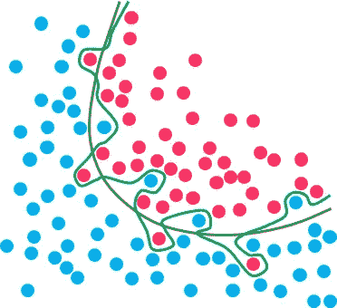
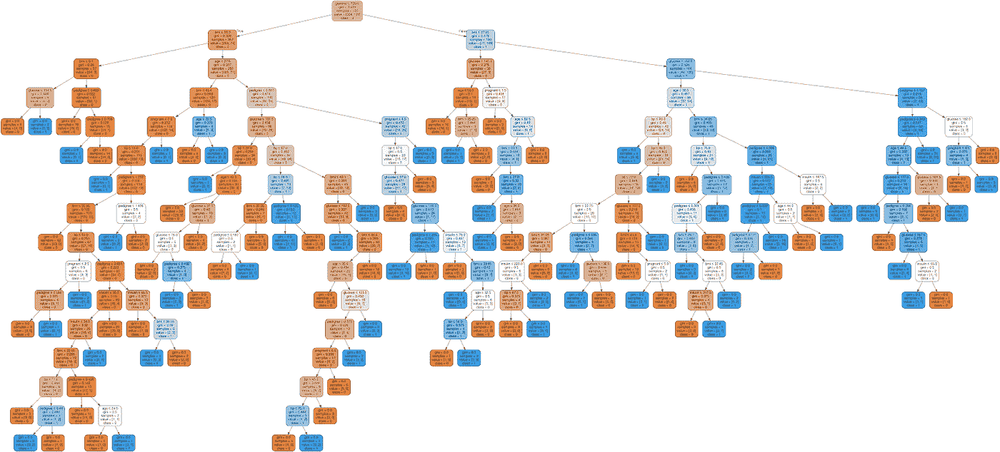
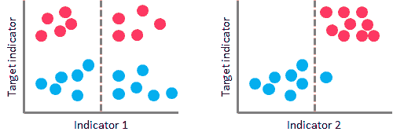
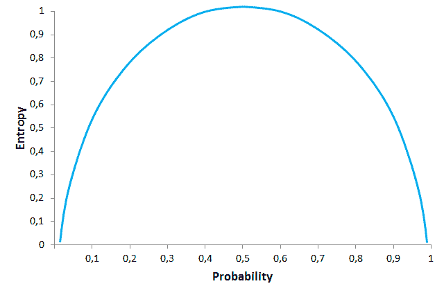

# 决策树完全指南

> 原文：<https://towardsdatascience.com/the-complete-guide-to-decision-trees-28a4e3c7be14?source=collection_archive---------0----------------------->

## 关于机器学习中的顶级算法，你需要知道的一切

Photo by [Helena Hertz](https://unsplash.com/@imperiumnordique?utm_source=medium&utm_medium=referral) on [Unsplash](https://unsplash.com?utm_source=medium&utm_medium=referral)

一开始，学习机器学习(ML)可能会令人生畏。像“梯度下降”、“潜在狄利克雷分配”或“卷积层”这样的术语会吓到很多人。但是也有友好的方式进入这个领域，我认为从决策树开始是一个明智的决定。

决策树可能是最有用的*监督学习*算法之一。与无监督学习(没有输出变量来指导学习过程，数据由算法探索以找到模式)相反，在**监督学习**中，你的现有数据已经被标记，你知道你想要在你获得的新数据中预测哪种行为。这是自动驾驶汽车用来识别行人和物体的算法类型，或者是组织用来估计客户终身价值和客户流失率的算法类型。

> 在某种程度上，监督学习就像跟着老师学习，然后将知识应用到新数据中。

DTs 是 ML 算法，它基于一个描述性特征将数据集逐步分成更小的数据组，直到它们达到足够小的集合，可以用某个**标签**来描述。他们要求你有被标记的数据(用一个或多个标签标记，像植物图片中的植物名称)，所以他们试图根据这些知识标记新的数据。

DTs 算法完美地解决了分类问题(机器将数据分类到类别中，如电子邮件是否是垃圾邮件)和回归问题(机器预测值，如房地产价格)。当因变量为连续变量或定量变量时，使用回归树(例如，如果我们想要估计客户拖欠贷款的概率)，当因变量为分类变量或定性变量时，使用分类树(例如，如果我们想要估计一个人的血型)。

DTs 的重要性依赖于它们在现实世界中有很多应用的事实。作为 ML 中最常用的算法之一，它们被应用于几个行业中的不同功能:

*   DTs 正被用于医疗保健行业，以改善早期检测**认知障碍**中阳性病例的筛查，并识别未来发展为某种类型痴呆症的主要[风险因素。](https://www.news-medical.net/news/20190117/Scientists-design-two-AI-algorithms-to-improve-early-detection-of-cognitive-impairment.aspx)
*   *索菲娅*，[成为沙特公民的机器人](https://www.theverge.com/2017/11/10/16617092/sophia-the-robot-citizen-ai-hanson-robotics-ben-goertzel)，使用 DTs 算法与人类聊天。事实上，使用这些算法的**聊天机器人**已经通过应用创新的调查和友好的聊天从客户那里收集数据，为[健康保险](https://yourstory.com/2018/11/age-alexa-siri-chatbots-next-health-assistants/)等行业带来了好处。谷歌最近收购了 *Onward* ，这是一家使用 DTs 开发[聊天机器人的公司，这些聊天机器人在提供世界一流的客户服务方面具有非凡的功能](https://martechseries.com/predictive-ai/ai-platforms-machine-learning/google-purchases-customer-service-automation-firm-onward/)，而[亚马逊也在向同一方向投资](https://venturebeat.com/2019/01/10/why-25-of-companies-are-copying-amazons-customer-support-model-using-bots-and-ai-vb-live/)，以引导客户快速找到解决方案。
*   通过训练 DTs 从卫星图像中识别**森林损失**的不同原因，有可能[预测森林干扰](https://www.europeanscientist.com/en/agriculture/new-analysis-reveals-causes-of-global-forest-loss/)的最可能原因，如野火、植树造林、大规模或小规模农业以及城市化。DTs 和卫星图像也被用于**农业**对[不同的作物类型](https://www.ncbi.nlm.nih.gov/pmc/articles/PMC4567051/)进行分类，并识别它们的物候阶段。
*   DTs 是[对文本进行情感分析](https://www.infoq.com/articles/sentiment-analysis-whats-with-the-tone)并识别其背后的情感的伟大工具。情绪分析是一种强大的技术，可以帮助组织了解客户的选择和他们的决策驱动因素。
*   在**环境科学**中，DTs 可以帮助确定[应对入侵物种](https://phys.org/news/2018-05-ai-canada-invasive-species.html)的最佳策略，范围从根除到遏制，以及减缓扩散。
*   DTs 还用于改进**金融欺诈检测**。麻省理工学院表明，它可以通过使用经过多种原始数据来源训练的 DTs 来显著提高替代性 ML 模型的性能，以[找到与欺诈案件相匹配的交易和信用卡模式](http://news.mit.edu/2018/machine-learning-financial-credit-card-fraud-0920)。

由于各种原因，DTs 非常受欢迎，因为它们的可解释性可能是它们最重要的优势。它们可以很快被训练出来，而且很容易理解，这为它们打开了通向远远超越科学壁垒的新领域的可能性。如今，DTs 在商业环境中非常流行，其使用也扩展到了民用领域，其中一些应用引起了极大的关注。

芝麻信用公司(隶属于阿里巴巴的一家公司)使用 [DTs 和其他算法来构建一个社会评估系统](https://bluenotes.anz.com/posts/2016/11/china-credit-and-seeing-unforseen-risk)，考虑了各种因素，如支付账单和其他在线活动的准时性。在中国，一个好的“芝麻分”的好处包括在交友网站上更高的知名度，以及在你需要看医生时不用排队。事实上，在中国政府宣布将把所谓的社会信用体系应用于航班和火车，并在一年内禁止有不良行为的人乘坐此类交通工具后，人们担心该体系最终会产生一个庞大的“ML 支持的老大哥”。

# **基础知识**

在电影 *Bandersnatch* (来自网飞的独立黑镜剧集)中，观众可以互动地选择不同的叙事路径，到达不同的故事线和结局。在电影讲故事的背后隐藏着一系列复杂的决定，让观众以一种选择自己的冒险模式移动，为此网飞必须找到一种方法，在以简单的方式呈现每个场景的同时加载多个版本。实际上，网飞制片人所做的是将电影分段，并为观众设置不同的分支点，从而得出不同的结果。换句话说，这就像建造一台 DT 一样。

DTs 由节点、分支和叶子组成。每个**节点**代表一个属性(或特征)，每个**分支**代表一个规则(或决策)，每个**叶子**代表一个结果。树的**深度**由层数定义，不包括根节点。

*In this example, a DT of 2 levels.*

DTs 对数据应用自上而下的方法，因此给定一个数据集，它们试图对它们之间相似的观察值进行分组和标记，并寻找最佳规则来拆分它们之间不相似的观察值，直到它们达到一定程度的相似性。

> 他们使用分层拆分过程，在每一层，他们尝试将数据拆分成两个或更多组，以便属于同一组的数据彼此最相似(**同质性**)，而组之间尽可能不同(**异质性**)。

分割可以是**二进制**(将每个节点分割成*最多*两个子组，并尝试找到最佳分割)，或**多路**(将每个节点分割成多个子组，使用与现有不同值一样多的分割)。在实践中，通常会看到带有二进制拆分的 DTs，但是知道多路拆分有一些优点是很重要的。多路分割耗尽了一个名义属性中的所有信息，这意味着一个属性很少在从根到叶的任何路径中出现一次以上，这使得 DTs 更容易理解。事实上，分割数据的最佳方式可能是为给定的要素找到一组间隔，然后根据这些间隔将数据分割成几个组。

*On the left hand side, a DT with binary splitting, as opposed to a DT with multiway splitting on the right.*

在二维术语中(仅使用 2 个变量)，DTs 将数据领域划分为一组矩形，并在每个矩形中建立一个模型。它们简单而强大，对于数据科学家来说是一个很好的工具。

*Right figure shows the partition of the bidimensional data space produced by the DT on the left (binary split). In practice, however, DTs use numerous variables (usually more than 2).*

DT 中的每个节点都充当某个条件的测试用例，从该节点开始的每个分支都对应于该测试用例的一个可能的答案。

# 修剪那棵树

随着 DTs 中拆分数量的增加，它们的复杂性也会增加。一般来说，简单的 DTs 比超级复杂的 DTs 更受欢迎，因为它们更容易理解，并且不太可能陷入过度拟合。

> **过度拟合**指的是一种模型，它对**训练数据**(它用来学习的数据)学习得如此之好，以至于它在推广到新的(看不见的)数据时遇到了问题。

换句话说，模型学习训练数据中的细节和噪声(数据集中不相关的信息或随机性),以至于对模型在新数据上的性能产生负面影响。这意味着训练数据中的噪声或随机波动被模型拾取并学习为概念。

*While the black line fits the data well, the green line is overfitting*

在这种情况下，您的模型可以很好地处理您预先提供的数据，但是当您将相同的模型暴露给新数据时，它就会崩溃。它无法重复其高度细致的表演。

那么，如何避免 DTs 中的过拟合呢？您需要排除非常适合数据的分支。您需要一个能够归纳新数据并很好地处理新数据的 DT，即使这可能意味着失去训练数据的精度。避免像鹦鹉学舌一样学习和重复特定细节的 DT 模型总是更好，并尝试开发一种具有能力和灵活性的模型，以便在您提供给它的新数据上有体面的性能。

> **修剪**是一种用于处理过度拟合的技术，它通过删除树中几乎没有预测或分类能力的部分来减小 DTs 的大小。

这一过程的目的是通过减少过拟合的影响和去除可能基于噪声或错误数据的 DT 部分来降低复杂性和获得更好的精度。在 DTs 上执行修剪有两种不同的策略:

*   **预修剪:**当信息变得不可靠时，停止生长 DT 分支。
*   **后期剪枝:**当您获取一个完全成长的 DT，然后仅当它导致更好的模型性能时才删除叶节点。这样，当无法进一步改进时，您就可以停止删除节点。

*Example of an unpruned DT, as taken from* [*DataCamp*](https://www.datacamp.com/community/tutorials/decision-tree-classification-python)

总之，正确分类或预测训练数据的每个示例的大 DT 可能不如不完全适合所有训练数据的较小 DT 好。

# **主要 DTs 算法**

现在您可能会问自己:DTs 如何知道选择哪些特性以及如何拆分数据？为了理解这一点，我们需要了解一些细节。

> 所有的 DTs 基本上执行相同的任务:它们检查数据集的所有属性，通过将数据分成子组来找到可能给出最佳结果的属性。他们通过将子组分成越来越小的单元来递归地执行这个任务，直到树完成(由特定标准停止)。

进行拆分的决策会严重影响树的准确性和性能，对于该决策，DTs 可以使用**不同的算法**，这些算法在树的可能结构(例如，每个节点的拆分数量)、如何执行拆分的标准以及何时停止拆分方面有所不同。

那么，我们如何定义拆分哪些属性，何时拆分以及如何拆分呢？要回答这个问题，我们必须回顾一下主要的 DTs 算法:

## CHAID

卡方自动交互检测(CHAID)是最古老的 DT 算法方法之一，它产生适合分类和回归任务的**多路**DT(分裂可以有两个以上的分支)。在构建**分类树**(因变量本质上是分类的)时，CHAID 依靠卡方独立性测试来确定每一步的最佳分割。**卡方检验**检查两个变量之间是否存在关系，并应用于 DT 的每个阶段，以确保每个分支与响应变量的统计显著预测值显著相关。

> 换句话说，它选择与因变量相互作用最强的自变量。

此外，就因变量而言，如果每个预测值的类别彼此之间没有显著差异，则将它们合并。在**回归树**(因变量是连续的)的情况下，CHAID 依靠 **F 检验**(而不是卡方检验)来计算两个总体均值之间的差异。如果 f 检验显著，则创建一个新分区(子节点)(这意味着该分区在统计上不同于父节点)。另一方面，如果目标平均值之间的 f 检验结果不显著，则类别被合并到单个节点中。

CHAID 不会替换丢失的值，并将它们作为一个单独的类来处理，如果合适的话，该类可以与另一个类合并。它还产生了倾向于更宽而不是更深的 DTs(多路特性)，这可能是不切实际的短，并且很难与真实的业务条件相关联。此外，它没有修剪功能。

虽然不是最强大的(在检测最小可能的差异方面)或最快的 DT 算法，但 CHAID 易于管理，灵活，非常有用。

你可以在这个[链接](https://www.r-bloggers.com/chaid-and-r-when-you-need-explanation-may-15-2018/)中找到 CHAID 和 R 的实现

## 手推车

CART 是一种 DT 算法，根据因变量(或目标变量)是分类变量还是数值变量，分别生成**二进制** *分类*或*回归*树。它以原始形式处理数据(不需要预处理)，并且可以在同一个 DT 的不同部分多次使用相同的变量，这可以揭示变量集之间复杂的相互依赖关系。

在**分类树**的情况下，CART 算法使用一种称为*基尼杂质***的度量来创建分类任务的决策点。 **Gini 杂质**给出了分裂有多精细的概念(节点“纯度”的度量)，通过分裂产生的两个组中类的混合程度。当所有的观察值都属于同一个标签时，就有了一个完美的分类，基尼不纯值为 0(最小值)。另一方面，当所有观察值在不同标签中平均分布时，我们面临最坏情况的分裂结果和 0.5(最大值)的基尼杂质值。**

*On the left-hand side, a high Gini Impurity value leads to a poor splitting performance. On the right-hand side, a low Gini Impurity value performs a nearly perfect splitting*

在**回归树**的情况下，CART 算法寻找最小化*最小平方偏差(LSD)* 的分割，在所有可能的选项中选择最小化结果的分割。 **LSD** (有时被称为“方差减少”)度量最小化观察值和预测值之间的平方距离(或偏差)的总和。预测值和观察值之间的差异称为“残差”，这意味着 LSD 选择参数估计值，以使残差平方和最小。

> LSD 非常适合度量数据，与其他算法相比，它能够正确捕获更多有关分割质量的信息。

CART 算法背后的思想是产生一系列的 DTs，每个 DTs 都是“最优树”的候选者。通过**测试**(使用 DT 以前从未见过的新数据)或执行**交叉验证**(将数据集分成“k”个折叠，并在每个折叠上执行测试)来评估每棵树的性能，从而确定最佳树。

购物车**不使用内部绩效评估**进行树选择。相反，DTs 的性能总是通过测试或交叉验证来衡量，只有在评估完成后才进行树的选择。

## ID3

迭代二分法 3 (ID3)是一种 DT 算法，主要用于产生*分类树*。由于在原始数据中构建回归树还没有被证明是如此有效，ID3 主要用于分类任务(尽管一些技术如构建数值区间可以提高其在回归树上的性能)。

> ID3 分割数据属性(二分法)以找到最主要的特征，以自顶向下的方法迭代地执行这个过程以选择 DT 节点。

对于分割过程，ID3 使用*信息增益*度量来选择对分类最有用的属性。**信息增益**是从信息论中提取的一个概念，指的是一组数据中随机性水平的降低:基本上它衡量的是一个特征给我们提供了多少关于一个类的“信息”。ID3 将总是试图最大化这个度量，这意味着具有最高信息增益的属性将首先分裂。

信息增益与**熵**的概念直接相关，熵是对数据中不确定性或随机性的度量。熵值范围从 0(当所有成员属于同一类或样本完全同质时)到 1(当存在完全随机性或不可预测性，或样本被平分时)。

你可以这样想:如果你想做一次无偏的抛硬币，有*完全随机性*或者熵值为 1(“正面”和“反面”一样，概率各为 0.5)。另一方面，如果你掷一枚硬币，例如一枚两面都有“反面”的硬币，事件中的随机性被消除，熵值为 0(得到“反面”的概率将跳到 1，正面”的概率将降到 0)。

*In this graph you can see the relationship between Entropy and the probability of different coin tosses. At the highest level of Entropy, the probability of getting “tails” is equal to the one of getting “heads” (0.5 each), and we face complete uncertainty. Entropy is directly linked to the probability of an event. Example taken from* [*The Null Pointer Exception*](https://nullpointerexception1.wordpress.com/2017/12/13/entropy-in-machine-learning/)

这很重要，因为**信息增益是熵**的减少，并且产生最大信息增益的属性被选择用于 DT 节点。

但是 ID3 也有一些缺点:它不能处理数值属性，也不能处理缺失值，这可能会带来严重的限制。

## C4.5

C4.5 是 ID3 的继任者，代表了几个方面的改进。C4.5 可以处理连续数据和分类数据，适合生成*回归*和*分类树*。此外，它可以通过忽略包含不存在数据的实例来处理缺失值。

与 ID3(使用信息增益作为分裂标准)不同，C4.5 使用*增益比*进行分裂过程。**增益比**是对信息增益概念的修改，通过在选择属性时考虑分支的数量和大小，减少了具有大量分支的 DTs 的偏差。由于信息增益显示出对具有许多结果的属性的不公平偏好，增益比通过考虑每个分割的内在信息来纠正这种趋势(它基本上通过使用分割信息值来“标准化”信息增益)。这样，**具有最大增益比的属性被选择作为分割属性**。

此外，C4.5 包括一项名为 *windowing* 的技术，该技术最初是为了克服早期计算机的内存限制而开发的。**开窗**意味着算法随机选择训练数据的子集(称为“窗口”)，并根据该选择构建 DT。这个 DT 然后被用于分类剩余的训练数据，并且如果它执行了正确的分类，DT 就完成了。否则，所有错误分类的数据点都被添加到窗口中，并且循环重复，直到训练集中的每个实例都被当前 DT 正确分类。由于随机化的使用，这种技术通常导致比标准过程产生的 DTs 更准确的 DTs，因为它捕获了所有“罕见”的实例以及足够多的“普通”病例。

> C4.5 的另一个能力是它可以**修剪** DTs。

C4.5 的剪枝方法基于估计每个内部节点的错误率，并且如果叶的估计错误较低，则用叶节点替换它。简而言之，如果算法估计如果删除一个节点的“子节点”并且该节点成为叶节点，DT 将更准确，那么 C4.5 将删除这些子节点。

该算法的最新版本被称为 C5.0，它是在专有许可下发布的，对 C4.5 进行了一些改进，如:

*   **速度提升:** C5.0 明显快于 C4.5(快了几个数量级)。
*   **内存使用:** C5.0 比 C4.5 更有内存效率。
*   **可变误分类成本:**在 C4.5 中，所有的错误都被同等对待，但在实际应用中，一些分类错误比其他分类错误更严重。C5.0 允许为每个预测/实际类对定义单独的成本。
*   **更小的决策树:** C5.0 得到的结果与 C4.5 相似，但 DTs 要小得多。
*   **其他数据类型:** C5.0 可以处理日期、时间，并允许将值标注为“不适用”。
*   **Winnowing:** C5.0 可以在构造分类器之前自动对属性进行 Winnowing，丢弃那些可能没有帮助或者看起来不相关的属性。

你可以在这里找到 C4.5 和 C5.0 的比较

# **树的阴暗面**

当然，DTs 有很多优点。由于其简单性以及易于理解和实施的事实，它们被广泛用于大量行业中的不同解决方案。但是你也需要意识到它的缺点。

> DTs 倾向于在他们的训练数据上**过度拟合**，如果之前显示给他们的数据与之后显示给他们的数据不匹配，他们就会表现不佳。

他们还受到**高方差**的影响，这意味着数据中的一个小变化会导致一组非常不同的分裂，使解释变得有些复杂。它们遭受固有的不稳定性，因为由于它们的等级性质，顶部分裂中的误差的影响向下传播到下面的所有分裂。

在分类树中，**错误分类观察的后果在某些类**中比其他类更严重。例如，当一个人实际上会心脏病发作时，预测他/她不会心脏病发作可能比反之更糟糕。这个问题在像 C5.0 这样的算法中得到缓解，但在其他算法中仍然是一个严重的问题。

如果一些类支配其他类，DTs 也可以创建**偏向**树。这是不平衡数据集中的一个问题(数据集中的不同类具有不同的观察值)，在这种情况下，建议在构建 DT 之前平衡 de 数据集。

在回归树的情况下，DTs 只能在他们基于之前看到的数据创建的值的范围内进行预测，这意味着他们对他们可以产生的值有**边界**。

在每一级，DTs 寻找可能的最佳分割，以便优化相应的分割标准。

> 但是 DTs 分裂算法不能看到远远超出它们正在操作的当前级别(它们是**【贪婪】**)，这意味着它们在每一步都寻找局部最优而不是全局最优。

DTs 算法根据一些分裂标准一次生长一个节点的树，并且不实现任何回溯技术。

# **群众的力量**

但是好消息是:有不同的策略来克服这些缺点。**集成方法**将几个 DTs 结合起来，以提高单个 DTs 的性能，并且是克服已经描述的问题的重要资源。这个想法是使用相同的学习算法训练多个模型，以获得更好的结果。

> 大概执行集合 DTs 的两个最常见的技术是*打包*和*助推*。

**当目标是减少 DT 的方差时，使用 Bagging** (或 Bootstrap Aggregation)。**方差**与 DTs 非常不稳定的事实有关，因为数据的微小变化可能会导致生成完全不同的树。因此，Bagging 的想法是通过并行创建**随机数据子集(来自训练数据)来解决这个问题，其中任何观察都有**相同的概率**出现在新的子集数据中。接下来，子集数据的每个集合用于训练 DTs，产生不同 DTs 的集合。最后，使用这些不同 DTs 的所有预测的平均值，这产生了比单个 DTs 更健壮的性能。**随机森林**是 Bagging 的扩展，它需要额外的一步:除了获取数据的随机子集，它还需要随机选择特征，而不是使用所有特征来增长 DTs。**

****Boosting** 是另一种创建预测值集合以减少 DT 方差的技术，但采用了不同的方法。它使用一种**顺序方法**来拟合连续的 DTS，并且在每一步都试图减少来自先前树的错误。使用增强技术，每个分类器都根据数据进行训练，并考虑到先前分类器的成功。在每个训练步骤之后，权重基于之前的表现被重新分配。通过这种方式，**错误分类的数据会增加其权重**以强调最困难的情况，以便后续的 DTs 在训练阶段关注它们并提高其准确性。与 Bagging 不同，在 Boosting 中，观察值是加权的，因此它们中的一些将更频繁地参与新的数据子集。作为该过程的结果，整个集合的组合提高了 DTs 的性能。**

**在 Boosting 中，有几种替代方法可以确定在训练和分类步骤中使用的权重(例如，Gradient Boost、XGBoost、AdaBoost 等)。**

**你可以在这里找到这两种技术[的异同点](https://quantdare.com/what-is-the-difference-between-bagging-and-boosting/)**

> **对这些话题感兴趣？在 [Linkedin](https://www.linkedin.com/in/lopezyse/) 或 [Twitter](https://twitter.com/lopezyse) 上关注我**