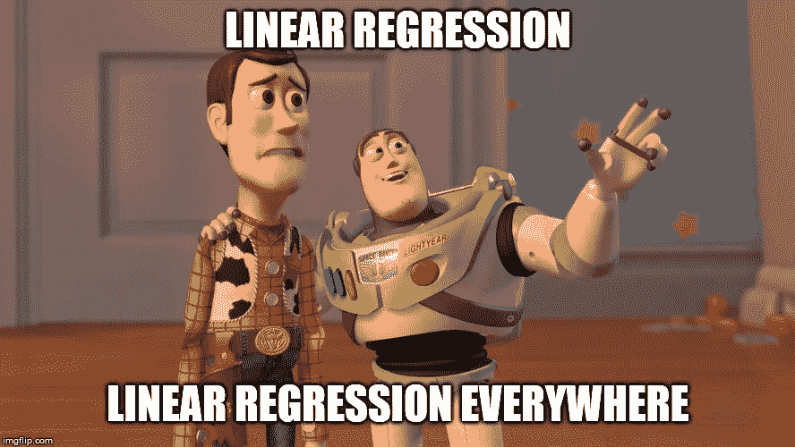
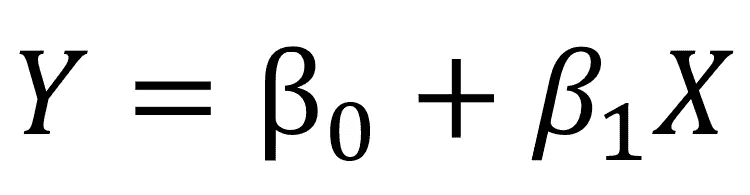
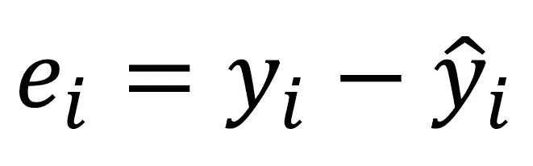
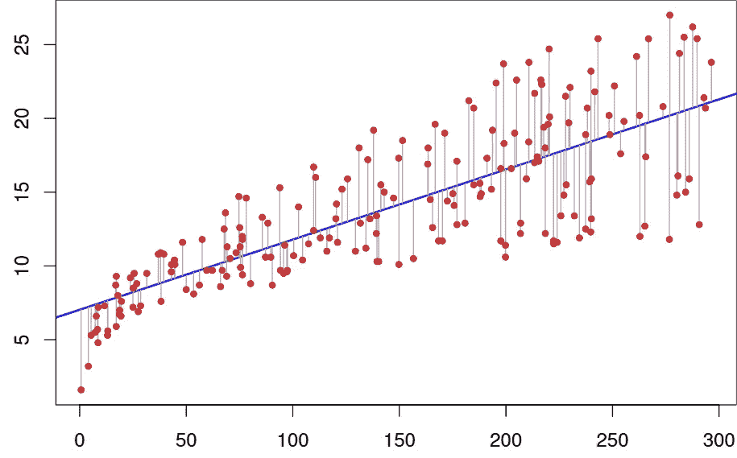
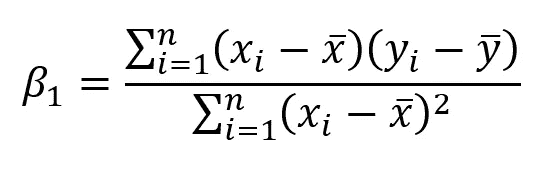
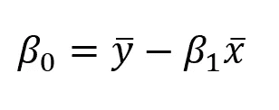
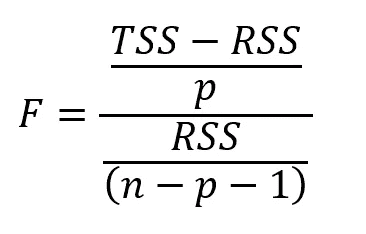
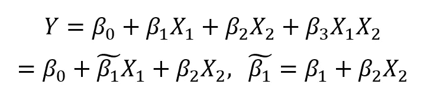
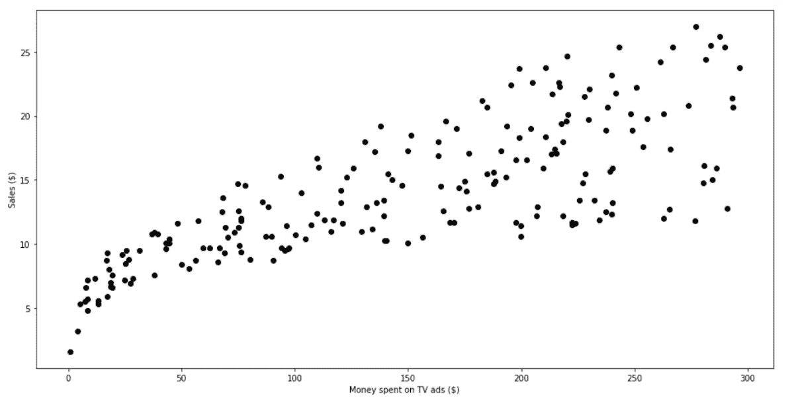
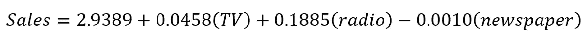

# Python 线性回归完全指南

> 原文：<https://towardsdatascience.com/the-complete-guide-to-linear-regression-in-python-3d3f8f06bf8?source=collection_archive---------0----------------------->

## 从理论到实践，学习线性回归的基本原理，并编写代码在数据集上实现它。



# 介绍

本文试图成为您在理解和执行线性回归时需要的参考。虽然算法很简单，但只有少数人真正理解其中的基本原理。

首先，我们将深入挖掘线性回归理论，以了解其内部工作原理。然后，我们将在 Python 中实现该算法来建模一个业务问题。

我希望这篇文章能找到你的书签！现在，让我们开始吧！

> 关于机器学习、深度学习和人工智能的实践视频教程，请查看我的 [YouTube 频道](https://www.youtube.com/channel/UC-0lpiwlftqwC7znCcF83qg?view_as=subscriber)。

# 该理论

How you’ll feel studying linear regression

线性回归可能是统计学习最简单的方法。对于更高级的方法来说，这是一个很好的起点，事实上，许多新奇的统计学习技术可以被视为线性回归的扩展。因此，在进入更复杂的方法之前，理解这个简单的模型将建立一个良好的基础。

线性回归很好地回答了以下问题:

*   两个变量之间有关系吗？
*   关系有多牢固？
*   哪个变量的贡献最大？
*   我们能多精确地估计每个变量的影响？
*   我们能多精确地预测目标？
*   关系是线性的吗？(咄)
*   有交互作用吗？

## 估计系数

假设我们只有一个变量和一个目标。然后，线性回归表示为:



Equation for a linear model with 1 variable and 1 target

在上面的等式中，*β*是系数。这些系数是我们用模型进行预测所需要的。

那么我们如何找到这些参数呢？

为了找到参数，我们需要最小化**最小平方**或**误差平方和**。当然，线性模型并不完美，它不会准确预测所有数据，这意味着实际值和预测值之间存在差异。误差很容易通过下式计算:



Subtract the prediction from the true value

但是为什么误差是平方的呢？

我们平方误差，因为预测可以高于或低于真实值，分别导致负的或正的差异。如果我们不对误差进行平方，误差的总和可能会因为负差异而减少，而不是因为模型非常适合。

此外，平方误差不利于较大的差异，因此最小化平方误差“保证”更好的模型。

让我们来看一个图表，以便更好地理解。



Linear fit to a data set

在上图中，红点是真实数据，蓝线是线性模型。灰色线条表示预测值和真实值之间的误差。因此，蓝线是使灰线的平方长度之和最小的线。

经过一些对本文来说过于繁琐的数学计算后，您最终可以用下面的等式来估计系数:



其中 *x 条*和 *y 条*代表平均值。

## 估计系数的相关性

现在你有了系数，你如何知道它们是否与预测你的目标相关？

最好的方法是找到 *p 值。**p 值*用于量化统计显著性；它允许判断是否要拒绝零假设。

无效假设？

对于任何建模任务，假设在特征和目标之间有某种关联。因此，零假设是相反的:**在特征和目标之间没有相关性**。

因此，找到每个系数的 *p 值*将会知道该变量对于预测目标是否具有统计显著性。根据一般经验，如果 *p 值*小于**0.05**:变量和目标之间有很强的关系。

## 评估模型的准确性

通过寻找变量的 *p 值*，您发现您的变量具有统计显著性。太好了！

现在，你怎么知道你的线性模型是好的呢？

为了进行评估，我们通常使用 RSE(剩余标准误差)和 R 统计量。


RSE formula


R² formula

第一个误差指标很容易理解:残差越低，模型就越符合数据(在这种情况下，数据越接近线性关系)。

至于 R 度量，它测量目标中可以用特征 X 解释的**可变性比例。所以假设线性关系，如果特征 X 能解释(预测)目标，那么比例高，R 值会接近 1。如果相反，R 值则更接近于 0。**

# 多元线性回归理论

在现实生活中，永远不会有单一的特征来预测目标。那么，我们一次对一个特征进行线性回归吗？当然不是。我们简单地执行多元线性回归。

该方程非常类似于简单的线性回归；简单地将预测值的数量和它们相应的系数相加:


Multiple linear regression equation. **p** is the number of predictors

## 评估预测值的相关性

以前，在简单的线性回归中，我们通过寻找特征的 *p 值*来评估特征的相关性。

在多元线性回归的情况下，我们使用另一个指标:F 统计量。



F-statistic formula. **n** is the number of data points and **p** is the number of predictors

这里，F 统计量是针对整个模型计算的，而 *p 值*是针对每个预测值的。如果有强关系，那么 F 会远大于 1。否则，它将近似等于 1。

如何使*比*大*比 1* 足够大？

这个很难回答。通常，如果有大量的数据点，F 可能略大于 1，表明有很强的关系。对于小数据集，F 值必须远大于 1，以表明强相关关系。

为什么我们不能在这种情况下使用 *p 值*？

由于我们正在拟合许多预测值，因此我们需要考虑有许多特征的情况( *p* 很大)。对于非常大量的预测值，总有大约 5%的预测值偶然具有非常小的 *p 值* ***甚至*** ***，尽管它们在统计上不显著。因此，我们使用 F 统计量来避免将不重要的预测因子视为重要的预测因子。***

## 评估模型的准确性

就像简单的线性回归一样，R 可以用于多元线性回归。但是，要知道添加更多的预测值总是会增加 R 值，因为模型必然会更好地拟合训练数据。

然而，这并不意味着它将在测试数据上表现良好(对未知数据点进行预测)。

## 添加交互

一个线性模型中有多个预测因子意味着一些预测因子可能会对其他预测因子产生影响。

例如，你想预测一个人的工资，知道她的年龄和上学的年数。当然，一个人越老，他在学校度过的时间就越多。那么我们如何对这种互动效应建模呢？

考虑这个非常简单的例子，有两个预测值:



Interaction effect in multiple linear regression

如你所见，我们简单地将两个预测因子相乘，并关联一个新的系数。简化公式，我们现在看到系数受另一个特征的值的影响。

作为一般规则，如果我们包括交互模型，我们应该包括特征的个体效应，即使它的 *p 值*不显著。这就是所谓的**等级原则**。这背后的基本原理是，如果两个预测者相互作用，那么包括他们各自的贡献将对模型产生很小的影响。

好吧！现在我们知道了它是如何工作的，让我们让它工作吧！我们将通过 Python 中的简单和多元线性回归来工作，我将展示如何在这两种情况下评估参数和整体模型的质量。

你可以在这里抓取代码和数据[。](https://github.com/marcopeix/ISL-linear-regression)

我强烈建议您在自己的 Jupyter 笔记本中遵循并重新创建这些步骤，以充分利用本教程。

我们开始吧！

We all code like this, right?

## 介绍

数据集包含关于花费在广告上的钱及其产生的销售额的信息。钱花在了电视、广播和报纸广告上。

**目标是使用线性回归来了解广告支出如何影响销售。**

## 导入库

使用 Python 的优势在于，我们可以访问许多库，这些库允许我们快速读取数据、绘制数据并执行线性回归。

我喜欢在笔记本顶部导入所有必要的库，以保持一切井然有序。导入以下内容:

```
import pandas as pd
import numpy as npimport matplotlib.pyplot as pltfrom sklearn.linear_model import LinearRegression
from sklearn.metrics import r2_scoreimport statsmodels.api as sm
```

## 读取数据

假设您下载了数据集，将它放在项目文件夹内的一个`data`目录中。然后，像这样读取数据:

```
data = pd.read_csv("data/Advertising.csv")
```

为了查看数据的样子，我们执行以下操作:

```
data.head()
```

你应该看看这个:


如您所见，列`Unnamed: 0`是多余的。因此，我们删除它。

```
data.drop(['Unnamed: 0'], axis=1)
```

好了，我们的数据是干净的，可以进行线性回归了！

# 简单线性回归

## 系统模型化

对于简单的线性回归，我们只考虑电视广告对销售的影响。在开始建模之前，让我们看一下数据是什么样子的。

我们使用`matplotlib`，一个流行的 Python 绘图库来制作散点图。

```
plt.figure(figsize=(16, 8))
plt.scatter(
    data['TV'],
    data['sales'],
    c='black'
)
plt.xlabel("Money spent on TV ads ($)")
plt.ylabel("Sales ($)")
plt.show()
```

运行这个代码单元，您应该会看到这个图形:



Scatter plot of money spent on TV ads and sales

正如你所看到的，在电视广告上的花费和销售额之间有着明显的关系。

让我们看看如何生成该数据的线性近似值。

```
X = data['TV'].values.reshape(-1,1)
y = data['sales'].values.reshape(-1,1)reg = LinearRegression()
reg.fit(X, y)print("The linear model is: Y = {:.5} + {:.5}X".format(reg.intercept_[0], reg.coef_[0][0]))
```

就这样？

是啊！对数据集拟合一条直线并查看方程的参数就是这么简单。在这种情况下，我们有


Simple linear regression equation

让我们想象一下这条线是如何拟合数据的。

```
predictions = reg.predict(X)plt.figure(figsize=(16, 8))
plt.scatter(
    data['TV'],
    data['sales'],
    c='black'
)
plt.plot(
    data['TV'],
    predictions,
    c='blue',
    linewidth=2
)
plt.xlabel("Money spent on TV ads ($)")
plt.ylabel("Sales ($)")
plt.show()
```

现在，你看:


Linear fit

从上图来看，似乎一个简单的线性回归可以解释电视广告支出和销售额的总体影响。

## 评估模型的相关性

现在，如果你还记得这篇[文章](/linear-regression-understanding-the-theory-7e53ac2831b5)中的内容，为了看看这个模型是否好，我们需要看看每个系数的 R 值和 p 值*。*

*我们是这样做的:*

```
*X = data['TV']
y = data['sales']X2 = sm.add_constant(X)
est = sm.OLS(y, X2)
est2 = est.fit()
print(est2.summary())*
```

*这给了你这个可爱的输出:*

**

*R² and p-value*

*查看这两个系数，我们有一个非常低的 *p 值*(尽管它可能不完全是 0)。这意味着这些系数和目标(销售额)之间有很强的相关性。*

*然后，看 R 值，我们有 0.612。因此，**大约 60%的销售变化可以用花在电视广告上的金额来解释**。这没问题，但肯定不是我们能准确预测销售的最好方法。当然，在报纸和广播广告上的花费肯定会对销售产生一定的影响。*

*让我们看看多元线性回归是否会表现得更好。*

# *多元线性回归*

## *系统模型化*

*就像简单的线性回归一样，我们将定义我们的特性和目标变量，并使用 *scikit-learn* 库来执行线性回归。*

```
*Xs = data.drop(['sales', 'Unnamed: 0'], axis=1)
y = data['sales'].reshape(-1,1)reg = LinearRegression()
reg.fit(Xs, y)print("The linear model is: Y = {:.5} + {:.5}*TV + {:.5}*radio + {:.5}*newspaper".format(reg.intercept_[0], reg.coef_[0][0], reg.coef_[0][1], reg.coef_[0][2]))*
```

*仅此而已！从这个代码单元，我们得到下面的等式:*

**

*Multiple linear regression equation*

*当然，我们无法想象所有三种媒体对销售的影响，因为它总共有四个维度。*

*请注意，报纸的系数是负的，但也相当小。与我们的模型相关吗？让我们通过计算每个系数的 F 统计量、R 值和 *p 值*来看看。*

## *评估模型的相关性*

*正如您所料，这里的过程与我们在简单线性回归中所做的非常相似。*

```
*X = np.column_stack((data['TV'], data['radio'], data['newspaper']))
y = data['sales']X2 = sm.add_constant(X)
est = sm.OLS(y, X2)
est2 = est.fit()
print(est2.summary())*
```

*您会得到以下结果:*

**

*R², p-value and F-statistic*

*可以看到，R 远高于简单线性回归，其值为 **0.897** ！*

*还有，F 统计量是 **570.3** 。这比 1 大得多，而且由于我们的数据集相当小(只有 200 个数据点)，它**表明广告支出和销售**之间有很强的关系。*

*最后，因为我们只有三个预测值，所以我们可以考虑它们的 *p 值*来确定它们是否与模型相关。当然，您会注意到第三个系数(报纸的系数)有一个很大的 *p 值*。因此，报纸上的广告支出**在统计上并不显著**。移除那个预测因子会稍微降低 R 值，但我们可能会做出更好的预测。*

*你真棒🤘。祝贺你坚持到最后，你现在是线性回归的大师了！*

*如上所述，这可能不是性能最好的算法，但对理解线性回归很重要，因为它是更复杂的统计学习方法的基础。*

*我希望你有时间会回头参考这篇文章。*

*干杯！*