# Python 中重采样方法和正则化的完整指南

> 原文：<https://towardsdatascience.com/the-complete-guide-to-resampling-methods-and-regularization-in-python-5037f4f8ae23?source=collection_archive---------16----------------------->

## 了解重采样方法和正则化如何改进模型，并在项目设置中应用这些方法。

Please, use resampling methods

重采样和正则化是两个重要的步骤，可以显著提高模型的性能和对模型的信心。

在本文中，交叉验证将被广泛讨论，因为它是最流行的重采样方法。然后，将介绍岭回归和 lasso 作为线性模型的正则化方法。之后，将在项目设置中应用重采样和正则化。

我希望这篇文章能作为你未来某个项目的参考，并能成为你的书签。

我们开始吧！

> 关于机器学习、深度学习和人工智能的实践视频教程，请查看我的 [YouTube 频道](https://www.youtube.com/channel/UC-0lpiwlftqwC7znCcF83qg?view_as=subscriber)。

# 重采样的重要性

重采样方法是现代统计学中不可缺少的工具。它们涉及重复地从训练集中抽取样本，并在每个样本上重新拟合感兴趣的模型，以便获得关于拟合模型的附加信息。这使我们能够获得更多的信息，而这些信息是仅拟合一次模型所无法获得的。

通常，数据科学项目的目标是使用训练数据创建模型，并让它对新数据进行预测。因此，重采样方法允许我们在不收集新数据的情况下，观察模型在未经训练的数据上的表现。

# 交叉验证

交叉验证( **CV** )用于估计与模型相关的测试误差，以评估其性能或选择适当的灵活性水平。评估一个模型的性能通常被定义为**模型评估**，而**模型选择**用于选择灵活性的级别。这个术语广泛用于数据科学领域。

现在，有不同的方法来执行交叉验证。让我们逐一探索。

## 验证集方法

这是最基本的方法。它只是将数据集随机分为两部分:一个**训练集**和一个**验证集**或**排除集**。该模型适合训练集，并且该适合的模型用于对验证集进行预测。

Validation set schematic

上面是验证集方法的示意图。你在一个数据集中有 *n* 个观察值，它被随机分成两部分。蓝色一侧代表训练集，橙色一侧是验证集。数字只是代表行数。

当然，这种简单的方法也有一些缺点。

首先，验证测试错误率是高度可变的，这取决于训练和验证集中的观察值。

第二，只有一小部分观察值用于拟合模型。然而，我们知道统计方法在数据较少的情况下往往表现较差。

MSE for the validation set approach

在上面的左侧，您可以看到验证集方法仅应用一次时的 MSE。在右边，这个过程重复了 10 次。如你所见，MSE 变化很大。

这显示了使用验证集方法时 MSE 的显著可变性。

当然，有一些方法可以解决这些缺点。

## 留一交叉验证

留一交叉验证( **LOOCV** )是比验证集方法更好的选择。不是将数据集分成两个子集，而是只使用一个观察值进行验证，其余的用于拟合模型。

LOOCV schematic

以上是 LOOCV 的示意图。如您所见，只有一个观察用于验证，其余的用于训练。然后，该过程重复多次。

多次运行后，误差估计为:

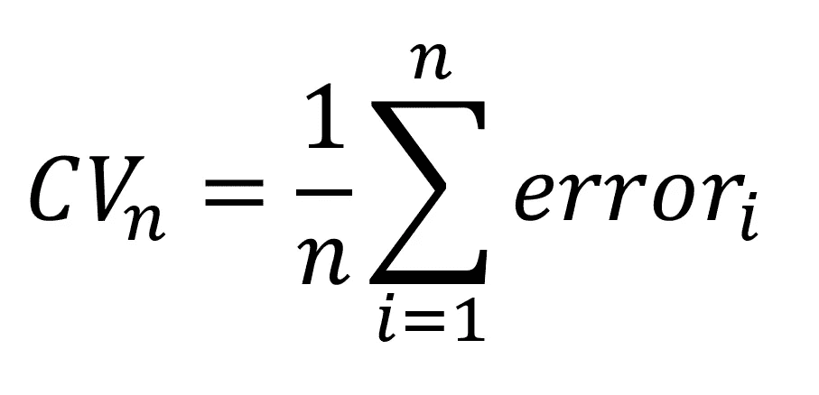

LOOCV estimated error

这仅仅是每次运行的误差的平均值。

这种方法要好得多，因为它的偏差要小得多，因为更多的观察数据被用来拟合模型。在训练/验证集分割中没有随机性。因此，我们降低了 MSE 的可变性，如下所示。

MSE of LOOCV

## k 倍交叉验证

这种方法包括将一组观察值随机分成大小大致相同的 *k* 组或**组**。第一个折叠被视为验证集，模型适合其余的折叠。然后重复该过程 *k* 次，其中不同的组被视为验证集。

k-fold cross-validation schematic

因此，你意识到 LOOCV 是一个特殊的 k 重交叉验证案例，其中 k*等于观察总数 *n* 。但是，通常将 *k* 设置为等于 5 或 10。*

尽管 LOOCV 对于大型数据集来说是计算密集型的，但是 k-fold 更通用，可以用于任何模型。此外，它通常比 LOOCV 给出更准确的测试误差估计。因此，要评估和验证您的模型，k 倍交叉验证方法是最佳选择。

既然我们知道了交叉验证是如何工作的，以及它如何提高我们对模型性能的信心，那么让我们看看如何通过正则化来改进模型本身。

# 正规化

正则化方法有效地防止了过度拟合。当模型在训练集上表现良好，但在验证集上表现不佳时，就会发生过度拟合。

我们已经看到，线性模型，如[线性回归](/the-complete-guide-to-linear-regression-in-python-3d3f8f06bf8)和推而广之的[逻辑回归](/the-complete-guide-to-classification-in-python-b0e34c92e455)，使用最小二乘法来估计参数。

现在，我们探索如何通过用其他拟合过程代替最小二乘拟合来改进线性模型。这些方法将产生更好的预测精度和模型可解释性。

但是为什么呢？为什么要用其他拟合方式？

最小二乘拟合在大多数情况下是可行的，但也有失败的情况。

例如，如果您的观察值数量 *n* 大于预测值数量 *p* ，那么最小二乘估计将具有较低的方差，并且表现良好。另一方面，当 *p* 大于 *n* (预测值多于观测值)时，方差为无穷大，该方法无法使用！

此外，多元线性回归往往会增加与响应实际不相关的变量。这给模型增加了不必要的复杂性。如果有一种方法可以自动执行特征选择，比如只包含最相关的变量，那就太好了。

为了实现这一点，我们引入了**岭回归**和**套索**。这是两种常见的正则化方法，也称为**收缩方法**。

# 收缩方法

将估计的系数向 0 收缩可以显著提高拟合度并减少系数的方差。在这里，我们探讨**岭回归**和**套索**。

## 里脊回归

传统的线性拟合涉及最小化 RSS(残差平方和)。在岭回归中，添加了一个新参数，现在参数将最小化:

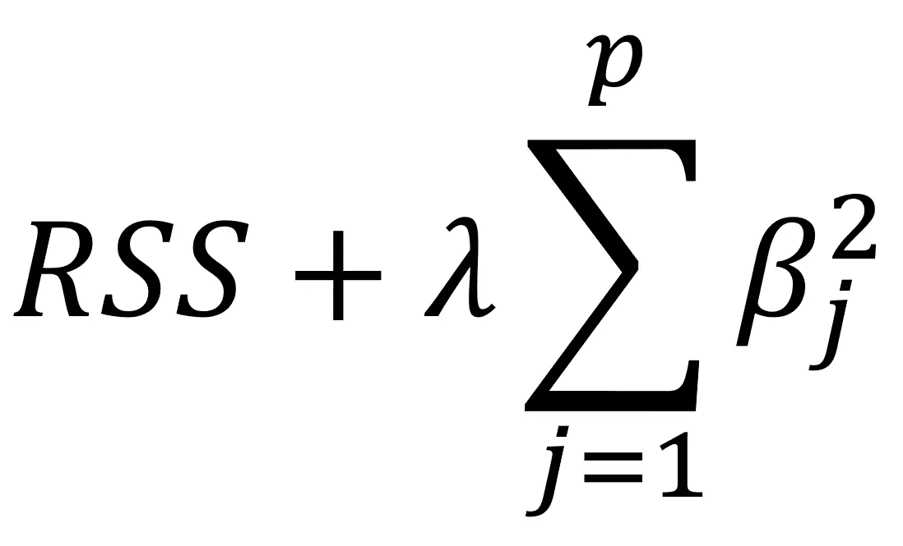

其中*λ*为**调谐参数**。使用交叉验证找到该参数，因为它必须最小化测试误差。因此，使用范围*λ*来拟合模型，并且最小化测试误差的*λ*是最佳值。

这里，岭回归将包括模型中所有的 *p* 预测值。因此，这是一种提高模型拟合度的好方法，但它不会执行变量选择。

## 套索

与岭回归类似，套索将最小化:

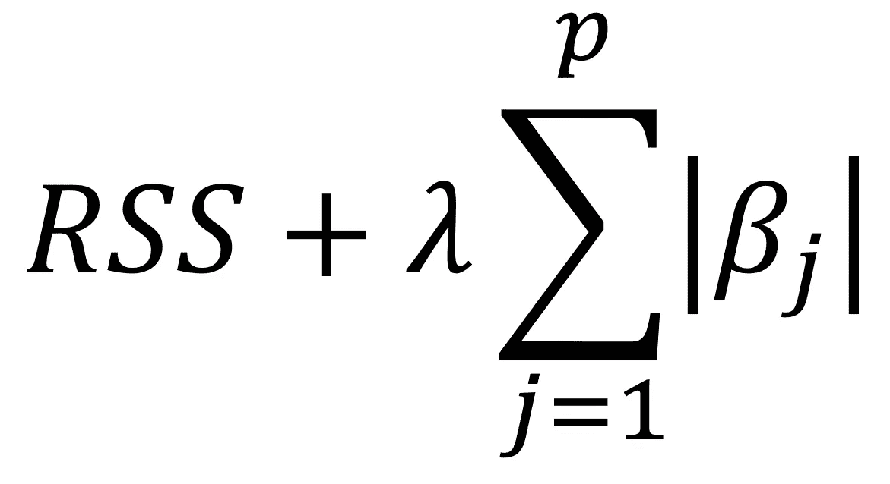

注意，我们使用参数*β*的绝对值，而不是它的平方值。此外，还存在相同的调谐参数。

然而，如果*λ*足够大，一些系数将有效地为 0！因此，lasso 还可以执行变量选择，使模型更容易解释。

# 项目

太好了！我们知道正则化和重采样是如何工作的。现在，让我们在项目设置中应用这些技术。

打开 Jupyter 笔记本，获取数据集。如果你遇到困难，还可以使用[解决方案笔记本](https://github.com/marcopeix/ISL-Ridge-Lasso)。

我们开始吧！

## 导入库

像任何项目一样，我们导入常用的库来帮助我们执行基本的数据操作和绘图。

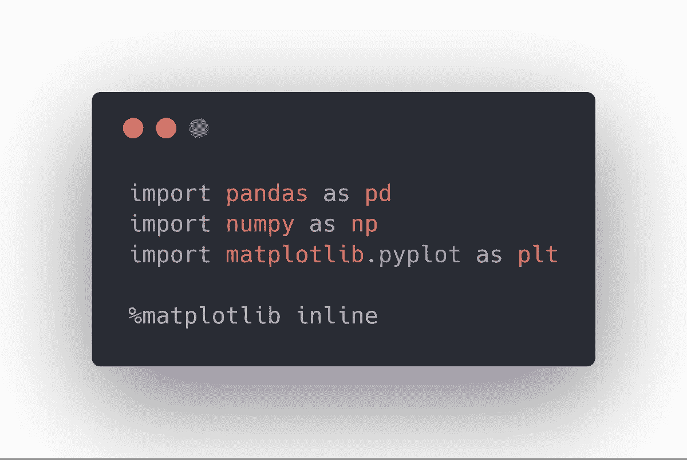

现在，我们可以开始探索性的数据分析了。

# 探索性数据分析

我们从导入数据集开始，查看前五行:

您应该看到:

请注意，*未命名:0* 列是无用的。让我们把它拿出来。

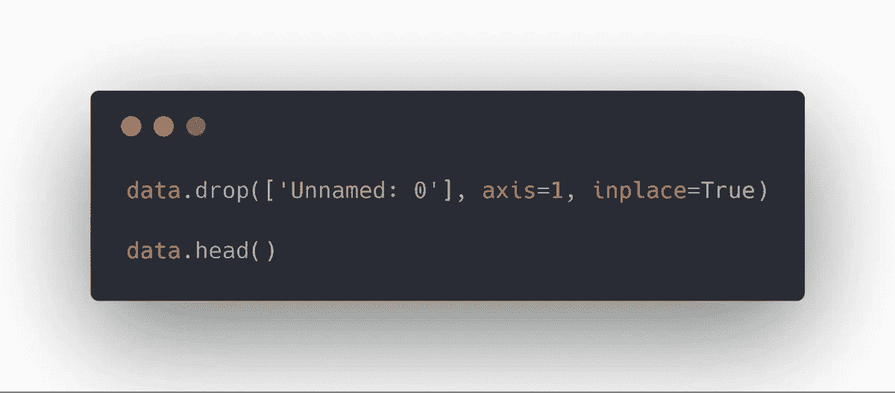

现在，我们的数据集看起来像这样:

如你所见，我们只有三种广告媒体，而*销售额*是我们的目标变量。

让我们通过绘制散点图来看看每个变量是如何影响销售的。首先，我们构建一个辅助函数来绘制散点图:

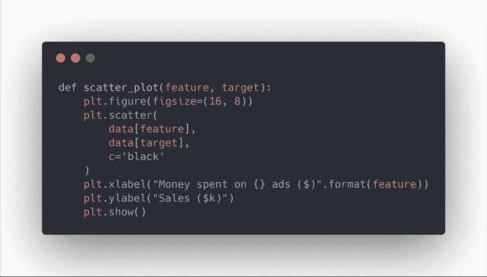

现在，我们可以为每个特征生成三个不同的图。

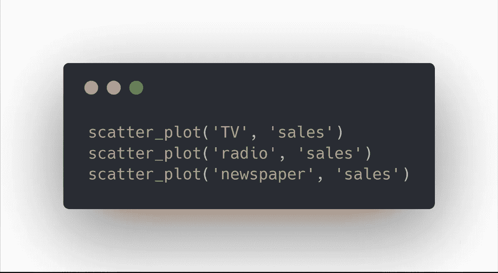

您会得到以下结果:

Sales with respect to money spend on TV ads

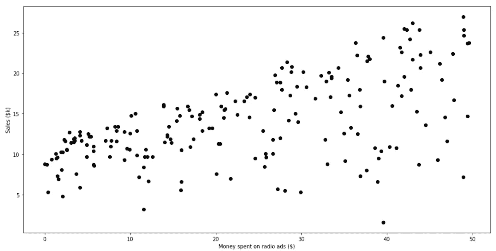

Sales with respect to money spent on radio ads

Sales with respect to money spent on newspaper ads

正如你所看到的，电视和广播广告似乎是销售的良好预测，而销售和报纸广告之间似乎没有相关性。

幸运的是，我们的数据集不需要进一步处理，所以我们准备好马上开始建模了！

# 系统模型化

## 多元线性回归—最小二乘拟合

在浏览之前，让我们先看看代码是什么样子的。

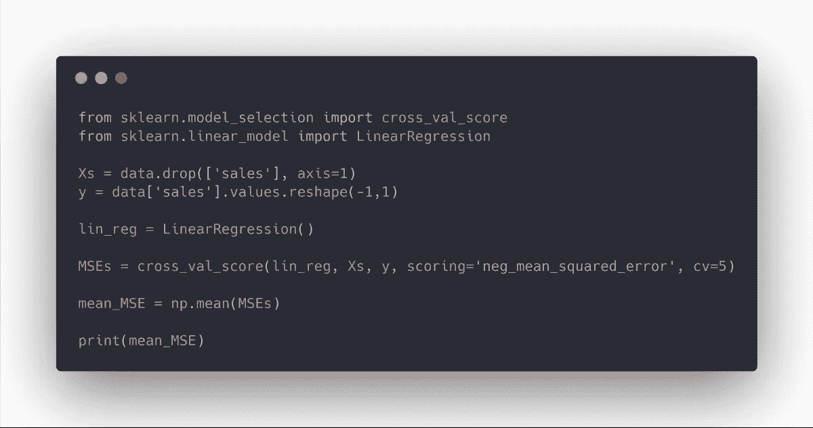

首先，我们导入 *LinearRegression* 和 *cross_val_score* 对象。第一个对象将允许我们拟合一个线性模型，而第二个对象将执行 k-fold 交叉验证。

然后，我们定义我们的特征和目标变量。

*cross_val_score* 将返回每个交叉验证步骤的 MSE 数组。在我们的例子中，我们有五个。所以我们取 MSE 的平均值，打印出来。您应该得到-3.0729 的负 MSE。

现在，我们来看看岭回归和套索哪个会更好。

## 里脊回归

对于岭回归，我们引入 *GridSearchCV* 。这将允许我们使用一系列不同的正则化参数自动执行 5 重交叉验证，以便找到*α*的最佳值。

代码如下所示:

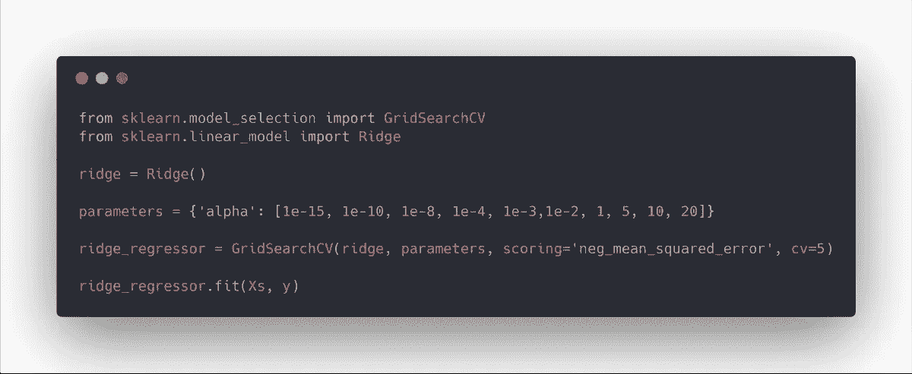

然后，我们可以通过以下公式找到最佳参数和最佳 MSE:

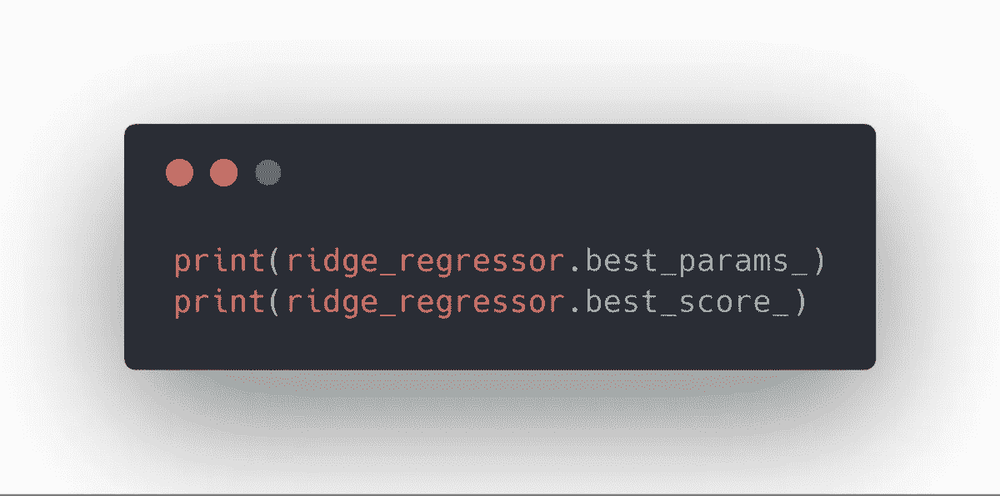

您应该看到 *alpha* 的最佳值是 20，MSE 为负-3.07267。这是对基本多元线性回归的一点改进。

## 套索

对于 lasso，我们遵循与岭回归非常相似的过程:

在这种情况下， *alpha* 的最优值为 1，负的 MSE 为-3.0414，这是三个模型中最好的分数！

就是这样！现在，您已经了解了重采样和正则化如何极大地改进您的模型，并且知道了如何在项目设置中实现这两种方法。

我希望这篇文章对你有用，并且你可以参考它。

干杯！