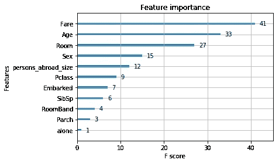

# 开始数据科学和人工智能之旅的完整指南。

> 原文：<https://towardsdatascience.com/the-complete-guide-to-start-your-datascience-ai-journey-c3d867215934?source=collection_archive---------8----------------------->

人工智能和数据科学已经是每个人都应该发展的技能。根据本指南，我们将快速浏览一个教程，向您展示如何开始这一技术之旅(学习和应用技能的平台、在您的计算机上安装、有用的软件)。在本文结束时，你将能够运行你的第一个机器学习程序！这个指南是为非专业人士设计的，所以不用担心！:-)

*你现在已经准备好开始你的数据科学&人工智能之旅。欢迎登机！*


# 让自己为数据科学做好准备

# 软技能

**教员自学**


数据科学/人工智能/机器学习/深度学习，所有这些领域目前都在定义中。所以首先要学习的是**永远积极学习的能力**。
对某事没有把握？寻找监督算法的定义？你程序中的一个错误？[**Google**](https://www.google.com/)**it**(或者使用其他任何搜索引擎作为 [Qwant](https://www.qwant.com/) 或者 [Ecosia](https://www.ecosia.org/) )！小心你的消息来源，因为人工智能是一个新的领域，你可能会看到许多不同的，有时是矛盾的信息。在这里，没有人有关于定义或知识的绝对真理。搜索、互动和构建你自己的想法！这也是我推荐**向协作平台学习的原因。在人工智能等热门话题上，协作平台是一个很好的信息来源，因为你可以浏览讨论主题，识别人物，并能够质疑任何答案或询问更多细节。如果你有问题或疑问，你可以确定在你之前已经有人在某个网站上问过了。你可能已经能够帮助别人了，所以不要犹豫，贡献自己的力量吧:**


*   [栈溢出](https://stackoverflow.com/)你新的最好的编码朋友
*   [Quora](https://www.quora.com/) 共享知识平台
*   [维基百科](https://www.wikipedia.org/)宇宙百科
*   [中等](https://medium.com/)对了

当你在机器学习方面更高级一点的时候**你的主要参考资料将会是来自图书馆**的文档，例如来自 [scikit-learn here](https://scikit-learn.org) 或 [Tensorflow](https://www.tensorflow.org/api_docs) 和 [Pytorch](https://pytorch.org/docs/stable/index.html) 的文档。

# 硬技能


**数学和统计知识**

机器学习、数据科学和人工智能需要很强的数学和统计知识。以下是您开始了解数据科学必须经历的知识领域(请不要犹豫，用一些其他领域来补充列表) :

*   常见的[代数理论](https://en.wikipedia.org/wiki/Algebraic_theory)(线性模型和矩阵代数)
*   [概率](https://en.wikipedia.org/wiki/Probability)和[贝叶斯](https://en.wikipedia.org/wiki/Bayesian_probability)理论
*   [决策理论](https://en.wikipedia.org/wiki/Decision_theory)
*   [图论](https://en.wikipedia.org/wiki/Graph_theory)
*   [功能分析](https://en.wikipedia.org/wiki/Functional_analysis)
*   [博弈论](https://en.wikipedia.org/wiki/Game_theory)
*   [算法逻辑](https://en.wikipedia.org/wiki/Algorithm)

*资源:*

*   [*数据科学数学技能*](https://www.coursera.org/learn/datasciencemathskills) *杜克大学*
*   [*斯坦福大学*](https://www.coursera.org/learn/mathematical-thinking#) *数学思维导论*
*   [*哈佛大学*](https://www.edx.org/course/introduction-linear-models-matrix-harvardx-ph525-2x-2) *线性模型与矩阵代数简介*
*   [*数学课*](https://www.khanacademy.org/math) *由可汗学院*

**面向数据科学的 Python**

Python 是一种用于很多事情的语言(网站、游戏、应用程序、后端、数据库管理……)。要将 **Python 用于数据科学**，您需要:

*   理解**语言的共同逻辑**
*   学习如何使用**库**

> 数据科学中最常见的图书馆是什么？
> Pandas 用于数据操作，seaborn/matplotlib 用于数据可视化，numpy 用于数学操作，sklearn 用于算法使用，keras、pytorch 和 tensorflow 用于更高级的使用(例如像神经网络)。

*资源:*

*   [微软推出 Python](https://www.edx.org/course/introduction-to-python-fundamentals-2)
*   杰克·范德普拉斯的《Python 数据科学手册》
*   [密歇根大学的 Python 应用数据科学](https://www.coursera.org/specializations/data-science-python)

**数据科学课程**

一旦你掌握了所有这些**数学和代码知识**，是时候让**进入数据科学领域**了。你需要学习新的技能。数据科学家应该能够全面了解下面列出的所有技能。但是取决于你想专攻什么，只有少数应该掌握。

*   **数据库管理:**从不同种类的源(SQL、非 SQL、结构化、非结构化、集群、文件……)访问不同种类的数据。
*   **数据结构:**轻松操作和准备您的数据，包括特性工程。
*   数据可视化:通过可视化而不是阅读来理解你的数据。
*   算法:没有比尝试所有可用的算法更糟糕的了，选择一个看起来“更好”的算法，这是浪费时间。每个训练有素的数据科学家都应该知道机器学习的 commons 算法是如何工作的。根据这些知识，数据科学家将能够从数据分析中选择算法。
*   **评估**:结合数据可视化和度量知识，数据科学家必须知道一个模型是否工作良好。
*   **可解释性:**我们得解开****【黑匣子】的神话。**机器学习的可解释性(带有一些库，如 [Shap](https://github.com/slundberg/shap) 或 [Lime](https://github.com/marcotcr/lime) )帮助我们理解*数据科学解决方案如何工作* **。****
*   ****网络和基础设施安全知识**:不要保存、运行或部署可能对组织或您的私人笔记本电脑造成危险的解决方案。**

***资源:***

*   **斯坦福大学的机器学习**
*   **哈佛大学的数据科学:机器学习**

**学以致用！**

**也许我最喜欢的学习方法是通过应用即时技能来直接学习。)。你会遇到许多人谈论机器学习、数据科学、分析或人工智能，却从未接触过一行代码，我认为这是不相关的。就像 Google 说的学习数据科学:*把手弄脏！***

**两个流行的平台将帮助您(真正地)发展您的数据科学编码技能:**

*   **[Kaggle](https://www.kaggle.com/) :最受欢迎的数据科学平台，拥有一个令人敬畏的社区，可以互相学习。本指南结束后，你将能够在 Kaggle 上运行一个机器学习项目！:-)**
*   **这个平台真的很有用，不是从竞赛中学习，而是从针对不同水平的不同挑战的专业课程中学习，去看看吧！**

# **机器学习基础**

****

> ****算法？模特？这种常见的区别必须在进一步研究之前完成。
> 机器学习是由**算法**组成的，像随机森林或者著名的 XGBoost。目前，世界各地的一些天才正在开发越来越复杂的算法。感谢开源库，你不需要编写代码，只需要知道如何使用它们！；)
> 一个**模型**是更一般的东西，一个模型由几个步骤(包括算法)组成，帮助你解决一个特定的问题。****

**机器学习项目(我在这里包括深度学习)可以有不同的类型:**

1.  ****分类**(即[离散值](https://en.wikipedia.org/wiki/Continuous_or_discrete_variable)):这类问题的目标是预测一个事件、物体、人的“类别”… *例如，如果你想预测一部手机使用哪个品牌、性能、材料、国家等。***
2.  ****回归**(即[连续值](https://en.wikipedia.org/wiki/Continuous_or_discrete_variable)):这类问题的目标是预测一个特定值。例如*如果你想预测一部手机的价格。***

**在机器学习的这两个常见问题中，有三种方法:**

*   ****监督:**在监督学习中，你有两种不同的列。要素列是您将从中学习预测标注列的列(大多数情况下，您必须预测一个标注列)。例如，根据六月前几个月的过去价格预测下一个六月的电话价格(以及更多其他细节，例如竞争对手、电话当前版本的材料……)**
*   ****无监督**:无监督学习更棘手，你有很多特征，你得想办法对一些事件或值进行分类。例如，预测一部新手机在六月份的价格，但是因为这是一部新手机，所以你没有任何过去的数据。你将不得不使用你拥有的其他数据来找到一个价格，例如来自其他手机的数据，这些数据将与我们的新手机最匹配。**
*   ****强化**:在强化学习的大部分时间里，你没有任何数据，你只有一些你想最大化/最小化的指标。使用不同的方法，如遗传算法，你将能够执行自动任务。例如，寻找材料的完美组合，以最大限度地提高新手机的利润。**

# **云还是本地？**

**一旦你为数据科学做好准备，让我们使用一台机器，它将成为你在这个人工智能旅程中的盟友。**

> **开始数据科学每个人的第一个问题是:我的笔记本电脑中有足够的电力来建造和创造一个终结者吗？**

****

**嗯…好问题！第一步是了解你的计算机的资源。之后就看你想做什么样的任务了。如果你想做深度学习，通过从成千上万的图像中训练自己的神经网络，你需要有一台高水平的计算机(至少有一个 Nvidia GPU 1080 和 32Go 的 RAM)。但是等等……呆在这里！
**目前大多数笔记本电脑都可以用来自数据库的数据运行基本的机器学习问题**(。csv)大约有 100，000 行。如果你要处理更多的数据和更复杂的数据(如图像或声音)，你需要升级你的笔记本电脑。从我的角度来看，一台机器学习笔记本电脑应该至少有 16Go 的内存和 8 个处理器内核，你可以少一些，但会花更多的时间…**

**如果您在有限的时间内需要更多的资源，您可以使用云解决方案，这对于初学者来说可能更难处理，因为它们需要一些高级配置。不要犹豫，访问流行的机器学习云解决方案提供商，如[谷歌云平台](https://cloud.google.com/)、[亚马逊网络服务](https://aws.amazon.com)或[微软 Azur](https://azure.microsoft.com) 。**

**因为这个指南是为初学者准备的，我们会把所有需要的东西直接安装到你的电脑上。**

# **让你的计算机数据科学做好准备**

## **末端的**

**也许初学者看到的第一个最奇怪的东西。你会找到几个词来定义这个黑色窗口:shell / bash / cmd / prompt，姑且称之为终端吧。
该终端允许您访问您计算机的每个文件夹和配置，信不信由您，当您掌握它时，它比鼠标导航器还快！在每台计算机的鼠标控制器民主化之前，一切都是使用几个终端“命令”来访问的。**

****

> **U nix？Windows？MacOS？Linux？关于终点站都是一样的吗？**

**Unix 是 OSX 的核心系统，也是 Linux 的灵感来源，这意味着所有的命令都是一样的。 **Macbook 和 Linux 用户，你已经全部设置好了，跳到下一节！**
*对于 Windows 用户来说在这里停留的时间稍微长一点:-)* 。从 Windows 10 开始，Windows 允许用户在终端上安装 unix 命令，**对许多开发者来说是一个巨大的成功**！
你可以用几种方法在 windows 上安装 unix 终端，我们将在下面看到(Git 部分)我使用的最简单的，但是这里有一个教程可以让你用 windows 安装 Unix 命令行的过程:[https://goo.gl/kYm1XC](https://goo.gl/kYm1XC)**

## **终端怎么用？简单的导航演示**

*   **在您的机器上安装了 unix 命令之后，打开一个搜索栏。**
*   **在你的终端输入`pwd`。`pwd`让你看到你在哪个文件夹里。**
*   **键入`ls`列出可见的文件夹和文件。并键入`ls --all`列出包含隐藏文件的每个文件(*它们为什么被隐藏？*为了简化导航，默认情况下您不会看到所有文件和文件夹。大多数时候隐藏文件是一些你不需要接触的配置文件，但是现在有了你的终端，一切都是可访问的，*棒极了不是吗？*)**
*   **选择一个文件夹并键入`cd THE_NAME_OF_THE_FOLDER_HERE`**
*   **再次键入`pwd`，你应该会看到你刚刚跳转到这个文件夹中，**恭喜你完成了你的第一个终端导航**！**
*   **看一下 Unix 的[完整命令集(键入`man COMMAND`以手动输入命令)](https://en.wikipedia.org/wiki/List_of_Unix_commands)**
*   **不要犹豫，用它来感受更舒适和享受！**

> **现在你掌握了终端，让我们安装所有我们需要的东西，开始玩人工智能！**

## **蟒蛇和蟒蛇**

***是的，都是关于蛇的，但不用担心你会没事的，让我们成为耍蛇人吧；).***

**Anaconda 是一个框架，它以一种简单的方式在你的系统中安装你的计算机所需的所有基本的东西(库、模块、包、语言)。**

> **图书馆？模块？包裹？语言？**

*   **这里我们将使用 **Python 作为“代码语言”。但是你有其他几种语言可以用来编码。语言的选择取决于你想做什么(javascript 用于 web 开发，SQL 用于数据库访问，Java 用于应用开发，Swift 用于 iOS 应用……)。Python 是最著名的语言之一，因为它以简单易懂的逻辑成为人类可读的语言。****
*   **正如您所料，已经用 Python 编写了几个编程功能。为了**不再开发其他人可能已经开发的功能**，共享代码的一种常见方式是**使用库(即模块、包……)和开源代码**。获得所有这些开源代码的最著名的平台是 GitHub，后面会看到如何安装和使用，*不用担心*。Anaconda 已经安装了下面列出的开始数据科学所需的所有基本库。**

****

**让我们**安装蟒蛇。**跳转到他们的网站[此处](https://www.anaconda.com/distribution/)下载安装程序并遵循安装流程(适用于所有平台— Windows / macOS / Linux):**

****

**我推荐使用 Python 3.7 版本，因为所有库都停止支持 Python 2.7。在这个最新版本中，所有的库并没有全部设置好，但是不要犹豫去谷歌你可能遇到的任何困难。**

**作为参考，一旦 Python 安装到您的计算机上，您将真正经常使用命令`pip`。`pip`是一个从终端使用的库系统管理。**

**安装 Anaconda 后，您将能够使用`conda`而不是`pip`命令行。
我强烈推荐你使用**环境来管理你所有的项目**，看看这里的。在一个环境中，你可以选择你想要的 python 版本，以及你想要使用的库和版本。但是您可以稍后再回来，届时您将有更多的时间来练习数据科学和编码。**

## **Git 和开源**

***让我们开始深入一点吧！Git 是一个很棒的管理和共享代码的系统。正如你可能做的那样，除非有时数百人在同一个项目上工作，你不能通过 USB 手动合并你的所有代码，或者更糟的是通过电子邮件传输。Git 带来了代码管理或版本控制系统。***

**要在您的机器上安装 Git，请根据您的系统(MacOs、Linux、Windows)在这里下载安装程序[。这里的](https://git-scm.com/download/mac)[和](https://fr.atlassian.com/git/tutorials/install-git)是在你的机器上安装 git 的教程。**

> **还记得如何在 windows 上管理 Unix 命令吗？
> **Windows 用户请按照下面几行来获取 Unix 命令！****

*   **打开安装程序**
*   **信息>点击下一步**
*   **选择组件>单击下一步**
*   **选择 Git 使用的默认编辑器>默认使用 Nano 编辑器**
*   **调整你的路径环境:停！选择**“从命令提示符使用 Git 和可选的 Unix 工具”****

****

*   **选择 HTTPS 传输后端>使用 OpenSSL 库**
*   **配置行尾转换>检出 Windows 样式，提交 Unix 样式的行尾**
*   **配置终端模拟器以用于 Git Bash: STOP！选择**“使用 windows 的默认控制台窗口”****

****

*   **配置额外选项>启用文件系统缓存和启用 Git 凭证管理器**
*   **安装并欢迎在这个惊人的新世界数十亿行代码！**

**快速指南[这里](https://fr.atlassian.com/git/tutorials/install-git)允许你安装 Git 并理解**它如何使用你新的终端命令行技能**；) :**

****Git 平台**( *wut？* ) **存储库是 Git 世界中的一个项目** :-)。其中一些平台: [Bitbucket](https://fr.atlassian.com/software/bitbucket?&aceid=&adposition=1t2&adgroup=59348728293&campaign=1578677439&creative=296782248399&device=c&keyword=bitbucket&matchtype=e&network=g&placement=&ds_kids=p37074135710&ds_e=GOOGLE&gclid=Cj0KCQiAnNXiBRCoARIsAJe_1cpijhhYXhiqWJh2jsHnCb23aSAFz5Rm-O-x0nK_rOl6LvZrobSJd20aAjz3EALw_wcB&gclsrc=aw.ds) ， [GitLab](https://about.gitlab.com/) ， [CodeBase](https://www.codebasehq.com/) ， [Assembla](http://Assembla) …
最著名的平台是 [**Github**](https://github.com/) 。
第一步:继续 [Github](https://github.com/) 和**创建一个账户**，供日常使用*顺便说一下*。
你现在能够访问数十亿行代码，其中一些来自顶级科技公司，如[谷歌](https://github.com/topics/google)，这将简化你进入数据科学的第一步。不要犹豫，穿过平台，发现来自脸书的[密集姿势项目。](https://github.com/facebookresearch/DensePose)**

****

**别忘了我们都使用开源项目。请不要犹豫**与社区**分享你的代码**贡献给开源项目**，成千上万的项目在等着你！代码是分享知识的绝佳工具，先分享后思考赚钱对每个人来说都更有利可图，*让我们遵循这种心态*。**

# **Jupyter & IDE，笔记本和脚本**

# **。巴拉圭**

**作为。docx 是 Word Office，。xlsx for Excel，。图像的 png。py 是 Python 脚本的扩展。**

**为了访问和管理一个 Python 脚本，你有几个软件具有**不同的复杂程度和不同的特性**，其中大部分被称为集成开发环境 **s** 的[**ide。让我们来介绍其中的四种，但同样不要犹豫，尝试在互联网上搜索一些其他的，**找到最适合你的一种**:**](https://en.wikipedia.org/wiki/Integrated_development_environment)**

*   **[Pycharm](https://www.jetbrains.com/pycharm/) :最完整、最稳定但也最复杂，允许你查看、停止、运行、跟踪你的代码的进程，包括 Git 和 automtic 错误控制。**
*   **Spyder :功能比 Pycharm 少，但更容易安装，对初学者来说功能齐全。**
*   **Visual Studio Code :一个真正简单易用的 IDE，比专业人士使用的其他 IDE 功能更少，但也非常适合初学者。**
*   **Sublime text[:最简单的用法，但是 Sublime text 允许你编辑你的代码，你需要回到你的终端来运行你的脚本。](https://www.sublimetext.com/)**

> **一旦 Python 安装在你的电脑上，要运行一个`*.py*`脚本，你只需要在你的终端上输入包含你的脚本的文件夹:`*python my_awesome_script.py*`**

# **。ipynb**

**。ipynb 是笔记本的扩展。最著名的笔记本跑垒员是[**【Jupyter】**](https://jupyter.org/)**。****

> ****笔记本？剧本？****

**它们对数据科学项目都很有用。这是一张来自最著名的数据科学平台 [Kaggle](https://www.kaggle.com/) 的图片，它向你解释了其中的区别。当你开始一个新项目(*命名为内核*)时，你必须在脚本或笔记本之间做出选择。**

****

**在全球范围内，笔记本用于数据探索/分析，并逐步多次运行模型和行，而无需回到代码执行的开始。但是由于您必须启动一个本地服务器，所以它比脚本慢，可伸缩性差。**

**为了在终端中安装笔记本，我们将安装 jupyter lab:**

*   **带`conda` : `conda install -c conda-forge jupyterlab`**
*   **与`pip` : `pip install jupyterlab`**

**[这里的](https://jupyterlab.readthedocs.io/en/stable/getting_started/installation.html)是完整的网站文档，但凭借你新的 git 技能，你也可以访问 Github [repo](https://github.com/jupyterlab/jupyterlab) ！:-)**

**安装完成后，你可以用命令行运行 Jupyter Lab:`jupyter lab`**

****

> **让我们应用所有这些新东西！**

# **你的第一个机器学习项目**

**是时候实践所有这些新知识了。*这最后一部分*包含一个教程，通过所需的所有步骤运行您的第一个机器学习项目:**

*   ****初始化一个项目****
*   ****任务理解**:我们将使用著名的泰坦尼克号数据集*来完成对什么样的人可能幸存的分析。特别是，我们要求您应用机器学习的工具来预测哪些乘客在悲剧中幸存下来。(感谢 Kaggle 挑战[这里](https://www.kaggle.com/c/titanic))***
*   ****数据探索/分析****

****

*   ****数据可视化****

****

*   ****特色工程****

****

*   ****建模****

****

*   ****预测****

****

## **初始化项目**

**我做了一个项目，可以帮助你开始这个旅程。我们要用这个 [github 回购](https://github.com/anisayari/your_first_machine_learning_project)。
我强烈推荐你分叉项目，以便能够修改它，随心所欲地玩它。叉子是什么？跳转到这个支持 Github 的网站[这里](https://help.github.com/articles/fork-a-repo/)。**

*   **打开终端**
*   **导航到所需的位置并克隆存储库，您可以使用 repo 的直接 url(`https://github.com/anisayari/your_first_machine_learning_project.git)`)，但是我建议您使用分叉的 URL，看起来应该是:`[https://github.com/YOURUSERNAME/your_first_machine_learning_project.git](https://github.com/YOURUSERNAME/your_first_machine_learning_project.git)`**

```
C:\Users\AAyari> cd Desktop
C:\Users\AAyari> git clone [https://github.com/anisayari/your_first_machine_learning_project](https://github.com/anisayari/your_first_machine_learning_project).git
Cloning into 'your_first_machine_learning_project'...
remote: Enumerating objects: 22, done.
remote: Counting objects: 100% (22/22), done.
remote: Compressing objects: 100% (19/19), done.
remote: Total 22 (delta 4), reused 11 (delta 0), pack-reused 0
Unpacking objects: 100% (22/22), done.
```

*   **导航到该文件并启动 jupyter lab 查看笔记本:**

```
C:\Users\AAyari> cd your_first_machine_learning_project
C:\Users\AAyari\Desktop\your_first_machine_learning_project> cd my_first_machine_learning_project
C:\Users\AAyari\Desktop\your_first_machine_learning_project\my_first_machine_learning_project> jupyter lab
[I 11:11:57.121 LabApp] The Jupyter Notebook is running at:
```

*   **太好了！我们的 Jupyter 实验室正在运行，您现在可以访问您的笔记本了。Jupyter 实验室应该已经在新的浏览器标签中打开，点击文件`my_first_machine_learning_program_notebook.ipynb`。
    浏览器窗口应该如下图所示:**

****

*   **好好享受这个笔记本吧！这是很好的评论，不要犹豫，通过这些线，并试图重现和改善他们。**
*   **你应该已经注意到`my_first_machine_learning_program.py`是内核的脚本版本。试着运行一下，看看有什么不同！你会更好的理解笔记本和剧本的区别。要运行此脚本:**

```
C:\Users\AAyari\Desktop\your_first_machine_learning_project\my_first_machine_learning_project> python my_first_machine_learning_program.py
```

*   **想用在 Kaggle 上？这款笔记本在 kaggle [这里](https://www.kaggle.com/anisayari/your-1st-data-science-project-simple-explanation)有售，不要犹豫，把它“分叉”并运行它，在 kaggle 上提交你的第一个机器学习程序！**

# **结论**

**现在，您应该能够:**

*   **知道你需要发展哪些技能和知识，以及去哪里学习**
*   **理解数据科学中使用的基本词汇(如笔记本、监督、模型……)**
*   **获得在笔记本电脑上运行和管理 python 代码所需的所有基本软件**

***最后但并非最不重要的*，你应该能够对你的同事说**你运行了你的第一个机器学习程序**！再次祝贺并感谢您阅读本指南。**

**数据科学和人工智能领域是令人兴奋的知识领域，保持好奇心，在互联网上探索更多。**

**欢迎来到你的数据科学/人工智能之旅。**