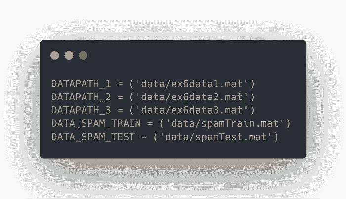

# 支持向量机完全指南(SVM)

> 原文：<https://towardsdatascience.com/the-complete-guide-to-support-vector-machine-svm-f1a820d8af0b?source=collection_archive---------5----------------------->

理解其内部工作原理，并在四种不同的场景中实现支持向量机

What would we do without sklearn?

# 介绍

我们已经看到了如何使用[逻辑回归、LDA](/the-complete-guide-to-classification-in-python-b0e34c92e455) 和[决策树](/the-complete-guide-to-decision-trees-17a874301448)处理分类问题。现在，又引入了另一个分类工具:**支持向量机**。

支持向量机是一种称为**最大间隔分类器**的分类器的推广。最大间隔分类器很简单，但它不能应用于大多数数据集，因为类必须由线性边界分隔。

这就是为什么**支持向量分类器**被引入作为最大间隔分类器的扩展，其可以应用于更广泛的情况。

最后，**支持向量机**只是支持向量分类器的进一步扩展，以适应非线性类边界。

它可用于二元或多元分类。

解释支持向量机的理论非常专业。希望这篇文章能让你更容易理解支持向量机的工作原理。

一旦理论涵盖，你将在四个不同的场景中实现算法！

没有别的事了，让我们开始吧。

> 关于机器学习、深度学习和人工智能的实践视频教程，请查看我的 [YouTube 频道](https://www.youtube.com/channel/UC-0lpiwlftqwC7znCcF83qg?view_as=subscriber)。

There are no SVM gifs.. so I had to settle for a ‘machine’ gif

# 最大间隔分类器

这种方法依赖于使用超平面来分离类。

什么是超平面？

在 *p* 维空间中，超平面是维数为 *p-1* 的平坦仿射子空间。视觉上，在 2D 空间中，超平面将是一条线，而在 3D 空间中，它将是一个平面。

数学上，超平面简单地说就是:

General hyperplane equation

如果 *X* 满足上式，则该点位于平面上。否则，它必须在平面的一侧，如下图所示。

The line represents a hyperplane in a 2D space. Points that satisfy the equation above will lie on the line, while others are on one side of the plane.

一般来说，如果可以使用超平面完美地分离数据，那么就有无限数量的超平面，因为它们可以向上或向下移动，或者稍微旋转，而不会接触到观察结果。

这就是为什么我们使用**最大间隔超平面**或*最佳分离超平面*的原因，最佳分离超平面是离观察值最远的分离超平面。我们从给定超平面的每个训练观察计算垂直距离。这就是所谓的**余量**。因此，最优分离超平面是具有最大余量的超平面。

Example of a maximal margin hyperplane

正如你在上面看到的，有三个点与超平面等距。这些观察结果被称为**支持向量**，因为如果它们的位置移动，超平面也会移动。有趣的是，这意味着超平面仅依赖于支持向量，而不依赖于任何其他观察。

如果不存在分离平面呢？

Overlapping classes where no separating hyperplane exists

在这种情况下，没有最大间隔分类器。我们使用一个支持向量分类器，该分类器可以使用一个被称为**支持向量分类器的*软余量*来*几乎*分离类别。**然而，进一步讨论这种方法变得非常技术性，因为它不是最理想的方法，我们现在将跳过这个主题。

# 支持向量机(SVM)

支持向量机是支持向量分类器的扩展，通过使用**内核**来扩大特征空间。核方法只是一种有效的计算方法，用于适应类之间的非线性边界。

在不涉及技术细节的情况下，核是量化两个观察的相似性的函数。内核可以是任何程度的。使用度大于 1 的核导致更灵活的决策边界，如下所示。

Example of classification with SVM

为了更好地理解内核的选择如何影响 SVM 算法，让我们在四个不同的场景中实现它。

# 项目

这个项目分为四个小项目。

第一部分将展示如何使用线性核执行分类，以及正则化参数 *C* 如何影响得到的**超平面**。

然后，第二部分将展示如何使用**高斯核**生成非线性超平面。

第三部分模拟重叠类，我们将使用**交叉验证**来找到 SVM 的最佳参数。

最后，我们使用 SVM 执行了一个非常简单的垃圾邮件分类器。

> 以上练习摘自吴恩达在 Coursera 上的免费课程。我简单用 Python 解决，导师不推荐。尽管如此，我还是向所有初学者强烈推荐这门课程。

一如既往，笔记本和数据在这里[可用](https://github.com/marcopeix/ISL-SVM?source=post_page---------------------------)。

## 迷你项目 1——线性核 SVM

在我们开始之前，让我们导入一些有用的库:

注意，我们在这里导入了 *loadmat* ，因为我们的数据是矩阵形式的。

然后，我们将数据集的路径存储在不同的变量中:

最后，我们将构建一个函数来帮助我们快速绘制每个数据集:

完美！

现在，在这一部分，我们将使用线性核实现一个支持向量机，我们将看到正则化参数如何影响超平面。

首先，让我们加载并可视化数据:

您应该会看到:

**注意上图左侧的异常值**。让我们看看正则化参数在存在异常值时将如何影响超平面。

上面的代码块简单地将 SVM 拟合到数据中，我们使用预测来绘制超平面。注意，我们使用正则化参数 1。结果应该如下所示:

Hyperplane with C=1

如你所见，超平面忽略了异常值。因此，较低正则化参数将被**更好地概括**。测试误差通常会高于交叉验证误差。

现在，让我们增加正则化参数:

你会得到:

Hyperplane with C=100

现在，异常值在超平面的*右侧*，但这也意味着我们过度拟合。最终，这个边界在未观察到的数据上表现不好。

## 迷你项目 2——高斯核 SVM

现在，我们知道为了适应非线性边界，我们需要改变核函数。在这个练习中，我们将使用一个**高斯核**。

首先，让我们绘制我们的数据:

您应该会看到:

在实现 SVM 之前，您应该知道高斯核表示为:

Gaussian kernel function

注意，有一个参数 *sigma* 决定了当它们相距较远时，相似性度量多快变为零。

因此，我们用以下代码实现它:

你应该得到下面的超平面:

Non-linear hyperplane with a Gaussian kernel

太神奇了！超平面不是一个完美的边界，但它在分类大多数数据方面做得很好。我建议你尝试不同的 *sigma* 值，看看它是如何影响超平面的。

## 迷你项目 3——交叉验证的 SVM

[交叉验证](/the-complete-guide-to-resampling-methods-and-regularization-in-python-5037f4f8ae23)对于从我们的模型中选择最佳性能的最佳调整参数至关重要。让我们看看如何将它应用到支持向量机中。

当然，让我们看看这个练习的数据是什么样的:

你会得到:

注意我们有重叠的类。当然，我们的超平面不会尽善尽美，但我们将使用交叉验证来确保它是我们能得到的最好结果:

从上面的代码单元中，您应该得到最佳正则化参数是 1，并且 *sigma* 应该是 0.1。使用这些值，我们可以生成超平面:

并获得:

Hyperplane with C=1 and sigma=0.1

## 迷你项目 4—SVM 垃圾邮件分类

最后，我们用 SVM 训练了一个垃圾邮件分类器。在这种情况下，我们将使用线性核。此外，我们有单独的数据集用于训练和测试，这将使我们的分析更容易一些。

你可以看到，我们得到的**训练**准确率为 99.825%，而**测试**准确率为 98.9%！

就是这样！您学习了支持向量机的内部工作原理，并在四个不同的迷你项目中实现了该算法，以了解核的选择如何影响该算法，以及如何使用交叉验证。

我希望这篇文章对您有所帮助，并且希望您在想要实现 SVM 的任何时候都能回来阅读这篇文章。

干杯！