# 时间序列分析和预测完全指南

> 原文：<https://towardsdatascience.com/the-complete-guide-to-time-series-analysis-and-forecasting-70d476bfe775?source=collection_archive---------0----------------------->

## 理解移动平均，指数平滑，平稳性，自相关，SARIMA，并在两个项目中应用这些技术。

无论我们希望预测金融市场或电力消费的趋势，时间都是我们的模型中必须考虑的重要因素。例如，预测在一天中的什么时间将会出现用电高峰是令人感兴趣的，例如调整电力的价格或产量。

输入**时间序列**。时间序列就是按时间顺序排列的一系列数据点。在时间序列中，时间通常是独立变量，目标通常是对未来做出预测。

然而，在处理时间序列时，还有其他方面的因素在起作用。

难道是**静止不动**？

有没有**季节性**？

目标变量**是否自相关**？

在这篇文章中，我将介绍时间序列的不同特征，以及我们如何对它们建模以获得准确的(尽可能多的)预测。

> 在 Python 课程的[应用时间序列分析中，超越基础并应用高级模型，如 SARIMAX、VARMAX、CNN、LSTM、ResNet、自回归 LSTM！](https://www.datasciencewithmarco.com/offers/tdU2mtVK)

Predicting the future is hard.

# 自相关

非正式地说，**自相关**是观测值之间的相似性，是它们之间的时滞的函数。

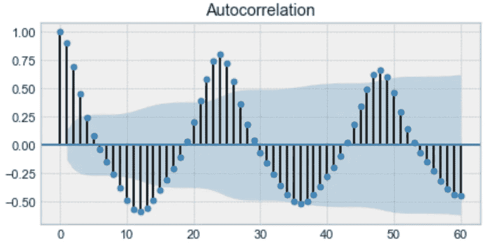

Example of an autocorrelation plot

上面是一个自相关图的例子。仔细观察，您会发现第一个值和第 24 个值具有很高的自相关性。同样，第 12 次和第 36 次观察高度相关。这意味着我们会在每 24 个时间单位找到一个非常相似的值。

注意这个图看起来像正弦函数。这是对**季节性、**的暗示，你可以通过在上面的图中找到时间段来找到它的值，这将给出 24 小时。

# 季节性

**季节性**指周期性波动。例如，用电量白天高，晚上低，或者圣诞节期间在线销售增加，然后再次放缓。

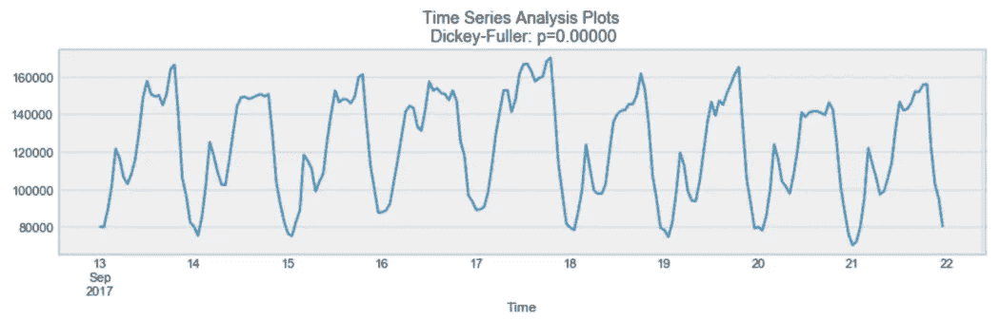

Example of seasonality

从上面可以看出，有明显的日季节性。每一天，你都会在傍晚看到一个高峰，而最低点则是每天的开始和结束。

请记住，如果自相关图呈正弦曲线形状，季节性也可以从自相关图中得出。简单地看周期，它给出了季节的长度。

# 平稳性

**平稳性**是时间序列的重要特征。如果一个时间序列的统计特性不随时间变化，则称该时间序列是平稳的。换句话说，它有**常数均值和方差**，协方差与时间无关。

Example of a stationary process

再看同样的图，我们看到上面的过程是静止的。平均值和方差不随时间变化。

通常，股票价格不是一个稳定的过程，因为我们可能会看到一个增长的趋势，或者它的波动性可能会随着时间的推移而增加(意味着方差在变化)。

理想情况下，我们希望有一个平稳的时间序列来建模。当然，并不是所有的都是静止的，但是我们可以做不同的变换使它们静止。

# 如何测试一个过程是否是稳定的

你可能已经注意到了上述*的标题。*这是我们用来确定时间序列是否平稳的统计测试。

在不深入 Dickey-Fuller 检验的技术细节的情况下，它检验了单位根存在的零假设。

如果是，那么*p>0，过程不是静止的。*

否则， *p =* 0，零假设被拒绝，过程被认为是平稳的。

例如，下面的过程不是静止的。请注意，平均值在整个时间内并不恒定。

Example of a non-stationary process

# 建模时间序列

为了进行预测，有许多方法可以对时间序列进行建模。在这里，我将介绍:

*   移动平均数
*   指数平滑法
*   ARIMA

# 移动平均数

移动平均模型可能是时间序列建模中最简单的方法。该模型简单地说明了下一个观察值是所有过去观察值的平均值。

虽然简单，但这个模型可能会出奇的好，它代表了一个好的起点。

否则，移动平均线可用于识别数据中有趣的趋势。我们可以定义一个*窗口*来应用移动平均模型*平滑*时间序列，并突出显示不同的趋势。

Example of a moving average on a 24h window

在上图中，我们将移动平均模型应用于 24 小时窗口。绿线*平滑了*时间序列，我们可以看到 24 小时内有两个峰值。

当然，窗口越长，趋势就越平稳。下面是一个小窗口的移动平均线的例子。

Example of a moving average on a 12h window

# 指数平滑法

指数平滑使用与移动平均类似的逻辑，但是这一次，不同的*递减权重*被分配给每个观察值。换句话说，随着我们离现在越来越远，观察的重要性就越来越小。

数学上，指数平滑表示为:

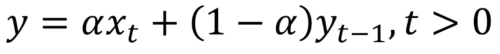

Exponential smoothing expression

这里， *alpha* 是一个**平滑因子**，取值在 0 和 1 之间。它决定了先前观察的重量减少的速度。

Example of exponential smoothing

从上面的图中，深蓝色线表示使用平滑因子 0.3 对时间序列进行指数平滑，而橙色线使用平滑因子 0.05。

可以看到，平滑因子越小，时间序列就越平滑。这是有意义的，因为当平滑因子接近 0 时，我们就接近移动平均模型。

# 双指数平滑

当时间序列中存在趋势时，使用双指数平滑。在这种情况下，我们使用这种技术，它只是指数平滑的两次递归使用。

数学上:

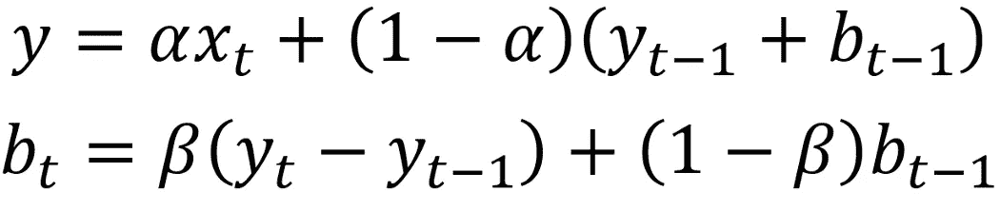

Double exponential smoothing expression

这里， *beta* 是**趋势平滑因子**，取 0 到 1 之间的值。

下面，你可以看到*α*和*β*的不同值如何影响时间序列的形状。

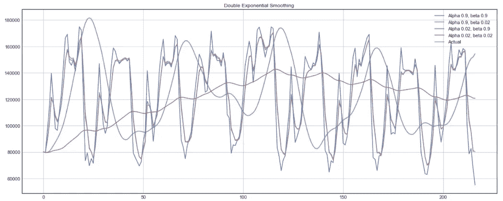

Example of double exponential smoothing

# 三指数平滑

该方法通过添加一个**季节性平滑因子**，扩展了双指数平滑。当然，如果您注意到时间序列中的季节性，这是很有用的。

数学上，三重指数平滑表示为:

Triple exponential smoothing expression

其中 *gamma* 是季节平滑因子，而 *L* 是季节长度。

# 季节性自回归积分移动平均模型

SARIMA 实际上是简单模型的组合，以形成一个复杂的模型，该模型可以模拟具有非平稳属性和季节性的时间序列。

首先，我们有**自回归模型 AR(p)** 。这基本上是时间序列自身的回归。这里，我们假设当前值依赖于它以前的值，有一些滞后。它采用代表最大滞后的参数 **p** 。为了找到它，我们查看部分自相关图，并确定大多数滞后不显著之后的滞后。

在下面的示例中， **p** 将为 4。

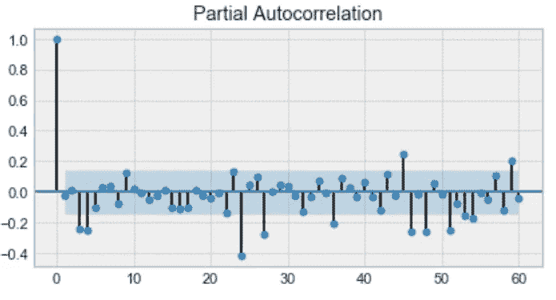

Example of a partial autocorrelation plot

然后，我们添加**移动平均线模型 MA(q)** 。这需要一个参数 **q** ，该参数代表最大滞后，在该最大滞后之后，其他滞后在自相关图上不显著。

下面， **q** 会是 4。

Example of an autocorrelation plot

之后，我们加上**的积分顺序** **I(d)** 。参数 **d** 代表使系列稳定所需的差值数量。

最后，我们添加最后一个组件:**季节性 S(P，D，Q，s)** ，其中 **s** 就是季节的长度。此外，该组件需要参数 **P** 和 **Q** ，它们与 **p** 和 **q** 相同，但用于季节性组件。最后， **D** 是季节积分的顺序，代表从序列中去除季节性所需的差异数。

综合所有这些，我们得到了 **SARIMA(p，D，q)(P，D，Q，s)** 模型。

主要要点是:在使用 SARIMA 建模之前，我们必须对时间序列进行转换，以消除季节性和任何非平稳行为。

那是一大堆让我们难以理解的理论！让我们在第一个项目中应用上面讨论的技术。

我们会试着预测一家特定公司的股价。现在，预测股票价格几乎是不可能的。然而，这仍然是一个有趣的练习，也是练习我们所学知识的好方法。

# 项目 1 —预测股票价格

我们将使用新德国基金(GF)的历史股价来尝试预测未来五个交易日的收盘价。

你可以在这里抓取数据集和笔记本[。](https://github.com/marcopeix/stock-prediction)

和往常一样，我强烈推荐你跟着编码！启动你的笔记本，我们走吧！

You will definitely not get rich trying to predict the stock market

## 导入数据

首先，我们导入一些对我们的分析有帮助的库。此外，我们定义了**平均百分比误差(MAPE)** ，因为这将是我们的误差度量。

然后，我们导入数据集，对前十个条目进行排序，您应该得到:

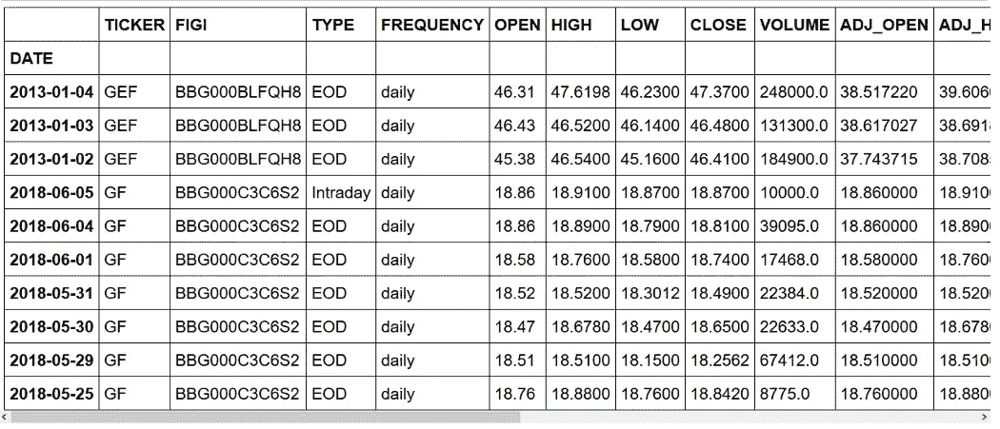

First 10 entries of the dataset

正如你所看到的，我们有几个条目是关于一只不同于新德国基金的股票。此外，我们有一个关于当天信息的条目，但我们只想要当天结束时(EOD)的信息。

## 清理数据

首先，我们删除不需要的条目。

然后，我们删除不需要的列，因为我们只想关注股票的收盘价。

如果预览数据集，您应该会看到:

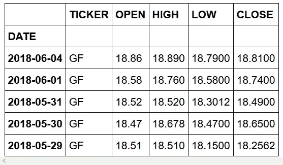

Clean dataset

厉害！我们准备好进行探索性数据分析了！

## 探索性数据分析

我们绘制了数据集整个时间段的收盘价。

您应该得到:

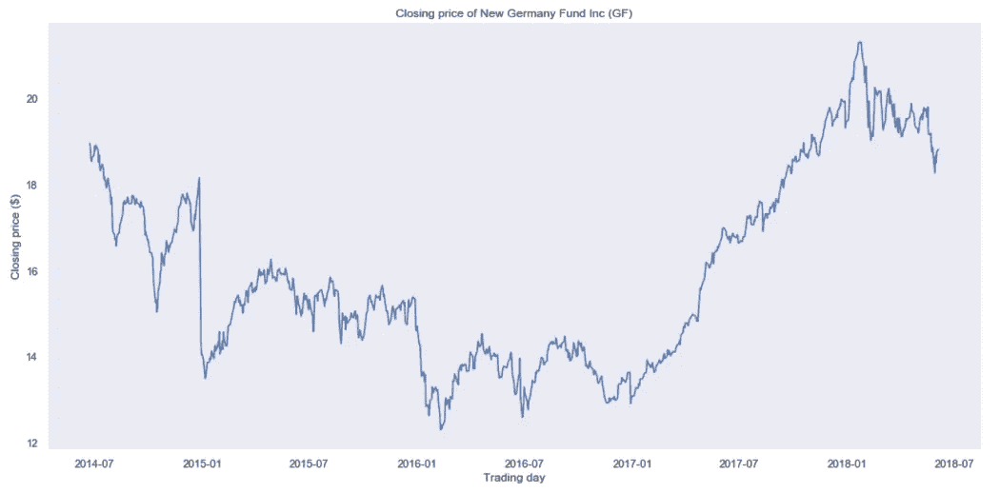

Closing price of the New Germany Fund (GF)

很明显，你看到这不是一个**平稳的**过程，很难判断是否存在某种**季节性**。

## 移动平均数

让我们使用**移动平均线**模型来平滑我们的时间序列。为此，我们将使用一个助手函数，该函数将在指定的时间窗口运行移动平均模型，并绘制出结果平滑曲线:

使用 5 天的时间窗，我们得到:

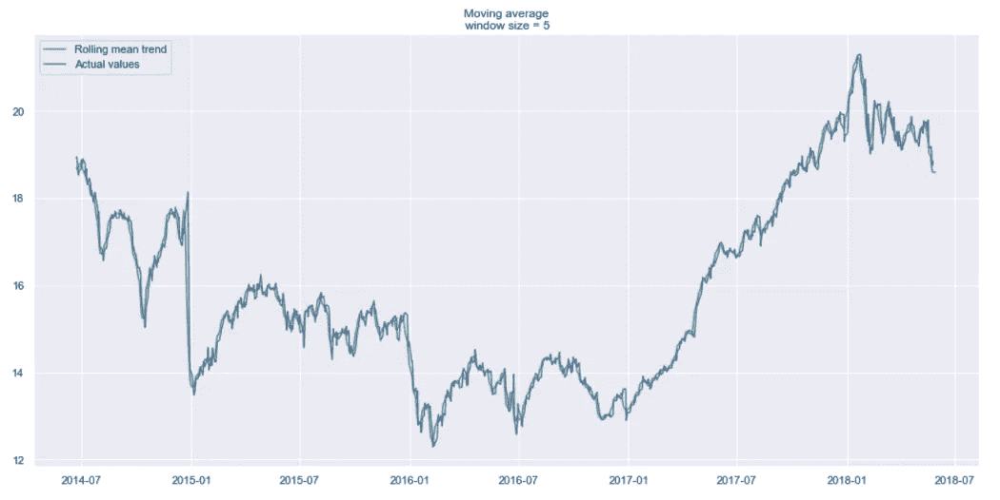

Smoothed curve by the previous trading week

如你所见，我们几乎看不到趋势，因为它太接近实际曲线了。让我们看看上个月和上个季度的平滑结果。

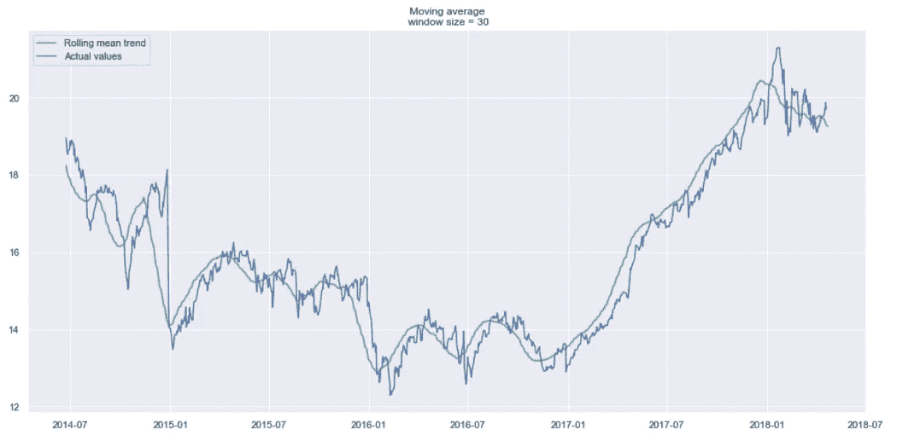

Smoothed by the previous month (30 days)

Smoothed by the previous quarter (90 days)

现在趋势更容易发现了。注意 30 天和 90 天的趋势是如何在最后显示出下降曲线的。这可能意味着股票可能会在接下来的几天下跌。

## 指数平滑法

现在，让我们使用**指数平滑**来看看它是否能拾取一个更好的趋势。

这里，我们使用 0.05 和 0.3 作为**平滑因子**的值。随意尝试其他值，看看结果如何。

Exponential smoothing

正如你所看到的，0.05 的 *alpha* 值平滑了曲线，同时拾取了大部分向上和向下的趋势。

现在，让我们使用**双指数平滑。**

## 双指数平滑

你会得到:

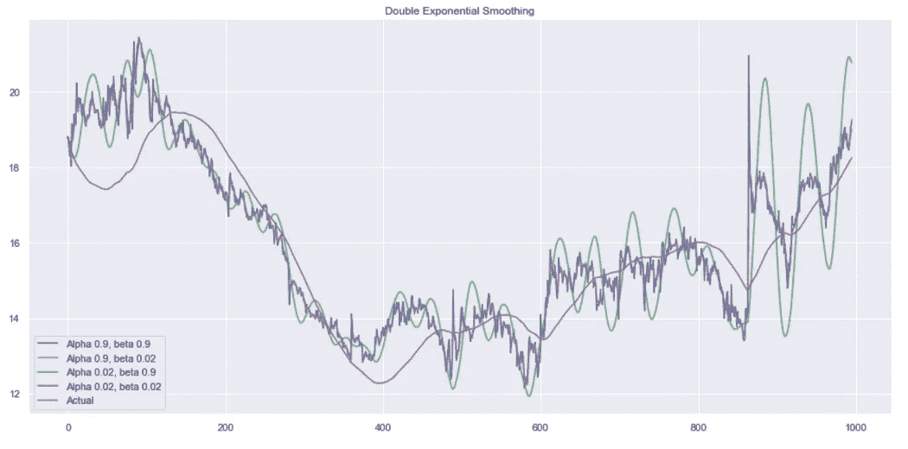

Double exponential smoothing

同样，尝试不同的 *alpha* 和 *beta* 组合来获得更好看的曲线。

## 系统模型化

如前所述，我们必须把我们的系列变成一个平稳的过程，以便对它建模。因此，让我们应用 Dickey-Fuller 检验来看看它是否是一个平稳过程:

您应该看到:

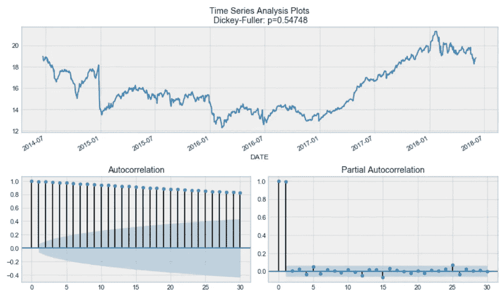

通过 Dickey-Fuller 检验，时间序列无疑是非平稳的。还有，看自相关图，看到很高，似乎没有明显的季节性。

因此，为了去掉高自相关性，并使过程平稳，我们取第一个差(代码块中的第 23 行)。我们简单地从滞后一天的时间序列中减去时间序列，我们得到:

厉害！我们的系列现在是固定的，我们可以开始建模！

## 萨里玛

现在，对于 SARIMA，我们首先定义一些参数和其他参数的值范围，以生成 P，Q，D，P，Q，D，s 的所有可能组合的列表。

现在，在上面的代码单元中，我们有 625 种不同的组合！我们将尝试每种组合，并用每种组合来训练 SARIMA，以找到最佳表现模式。这可能需要一段时间，具体取决于您计算机的处理能力。

完成后，我们会打印出最佳模型的摘要，您应该会看到:

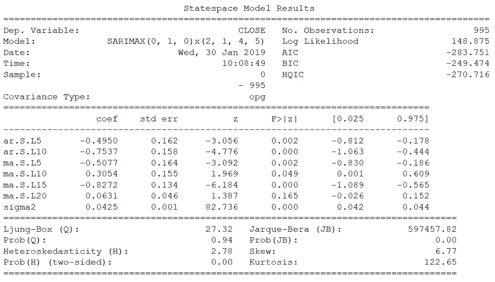

厉害！我们最终预测未来五个交易日的收盘价，并评估模型的 MAPE。

在这种情况下，我们有 0.79%的 MAPE，这非常好！

## 将预测价格与实际数据进行比较

现在，为了将我们的预测与实际数据进行比较，我们从[雅虎财经](https://ca.finance.yahoo.com/)获取财务数据，并创建一个数据框架。

然后，我们画一个图，看看我们离实际收盘价有多远:

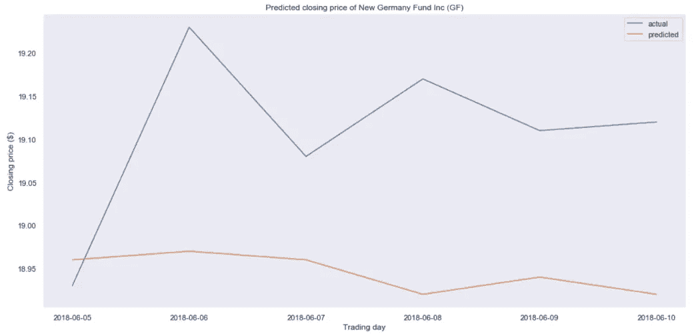

Comparison of predicted and actual closing prices

看来我们的预测有点偏差。事实上，预测价格基本持平，这意味着我们的模型可能表现不佳。

同样，这不是因为我们的程序，而是因为预测股票价格基本上是不可能的。

从第一个项目中，我们学习了在使用 SARIMA 建模之前使时间序列平稳的整个过程。这是一个漫长而乏味的过程，需要大量的手工调整。

现在，让我们介绍脸书的先知。这是一个 Python 和 r 版本的预测工具。该工具允许专家和非专家以最少的努力做出高质量的预测。

让我们看看如何在第二个项目中使用它！

# 项目 2 —用 Prophet 预测空气质量

标题说明了一切:我们将使用 Prophet 来帮助我们预测空气质量！

完整的笔记本和数据集可在[这里](https://github.com/marcopeix/air-quality)找到。

我们来做一些预测吧！

Prophecy cat!

## 导入数据

和往常一样，我们从导入一些有用的库开始。然后，我们打印出前五行:

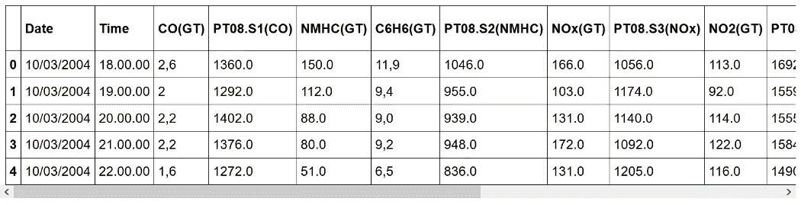

First five entries of the dataset

如您所见，数据集包含不同气体浓度的信息。他们每天每小时都被记录下来。你可以在这里找到所有[特征的描述](https://www.kaggle.com/sayakchakraborty/air-quality-prediction-of-relative-humidity)。

如果您进一步研究数据集，您会注意到有很多值-200 的实例。当然，负浓度是没有意义的，所以我们需要在建模前清理数据。

因此，我们需要清理数据。

## 数据清理和特征工程

这里，我们首先解析日期列，将其转换为“日期”。

然后，我们将所有的测量值转换成浮点数。

之后，我们通过取每个测量值的平均值来汇总每天的数据。

在这一点上，我们仍然有一些*南*我们需要摆脱。因此，我们删除超过 8 个 *NaN* 的列。这样，我们就可以删除包含 *NaN* 值的行，而不会丢失太多数据。

最后，我们按周汇总数据，因为这将给出一个更平滑的趋势来分析。

我们可以画出每种化学物质的趋势。在这里，我们展示了氮氧化物。

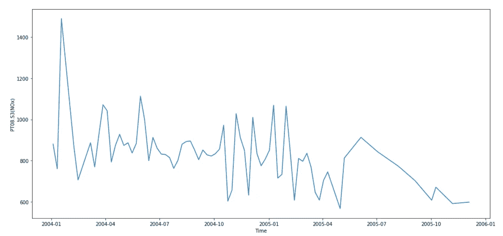

NOx concentration

氮氧化物是非常有害的，因为它们反应形成烟雾和酸雨，并且是细颗粒和地面臭氧形成的原因。这些对健康有不良影响，所以氮氧化物的浓度是空气质量的一个关键特征。

## 系统模型化

我们将只关注 NOx 浓度的建模。因此，我们删除所有其他不相关的列。

然后，我们进口先知。

Prophet 要求将日期列命名为 *ds* ，将特性列命名为 *y* ，因此我们进行了适当的修改。

此时，我们的数据看起来像这样:

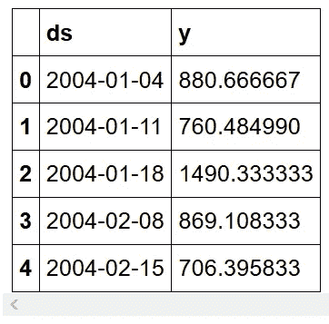

然后，我们定义一个训练集。为此，我们将拿出最后 30 个条目进行预测和验证。

之后，我们简单地初始化 Prophet，将模型与数据进行拟合，并进行预测！

您应该看到以下内容:

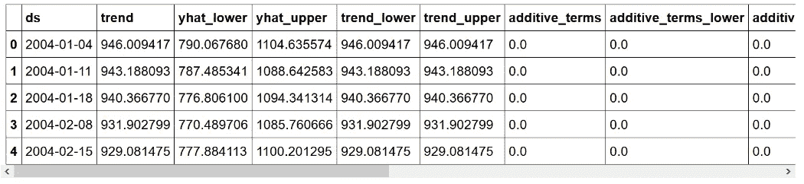

这里， *yhat* 代表预测， *yhat_lower* 和 *yhat_upper* 分别代表预测的下限和上限。

Prophet 允许您轻松绘制预测图，我们得到:

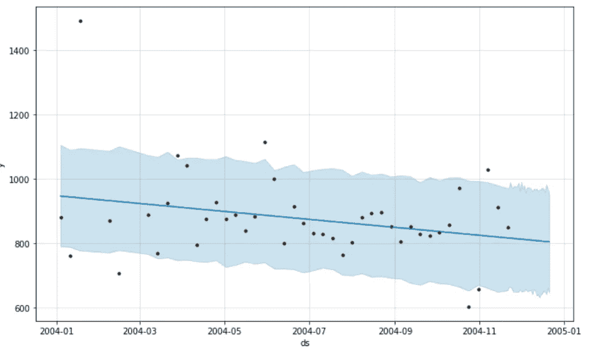

NOx concentration forecast

可以看到，Prophet 只是简单的用了一条直线向下的线来预测未来 NOx 的浓度。

然后，我们检查时间序列是否有任何有趣的特征，例如季节性:

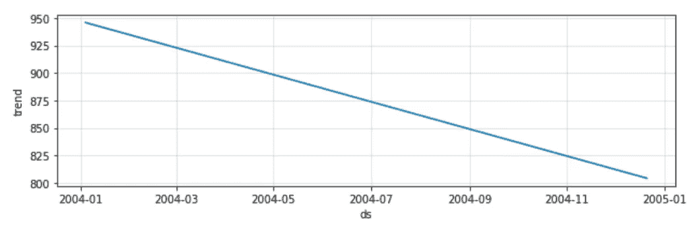

在这里，Prophet 只确定了一个没有季节性的下降趋势。

通过计算其平均绝对百分比误差(MAPE)和平均绝对误差(MAE)来评估模型的性能，我们看到 MAPE 为 13.86%，MAE 为 109.32，还不算太差！请记住，我们根本没有微调模型。

最后，我们绘制了预测的上限和下限:

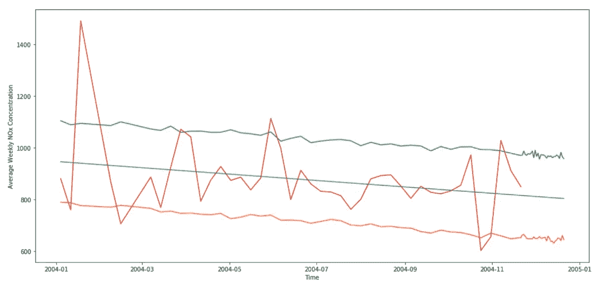

Forecast of the average weekly NOx concentration

恭喜你坚持到最后！这是一篇很长但内容丰富的文章。您学习了如何对时间序列进行稳健分析和建模，并在两个不同的项目中应用了您的知识。

我希望这篇文章对你有用，我希望你能回头参考它。

要了解时间序列分析的最新技术，请查看本课程:

*   [在 Python 中应用时间序列分析](https://www.datasciencewithmarco.com/offers/tdU2mtVK)

干杯！

> 参考:非常感谢这篇[文章](https://medium.com/open-machine-learning-course/open-machine-learning-course-topic-9-time-series-analysis-in-python-a270cb05e0b3)对时间序列分析的精彩介绍！