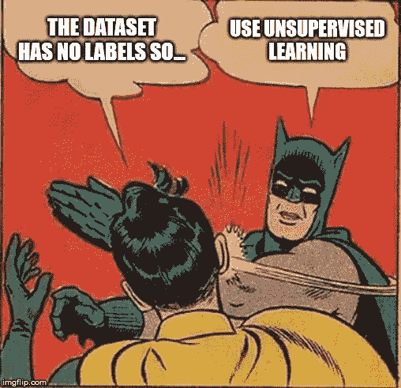

# 无监督学习完全指南

> 原文：<https://towardsdatascience.com/the-complete-guide-to-unsupervised-learning-ecf8b676f2af?source=collection_archive---------14----------------------->

## 理解主成分分析(PCA)和聚类方法，并在两个小型项目中实现每个算法

# 介绍

无监督学习是一组统计工具，用于只有一组特征而没有目标的场景。因此，我们无法做出预测，因为对每个观察结果都没有相关的反应。相反，我们感兴趣的是找到一种有趣的方式来可视化数据，或者发现类似观察的子群。

无监督学习往往更具挑战性，因为分析没有明确的目标，而且往往是主观的。此外，很难评估获得的结果是否良好，因为没有公认的机制来执行交叉验证或验证独立数据集上的结果，因为我们不知道真实的答案。

本指南将重点介绍两种技术:**主成分分析**和**聚类**。我们将探索每一个是如何在数学上工作的，并且我们将在两个迷你项目中实现它们。

我们开始吧！

> 对于机器学习、深度学习和人工智能的实践视频教程，请查看我的 [YouTube 频道](https://www.youtube.com/channel/UC-0lpiwlftqwC7znCcF83qg?view_as=subscriber)。

Unsupervised parties are dangerous!

# 主成分分析

PCA 是指计算主成分并用于更好地理解数据的过程。PCA 也可以用于可视化。

什么是主成分？

假设您想要可视化一组 *p* 特征上的 *n* 观测值，作为探索性数据分析的一部分。我们可以一次检查两个特征的 2D 散点图，但如果有很多预测因素，就会很快失控。

使用 PCA，我们可以找到包含尽可能多的变化的数据集的低维表示。因此，我们只得到最有趣的*特征，因为它们是方差的主要来源。*

主成分是怎么找到的？

第一个主成分是具有最大方差的特征的归一化线性组合:

First principal component equation

符号*φ*被称为**载荷**。负载必须最大化:

这就是全部了！

# 聚类方法

聚类是指在数据集中查找子组或聚类的一系列技术。这有助于我们将观察结果划分为不同的组，以便每个组包含彼此相似的观察结果。例如，在乳腺癌的情况下，组可以代表肿瘤等级。它在市场细分的营销中也非常有用，以便确定更容易接受某种产品的人群。

聚类方法有很多，但我们将重点介绍 **k-means 聚类**和**层次聚类**。在 K 均值聚类中，我们希望将数据划分成预先指定数量的 *K* 个聚类。另一方面，对于层次聚类，我们不知道我们需要多少个聚类。相反，我们想要一个树状图，它允许我们查看每个可能的聚类数所获得的所有聚类。

# k 均值聚类

这种方法简单地将观察结果分成 *K* 个集群。它假设:

1.每个观察值属于 K 个聚类中的至少一个

2.集群不重叠

此外，每个集群内的变化被最小化。

How observations were clustered depending on the number of specified clusters

这是通过最小化一个聚类内每个观察值之间的平方欧几里德距离之和来实现的:

Optimization function for k-mean clustering

为了最小化，我们遵循以下算法:

1.从 1 到 *K* 之间随机分配一个数字给每个观察值。这些用作观测的初始聚类分配。

2.迭代直到集群分配停止变化:

2.a .对于每个 *K* 簇，计算簇**质心**。第*个*簇质心是第*个*簇中观测值的 *p* 特征均值的向量

2.b .将每个观察值分配给质心最近(最短欧几里得距离)的聚类

请注意，上面的算法将找到一个局部最小值。因此，所获得的结果将取决于初始随机聚类分配。因此，多次运行该算法非常重要。

# 分层聚类

k-means 聚类的一个潜在缺点是它需要人工输入来指定聚类的数量。**另一方面，层次聚类**不需要聚类的初始数量。

最常见的层次聚类类型是*自底向上*或*聚集*聚类。这指的是这样一个事实，即从叶子开始生成一个**树状图**,并将簇组合到树干。

Examples of dendrograms

算法其实很简单。它首先定义每对观察值之间的不相似性度量，比如欧几里德距离。然后，首先假设每个观察值属于它自己的集群。然后将两个最相似的聚类融合，这样就有了 *n-1* 个聚类。之后，融合另外两个相似的簇，产生 *n-2* 簇。该过程反复重复，直到所有的观察结果都是单个聚类的一部分。

虽然简单，但有些事情没有解决。如何定义聚类之间的相异度？这是通过**联动**的概念实现的。下表总结了四种最常见的链接类型:

The four most common types of linkage

完全连锁、平均连锁和质心连锁是最常见的连锁类型，因为单个连锁往往会产生不平衡的树状图。注意，生成的树状图很大程度上取决于所用的连锁类型。

Effect of linkage on the final dendrogram

此外，选择合适的相异度也很关键。欧几里德距离被广泛讨论，但也有基于相关性的距离*。如果两个特征高度相关，则认为它们是相似的，这意味着它们具有相似的轮廓。*

**

*Observation 1 and 2 are highly correlated, since they have similar profiles*

*例如，假设一家在线零售商对基于购物者过去的购物历史对他们进行聚类感兴趣。目标是识别相似购物者的子群，这样他们就可以看到可能引起他们兴趣的广告。使用欧几里德距离，那么总体上很少购买商品的购物者将被聚集在一起，这可能不是理想的。另一方面，使用基于相关性的距离，具有类似*偏好*(他们购买了商品 A 和 B，但没有购买商品 C 和 D)的购物者将被聚集在一起，即使他们购买了不同数量的商品。*

*然而，在所有情况下，一旦层次聚类完成，我们仍然需要人工输入来确定要使用的最终聚类数。*

*现在您已经了解了 PCA 和聚类方法的工作原理，让我们在一个小型项目环境中实现它们。*

# *项目*

*这个项目将被分为两个迷你项目。在第一个例子中，我们将使用 k-means 聚类对图像执行**颜色量化**。*

*然后，在第二个迷你项目中，我们将使用主成分分析来降低数据集的维度，允许我们用 2D 图来可视化它。*

*在这里[你可以得到你需要的一切。](https://github.com/marcopeix/ISL-Unsupervised?source=post_page---------------------------)*

*旋转你的 Jupyter 笔记本，我们走吧！*

## *初始设置*

*在开始任何实现之前，我们将导入一些在以后会变得方便的库:*

**

*与之前的教程不同，我们不会导入数据集。相反，我们将使用由 *scikit-learn* 库提供的数据。*

## *迷你项目 1 —使用 k 均值聚类的颜色量化*

*快速，颜色量化是一种技术，以减少在图像中使用的不同颜色的数量。这对于在保持图像完整性的同时压缩图像尤其有用。*

*首先，我们导入以下库:*

**

*注意，我们导入了一个名为 *load_sample_image* 的样本数据集。这仅仅包含两个图像。我们将使用其中一个来执行颜色量化。*

*因此，让我们展示一下我们将在本练习中使用的图像:*

**

*您应该会看到:*

**

*Original image*

*现在，对于颜色量化，必须遵循不同的步骤。*

*首先，我们需要将图像转换成 2D 矩阵进行处理:*

**

*然后，我们训练我们的模型来聚合颜色，以便在图像中有 64 种不同的颜色:*

**

*然后，我们构建一个辅助函数来帮助我们用指定颜色的数量重建图像:*

**

*最后，我们现在可以看到只有 64 种颜色的图像，以及它与原始图像的对比:*

**

*Original image with 96 615 colors*

**

*Reconstructed image with 64 colors*

*当然，我们可以看到一些差异，但总体而言，图像的完整性是守恒的！一定要探索不同数量的集群！例如，如果指定 10 种颜色，将会得到以下结果:*

**

*Reconstructed image with 10 colors*

## *迷你项目 2 —使用主成分分析进行降维*

*在本练习中，我们将使用主成分分析来降低数据集的维度，以便我们可以轻松地将其可视化。*

*因此，让我们从 *scikit-learn* 导入虹膜数据集:*

**

*现在，我们将计算前两个主成分，并查看每个主成分可以解释的方差比例:*

**

*从上面的代码块中，您应该看到第一个主成分包含 92%的方差，而第二个主成分占 5%的方差。因此，这意味着仅两个特征就足以解释数据集中 97%的方差！*

*现在，我们可以利用它轻松绘制二维数据:*

**

*你会得到:*

**

*正如你所看到的，主成分分析有助于减少数据集的维数，允许我们绘制它，并可视化每个类别是如何分开的。*

*就是这样！您现在了解了最流行的无监督学习技术是如何工作的，以及如何实现它们。*

*再次请记住，无监督学习是困难的，因为没有错误度量来评估算法的表现如何。此外，在进行监督学习之前，这些技术通常用于探索性数据分析。*

*我希望这篇文章对你有用，并能找到你的书签！*

*继续努力！*

> *这些练习是在 [*scikit-learn*](https://scikit-learn.org/stable/index.html?source=post_page---------------------------) 网站上提供的示例。我只是试图用更多的细节来解释它们。*