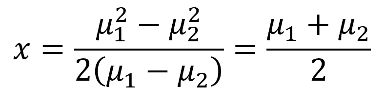
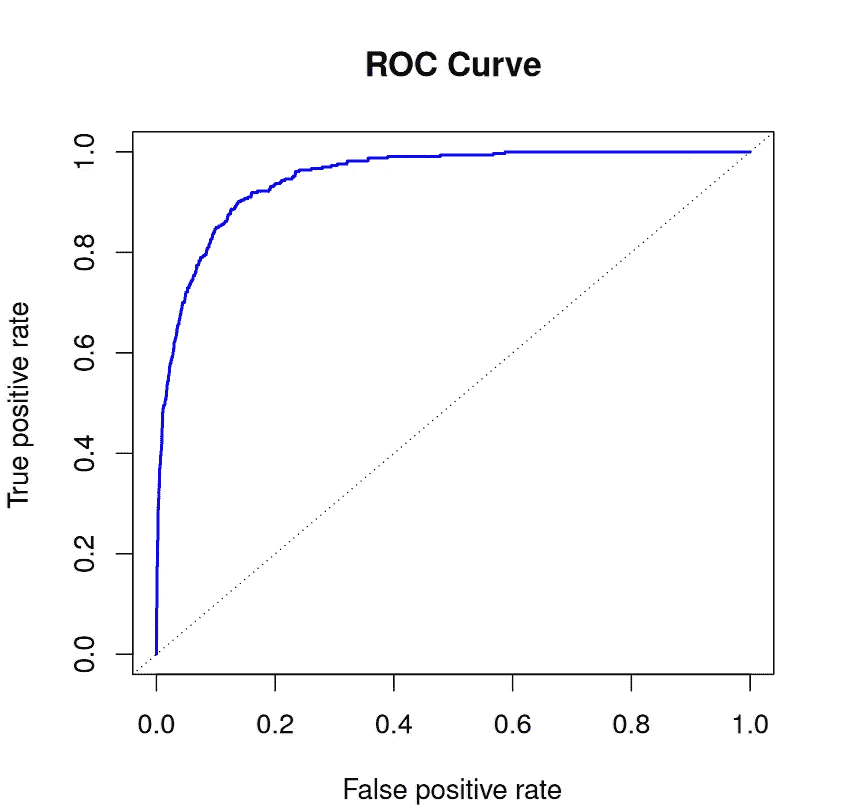
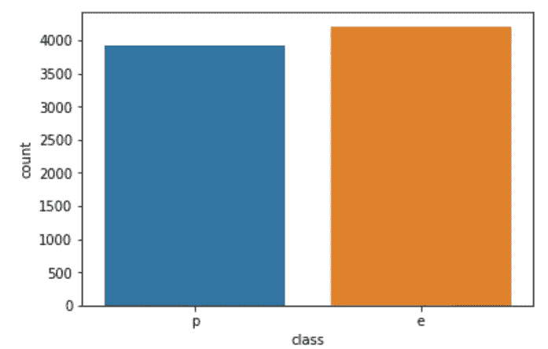
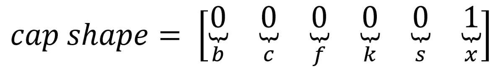
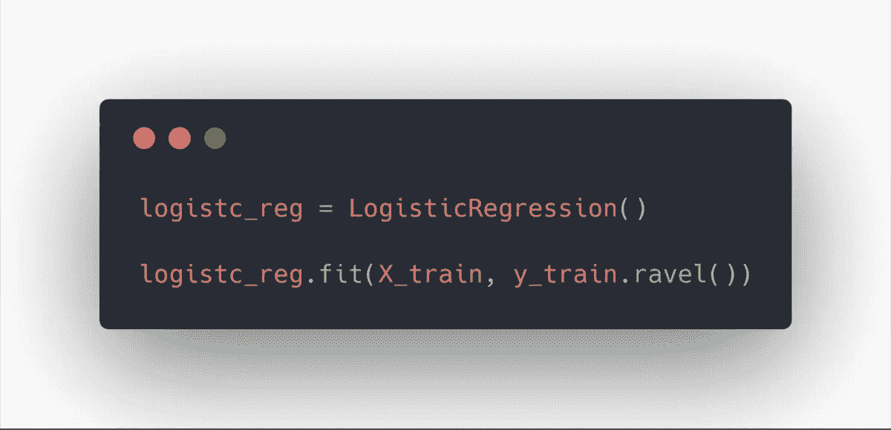
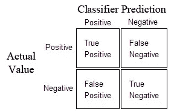
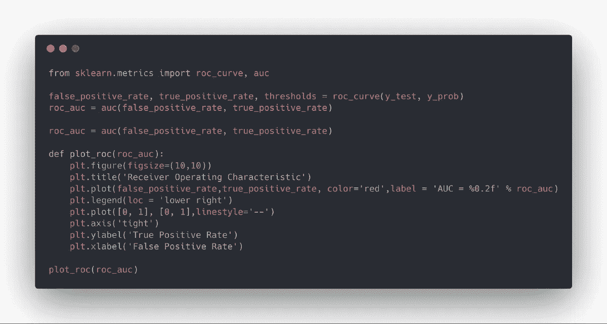
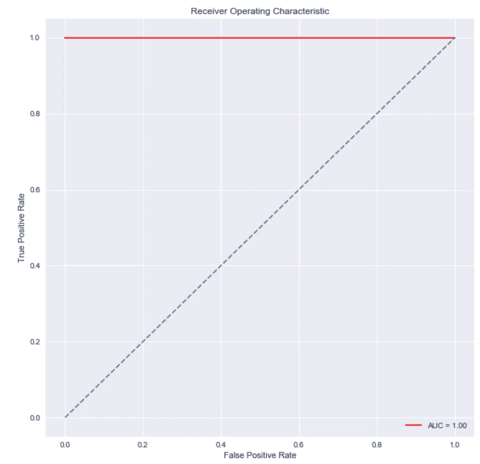
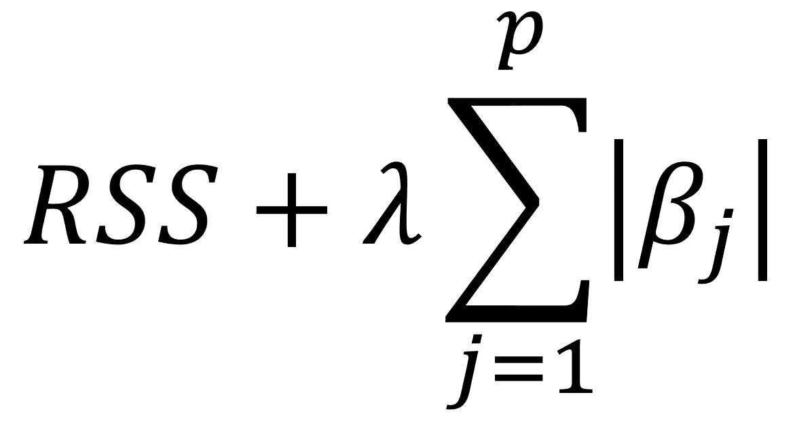
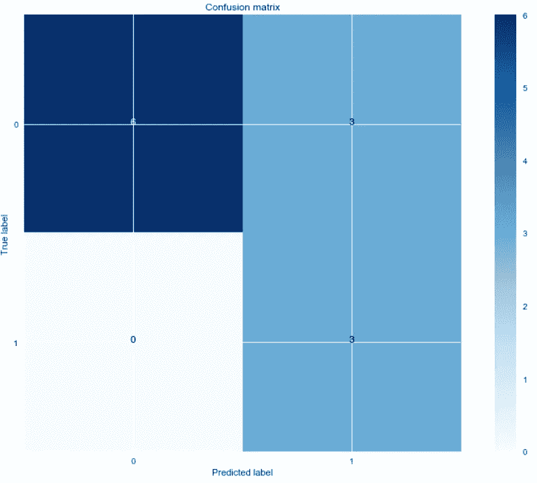

# 完整的动手机器学习速成班

> 原文：<https://towardsdatascience.com/the-complete-hands-on-machine-learning-crash-course-59e43c8cee52?source=collection_archive---------7----------------------->

## 从线性回归到无监督学习，本指南涵盖了你开始学习机器所需要知道的一切。每个主题都包括理论和实践练习！


# 目录

1.  [线性回归—理论](/the-complete-hands-on-machine-learning-crash-course-59e43c8cee52#b035)
2.  [线性回归—练习](#429c)
3.  [逻辑回归—理论](#b95e)
4.  [线性判别分析(LDA) —理论](#a78c)
5.  [二次判别分析(QDA)—理论](#7fe0)
6.  [逻辑回归、LDA 和 QDA —实践](#ef44)
7.  [重采样—理论](#f87f)
8.  [正则化理论](#ed7b)
9.  [重采样和正则化—练习](#43b4)
10.  [决策树—理论](#4ab3)
11.  [决策树—实践](#d1e8)
12.  [支持向量机(SVM)—理论](#270d)
13.  [支持向量机(SVM) —实践](#d4e4)
14.  [无监督学习——理论](#3f0c)
15.  [无监督学习—实践](#0cc5)
16.  [时间序列分析—理论](#7acb)
17.  [时间序列分析—练习](#dab5)
18.  [来源](#cefd)

> 关于机器学习、深度学习和人工智能的实践视频教程，请查看我的 [YouTube 频道](https://www.youtube.com/channel/UC-0lpiwlftqwC7znCcF83qg?view_as=subscriber)。

# 线性回归理论

线性回归可能是统计学习最简单的方法。对于更高级的方法来说，这是一个很好的起点，事实上，许多新奇的统计学习技术可以被视为线性回归的扩展。因此，在进入更复杂的方法之前，理解这个简单的模型将建立一个良好的基础。

线性回归很好地回答了以下问题:

*   两个变量之间有关系吗？
*   关系有多牢固？
*   哪个变量的贡献最大？
*   我们能多精确地估计每个变量的影响？
*   我们能多精确地预测目标？
*   关系是线性的吗？(咄)
*   有交互作用吗？

## 估计系数

假设我们只有一个变量和一个目标。然后，线性回归表示为:


Equation for a linear model with 1 variable and 1 target

在上式中，*β*是系数。这些系数是我们用模型进行预测所需要的。

那么我们如何找到这些参数呢？

为了找到参数，我们需要最小化**最小平方**或**误差平方和**。当然，线性模型并不完美，它不会准确预测所有数据，这意味着实际值和预测值之间存在差异。误差很容易通过下式计算:


Subtract the prediction from the true value

但是为什么误差是平方的呢？

我们平方误差，因为预测可以高于或低于真实值，分别导致负的或正的差异。如果我们不对误差进行平方，误差的总和可能会因为负差异而减少，而不是因为模型非常适合。

此外，平方误差不利于较大的差异，因此最小化平方误差“保证”更好的模型。

让我们来看一个图表，以便更好地理解。


Linear fit to a data set

在上图中，红点是真实数据，蓝线是线性模型。灰色线条表示预测值和真实值之间的误差。因此，蓝线是使灰线的平方长度之和最小的线。

经过一些对本文来说过于繁琐的数学计算后，您最终可以用下面的等式来估计系数:


其中 *x 条*和 *y 条*代表平均值。

## 估计系数的相关性

现在你有了系数，你如何知道它们是否与预测你的目标相关？

最好的方法是找到 *p 值。**p 值*用于量化统计显著性；它允许判断是否要拒绝零假设。

无效假设？

对于任何建模任务，假设在特征和目标之间存在某种相关性。因此，零假设是相反的:**在特征和目标之间没有相关性**。

因此，找到每个系数的 *p 值*将会知道该变量对于预测目标是否具有统计显著性。根据一般经验，如果 *p 值*小于**0.05**:变量和目标之间有很强的关系。

## 评估模型的准确性

通过找到变量的 *p 值*，您发现您的变量具有统计显著性。太好了！

现在，你怎么知道你的线性模型是好的呢？

为了进行评估，我们通常使用 RSE(剩余标准误差)和 R 统计量。


RSE formula


R² formula

第一个误差指标很容易理解:残差越低，模型就越符合数据(在这种情况下，数据越接近线性关系)。

至于 R 度量，它测量目标中可以用特征 X 解释的**可变性比例。所以假设线性关系，如果特征 X 能解释(预测)目标，那么比例高，R 值会接近 1。如果相反，R 值则更接近于 0。**

## 多元线性回归理论

在现实生活中，永远不会有单一的特征来预测目标。那么，我们一次对一个特征进行线性回归吗？当然不是。我们简单地执行多元线性回归。

该方程非常类似于简单的线性回归；简单地将预测值的数量和它们相应的系数相加:


Multiple linear regression equation. **p** is the number of predictors

## 评估预测值的相关性

以前，在简单的线性回归中，我们通过寻找特征的 *p 值*来评估特征的相关性。

在多元线性回归的情况下，我们使用另一个指标:F 统计量。


F-statistic formula. **n** is the number of data points and **p** is the number of predictors

在这里，F 统计量是为整个模型计算的，而 *p 值*是特定于每个预测值的。如果有强关系，那么 F 会远大于 1。否则，它将近似等于 1。

如何使*大于* *比 1* 足够大？

这个很难回答。通常，如果有大量的数据点，F 可能略大于 1，表明有很强的关系。对于小数据集，F 值必须远大于 1，以表明强相关关系。

为什么我们不能在这种情况下使用 *p 值*？

由于我们正在拟合许多预测值，因此我们需要考虑有许多特征的情况( *p* 很大)。对于非常大量的预测值，总会有大约 5%的预测值偶然具有非常小的 *p 值* ***甚至*** ***，尽管它们在统计上不显著。因此，我们使用 F 统计量来避免将不重要的预测因子视为重要的预测因子。***

## 评估模型的准确性

就像简单的线性回归一样，R 可以用于多元线性回归。但是，要知道添加更多的预测值总是会增加 R 值，因为模型必然会更好地拟合训练数据。

然而，这并不意味着它将在测试数据上表现良好(对未知数据点进行预测)。

## 添加交互

一个线性模型中有多个预测因子意味着一些预测因子可能会对其他预测因子产生影响。

例如，你想预测一个人的工资，知道她的年龄和上学的年数。当然，一个人越老，他在学校度过的时间就越多。那么我们如何对这种互动效应建模呢？

考虑这个非常简单的例子，有两个预测值:


Interaction effect in multiple linear regression

如你所见，我们简单地将两个预测因子相乘，并关联一个新的系数。简化公式，我们现在看到系数受另一个特征的值的影响。

一般来说，如果我们包括交互模型，我们应该包括特征的个体效应，即使它的 *p 值*不显著。这就是所谓的**等级原则**。这背后的基本原理是，如果两个预测者相互作用，那么包括他们各自的贡献将对模型产生很小的影响。

# 线性回归—实践

好吧！现在我们知道了它是如何工作的，让我们让它工作吧！我们将通过 Python 中的简单和多元线性回归来工作，我将展示如何在这两种情况下评估参数和整体模型的质量。

你可以在这里获取代码和数据。

我强烈建议您在自己的 Jupyter 笔记本中遵循并重新创建这些步骤，以充分利用本教程。

数据集包含关于花费在广告上的钱及其产生的销售额的信息。钱花在了电视、广播和报纸广告上。

**目标是使用线性回归来了解广告支出如何影响销售。**

## 导入库

使用 Python 的优势在于，我们可以访问许多库，这些库允许我们快速读取数据、绘制数据并执行线性回归。

我喜欢在笔记本顶部导入所有必要的库，以保持一切井然有序。导入以下内容:

```
import pandas as pd
import numpy as npimport matplotlib.pyplot as pltfrom sklearn.linear_model import LinearRegression
from sklearn.metrics import r2_scoreimport statsmodels.api as sm
```

## 读取数据

假设您下载了数据集，将它放在项目文件夹内的一个`data`目录中。然后，像这样读取数据:

```
data = pd.read_csv("data/Advertising.csv")
```

为了查看数据的样子，我们执行以下操作:

```
data.head()
```

你应该看看这个:


如您所见，列`Unnamed: 0`是多余的。因此，我们删除它。

```
data.drop(['Unnamed: 0'], axis=1)
```

好了，我们的数据是干净的，可以进行线性回归了！

## 简单线性回归

对于**简单线性回归**，我们只考虑电视广告对销售的影响。在开始建模之前，让我们看一下数据是什么样子的。

我们使用`matplotlib`，一个流行的 Python 绘图库来制作散点图。

```
plt.figure(figsize=(16, 8))
plt.scatter(
    data['TV'],
    data['sales'],
    c='black'
)
plt.xlabel("Money spent on TV ads ($)")
plt.ylabel("Sales ($)")
plt.show()
```

运行这个代码单元，您应该会看到这个图形:


Scatter plot of money spent on TV ads and sales

正如你所看到的，在电视广告上的花费和销售额之间有着明显的关系。

让我们看看如何生成该数据的线性近似值。

```
X = data['TV'].values.reshape(-1,1)
y = data['sales'].values.reshape(-1,1)reg = LinearRegression()
reg.fit(X, y)print("The linear model is: Y = {:.5} + {:.5}X".format(reg.intercept_[0], reg.coef_[0][0]))
```

就这样？

是啊！对数据集拟合一条直线并查看方程的参数就是这么简单。在这种情况下，我们有


Simple linear regression equation

让我们想象一下这条线是如何拟合数据的。

```
predictions = reg.predict(X)plt.figure(figsize=(16, 8))
plt.scatter(
    data['TV'],
    data['sales'],
    c='black'
)
plt.plot(
    data['TV'],
    predictions,
    c='blue',
    linewidth=2
)
plt.xlabel("Money spent on TV ads ($)")
plt.ylabel("Sales ($)")
plt.show()
```

现在，你看:


Linear fit

从上图来看，似乎一个简单的线性回归可以解释电视广告支出和销售额的总体影响。

## 评估模型的相关性

现在，如果你还记得这篇[文章](/linear-regression-understanding-the-theory-7e53ac2831b5)，为了看看这个模型是否好，我们需要看看每个系数的 R 值和 *p 值*。

我们是这样做的:

```
X = data['TV']
y = data['sales']X2 = sm.add_constant(X)
est = sm.OLS(y, X2)
est2 = est.fit()
print(est2.summary())
```

这给了你这个可爱的输出:


R² and p-value

查看这两个系数，我们有一个非常低的 *p 值*(尽管它可能不完全是 0)。这意味着这些系数和目标(销售额)之间有很强的相关性。

然后，看 R 值，我们有 0.612。因此，**大约 60%的销售变化可以用花在电视广告上的金额来解释**。这没问题，但肯定不是我们能准确预测销售的最好方法。当然，在报纸和广播广告上的花费肯定会对销售产生一定的影响。

让我们看看多元线性回归是否会表现得更好。

## 多元线性回归

就像简单的线性回归一样，我们将定义我们的特性和目标变量，并使用 *scikit-learn* 库来执行线性回归。

```
Xs = data.drop(['sales', 'Unnamed: 0'], axis=1)
y = data['sales'].reshape(-1,1)reg = LinearRegression()
reg.fit(Xs, y)print("The linear model is: Y = {:.5} + {:.5}*TV + {:.5}*radio + {:.5}*newspaper".format(reg.intercept_[0], reg.coef_[0][0], reg.coef_[0][1], reg.coef_[0][2]))
```

仅此而已！从这个代码单元，我们得到下面的等式:


Multiple linear regression equation

当然，我们无法想象所有三种媒体对销售的影响，因为它总共有四个维度。

请注意，报纸的系数是负的，但也相当小。与我们的模型相关吗？让我们通过计算每个系数的 F 统计量、R 值和 *p 值*来看看。

## 评估模型的相关性

正如您所料，这里的过程与我们在简单线性回归中所做的非常相似。

```
X = np.column_stack((data['TV'], data['radio'], data['newspaper']))
y = data['sales']X2 = sm.add_constant(X)
est = sm.OLS(y, X2)
est2 = est.fit()
print(est2.summary())
```

您会得到以下结果:


R², p-value and F-statistic

可以看到，R 远高于简单线性回归的 R，其值为 **0.897** ！

此外，F 统计值为 **570.3** 。这比 1 大得多，而且由于我们的数据集相当小(只有 200 个数据点)，它**表明广告支出和销售**之间有很强的关系。

最后，因为我们只有三个预测值，所以我们可以考虑它们的 *p 值*来确定它们是否与模型相关。当然，你会注意到第三个系数(报纸的系数)有一个很大的 p 值。因此，报纸上的广告支出**在统计上并不显著**。移除那个预测因子会稍微降低 R 值，但我们可能会做出更好的预测。

# 逻辑回归理论

## 回归与分类问题

之前，我们看到[线性回归](/the-complete-guide-to-linear-regression-in-python-3d3f8f06bf8)假设响应变量是定量的。然而，在许多情况下，反应实际上是定性的，就像眼睛的颜色。这种类型的反应被称为**绝对的。**

分类是预测定性反应的过程。用于分类的方法通常预测定性变量的每个类别的概率，作为进行分类的基础。在某种程度上，它们的行为类似于回归方法。

通过分类，我们可以回答如下问题:

*   一个人有一系列症状，这些症状可以归因于三种医学状况中的一种。哪一个？
*   一笔交易是不是欺诈？

分类回答通常用词来表达。当然，我们不能用文字作为传统统计方法的输入数据。当我们实现算法的时候，我们会看到如何处理这个问题。

现在，让我们看看逻辑回归是如何工作的。

## 逻辑回归

当涉及到分类时，我们要确定一个观察值是否属于某一类的概率。因此，我们希望用 0 到 1 之间的值来表示概率。

接近 1 的概率意味着观测结果**很可能**属于那一类。

为了生成介于 0 和 1 之间的值，我们使用以下等式来表示概率:


Sigmoid function

上面的等式被定义为 **sigmoid 函数。**

画出这个方程，你会发现这个方程总是产生一个介于 0 和 1 之间的 S 形曲线。


Logistic regression curve

对上面的等式进行一些操作后，您会发现:


在两侧取*圆木*；


上面的等式被称为 *logit* 。可以看到，在 *X* 中是线性的。这里，如果系数是正的，那么 *X* 的增加将导致更高的概率。

## 估计系数

与线性回归一样，我们需要一种方法来估计系数。为此，我们**最大化**的*似然函数*:


Likelihood function

这里的直觉是，我们希望系数使得预测的概率(在上面的等式中用撇号表示)尽可能接近观察到的状态。

与线性回归类似，我们使用 *p 值*来确定是否拒绝零假设。

Z 统计数据*也被广泛使用。大的绝对 Z 统计量意味着零假设被拒绝。*

请记住，零假设声明:特征和目标之间没有相关性。

## 多元逻辑回归

当然，逻辑回归可以很容易地扩展到容纳一个以上的预测因子:


Multiple logistic regression

请注意，使用多元逻辑回归可能会给出更好的结果，因为它可以考虑预测因素之间的相关性，这种现象被称为*混杂*。此外，很少仅有一个预测器就足以建立准确的预测模型。

# 线性判别分析(LDA) —理论

现在，我们明白了逻辑回归是如何工作的，但是像任何模型一样，它也存在一些缺陷:

*   当类被很好地分开时，从逻辑回归估计的参数往往是不稳定的
*   当数据集很小时，逻辑回归也是不稳定的
*   最好不要预测两个以上的类

这就是线性判别分析(LDA)派上用场的地方。它比逻辑回归更稳定，广泛用于预测两个以上的类别。

LDA 的特殊性在于，它分别对每个响应类别中预测值的分布进行建模，然后使用贝叶斯定理来估计概率。

好吧，这有点难以理解。我们来分解一下。

## 贝叶斯分类定理

*(抱歉，Medium 不支持数学方程。我尽了最大努力，尽可能的明确)。*

假设我们想要将一个观察结果分类到 *K* 类中的一个，其中 *K* 大于或等于 2。然后，让 *pi-k* 成为一个观察值关联到第*个*类的总概率。然后，让 *f_k(X)* 表示 *X* 的密度函数，用于来自*第 k 个*类的观察。这意味着如果来自*第 k 个*类的观测值具有 X = x 的概率，那么 *f_k(X)* 是大的。然后，贝叶斯定理陈述:


Bayes’ theorem for classification

上面的等式可以简单地缩写为:


Abbreviated Bayes’ theorem for classification

希望这有一定的意义！

这里的挑战是估计密度函数。理论上，贝叶斯的分类错误率最低。因此，我们的分类器需要估计密度函数，以逼近贝叶斯分类器。

## 一个预测器的 LDA

假设我们只有一个预测值，并且密度函数是正态的。然后，您可以将密度函数表示为:


Normal distribution function

现在，我们要指定一个观察值 *X = x* ，对于该观察值 *P_k(X)* 最大。如果你在 *P_k(X)* 中插入密度函数，取*对数*，你会发现你希望最大化:


Discriminant equation

上面的等式称为**判别式。**如你所见，这是一个线性方程。因此得名:**线性判别分析**！

现在，假设只有两个具有相等分布的类，您会发现:



Boundary equation

这是边界方程。下图显示了图示。


Boundary line to separate 2 classes using LDA

当然，这代表了一种理想的解决方案。事实上，我们无法精确计算边界线。

因此，LDA 利用以下近似:

*   对于所有训练观察的平均值


Average of all training observations

*   对于每类样本方差的加权平均值


Weighted average of sample variances for each class

其中 *n* 是观察次数。

重要的是要知道，LDA 为每个类别假设了一个**正态分布**，一个**特定类别均值**，以及一个**共同方差**。

## 多个预测值的 LDA

现在扩展到多个预测值，我们必须假设 *X* 来自**多元高斯分布**，具有特定类别的均值向量和公共协方差矩阵。

相关和不相关高斯分布的示例如下所示。


Left: Uncorrelated normal distribution. Right: correlated normal distribution

现在，用向量符号表示判别方程，我们得到:


Discriminant equation with matrix notation

如你所见，等式保持不变。只是这一次，我们使用向量符号来容纳许多预测值。

## 如何评估模型的性能

对于分类，有时使用准确性来评估模型的性能是不相关的。

考虑分析一个高度不平衡的数据集。例如，您试图确定一项交易是否是欺诈性的，但您的数据集只有 0.5%包含欺诈性交易。然后，您可以预测没有任何交易是欺诈性的，并有 99.5%的准确率得分！当然，这是一种非常幼稚的方法，无助于检测欺诈交易。

那么我们用什么呢？

通常，我们用**灵敏度**和**特异性**。

**灵敏度**是真正的阳性率:被正确识别的实际阳性的比例。

**特异性**是真阴性率:实际阴性被正确识别的比例。

让我们给出一些背景来更好地理解。使用欺诈检测问题，**敏感度**是被识别为欺诈的欺诈交易的比例。**特异性**是被识别为非欺诈的非欺诈交易的比例。

因此，在理想情况下，我们需要高灵敏度和高特异性，尽管这可能会因环境而异。例如，银行可能希望优先考虑较高的敏感性而不是特异性，以确保识别欺诈性交易。

**ROC 曲线**(接收器工作特性)可以很好地显示上述两种误差指标。分类器的总体性能由 ROC 曲线下的面积给出( **AUC** )。理想情况下，它应该紧挨着图形的左上角，并且面积接近 1。



Example of a ROC curve. The straight line is a base model

# 二次判别分析(QDA)——理论

这里，我们保持与 LDA 相同的假设，但是现在，来自第*个*类的每个观察值都有自己的协方差矩阵。

对于 QDA，判别式表示为:


Discriminant equation for QDA

毫无疑问，你会注意到这个方程现在是二次方程了。

但是，为什么选择 QDA 而不是 LDA？

对于大型数据集，QDA 是更好的选择，因为它倾向于具有更低的偏差和更高的方差。

另一方面，LDA 更适合于较小的数据集，它有较高的偏倚和较低的方差。

# 逻辑回归、线性判别分析和 QDA——实践

太好了！既然我们已经深刻理解了逻辑回归、LDA 和 QDA 的工作原理，让我们应用每种算法来解决一个分类问题。

## 动机

蘑菇味道好极了！但是，仅在北美就有超过 10 000 种蘑菇，我们怎么知道哪些是可以食用的呢？

这是这个项目的目标。我们将构建一个分类器来确定某种蘑菇是可食用的还是有毒的。

我建议你拿起[数据集](https://www.kaggle.com/uciml/mushroom-classification)跟着做。如果你被卡住了，请随时查阅[完整笔记本](https://github.com/marcopeix/ISL-classification)。

我们开始吧！

## 探索性数据分析

我们将使用的[数据集](https://www.kaggle.com/uciml/mushroom-classification)包含 8124 个蘑菇实例，有 22 个特征。其中，我们发现了蘑菇的帽形、帽色、鳃色、面纱类型等。当然，它也告诉我们蘑菇是可食用的还是有毒的。

让我们导入一些库，它们将帮助我们导入数据并操作它。在您的笔记本中，运行以下代码:


数据科学项目通常的第一步是执行**探索性数据分析** (EDA)。这一步通常包括了解更多关于您正在处理的数据的信息。您可能想知道数据集的**形状**(有多少行和列)、空值的数量，并可视化部分数据以更好地理解特征和目标之间的相关性。

导入数据并查看前五列，代码如下:


将数据集放在项目目录下的*数据*文件夹中总是好的。此外，我们将文件路径存储在一个变量中，这样，如果路径发生变化，我们只需更改变量赋值。

运行此代码单元后，您应该会看到前五行。您会注意到每个特性都是分类的，并且用一个字母来定义某个值。当然，分类器不能接受字母作为输入，所以我们最终必须改变它。

现在，让我们看看我们的数据集是否不平衡。一个不平衡的数据集是指**一个类比另一个类出现得多**。理想情况下，在分类的上下文中，我们希望每个类的实例数量相等。否则，我们将需要实现先进的采样方法，如**少数过采样。**

在我们的例子中，我们想看看数据集中有毒和可食用蘑菇的数量是否相等。我们可以像这样画出每一类的频率:


你会得到下面的图表:



厉害！这看起来像是一个相当平衡的数据集，有毒和可食用蘑菇的数量几乎相等。

现在，我想看看每个特征如何影响目标。为了做到这一点，对于每个特性，我绘制了一个由蘑菇类分隔的所有可能值的条形图。为所有 22 个特性手动执行没有意义，因此我们构建了这个帮助器函数:


*色调*会给有毒和可食用类一个颜色代码。*数据*参数将包含除蘑菇类之外的所有特征。运行下面的单元代码:


您应该会得到一个包含 22 个地块的列表。下面是一个输出示例:


花些时间浏览所有的情节。

现在，让我们看看是否有丢失的值。运行这段代码:


您应该看到每一列都有缺失值的数量。幸运的是，我们有一个没有缺失值的数据集。这很不常见，但我们不会抱怨。

## 为建模做准备

现在我们已经熟悉了数据，是时候为建模做准备了。如前所述，特性用字母来表示不同的可能值，但是我们需要将它们转换成数字。

为此，我们将使用**标签编码**和**一键编码。**

让我们首先在目标列上使用标签编码。运行以下代码:


您会注意到现在该列包含 1 和 0。


Result of label encoding the ‘class’ column

现在，有毒的用 1 表示，可食用的用 0 表示。现在，我们可以把我们的分类器想成“有毒与否”。毒蘑菇得 1(真)，食用菌得 0(假)。

因此，**标签编码**会将分类特征转化为数字特征。但是，当有两个以上的可能值时，不建议使用标签编码。

为什么？

因为它会将每个值赋给 0、1 或 2。这是一个问题，因为“2”可能被认为是更重要的*，并且可能由此得出错误的相关性。*

*为了避免这个问题，我们在其他特性上使用**一键编码**。为了理解它的作用，让我们考虑一下第一个入口点的帽形。你可以看到它的值为“x ”,代表凸帽形状。然而，在数据集中总共记录了六种不同的帽形状。如果我们对特征进行一次性编码，我们应该得到:*

**

*One-hot encoding the “cap-shape” feature*

*如您所见，帽子形状现在是一个矢量。1 表示数据集中条目的实际帽形状值，其余部分用 0 填充。同样，你可以认为 1 代表*真*，0 代表*假。**

*一键编码的缺点是它向数据集引入了更多的列。在帽形的情况下，我们从一列到六列。对于非常大的数据集，这可能是一个问题，但是在我们的例子中，额外的列应该是可以管理的。*

*让我们继续对其余的功能进行一次性编码:*

**

*现在您应该可以看到:*

**

*One-hot encoded data set*

*你注意到我们从 23 列增加到 118 列。这是五倍的增长，但这个数字还不足以导致计算机内存问题。*

*既然我们的数据集只包含数字数据，我们就可以开始建模和预测了！*

## *训练/测试分割*

*在深入建模和进行预测之前，我们需要将数据集分成训练集和测试集。这样，我们可以在训练集上训练算法，并在测试集上进行预测。这种方式的误差度量将更加相关，因为该算法将对以前没有见过的数据进行预测。*

*我们可以像这样轻松地分割数据集:*

**

*在这里， *y* 仅仅是目标(有毒或可食用)。那么， *X* 就是简单的数据集的所有特征。最后，我们使用 *train_test_split* 函数。 *test_size* 参数对应于将用于测试的数据集部分。通常，我们使用 20%。然后， *random_state* 参数用于再现性。它可以设置为任何数字，但它将确保每次代码运行时，数据集将被相同地分割。如果没有提供 *random_state* ，那么训练集和测试集将会不同，因为函数会随机分割它。*

*好了，我们正式准备好开始建模和预测了！*

## *逻辑回归*

*我们将首先使用逻辑回归。在接下来的步骤中，我们将使用 ROC 曲线下的面积和混淆矩阵作为误差度量。*

*让我们先导入我们需要的所有内容:*

**

*然后，我们创建一个 *LogisticRegression* 对象的实例，并使模型适合训练集:*

**

*然后，我们预测蘑菇有毒的概率。记住，我们认为蘑菇有毒或无毒。*

*此外，必须提醒您，逻辑回归会返回一个概率。现在，让我们将阈值设置为 0.5，这样，如果概率大于 0.5，蘑菇将被分类为有毒。当然，如果概率小于阈值，蘑菇被分类为可食用。*

*这正是下面代码单元格中发生的情况:*

**

*注意，我们是在测试集上计算概率的。*

*现在，让我们看看**混淆矩阵。**这将显示真实阳性率、真实阴性率、假阳性率和假阴性率。*

**

*Example of a confusion matrix*

*我们像这样输出我们的混淆矩阵:*

**

*您应该得到:*

**

*太神奇了！我们的分类器是完美的！从上面的混淆矩阵中，你可以看到我们的假阳性和假阴性率是 0，这意味着所有的蘑菇都被正确地分类为有毒或可食用！*

*让我们打印 ROC 曲线下的面积。如你所知，对于一个完美的分类器，它应该等于 1。*

**

*的确，上面的代码块输出 1！我们可以制作自己的函数来可视化 ROC 曲线:*

**

*您应该会看到:*

**

*ROC curve*

*恭喜你！你用一个基本的逻辑回归模型建立了一个完美的分类器。*

*然而，为了获得更多的经验，让我们使用 ld a 和 QDA 建立一个分类器，看看我们是否得到类似的结果。*

## *LDA 分类器*

*遵循逻辑回归概述的相同步骤:*

**

*如果您运行上面的代码，您应该看到我们再次获得了一个完美的分类器，其结果与使用逻辑回归的分类器相同。*

## *QDA 分类器*

*现在，我们重复这个过程，但是使用 QDA:*

**

*同样，结果是一样的！*

# *重采样—理论*

*重采样和正则化是两个重要的步骤，可以显著提高模型的性能和对模型的信心。*

*在本文中，交叉验证将被广泛讨论，因为它是最流行的重采样方法。然后，将介绍岭回归和 lasso 作为线性模型的正则化方法。之后，将在项目设置中应用重采样和正则化。*

*我希望这篇文章能作为你未来某个项目的参考，并能成为你的书签。*

*我们开始吧！*

## *重采样的重要性*

*重采样方法是现代统计学中不可缺少的工具。它们涉及重复地从训练集中抽取样本，并在每个样本上重新拟合感兴趣的模型，以便获得关于拟合模型的附加信息。这使我们能够获得更多的信息，而这些信息是仅拟合一次模型所无法获得的。*

*通常，数据科学项目的目标是使用训练数据创建模型，并让它对新数据进行预测。因此，重采样方法允许我们在不收集新数据的情况下，观察模型在未经训练的数据上的表现。*

## *交叉验证*

*交叉验证( **CV** )用于估计与模型相关的测试误差，以评估其性能或选择适当的灵活性水平。评估一个模型的性能通常被定义为**模型评估**，而**模型选择**用于选择灵活性的级别。这个术语广泛用于数据科学领域。*

*现在，有不同的方法来执行交叉验证。让我们逐一探索。*

## *验证集方法*

*这是最基本的方法。它只是简单地将数据集随机分成两部分:一个**训练集**和一个**验证集**或**保留集**。该模型适合训练集，并且该适合的模型用于对验证集进行预测。*

**

*Validation set schematic*

*上面是验证集方法的示意图。在一个数据集中有 n 个观察值，它被随机分成两部分。蓝色一侧代表训练集，橙色一侧是验证集。数字只是代表行数。*

*当然，这种简单的方法也有一些缺点。*

*首先，验证测试错误率是高度可变的，这取决于训练和验证集中的观察值。*

*第二，只有一小部分观察值用于拟合模型。然而，我们知道统计方法在数据较少的情况下往往表现较差。*

**

*MSE for the validation set approach*

*在上面的左侧，您可以看到验证集方法仅应用一次时的 MSE。在右边，这个过程重复了 10 次。如你所见，MSE 变化很大。*

*这显示了使用验证集方法时 MSE 的显著可变性。*

*当然，有一些方法可以解决这些缺点。*

## *留一交叉验证*

*留一交叉验证( **LOOCV** )是比验证集方法更好的选择。不是将数据集分成两个子集，而是只使用一个观察值进行验证，其余的用于拟合模型。*

**

*LOOCV schematic*

*以上是 LOOCV 的示意图。如您所见，只有一个观察用于验证，其余的用于训练。然后，该过程重复多次。*

*多次运行后，误差估计为:*

**

*LOOCV estimated error*

*这仅仅是每次运行的误差的平均值。*

*这种方法要好得多，因为它的偏差要小得多，因为更多的观察数据被用来拟合模型。在训练/验证集分割中没有随机性。因此，我们降低了 MSE 的可变性，如下所示。*

**

*MSE of LOOCV*

## *k 倍交叉验证*

*这种方法包括将一组观察值随机分成大约相等大小的 *k* 组或**折叠**。第一个折叠被视为验证集，模型适合其余的折叠。然后重复该过程 *k* 次，其中不同的组被视为验证集。*

**

*k-fold cross-validation schematic*

*因此，你意识到 LOOCV 是一个特殊的 k 重交叉验证案例，其中 k 等于观察总数 n(T21)。但是，通常将 *k* 设置为等于 5 或 10。*

*尽管 LOOCV 对于大型数据集来说是计算密集型的，但是 k-fold 更通用，可以用于任何模型。此外，它通常比 LOOCV 给出更准确的测试误差估计。因此，要评估和验证您的模型，k 倍交叉验证方法是最佳选择。*

*既然我们知道了交叉验证是如何工作的，以及它如何提高我们对模型性能的信心，那么让我们看看如何通过正则化来改进模型本身。*

# *正则化理论*

*正则化方法有效地防止了过度拟合。当模型在训练集上表现良好，但在验证集上表现不佳时，就会发生过度拟合。*

*我们已经看到，线性模型，如[线性回归](/the-complete-guide-to-linear-regression-in-python-3d3f8f06bf8)和推而广之的[逻辑回归](/the-complete-guide-to-classification-in-python-b0e34c92e455)，使用最小二乘法来估计参数。*

*现在，我们探索如何通过用其他拟合过程代替最小二乘拟合来改进线性模型。这些方法将产生更好的预测精度和模型可解释性。*

*但是为什么呢？为什么要用其他拟合方式？*

*最小二乘拟合在大多数情况下是可行的，但也有失败的情况。*

*例如，如果您的观察值数量 *n* 大于预测值数量 *p* ，那么最小二乘估计将具有较低的方差，并且表现良好。另一方面，当 *p* 大于 *n* (预测值多于观测值)时，方差为无穷大，该方法无法使用！*

*此外，多元线性回归往往会增加与响应实际不相关的变量。这给模型增加了不必要的复杂性。如果有一种方法可以自动执行特征选择，比如只包含最相关的变量，那就太好了。*

*为了实现这一点，我们引入了**岭回归**和**套索**。这是两种常见的正则化方法，也称为**收缩方法**。*

## *收缩方法*

*将估计的系数向 0 收缩可以显著提高拟合度并减少系数的方差。在这里，我们探讨**岭回归**和**套索**。*

## *里脊回归*

*传统的线性拟合涉及最小化 RSS(残差平方和)。在岭回归中，添加了一个新参数，现在参数将最小化:*

**

*其中*λ*为**调谐参数**。使用交叉验证找到该参数，因为它必须最小化测试误差。因此，*λ*的范围用于拟合模型，并且使测试误差最小化的*λ*是最佳值。*

*这里，岭回归将包括模型中所有的 *p* 预测值。因此，这是一种提高模型拟合度的好方法，但它不会执行变量选择。*

## *套索*

*与岭回归类似，套索将最小化:*

**

*注意，我们使用参数*β*的绝对值，而不是它的平方值。此外，还存在相同的调谐参数。*

*然而，如果*λ*足够大，一些系数将有效地为 0！因此，lasso 还可以执行变量选择，使模型更容易解释。*

# *重采样和正则化-实践*

*我们知道正则化和重采样是如何工作的。现在，让我们在项目设置中应用这些技术。*

*打开 Jupyter 笔记本，获取数据集。如果你遇到困难，也可以使用[解决方案笔记本](https://github.com/marcopeix/ISL-Ridge-Lasso)。*

## *导入库*

*像任何项目一样，我们导入常用的库来帮助我们执行基本的数据操作和绘图。*

**

*现在，我们可以开始探索性的数据分析了。*

## *探索性数据分析*

*我们从导入数据集开始，查看前五行:*

**

*您应该看到:*

**

*注意*未命名:0* 列是无用的。让我们把它拿出来。*

**

*现在，我们的数据集看起来像这样:*

**

*如你所见，我们只有三种广告媒体，而*销售额*是我们的目标变量。*

*让我们通过绘制散点图来看看每个变量是如何影响销售的。首先，我们构建一个辅助函数来绘制散点图:*

**

*现在，我们可以为每个特征生成三个不同的图。*

**

*您会得到以下结果:*

**

*Sales with respect to money spend on TV ads*

**

*Sales with respect to money spent on radio ads*

**

*Sales with respect to money spent on newspaper ads*

*正如你所看到的，电视和广播广告似乎是销售的良好预测工具，而销售和报纸广告之间似乎没有相关性。*

*幸运的是，我们的数据集不需要进一步处理，所以我们准备好马上开始建模了！*

## *多元线性回归—最小二乘拟合*

*在浏览之前，让我们先看看代码是什么样子的。*

**

*首先，我们导入 *LinearRegression* 和 *cross_val_score* 对象。第一个对象将允许我们拟合一个线性模型，而第二个对象将执行 k-fold 交叉验证。*

*然后，我们定义我们的特征和目标变量。*

**cross_val_score* 将为每个交叉验证步骤返回一个 MSE 数组。在我们的例子中，我们有五个。所以我们取 MSE 的平均值，打印出来。您应该得到-3.0729 的负 MSE。*

*现在，我们来看看岭回归和套索哪个会更好。*

## *里脊回归*

*对于岭回归，我们引入 *GridSearchCV* 。这将允许我们使用一系列不同的正则化参数自动执行 5 重交叉验证，以便找到*α*的最佳值。*

*代码如下所示:*

**

*然后，我们可以通过以下公式找到最佳参数和最佳 MSE:*

**

*您应该看到 *alpha* 的最佳值是 20，MSE 为负-3.07267。这是对基本多元线性回归的一点改进。*

## *套索*

*对于 lasso，我们遵循与岭回归非常相似的过程:*

**

*在这种情况下， *alpha* 的最优值为 1，负的 MSE 为-3.0414，这是三个模型的最好成绩！*

# *决策树——理论*

*基于树的方法可用于回归或分类。它们包括将预测空间分割成许多简单的区域。分割规则集可以总结为一棵树，因此被命名为**决策树**方法。*

*单个决策树往往不如[线性回归](/linear-regression-understanding-the-theory-7e53ac2831b5)、[逻辑回归](https://becominghuman.ai/classification-part-1-intro-to-logistic-regression-f6258791d309)、 [LDA](/classification-part-2-linear-discriminant-analysis-ea60c45b9ee5) 等性能好。但是，通过引入 bagging、随机森林和 boosting，它可以显著提高预测的准确性，但会损失一些解释能力。*

## *回归树*

*在进入理论之前，我们需要一些基本的术语。*

*树是倒着画的。最后的区域被称为*叶。*树内发生分裂的点是*区间节点*。最后，连接节点的线段是*分支*。*

**

*Decision tree schematic*

*要创建回归树，请执行以下操作:*

1.  *将预测空间划分为 *J* 个不同且不重叠的区域*
2.  *对于落在一个区域中的每个观察值，预测该区域中响应值的平均值*

*每个区域被分割以最小化 RSS。为此，需要一种**自顶向下的贪婪方法**，也称为*递归二进制分裂*。*

*为什么自上而下？*

*因为在第一次分裂之前，所有观测值都在单个区域中。*

*为什么是贪婪的方法？*

*因为最佳分割发生在特定步骤，而不是向前看并进行分割，这将导致对未来步骤的更好预测。*

*数学上，我们将这对半平面定义为:*

**

*并且我们寻求 *j* 和 *s* 最小化:*

**

*但是，这可能会导致过度拟合。修剪树将产生一个更小的子树，我们可以用交叉验证来验证它。*

**

*Schematic of an unpruned tree*

## *分类树*

*分类树与回归树非常相似。但是，我们不能使用响应的平均值，所以我们现在预测一个区域中最常出现的类。当然，RSS 不能作为评判标准。相反，每次分割都是为了最小化**分类错误率**。*

*分类错误率只是不属于最常见类别的区域中训练观察值的分数。*

**

*Classification error rate*

*不幸的是，这对于植树来说不够灵敏。在实践中，还使用了另外两种方法。*

*还有**基尼指数**:*

**

*Gini index*

*这是对所有类别的总方差的度量。如你所见，如果比例接近 0 或 1，基尼指数会很小，所以它是一个很好的衡量**节点纯度**的指标。*

*类似的基本原理适用于另一种称为**交叉熵**的方法:*

**

*Cross-entropy*

*既然我们已经看到了基本决策树是如何工作的，那么让我们来看看如何提高它的性能！*

## *制袋材料*

*我们知道 bootstrap 可以计算任何感兴趣的量的标准差。对于决策树来说，方差非常大。因此，通过 bootstrap 聚合或 **bagging** ，我们可以减少方差并提高决策树的性能。*

*装袋包括从数据集中重复提取样本。这产生了 *B* 不同的引导训练集。然后，我们对所有自举训练集进行训练，以获得每个集的预测，并对这些预测进行平均。*

*数学上，平均预测是:*

**

*将此应用于决策树，这意味着我们可以构建大量具有高方差和低偏差的树。然后，我们可以对他们的预测进行平均，以减少方差，从而提高决策树的性能。*

## *随机森林*

*随机森林通过一个小调整提供了对袋装树的改进，这个小调整解除了树木之间的关联。*

*像装袋一样，建立多个决策树。然而，在每次分割时，从所有的 *p* 预测值中选择一个随机样本 *m* 预测值。分割只允许使用一个 *m* 预测器，通常:*

**

*换句话说，在每次分割时，不允许算法考虑大多数可用的预测值！*

*为什么？*

*假设数据集中有一个非常强的预测因子，以及其他中等强度的预测因子。然后在套袋树的采集中，他们都会在顶裂中使用这个强预测器。因此，所有装袋的树将非常相似，平均它们的预测不会减少方差，因为预测将高度相关。*

*随机森林通过强制每次分割只考虑有效地*去相关*树的预测子集合来克服这个问题。*

*当然，如果 *m* 等于 *p* ，那么就跟装袋一样。通常情况下， *p* 的平方根给出的结果最好，如下图所示。*

**

*Classification error as a function of the number of trees. Each line represents the number of predictors available at each split.*

## *助推*

*Boosting 的工作方式与 bagging 类似，但树是按顺序生长的:每棵树都使用来自先前生长的树的信息。*

*这意味着算法慢慢地学习*。每棵树都适合模型的残差，而不是目标变量。因此，每棵树都很小，在表现不好的地方会慢慢改善预测。**

**升压有三个调整参数:**

**1.树的数量( ***B*** ):与套袋和随机森林不同，如果 *B* 太大，boosting 可能会溢出。使用交叉验证来选择正确的树的数量。**

**2.收缩参数( ***alpha*** ):控制 boosting 学习速率的小正数。它通常设置为 0.01 或 0.001。**

**3.每棵树的分裂数( ***d*** ):它控制增强整体的复杂度。通常，单个拆分( *d* = 1)效果很好。它也被称为**。****

****

**Classification error as a function of the number of trees. Each line represents a different interaction depth.**

**正如你在上面看到的，交互深度为 1 似乎给出了最好的结果。**

# **决策树—实践**

**现在，让我们应用我们所学的知识来预测乳腺癌。许多关于乳腺癌的数据集包含关于肿瘤的信息。然而，我很幸运地找到了一个数据集，其中包含了乳腺癌患者和非乳腺癌患者的常规血液检查信息。潜在地，如果我们能够准确地预测一个病人是否患有癌症，那么这个病人可以接受非常早期的治疗，甚至在肿瘤被发现之前！**

**当然，数据集和完整的笔记本都可以在这里[获得](https://github.com/marcopeix/ISL-Decision-Trees)，我强烈建议你也一起编码。**

## **探索性数据分析**

**在开始 Jupyter 的工作之前，我们可以在这里获得关于数据集[的信息。](https://archive.ics.uci.edu/ml/datasets/Breast+Cancer+Coimbra)**

**首先，您会注意到数据集非常小，只有 116 个实例。这带来了几个挑战，因为决策树可能会过度拟合数据，或者由于缺乏其他观察，我们的预测模型可能不是最好的。然而，这是一个很好的概念验证，可能证明通过简单的血液测试预测乳腺癌的真正潜力。**

**数据集仅包含以下十个属性:**

**1.年龄:患者的年龄(岁)**

**2.身体质量指数:体重指数(千克/米)**

**3.葡萄糖:血液中的葡萄糖浓度(毫克/分升)**

**4.胰岛素:血液中的胰岛素浓度(微单位/毫升)**

**5.HOMA:胰岛素抵抗的稳态模型评估(*葡萄糖*乘以*胰岛素***

**6.瘦素:能量消耗激素瘦素的浓度(ng/mL)**

**7.脂联素:脂联素的浓度——一种调节葡萄糖水平的蛋白质(微克/毫升)**

**8.抵抗素:抵抗素的浓度——脂肪组织分泌的一种蛋白质(ng/mL)**

**9.MCP . 1:MCP-1 的浓度——一种由于组织损伤或炎症而将单核细胞募集到炎症部位的蛋白质(pg/dL)**

**10.分类:健康对照(1)或患者(2)**

**现在我们知道了我们将使用什么，我们可以从导入我们常用的库开始:**

****

**然后，定义数据集的路径，让我们预览一下:**

****

**太好了！现在，因为这是一个分类问题，所以让我们看看这些类别是否平衡:**

****

**结果应该是:**

****

**如你所见，病人和健康对照的数量几乎相同。**

**现在，看看健康人和病人的每个特征的分布和密度会很有趣。为此，一个**小提琴情节**是理想的。它显示了单一地块中要素的密度和分布。让我们有九个小提琴情节:每个特征一个:**

****

**花点时间回顾一下所有的图，试着找出健康对照和患者之间的一些差异。**

**最后，让我们检查一下是否有丢失的值:**

****

**您应该看到没有一列缺少值！我们现在准备开始建模！**

# **系统模型化**

**首先，我们需要将类编码为 0 和 1:**

****

**现在，0 代表健康对照，1 代表病人。**

**然后，我们将数据集分为训练集和测试集:**

****

**在编写模型之前，我们需要定义适当的误差度量。在这种情况下，由于这是一个分类问题，我们可以使用**混淆矩阵**并使用分类误差。让我们编写一个帮助函数来绘制混淆矩阵:**

****

**厉害！现在，让我们实现一个决策树。**

## **决策图表**

**使用 *scikit-learn* ，决策树很容易实现:**

****

**您应该得到以下混淆矩阵:**

********

**如您所见，它错误地分类了三个实例。因此，我们来看看套袋、助推或随机森林是否能提高树的性能。**

## **制袋材料**

**为了实现带有 bagging 的决策树，我们编写以下代码:**

****

**你会得到下面的混淆矩阵:**

****

**太神奇了！该模型对测试集中的所有实例进行了正确分类！为了得到更多的练习，让我们也实现一个随机森林分类器并使用 boosting。**

## **随机森林分类器**

**这里，对于随机森林分类器，我们指定我们想要的树的数量。让我们用 100:**

********

**你会得到这个混乱矩阵:**

****

**在这里，虽然只有一个实例被错误分类，但是模型实际上说一个病人是健康的，而实际上这个人患有癌症！这是非常不理想的情况。**

## **助推**

**最后，对于升压:**

****

**我们得到了以下结果:**

****

**同样，只有一个实例被错误分类。**

# **支持向量机(SVM)——理论**

**我们已经看到了如何使用[逻辑回归、LDA](/the-complete-guide-to-classification-in-python-b0e34c92e455) 和[决策树](/the-complete-guide-to-decision-trees-17a874301448)处理分类问题。现在，又引入了另一个分类工具:**支持向量机**。**

**支持向量机是一种称为**最大间隔分类器**的分类器的推广。最大间隔分类器很简单，但它不能应用于大多数数据集，因为类必须由线性边界分隔。**

**这就是为什么**支持向量分类器**被引入作为最大间隔分类器的扩展，其可以应用于更广泛的情况。**

**最后，**支持向量机**只是支持向量分类器的进一步扩展，以适应非线性类边界。**

**它可用于二元或多元分类。**

**解释支持向量机的理论非常专业。希望这篇文章能让你更容易理解支持向量机是如何工作的。**

## **最大间隔分类器**

**这种方法依赖于使用超平面来分离类。**

**什么是超平面？**

**在 *p* 维空间中，超平面是维数为 *p-1* 的平坦仿射子空间。视觉上，在 2D 空间中，超平面将是一条线，而在 3D 空间中，它将是一个平面。**

**数学上，超平面简单地说就是:**

****

**General hyperplane equation**

**如果 *X* 满足上式，则该点位于平面上。否则，它必须在平面的一侧，如下图所示。**

****

**The line represents a hyperplane in a 2D space. Points that satisfy the equation above will lie on the line, while others are on one side of the plane.**

**一般来说，如果可以使用超平面完美地分离数据，那么就有无限数量的超平面，因为它们可以向上或向下移动，或者稍微旋转，而不会接触到观察结果。**

**这就是为什么我们使用**最大间隔超平面**或*最佳分离超平面*的原因，最佳分离超平面是离观察值最远的分离超平面。我们从给定超平面的每个训练观察计算垂直距离。这就是所谓的**余量**。因此，最优分离超平面是具有最大余量的超平面。**

****

**Example of a maximal margin hyperplane**

**正如你在上面看到的，有三个点与超平面等距。这些观察结果被称为**支持向量**，因为如果它们的位置移动，超平面也会移动。有趣的是，这意味着超平面仅依赖于支持向量，而不依赖于任何其他观察。**

**如果不存在分离平面呢？**

****

**Overlapping classes where no separating hyperplane exists**

**在这种情况下，没有最大间隔分类器。我们使用一个支持向量分类器，该分类器使用一个被称为**支持向量分类器的*软余量*来*几乎*分离类别。**然而，进一步讨论这种方法变得非常技术性，因为它不是最理想的方法，我们现在将跳过这个主题。**

## **支持向量机(SVM)**

**支持向量机是支持向量分类器的扩展，通过使用**内核**来扩大特征空间。核方法只是一种有效的计算方法，用于适应类之间的非线性边界。**

**在不涉及技术细节的情况下，核是量化两个观察的相似性的函数。内核可以是任何程度的。使用度大于 1 的核导致更灵活的决策边界，如下所示。**

****

**Example of classification with SVM**

**为了更好地理解内核的选择如何影响 SVM 算法，让我们在四个不同的场景中实现它。**

# **支持向量机(SVM)-实践**

**这个项目分为四个小项目。**

**第一部分将展示如何使用线性核执行分类，以及正则化参数 *C* 如何影响得到的**超平面**。**

**然后，第二部分将展示如何使用**高斯核**生成一个非线性超平面。**

**第三部分模拟重叠类，我们将使用**交叉验证**来找到 SVM 的最佳参数。**

**最后，我们使用 SVM 执行了一个非常简单的垃圾邮件分类器。**

> **以上练习摘自吴恩达在 Coursera 上的免费课程。我简单用 Python 解决，导师不推荐。尽管如此，我还是向所有初学者强烈推荐这门课程。**

**一如既往，笔记本和资料在这里[可用](https://github.com/marcopeix/ISL-SVM?source=post_page---------------------------)。**

## **迷你项目 1——线性核 SVM**

**在我们开始之前，让我们导入一些有用的库:**

****

**注意，我们在这里导入了 *loadmat* ，因为我们的数据是矩阵形式的。**

**然后，我们将数据集的路径存储在不同的变量中:**

****

**最后，我们将构建一个函数来帮助我们快速绘制每个数据集:**

****

**完美！**

**现在，在这一部分，我们将使用线性核实现一个支持向量机，我们将看到正则化参数如何影响超平面。**

**首先，让我们加载并可视化数据:**

****

**您应该会看到:**

****

****注意上图左侧的异常值**。让我们看看正则化参数在存在异常值时将如何影响超平面。**

****

**上面的代码块简单地将 SVM 拟合到数据中，我们使用预测来绘制超平面。注意，我们使用正则化参数 1。结果应该如下所示:**

****

**Hyperplane with C=1**

**如你所见，超平面忽略了异常值。因此，较低正则化参数将被**更好地概括**。测试误差通常会高于交叉验证误差。**

**现在，让我们增加正则化参数:**

****

**你会得到:**

****

**Hyperplane with C=100**

**现在，异常值在超平面的右侧，但这也意味着我们过度拟合了。最终，这个边界在未观察到的数据上表现不好。**

## **迷你项目 2——高斯核 SVM**

**现在，我们知道为了适应非线性边界，我们需要改变核函数。在这个练习中，我们将使用一个高斯内核。**

**首先，让我们绘制我们的数据:**

****

**您应该会看到:**

****

**在实现 SVM 之前，您应该知道高斯核表示为:**

****

**Gaussian kernel function**

**注意，有一个参数 *sigma* 决定了当它们相距较远时，相似性度量多快变为零。**

**因此，我们用以下代码实现它:**

****

**你应该得到下面的超平面:**

****

**Non-linear hyperplane with a Gaussian kernel**

**太神奇了！超平面不是一个完美的边界，但它在分类大多数数据方面做得很好。我建议你尝试不同的 *sigma* 值，看看它是如何影响超平面的。**

## **迷你项目 3——交叉验证的 SVM**

**[交叉验证](/the-complete-guide-to-resampling-methods-and-regularization-in-python-5037f4f8ae23)对于从我们的模型中选择最佳性能的最佳调整参数至关重要。让我们看看如何将它应用到支持向量机中。**

**当然，让我们看看这个练习的数据是什么样的:**

****

**你会得到:**

****

**注意我们有重叠的类。当然，我们的超平面不会尽善尽美，但我们将使用交叉验证来确保它是我们能得到的最好结果:**

****

**从上面的代码单元中，您应该得到最佳正则化参数是 1，并且 *sigma* 应该是 0.1。使用这些值，我们可以生成超平面:**

****

**并获得:**

****

**Hyperplane with C=1 and sigma=0.1**

## **迷你项目 4—SVM 垃圾邮件分类**

**最后，我们用 SVM 训练了一个垃圾邮件分类器。在这种情况下，我们将使用线性核。此外，我们有单独的数据集用于训练和测试，这将使我们的分析更容易一些。**

****

**你可以看到，我们得到的**训练**准确率为 99.825%，而**测试**准确率为 98.9%！**

# **无监督学习——理论**

**无监督学习是一组统计工具，用于只有一组特征而没有目标的场景。因此，我们无法做出预测，因为对每个观察结果都没有相关的反应。相反，我们感兴趣的是找到一种有趣的方式来可视化数据，或者发现类似观察的子群。**

**无监督学习往往更具挑战性，因为分析没有明确的目标，而且往往是主观的。此外，很难评估获得的结果是否良好，因为没有公认的机制来执行交叉验证或验证独立数据集上的结果，因为我们不知道真实的答案。**

**本指南将重点介绍两种技术:**主成分分析**和**聚类**。**

## **主成分分析**

**PCA 是指计算主成分并用于更好地理解数据的过程。PCA 也可以用于可视化。**

**什么是主成分？**

**假设您想要可视化一组 *p* 特征上的 *n* 观测值，作为探索性数据分析的一部分。我们可以一次检查两个特征的 2D 散点图，但如果有很多预测因素，就会很快失控。**

**使用 PCA，我们可以找到包含尽可能多的变化的数据集的低维表示。因此，我们只获得最感兴趣的*特征，因为它们是方差的主要来源。***

**主成分是怎么找到的？**

**第一个主成分是具有最大方差的特征的归一化线性组合:**

****

**First principal component equation**

**符号*φ*被称为**载荷**。负载必须最大化:**

****

**这就是全部了！**

## **聚类方法**

**聚类是指在数据集中查找子组或聚类的一系列技术。这有助于我们将观察结果划分为不同的组，以便每个组包含彼此相似的观察结果。例如，在乳腺癌的情况下，组可以代表肿瘤等级。它在市场细分的营销中也非常有用，以便确定更容易接受某种产品的人群。**

**聚类方法有很多，但我们将重点介绍 **k-means 聚类**和**层次聚类**。在 K 均值聚类中，我们希望将数据划分成预先指定数量的 *K* 个聚类。另一方面，对于层次聚类，我们不知道我们需要多少个聚类。相反，我们想要一个树状图，它允许我们查看每个可能的聚类数所获得的所有聚类。**

## **k 均值聚类**

**这种方法简单地将观察结果分成 *K* 个集群。它假设:**

**1.每个观察值属于 K 个聚类中的至少一个**

**2.集群不重叠**

**此外，每个集群内的变化被最小化。**

****

**How observations were clustered depending on the number of specified clusters**

**这是通过最小化一个聚类内每个观察值之间的平方欧几里德距离之和来实现的:**

****

**Optimization function for k-mean clustering**

**为了最小化，我们遵循以下算法:**

**1.从 1 到 *K* 之间随机分配一个数字给每个观察值。这些用作观测的初始聚类分配。**

**2.迭代直到集群分配停止变化:**

**2.a .对于每个 *K* 簇，计算簇**质心**。第*个*簇质心是第*个*簇中观测值的 *p* 特征均值的向量**

**2.b .将每个观察值分配给质心最近(最短欧几里得距离)的聚类**

**请注意，上面的算法将找到一个局部最小值。因此，所获得的结果将取决于初始随机聚类分配。因此，多次运行该算法非常重要。**

## **分层聚类**

**k-means 聚类的一个潜在缺点是它需要人工输入来指定聚类的数量。**另一方面，层次聚类**不需要聚类的初始数量。**

**最常见的层次聚类类型是*自底向上*或*聚集*聚类。这指的是这样一个事实，即从叶子开始生成一个**树状图**,并将簇组合到树干。**

****

**Examples of dendrograms**

**算法其实很简单。它从定义每对观察值之间的不相似性度量开始，比如欧几里德距离。然后，首先假设每个观察值属于它自己的集群。然后将两个最相似的聚类融合，这样就有了 *n-1* 个聚类。之后，融合另外两个相似的簇，产生 *n-2* 簇。该过程反复重复，直到所有的观察结果都是单个聚类的一部分。**

**虽然简单，但有些事情没有解决。如何定义聚类之间的相异度？这是通过**联动**的概念实现的。下表总结了四种最常见的链接类型:**

****

**The four most common types of linkage**

**完全连锁、平均连锁和质心连锁是最常见的连锁类型，因为单个连锁往往会产生不平衡的树状图。注意，生成的树状图很大程度上取决于所用的连锁类型。**

********

**Effect of linkage on the final dendrogram**

**此外，选择合适的相异度也很关键。欧几里德距离被广泛讨论，但也有基于相关性的距离*。如果两个特征高度相关，则认为它们是相似的，这意味着它们具有相似的轮廓。***

******

***Observation 1 and 2 are highly correlated, since they have similar profiles***

***例如，假设一家在线零售商对基于购物者过去的购物历史对他们进行聚类感兴趣。目标是识别相似购物者的子群，这样他们就可以看到可能引起他们兴趣的广告。使用欧几里德距离，那么总体上很少购买商品的购物者将被聚集在一起，这可能不是理想的。另一方面，使用基于相关性的距离，具有类似*偏好*(他们购买了商品 A 和 B，但没有购买商品 C 和 D)的购物者将被聚集在一起，即使他们购买了不同数量的商品。***

**然而，在所有情况下，一旦层次聚类完成，我们仍然需要人工输入来确定要使用的最终聚类数。**

**现在您已经了解了 PCA 和聚类方法的工作原理，让我们在一个小型项目环境中实现它们。**

# **无监督学习—实践**

**这部分将分为两个迷你项目。在第一个例子中，我们将使用 k-means 聚类对图像执行**颜色量化**。**

**然后，在第二个迷你项目中，我们将使用主成分分析来降低数据集的维度，允许我们用 2D 图来可视化它。**

**在这里[你可以得到你需要的一切。](https://github.com/marcopeix/ISL-Unsupervised?source=post_page---------------------------)**

**旋转你的 Jupyter 笔记本，我们走吧！**

## **初始设置**

**在开始任何实现之前，我们将导入一些在以后会变得方便的库:**

****

**与之前的教程不同，我们不会导入数据集。相反，我们将使用由 *scikit-learn* 库提供的数据。**

## **迷你项目 1 —使用 k 均值聚类的颜色量化**

**快速，颜色量化是一种技术，以减少在图像中使用的不同颜色的数量。这对于在保持图像完整性的同时压缩图像尤其有用。**

**首先，我们导入以下库:**

****

**注意，我们导入了一个名为 *load_sample_image* 的样本数据集。这仅仅包含两个图像。我们将使用其中一个来执行颜色量化。**

**因此，让我们展示一下我们将在本练习中使用的图像:**

****

**您应该会看到:**

****

**Original image**

**现在，对于颜色量化，必须遵循不同的步骤。**

**首先，我们需要将图像转换成 2D 矩阵进行处理:**

****

**然后，我们训练我们的模型来聚合颜色，以便在图像中有 64 种不同的颜色:**

****

**然后，我们构建一个辅助函数来帮助我们用指定颜色的数量重建图像:**

****

**最后，我们现在可以看到只有 64 种颜色的图像，以及它与原始图像的对比:**

****

**Original image with 96 615 colors**

****

**Reconstructed image with 64 colors**

**当然，我们可以看到一些差异，但总体而言，图像的完整性是守恒的！一定要探索不同数量的集群！例如，如果指定 10 种颜色，将会得到以下结果:**

****

**Reconstructed image with 10 colors**

## **迷你项目 2 —使用主成分分析进行降维**

**在本练习中，我们将使用主成分分析来降低数据集的维度，以便我们可以轻松地将其可视化。**

**因此，让我们从 *scikit-learn* 导入虹膜数据集:**

****

**现在，我们将计算前两个主成分，并查看每个主成分可以解释的方差比例:**

****

**从上面的代码块中，您应该看到第一个主成分包含 92%的方差，而第二个主成分占 5%的方差。因此，这意味着仅两个特征就足以解释数据集中 97%的方差！**

**现在，我们可以利用它轻松绘制二维数据:**

****

**你会得到:**

****

**正如你所看到的，主成分分析有助于减少数据集的维数，允许我们绘制它，并可视化每个类别是如何分开的。**

# **时间序列分析—理论**

**无论我们希望预测金融市场或电力消费的趋势，时间都是我们的模型中必须考虑的重要因素。例如，预测在一天中的什么时间将会出现用电高峰是令人感兴趣的，例如调整电力的价格或产量。**

**进入**时间序列**。时间序列就是按时间顺序排列的一系列数据点。在时间序列中，时间通常是独立变量，目标通常是对未来做出预测。**

**然而，在处理时间序列时，还有其他方面的因素在起作用。**

**是**静止的**吗？**

**有没有**季节性**？**

**目标变量**是否与**自相关？**

## **自相关**

**非正式地说，**自相关**是观测值之间的相似性，是它们之间的时滞的函数。**

****

**Example of an autocorrelation plot**

**上面是一个自相关图的例子。仔细观察，您会发现第一个值和第 24 个值具有很高的自相关性。同样，第 12 次和第 36 次观察高度相关。这意味着我们会在每 24 个时间单位找到一个非常相似的值。**

**注意这个图看起来像正弦函数。这是对**季节性、**的暗示，你可以通过在上面的图中找到时间段来找到它的值，这将给出 24 小时。**

## **季节性**

****季节性**指周期性波动。例如，用电量白天高，晚上低，或者圣诞节期间在线销售增加，然后再次放缓。**

****

**Example of seasonality**

**从上面可以看出，有明显的日季节性。每一天，你都会在傍晚看到一个高峰，而最低点则是每天的开始和结束。**

**请记住，如果自相关图呈正弦曲线形状，季节性也可以从自相关图中得出。简单地看周期，它给出了季节的长度。**

## **平稳性**

****平稳性**是时间序列的重要特征。如果一个时间序列的统计特性不随时间变化，则称该时间序列是平稳的。换句话说，它有**常数均值和方差**，协方差与时间无关。**

****

**Example of a stationary process**

**再看同样的图，我们看到上面的过程是静止的。平均值和方差不随时间变化。**

**通常，股票价格不是一个稳定的过程，因为我们可能会看到一个增长的趋势，或者它的波动性可能会随着时间的推移而增加(意味着方差在变化)。**

**理想情况下，我们希望有一个平稳的时间序列来建模。当然，并不是所有的都是静止的，但是我们可以做不同的变换使它们静止。**

## **如何测试一个过程是否是稳定的**

**你可能已经注意到了上面这个图的标题。这是我们用来确定时间序列是否平稳的统计测试。**

**在不深入 Dickey-Fuller 检验的技术细节的情况下，它检验了单位根存在的零假设。**

**如果是，那么*p>0，过程不是静止的。***

**否则， *p =* 0，零假设被拒绝，过程被认为是平稳的。**

**例如，下面的过程不是静止的。请注意，平均值在整个时间内并不恒定。**

****

**Example of a non-stationary process**

## **建模时间序列**

**为了进行预测，有许多方法可以对时间序列进行建模。在这里，我将介绍:**

*   **移动平均数**
*   **指数平滑法**
*   **ARIMA**

## **移动平均数**

**移动平均模型可能是时间序列建模中最简单的方法。该模型简单地说明了下一个观察值是所有过去观察值的平均值。**

**虽然简单，但这个模型可能会出奇的好，它代表了一个好的起点。**

**否则，移动平均线可用于识别数据中有趣的趋势。我们可以定义一个*窗口*来应用移动平均模型*平滑*时间序列，并突出显示不同的趋势。**

****

**Example of a moving average on a 24h window**

**在上图中，我们将移动平均模型应用于 24 小时窗口。绿线*平滑了时间序列*，我们可以看到 24 小时内有两个峰值。**

**当然，窗口越长，趋势就越平稳。下面是一个小窗口的移动平均线的例子。**

****

**Example of a moving average on a 12h window**

## **指数平滑法**

**指数平滑使用与移动平均类似的逻辑，但是这一次，不同的*递减权重*被分配给每个观察值。换句话说，*随着我们离现在越来越远，观察的重要性*就越来越小。**

**数学上，指数平滑表示为:**

****

**Exponential smoothing expression**

**这里，*α*是取值在 0 和 1 之间的**平滑因子**。它决定了先前观察到的重量减少的速度。**

****

**Example of exponential smoothing**

**从上面的图中，深蓝色线表示使用平滑因子 0.3 对时间序列进行指数平滑，而橙色线使用平滑因子 0.05。**

**可以看到，平滑因子越小，时间序列就越平滑。这是有意义的，因为当平滑因子接近 0 时，我们就接近移动平均模型。**

## **双指数平滑**

**当时间序列中存在趋势时，使用双指数平滑。在这种情况下，我们使用这种技术，它只是指数平滑的两次递归使用。**

**数学上:**

****

**Double exponential smoothing expression**

**这里， *beta* 是**趋势平滑因子**，取 0 到 1 之间的值。**

**下面，您可以看到 *alpha* 和 *beta* 的不同值如何影响时间序列的形状。**

****

**Example of double exponential smoothing**

## **三指数平滑**

**该方法通过添加**季节性平滑因子**扩展了双指数平滑。当然，如果您注意到时间序列中的季节性，这是很有用的。**

**数学上，三重指数平滑表示为:**

****

**Triple exponential smoothing expression**

**其中*伽玛*是季节平滑因子，而 *L* 是季节的长度。**

## **季节性自回归积分移动平均模型**

**SARIMA 实际上是简单模型的组合，以形成一个复杂的模型，该模型可以模拟具有非平稳属性和季节性的时间序列。**

**首先，我们有**自回归模型 AR(p)** 。这基本上是时间序列自身的回归。这里，我们假设当前值依赖于它以前的值，有一些滞后。它采用一个代表最大滞后的参数 **p** 。为了找到它，我们查看部分自相关图，并确定大多数滞后不显著之后的滞后。**

**在下面的例子中， **p** 应该是 4。**

****

**Example of a partial autocorrelation plot**

**然后，我们添加**移动平均线模型 MA(q)** 。这需要一个参数 **q** ，该参数代表最大滞后，在该最大滞后之后，其他滞后在自相关图上不显著。**

**下面， **q** 会是 4。**

****

**Example of an autocorrelation plot**

**之后，我们加上**的积分顺序** **I(d)** 。参数 **d** 代表使序列稳定所需的差值数量。**

**最后，我们添加最后一个组件:**季节性 S(P，D，Q，s)** ，其中 **s** 就是季节的长度。此外，该组件需要参数 **P** 和 **Q** ，它们与 **p** 和 **q** 相同，但针对季节性组件。最后， **D** 是季节积分的顺序，代表从序列中去除季节性所需的差异数。**

**综合所有这些，我们得到了**萨里玛(P，D，q)(P，D，Q，s)** 模型。**

**主要要点是:在使用 SARIMA 建模之前，我们必须对时间序列进行转换，以消除季节性和任何非平稳行为。**

# **时间序列分析—实践**

**我们会试着预测一家特定公司的股价。现在，预测股票价格几乎是不可能的。然而，这仍然是一个有趣的练习，也是练习我们所学知识的好方法。**

**我们将使用新德国基金(GF)的历史股价来尝试预测未来五个交易日的收盘价。**

**你可以在这里抓取数据集和笔记本[。](https://github.com/marcopeix/stock-prediction)**

**和往常一样，我强烈推荐你跟着编码！启动你的笔记本，我们走吧！**

## **导入数据**

**首先，我们导入一些对我们的分析有帮助的库。此外，我们定义了**平均百分比误差(MAPE)** ，因为这将是我们的误差度量。**

**首先，我们导入一些对我们的分析有帮助的库。此外，我们定义了**平均百分比误差(MAPE)** ，因为这将是我们的误差度量。**

**然后，我们导入数据集，对前十个条目进行排序，您应该会得到**

****

**First 10 entries of the dataset**

**正如你所看到的，我们有几个条目是关于一只不同于新德国基金的股票。此外，我们有一个关于当天信息的条目，但我们只想要当天结束时(EOD)的信息。**

## **清理数据**

**首先，我们删除不需要的条目。**

**然后，我们删除不需要的列，因为我们只想关注股票的收盘价。**

**如果预览数据集，您应该会看到:**

****

**Clean dataset**

**厉害！我们准备好进行探索性数据分析了！**

## **探索性数据分析**

**我们绘制了数据集整个时间段的收盘价。**

**您应该得到:**

****

**Closing price of the New Germany Fund (GF)**

**显然，你看到这不是一个**平稳的**过程，很难判断是否存在某种**季节性**。**

## **移动平均数**

**让我们使用**移动平均**模型来平滑我们的时间序列。为此，我们将使用一个助手函数，该函数将在指定的时间窗口运行移动平均模型，并绘制出平滑的结果曲线:**

**使用 5 天的时间窗，我们得到:**

****

**Smoothed curve by the previous trading week**

**如你所见，我们几乎看不到趋势，因为它太接近实际曲线了。让我们看看上个月和上个季度的平滑结果。**

****

**Smoothed by the previous month (30 days)**

****

**Smoothed by the previous quarter (90 days)**

**现在趋势更容易发现了。注意 30 天和 90 天的趋势是如何在最后显示出下降曲线的。这可能意味着股票可能会在接下来的几天下跌。**

## **指数平滑法**

**现在，让我们使用**指数平滑**来看看它是否能获得更好的趋势。**

**这里，我们使用 0.05 和 0.3 作为**平滑因子**的值。随意尝试其他值，看看结果如何。**

****

**Exponential smoothing**

**正如你所看到的，0.05 的 *alpha* 值平滑了曲线，同时拾取了大部分向上和向下的趋势。**

**现在，让我们使用**双指数平滑。****

## **双指数平滑**

**你会得到:**

****

**Double exponential smoothing**

**同样，尝试不同的 *alpha* 和 *beta* 组合来获得更好看的曲线。**

## **系统模型化**

**如前所述，我们必须把我们的系列变成一个平稳的过程，以便对它建模。因此，让我们应用 Dickey-Fuller 检验来看看它是否是一个平稳过程:**

**您应该看到:**

****

**通过 Dickey-Fuller 检验，时间序列无疑是非平稳的。还有，看自相关图，看到很高，似乎没有明显的季节性。**

**因此，为了去掉高自相关性，并使过程平稳，我们取第一个差(代码块中的第 23 行)。我们简单地从滞后一天的时间序列中减去时间序列，我们得到:**

****

**厉害！我们的系列现在是固定的，我们可以开始建模！**

## **萨里玛**

**现在，对于 SARIMA，我们首先定义一些参数和其他参数的值范围，以生成 P，Q，D，P，Q，D，s 的所有可能组合的列表。**

**现在，在上面的代码单元中，我们有 625 种不同的组合！我们将尝试每种组合，并用每种组合来训练 SARIMA，以找到最佳表现模式。这可能需要一段时间，具体取决于您计算机的处理能力。**

**完成后，我们会打印出最佳模型的摘要，您应该会看到:**

****

**厉害！我们最终预测未来五个交易日的收盘价，并评估模型的 MAPE。**

**在这种情况下，我们有 0.79%的 MAPE，这非常好！**

## **将预测价格与实际数据进行比较**

**现在，为了将我们的预测与实际数据进行比较，我们从[雅虎财经](https://ca.finance.yahoo.com/)获取财务数据，并创建一个数据框架。**

**然后，我们画一个图，看看我们离实际收盘价有多远:**

****

**Comparison of predicted and actual closing prices**

**看来我们的预测有点偏差。事实上，预测价格基本持平，这意味着我们的模型可能表现不佳。**

**同样，这不是因为我们的程序，而是因为预测股票价格基本上是不可能的**

# **来源**

1.  **[统计学习介绍](http://faculty.marshall.usc.edu/gareth-james/) —加雷斯·詹姆士*等*。**
2.  **[机器学习](https://www.coursera.org/learn/machine-learning) —吴恩达**
3.  **[开放机器学习课程:时间序列](https://medium.com/open-machine-learning-course/open-machine-learning-course-topic-9-time-series-analysis-in-python-a270cb05e0b3) —德米特里·谢尔盖耶夫**