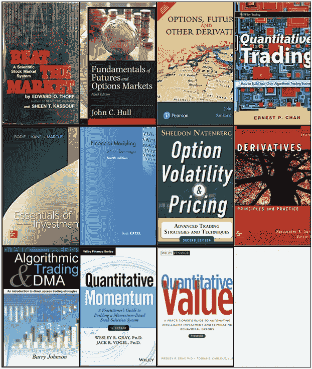
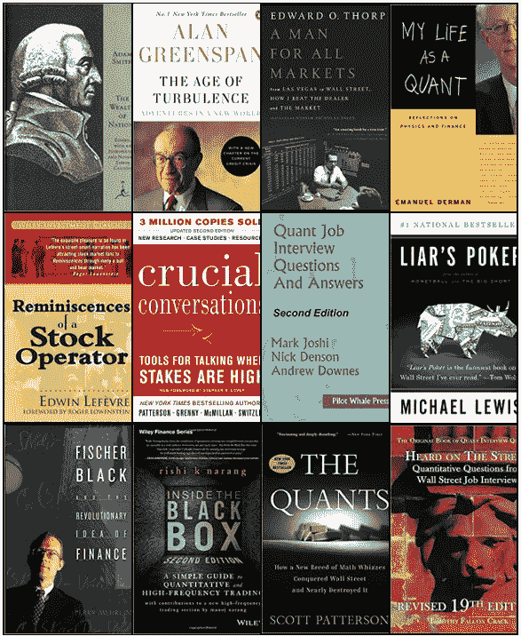
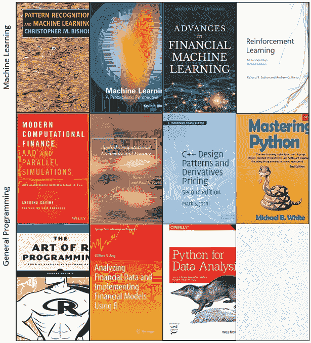
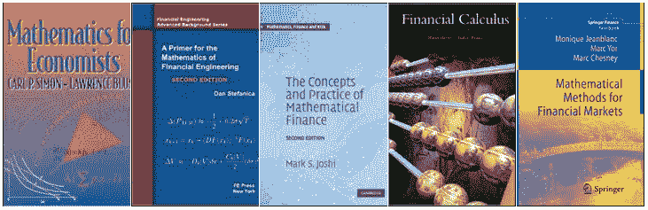
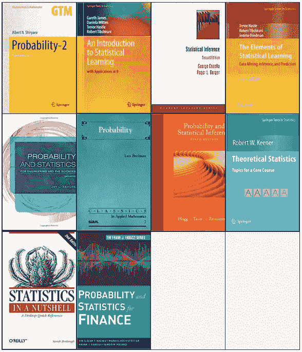
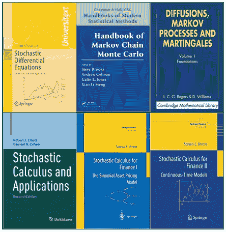
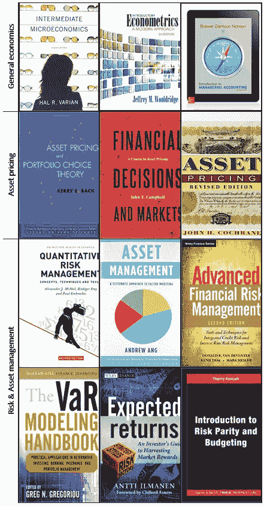
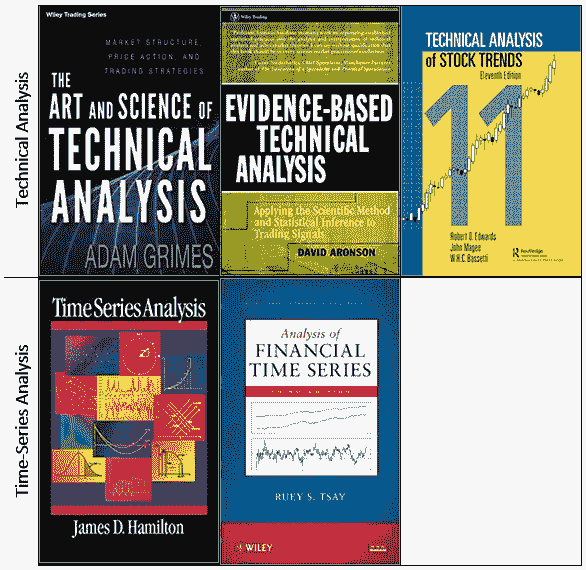

# 量化/算法/机器学习交易的完整书籍列表

> 原文：<https://towardsdatascience.com/the-complete-list-of-books-for-quantitative-algorithmic-machine-learning-trading-621b274fec5f?source=collection_archive---------3----------------------->

## 你和你的财务自由之间唯一的障碍是 108 本书，所以你还在等什么？开始阅读吧！

那些在前方寻求智慧的人，请小心，因为这是一个很长的列表..(100 多本书)

> "你**不会**一夜之间成为算法天才、杰出的学者、慈善家、亿万富翁."

三个月后你就不是了。一年后你也不会成为其中一员。你可能永远也不会成为一个。但是就像生活中的大多数事情一样，如果你努力，你可能会越来越接近实现财务自由的梦想。

现在很明显，其中一些有重叠的内容，所以你应该自己研究一下哪些书更适合你的心态和当前的技能。

这个列表由网上的多个来源组成，并尽我所能过滤成以下几类:

*   **一般阅读**
*   **轻读**
*   **编程**
*   **数学**
*   **经济学&金融学**
*   **技术&时序分析**
*   **其他**
*   **衍生品**

如果你喜欢这篇文章并想看更多，请务必关注我的简介。

# 一般阅读——基础

这可能是一个很好的起点，这些书涵盖了广泛的主题，可能是对量化交易的各种元素的一个不错的介绍。

Listed below in order of appearance in this picture!

*   艾德·索普 [**战胜市场**](https://amzn.to/2NyWOKs)
*   [**期货与期权市场基本面**](https://amzn.to/34luwdo) 约翰·C·赫尔著
*   [**期权、期货和其他衍生品**](https://amzn.to/2Nqp02c) 约翰·C·赫尔
*   [**量化交易**](https://amzn.to/2Wx3Nrk) 陈伟民
*   [**投资要点**](https://amzn.to/2qaMfVY)Zvi Bodie，Alex Kane & Alan Marcus
*   [**金融建模**](https://amzn.to/335TY6f) 西蒙·贝宁加著
*   [**期权波动率&定价**](https://amzn.to/2pw7IZA) 谢耳朵
*   [**衍生品**](https://amzn.to/2WuIBCz) 由桑基夫达斯&兰加拉詹孙达拉姆
*   巴里·约翰逊 [**算法交易和 DMA**](https://amzn.to/2NyvCvx)
*   [**定量动量**](https://amzn.to/31YBSSs) 作者韦斯利·r·格雷&杰克·r·沃格尔
*   [**量化值**](https://amzn.to/2NHYr91) 卫斯理·r·格雷&托比亚斯·卡莱尔

# ***轻*阅读——故事**

这些大多是“战争故事”和来自量化世界的故事。有些会很有教育意义，有些会比较悠闲的读书。

Listed below in order of appearance in this picture!

*   [**《国富论》**](https://amzn.to/33fuJ1y) 亚当·斯密
*   [**动荡的年代**](https://amzn.to/2NdxHOh) 格林斯潘著
*   ****爱德华·索普****
*   ****[**【我的一生】伊曼纽尔·德曼著**](https://amzn.to/2NcBATS)****
*   ****杰西·利弗莫尔著****股票操作者回忆录********
*   ******[**【至关重要的对话工具】……**](https://amzn.to/36xgK9m)**作者李淑昕·帕特森********
*   ******马克·乔希 [**Quant 求职面试问答**](https://amzn.to/36pvNSm)******
*   ****[**骗子的扑克**](https://amzn.to/2NfpglV) 迈克尔·刘易斯著****
*   ****[**费希尔·布莱克&金融的革命性理念**](https://amzn.to/2oJCpKl) 佩里 m****
*   ****黑匣子里的**Rishi k . Narang 著******
*   ******[**斯科特·帕特森的**](https://amzn.to/2qjqRy1)******
*   ****[**在街上听说**](https://amzn.to/2JNJwZM) 被蒂莫西破解****

# ******编程—机器学习和一般******

****这是一个机器学习文献的联合列表，也是专门针对 Python、R 和 C++的通用良好实践编程书籍。****

********

****Listed below in order of appearance in this picture!****

## ****机器学习****

*   ****[**模式识别与机器学习**](https://amzn.to/2Nd60W6) 作者克里斯托弗·m·毕晓普****
*   ****凯文·P·墨菲著 [**机器学习:概率视角**](https://amzn.to/2oPv9Ne)****
*   ****[**金融机器学习的进展**](https://amzn.to/2WCMgOK) 马科斯·洛佩兹·德·普拉多****
*   ****[**强化学习**](https://amzn.to/34s61Lt) 作者理查德·萨顿、安德鲁·g·巴尔托****

## ****通用编程****

*   ****[**现代计算金融**](https://amzn.to/2qnh36c) 作者安托万·萨万****
*   ****[**应用计算经济学和金融学**](https://amzn.to/2CbdZfT) 作者马里奥 J. &保罗 l****
*   ****[**C++设计模式和衍生产品定价**](https://amzn.to/2NBJm8N) 作者 Mark Joshi****
*   ****[**掌握 Python**](https://amzn.to/33hovOO) 迈克尔·b·怀特著****
*   ****诺曼·马特洛夫的《R 编程的艺术》****
*   ****renéCarmona[**R**](https://amzn.to/34umhvG)财务数据统计分析****
*   ****[**用于数据分析的 Python**](https://amzn.to/2NBJsgF)作者 Wes McKinney****

# ****数学——统计与概率、随机过程和一般****

****现在我们进入细节。这些书的有用性将高度依赖于你在该领域的教育和经验，所以要小心行事。****

## ****普通数学:****

********

****Listed below in order of appearance in this picture!****

*   ****[**经济学的数学**](https://amzn.to/2JTFUFp) 卡尔·西蒙&劳伦斯·e·布鲁姆****
*   ****[**金融工程数学入门**](https://amzn.to/2POmJRb) 作者丹·s****
*   ****[**数理金融的概念与实践**](https://amzn.to/2oSSy0c) 马克·乔希著****
*   ****[**金融微积分**](https://amzn.to/2Cfw2BS) 作者马丁·巴克斯特&安德鲁·雷尼****
*   ****金融市场的数学方法****

## ****统计和概率:****

********

****Listed below in order of appearance in this picture!****

*   ****[**概率**](https://amzn.to/32mkWoV) 作者 A.N. Shiryaev****
*   ****《统计学习导论》( Gareth J. & Trevor H。****
*   ****[**统计推断**](https://amzn.to/2NIGgjh) 乔治·卡塞拉&罗杰·伯杰****
*   ******统计学习的要素******
*   ******[**工程与科学的概率与统计**](https://amzn.to/32indSf) 杰伊 l******
*   ****[**概率**](https://amzn.to/36wRksl) 作者利奥·布雷曼****
*   ****[**概率和统计推断**](https://amzn.to/2CdLBtD) 罗伯特·v·霍格著，埃利奥特·坦尼斯****
*   ****罗伯特·w·基纳的《理论统计——核心课程主题》****
*   ****[**统计数据概括地说**](https://amzn.to/32hxVsd) 由莎拉·博思劳****
*   ****[**金融概率统计**](https://amzn.to/34yAkjS) 斯维特洛扎·t·拉切夫****

## ****随机过程:****

********

****Listed below in order of appearance in this picture!****

*   ****[**随机微分方程**](https://amzn.to/2WLKz1B) 作者 Bernt Oksendal****
*   ****[**马尔可夫链蒙特卡罗手册**](https://amzn.to/32ieVtt) 布鲁克斯史蒂夫著****
*   ****[**扩散、马氏过程和鞅**](https://amzn.to/2CbiSpp) 作者 L. Roger，D. Williams****
*   ****[**随机微积分及应用**](https://amzn.to/2NIH0VB) 塞缪尔 N. &罗伯特 j****
*   ****[**金融随机微积分 I**](https://amzn.to/33hZvGV) 作者史蒂文·什里夫****
*   ****史蒂文·什里夫的《金融的随机微积分 II》****

# ****经济与金融——一般资产定价和管理****

****如果你没有金融或经济背景，明智的做法是阅读这些书籍，了解构成我们市场基础的各个部分。就像所有这些一样，有些可能不适合你，有些可能适合，所以在承诺之前做好自己的研究！****

********

****Listed below in order of appearance in this picture!****

## ****普通经济学:****

*   ****[**中级微观经济学:现代方法**](https://amzn.to/36AY0FQ) 哈尔·瓦里安著****
*   ****《计量经济学导论:现代方法》****
*   ****[**管理会计导论**](https://amzn.to/2CdMkLn) 作者彼得 b、雷 G. &埃里克 n****

## ****资产定价:****

*   ****[**资产定价与投资组合选择理论**](https://amzn.to/2pIpk4v) 由回克里****
*   ****[**【金融决策与市场:资产定价教程】约翰·y**](https://amzn.to/36z6L3j)****
*   ****[**【资产定价(修订版)**](https://amzn.to/2pMoXWu) 作者约翰·h****

## ****风险和资产管理:****

*   ****[**量化风险管理**](https://amzn.to/2PPdG2g) 作者亚历山大 j、鲁迪格 F. &保罗 e****
*   ****[**资产管理:要素投资的系统方法**](https://amzn.to/33lLb0m) 安****
*   ****[**高级金融风险管理**](https://amzn.to/36Ckarx) 作者唐纳德 r&德温特 k****
*   ****[**《VaR 建模手册**](https://amzn.to/2WKFtCq)Greg n . Gregoriou 著****
*   ****[**预期收益:收获市场回报指南**](https://amzn.to/2POovlj) 作者 I. Anti****
*   ****[**风险平价和预算简介**](https://amzn.to/33j2q2n)Ron calli Thierry****

# ****技术和时间序列分析——画出那些线！****

****尽管技术分析在交易界是一个很大的争议，但是理解这些概念还是有价值的。****

********

****Listed below in order of appearance in this picture!****

## ****技术分析:****

*   ****[**技术分析的艺术与科学**](https://amzn.to/2oSTO3q) 亚当·格里姆斯著****
*   ****[**循证技术分析**](https://amzn.to/36DpQRO) 大卫·阿伦森****
*   ****[**股票趋势技术分析**](https://amzn.to/2NMVT9k) 罗伯特·爱德华兹，约翰·马吉****

## ****时间序列分析:****

*   ****[**时间序列分析詹姆斯**](https://amzn.to/2NEdIHI) 道格拉斯·汉密尔顿****
*   ****[**金融时间序列分析**](https://amzn.to/2CdCrgD) 蔡瑞生****

# ****其他—介于两者之间的一切****

****这份清单的独特之处在于，我不确定该把这些书放在哪里。当然，这并不是说这些书比这本书集中的任何其他书都差，事实上，它们中的一些可能对你的学习经历至关重要并产生巨大影响。****

*   ****[**证券分析**](https://amzn.to/2rb9obf) 本杰明·格拉哈姆、大卫·多德、沃伦·巴菲特****
*   ******市场的(错误)行为******
*   ******[**达莫达兰论估价**](https://amzn.to/2JS35jE) 达莫达兰·阿斯瓦特著******
*   ****[**行为恶劣的模特**](https://amzn.to/2PLxdAR) 伊曼纽尔·德曼****
*   ****[**交易系统**](https://amzn.to/2PMVYww) 作者埃米利奥·托马西尼****
*   ****[**商业周期与均衡**](https://amzn.to/2WORyqj) 费希尔·布莱克著****
*   ****[**双动力投资**](https://amzn.to/34BSa5v) 作者加里·安东纳奇****
*   ****[**HFT 的问题**](https://amzn.to/36A67me) 作者海姆·博德克****
*   ****[**《金融市场计量经济学》**](https://amzn.to/2CedUbx) 作者约翰·y、罗文-C、阿奇·c****
*   ****凯文·戴维 [**构建成功的算法交易系统**](https://amzn.to/2JPnrdi)****
*   ****[**交易与交易所**](https://amzn.to/2POpmCx) 拉里·哈里斯著****
*   ****[**金融建模中的鞅方法**](https://amzn.to/2oNxFmX) 由 Marek M，Marek R****
*   ****[**动态对冲:管理香草和奇异期权**](https://amzn.to/2WJ9t1G)**Nassim n******
*   ******[**带有跳跃过程的金融建模**](https://amzn.to/34ucCFl) 作者 Rama C. & Peter T******
*   ****[**交易策略的评估与优化**](https://amzn.to/2NIP4G0) 罗伯特·p****
*   ****[**公司财务基础**](https://amzn.to/34zbr7z) 作者斯蒂芬·a、伦道夫·W&更****
*   ****[**连续时间套利理论**](https://amzn.to/33j1mvn) 托马斯·比约克著****
*   ****范·k·塔普著**通过交易获得财务自由******

# ******衍生品—股票、外汇、商品、利率、信用、外汇******

******这是不言自明的。关于特定种类衍生产品的高度特定的文献。当这些书的主题植入你的脑海时，你可能会认为自己是这个领域的伪专家。******

## ******股票衍生品:******

*   ******[**波动面**](https://amzn.to/36BwJmQ) 由吉姆配齐******
*   ****[**随机波动建模**](https://amzn.to/2NOf9DI)Lorenzo bergo mi****
*   ****[**股权混合衍生品**](https://amzn.to/2pzh0UP) 马库斯·奥弗豪斯等人著。****

## ****外汇衍生品:****

*   ****[**外汇期权和微笑风险**](https://amzn.to/2WKVuZb) 作者安东尼奥·卡斯塔尼亚****
*   ****[**外汇期权定价**](https://amzn.to/2pIrp0j) 作者伊恩·克拉克 FX****
*   ****[**外汇期权和结构性产品**](https://amzn.to/36EPDJI) 作者 Uwe Wystup****

## ******商品**衍生品:****

*   ****[**能源和电力风险管理**](https://amzn.to/2JUSm82) 作者亚历山大 e****
*   ****[**商品及商品衍生品**](https://amzn.to/2NhtitY) 作者:Helyette Geman****
*   ****[**商品期权定价**](https://amzn.to/2WLWnAA) 伊恩·克拉克著****

## ****利率衍生品****

*   ****[**利率模型——理论与实践**](https://amzn.to/2JSqDoq) 达米亚诺 B. &法比奥 m****
*   ****[**定价和交易利率衍生品**](https://amzn.to/2JRfeFn) 由 J. H. M .达比****
*   ****[**利率建模一、**](https://amzn.to/2JOxOOk) **、** [**二、**](https://amzn.to/2NkOHCg)**&**[**三、**](https://amzn.to/33txmNv) 作者叶小开·安德森&弗拉基米尔·皮特伯格****
*   ****[**利率期权模型**](https://amzn.to/2PP7kAf) 由 Rebonato****

## ****信用衍生品****

*   ****多米尼克 [**建模单名和多名信用衍生品**](https://amzn.to/2NhWvER)****
*   ****[**信用风险——建模、估价&套期保值**](https://amzn.to/2qmj2HK) 作者 Tomasz R. & Marek R****

## ****XVA****

*   ****[**XVA:信贷、融资和资本估值调整**](https://amzn.to/2WIxLsy) 作者 Andrew G****
*   ****[**交易对手信用风险、抵押品和融资**](https://amzn.to/2qpUHAG) 达米亚诺·布里戈著****

# ****最后的沉思——继续前进****

********

****My face when I finally finished this list.****

******所以我们做了**，我们做了一个“*完整的*算法和量化交易的书单！现在不言而喻，像这样的一份名单只是“*完整的*”直到有人评论说:****

> ****“但是，等等，你忘记了这篇至关重要的文献，你怎么能这样做呢？!"****

****正是因为这个原因，我会继续更新，尽可能多地从你们在**媒体**和 [**推特**](https://twitter.com/PeterNistrup) 和 **Reddit** 上的人那里获得反馈。****

# ****结束语****

****如果你想多看多学，一定要上 [**关注我的**](https://medium.com/@peter.nistrup) 🔍**[**碎碎念**](https://twitter.com/peternistrup) 🐦******

**** [## 彼得·尼斯特鲁普-中等

### 阅读彼得·尼斯特拉普在媒介上的作品。数据科学、统计和人工智能...推特:@PeterNistrup，LinkedIn…

medium.com](https://medium.com/@peter.nistrup)****