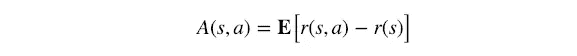
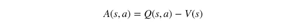
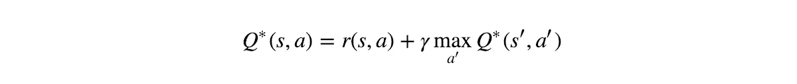
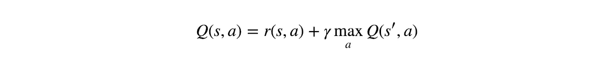
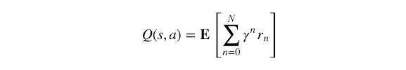
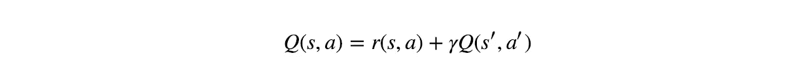
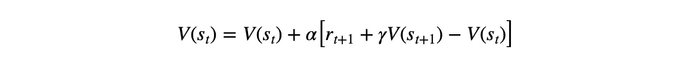
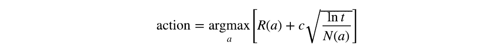
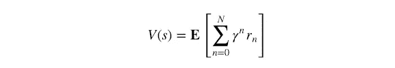

# 完全强化学习词典

> 原文：<https://towardsdatascience.com/the-complete-reinforcement-learning-dictionary-e16230b7d24e?source=collection_archive---------2----------------------->

## 强化学习术语，从 A 到 Z

**在媒体*上阅读此文，而*不是使用此** [**好友链接**](/the-complete-reinforcement-learning-dictionary-e16230b7d24e?sk=9d29f303db3650387c489c9565b43636) **的媒体成员！**

每当我开始学习一门新的学科时，我发现最难应付的是它的新术语。每个领域都有许多术语和定义，对于一个局外人来说完全是晦涩难懂的，这会使一个新手迈出第一步相当困难。

当我第一次踏入强化学习的世界时，我被每隔一行就弹出的新术语所淹没，并且总是让我惊讶的是在这些复杂的单词背后隐藏着非常简单和符合逻辑的想法。因此，我决定用自己的话把它们都写下来，这样我就可以随时查阅，以防忘记。这本字典就是这样产生的。

这不是强化学习的入门文章，而是学习时的辅助工具。如果你也想在这个领域开始你的职业生涯，我可以给你以下建议:

*   如果你正在寻找一个包含代码示例的快速、10 分钟速成课程，请查看我的 *Qrash 课程*系列:[RL 和 Q-Learning 简介](https://medium.com/@shakedzy/qrash-course-deep-q-networks-from-the-ground-up-1bbda41d3677)和[政策梯度和行动者-批评家](https://medium.com/@shakedzy/qrash-course-ii-from-q-learning-to-gradient-policy-actor-critic-in-12-minutes-8e8b47129c8c)。
*   如果你有更深的兴趣，并且想学习和编写几种不同的 RL 算法并获得更多的直觉，我可以推荐托马斯·西蒙尼的这个系列和亚瑟·朱利安尼的这个系列。
*   如果你已经准备好掌握 RL，我会把你引向强化学习的“圣经”——理查德·萨顿和安德鲁·巴尔托的《强化学习导论》。第二版(从 2018 年开始)作为 [PDF 文件](https://web.stanford.edu/class/psych209/Readings/SuttonBartoIPRLBook2ndEd.pdf)免费(合法)提供。

我将尽我最大的努力不断更新这本词典。如果我错过了什么重要的事情或者做错了什么，请随时告诉我。

# 字典

**动作值功能:**见 [*Q 值*](#f366) *。*

**动作:**动作是 [*代理*](#b6a2) *的*方法，允许其交互并改变其 [*环境*](#4311) ，从而在 [*状态*](#c274) 之间转移。代理人执行的每一个动作都会从环境中获得一个 [*奖励*](#6a6f) 。选择哪个动作的决定由 [*策略*](#a76c) 做出。

**演员-评论家:**当试图解决一个 [*强化学习*](#fc9f) 问题时，有两种主要方法可供选择:计算每个状态的 [*值函数*](#680c) 或 [*Q 值*](#f366) 并根据这些来选择动作，或者直接计算一个 [*策略*](#a76c) ，该策略定义了每个动作应该被采取的概率 Actor-Critic 算法结合了这两种方法，以创建一种更健壮的方法。一个很棒的插图漫画解释可以在[这里](https://hackernoon.com/intuitive-rl-intro-to-advantage-actor-critic-a2c-4ff545978752)找到。

**优势函数:**通常表示为 *A(s，a)* ，优势函数是在给定某个*状态的情况下，衡量某个 [*动作*](#8751) 好坏的一个决策——或者更简单的说，从某个状态中选择某个动作的优势是什么。它在数学上定义为:*

**

*其中 *r(s，a)* 是从状态 *s* 开始的动作 *a* 的期望 [*奖励*](#6a6f) ，并且 *r(s)* 是在选择动作之前整个状态 *s* 的期望奖励。它也可以被视为:*

**

*其中 *Q(s，a)* 为 [*Q 值*](#f366)*V(s)*为 [*值函数*](#680c) *。**

***代理:**学习和 [*演戏*](#8751) 一部分 [*强化学习*](#fc9f) 问题，即试图最大化 [*奖励*](#6a6f) 它是由 [*环境*](#4311) 给出的。简单地说，代理就是你试图设计的模型。*

***盗匪:**正式命名为“k-Armed 盗匪”后昵称“独臂盗匪”给予[吃角子老虎](https://en.wikipedia.org/wiki/Slot_machine)，这些被认为是最简单类型的 [*强化学习*](#fc9f) 任务。盗匪没有不同的 [*状态*](#c274) ，只有一个——而考虑中的 [*奖励*](#6a6f) 只是眼前的一个。因此，土匪可以被认为是有单态 [*集*](#601d) 。每个 k 臂被认为是一个 [*动作*](#8751) ，目标是学习在每个动作(或拉臂)后将最大化期望回报的 [*策略*](#a76c) 。
尽管如此，这个任务仍然是一个单一状态的阶段性任务，一个上下文不能对其他上下文产生影响。*

***贝尔曼方程:**形式上，贝尔曼方程定义了一个给定的 [*状态*](#c274) (或状态- [*动作*](#8751) 对)与其后继者之间的关系。虽然存在许多形式，但在 [*强化学习*](#fc9f) 任务中通常遇到的最常见形式是最优 [*Q 值*](#f366) 的贝尔曼方程，其由下式给出:*

**

*或者当不存在不确定性时(即概率为 1 或 0):*

**

*其中星号表示*最佳值*。一些算法，如 [*Q-Learning*](#9d8f) ，就是以此为基础进行学习的。*

***连续任务:** [*强化学习*](#fc9f) 不是由 [*集*](#601d) 组成，而是永远持续的任务。这个任务没有终端[*状态*](#c274) *s.* 为了简单起见，通常假设它们由一个永无止境的情节组成。*

***深度 Q-Networks (DQN)** :参见 [*Q-Learning*](#9d8f)*

***深度强化学习:**使用带有深度神经网络的 [*强化学习*](#fc9f) 算法作为学习部分的近似器。这样做通常是为了处理可能的 [*状态*](#c274) 和 [*动作*](#8751) 的数量迅速增加，并且精确的解决方案不再可行的问题。*

***贴现因子(γ)** :贴现因子，通常表示为γ，是乘以未来期望 [*报酬*](#6a6f) 的因子，在[0，1]的范围内变化。它控制着未来回报相对于眼前回报的重要性。折扣因子越低，未来的回报就越不重要，而 [*代理*](#b6a2) 会倾向于专注于只会产生即时回报的 [*行动*](#8751) 。*

***环境:**除了[之外的一切*代理*](#b6a2)；代理可以直接或间接与之交互的一切。环境随着代理执行 [*动作*](#8751) 而变化；每一个这样的变化都被认为是一个 [*状态*](#c274)-转换。代理执行的每个动作都会产生一个由代理接收的 [*奖励*](#6a6f) 。*

***插曲:**介于初态和终态之间的所有 [*态*](#c274)；比如:一盘棋。 [*代理*](#b6a2)*的目标是让它在一集里收到的总 [*奖励*](#6a6f) 最大化。在没有终极状态的情况下，我们考虑一个无限事件。重要的是要记住，不同的情节是完全相互独立的。**

****阶段性任务:**[*强化学习*](#fc9f) 任务由不同的 [*剧集*](#601d) (意思是，每一集都有一个终端[*状态*](#c274) )。**

****预期回报:**有时被称为“整体报酬”，偶尔被表示为 *G* ，是在整个*剧集中的预期*。****

*****体验回放:**作为 [*强化学习*](#fc9f) 任务，没有预先生成的训练集可供其学习， [*代理*](#b6a2) 必须保留其遇到的所有 [*状态*](#c274) *-* 转换的记录，以便以后可以从中学习。用于存储此内容的内存缓冲区通常被称为*体验回放*。这些内存缓冲区有几种类型和架构，但一些非常常见的是[循环内存缓冲区](https://en.wikipedia.org/wiki/Circular_buffer)(它确保代理保持对其新行为的训练，而不是可能不再相关的事情)和[基于库采样](https://en.wikipedia.org/wiki/Reservoir_sampling)的内存缓冲区(它保证记录的每个状态转换都有均匀的概率被插入到缓冲区中)。***

****开发&探索:** [*强化学习*](#fc9f) 任务没有可以学习的预先生成的训练集——它们创建自己的 [*经验*](#5ecb) 并“动态”学习。为了能够这样做， [*代理*](#b6a2) 需要在许多不同的*状态下尝试许多不同的*动作*，以便尝试和学习所有可用的可能性，并找到将最大化其总体*回报的路径；这被称为*探索*，因为代理探索 [*环境*](#4311) 。另一方面，如果代理只做探索，它永远不会最大化整体回报——它还必须使用它学到的信息来这样做。这被称为*利用*，因为代理利用其知识来最大化其收到的回报。
这两者之间的权衡是强化学习问题的最大挑战之一，因为这两者必须平衡，以便让代理既能充分探索环境，又能利用它所学到的东西，并重复它找到的最有价值的路径。****

****贪策，*ε*——贪策:**一贪 [*策*](#a76c) 意为 [*代理*](#b6a2) 不断地执行 [*动作*](#8751) 即被认为能产生最高预期 [*报酬*](#6a6f) 。显然，这样的政策根本不会允许代理人 [*探索*](#b903) 。为了仍然允许一些探索，通常使用一种 *ε-* 贪婪策略来代替:选择[0，1]范围内的一个数(名为 *ε* ) ，并且在选择动作之前，选择[0，1]范围内的一个随机数。如果该数字大于 *ε* ，则选择贪婪动作，但如果该数字小于该数字，则选择随机动作。注意，如果 *ε* =0，则该策略成为贪婪策略，如果 *ε* =1，则始终探索。**

****k-武装土匪:**见 [*土匪*](#790b) *。***

****马尔可夫决策过程(MDP):** 马尔可夫属性是指每个**状态完全依赖于它之前的状态，从那个状态中取出的被选择的 [*动作*](#8751) 和在那个动作被执行之后立即收到的 [*奖励*](#6a6f) 。数学上的意思是: *s' = s'(s，a，r)* ，其中 *s'* 是未来状态， *s* 是其之前状态， *a* 和 *r* 是动作和奖励。不需要事先知道在 *s* 之前发生了什么——马尔可夫属性假设 *s* 包含所有相关信息。马尔可夫决策过程是基于这些假设的决策过程。****

****基于模型&无模型:**基于模型和无模型是一个 [*代理*](#b6a2) 在试图优化其 [*策略*](#a76c) 时可以选择的两种不同的方法。最好用一个例子来解释:假设你正试图学习如何玩[21 点](https://en.wikipedia.org/wiki/Blackjack)。你可以通过两种方式做到这一点:一，你预先计算，在游戏开始之前，所有 [*状态*](#c274) 的获胜概率，以及所有可能的*动作的所有状态转移概率，然后简单地按照你的计算去行动。第二种选择是在没有任何先验知识的情况下简单地玩，并使用“试错法”来获取信息。注意，使用第一种方法，你基本上是在*建模*你的 [*环境*](#4311) ，而第二种方法不需要关于环境的任何信息。这正是基于模型和无模型的区别；第一种方法是基于模型的，而后者是无模型的。***

****蒙特卡洛(MC):** 蒙特卡洛方法是一种算法，它使用重复的随机抽样来获得一个结果。它们经常在 [*强化学习*](#fc9f) 算法中使用，以获得期望值；例如—计算一个 [*状态*](#c274) [*值函数*](#680c) 通过反复返回同一状态，对每次收到的实际累计 [*奖励*](#6a6f) 进行平均。**

****On-Policy&Off-Policy:**每一个 [*强化学习*](#fc9f) 算法都必须遵循一些 [*策略*](#a76c) 以决定在每一个*状态下执行哪些 [*动作*](#8751) 。尽管如此，算法的学习过程在学习时不必考虑该策略。关注产生过去状态行为决策的策略的算法被称为*符合策略的*算法，而忽略它的算法被称为*不符合策略的*。
一个众所周知的非策略算法是 [*Q-Learning*](#9d8f) ，因为它的更新规则使用将产生最高 [*Q 值*](#f366) 的动作，而实际使用的策略可能会限制该动作或选择另一个动作。Q-Learning 的基于策略的变体被称为 [*Sarsa*](#da43) ，其中更新规则使用由跟随的策略选择的动作。***

****独臂土匪:**见 [*土匪*](#790b) *。***

****一步到位 TD:** 见 [*时间差*](#d0d7) *。***

****策略(π):** 策略，记为 *π* (有时也称为 *π(a|s)* )，是从某个 [*状态*](#c274) *s* 到给定该状态下选择每个可能的 [*动作*](#8751) 的概率的映射。例如，一个 [*贪婪策略*](#15c5) 为每个状态输出具有最高期望 [*Q 值*](#f366) 的动作。**

****Q-Learning:** Q-Learning 是一种[*off-policy*](#44d1)*[*强化学习*](#fc9f) 算法，被认为是非常基础的算法之一。在其最简化的形式中，它使用一个表来存储所有可能的 [*状态*](#c274) *-* [*动作*](#8751) 对的所有 [*Q 值*](#f366) 。它使用 [*贝尔曼方程*](#fbd3) 更新该表，而动作选择通常使用[*ε-贪婪策略*](#15c5) *进行。* 以其最简单的形式(无不确定性*-状态跃迁和预期*)，Q-Learning 的更新规则是:*****

******

***它的一个更复杂的版本，尽管更受欢迎，是*深度 Q-网络*变体(有时甚至简称为*深度 Q-学习*或简称为*Q-学习*)。这种变体用神经网络代替状态-动作表，以便处理大规模任务，其中可能的状态-动作对的数量可能是巨大的。你可以在[这篇博文](https://medium.com/@shakedzy/qrash-course-deep-q-networks-from-the-ground-up-1bbda41d3677)中找到这个算法的教程。***

****Q 值(Q 函数):**通常表示为 *Q(s，a)* (有时带π下标，有时表示为 *Q(s，a；θ)* 中 [*深 RL*](#aa91) )，Q 值是整体预期 [*奖励*](#6a6f) 假设 [*代理*](#b6a2) 处于 [*状态*](#c274)*并执行 [*动作*](#8751) 它的名字是“质量”一词的缩写，数学上定义为:***

****

**其中 *N* 是从状态 *s* 到终止状态的状态数，γ是 [*折扣因子*](#4ee6) ，r⁰是在状态 *s* 执行动作 *a* 后收到的即时奖励。**

****强化算法:**强化算法是 [*强化学习*](#fc9f) 算法的一个家族，它根据策略相对于策略参数的梯度来更新自己的 [*策略*](#a76c) 参数*[论文](https://papers.nips.cc/paper/1713-policy-gradient-methods-for-reinforcement-learning-with-function-approximation.pdf)。该名称通常只使用大写字母，因为它最初是原始算法组设计的缩写:"**RE**ward**I**Non negative**F**actor*x*Offset**R**E enforcement*x*Ccharacter istic**E*****

****强化学习(RL):** 与监督学习和非监督学习一样，强化学习是机器学习和人工智能的主要领域之一。它关注的是一个任意存在的学习过程，正式名称为 [*智能体*](#b6a2) ，在其周围的世界中，称为 [*环境*](#4311) 。智能体寻求从环境中获得的 [*奖励*](#6a6f) 最大化，并执行不同的 [*动作*](#8751) 以学习环境如何反应并获得更多奖励。RL 任务的最大挑战之一是将行为与延迟奖励相关联——延迟奖励是代理在产生奖励的行为做出很久之后才收到的奖励。因此，它被大量用于解决不同类型的游戏，从井字游戏，国际象棋，雅达利 2600 和所有的方式去和星际争霸。**

****奖励:**由 [*代理*](#b6a2) 从 [*环境*](#4311) 中接收的一个数值，作为对代理 [*动作*](#8751) 的直接响应。代理人的目标是在一集*中最大化其收到的总奖励，因此奖励是代理人以期望的行为行动所需的动机。所有的行动都会产生奖励，大致可以分为三种类型:*积极奖励*强调想要的行动，*消极奖励*强调行动者应该偏离的行动，*零*，这意味着行动者没有做任何特殊或独特的事情。***

****Sarsa:**Sarsa 算法基本上是一种 [*Q-Learning*](#9d8f) 算法，只是稍加修改，使其成为一种 [*on-policy*](#44d1) 算法。Q-学习更新规则是基于*贝尔曼方程求最优*的 Q 值，因此在*-状态-跃迁和期望*不确定的情况下，Q-学习更新规则是:******

******

***为了将其转换为基于策略的算法，最后一项被修改:***

******

***当此处，两个 [*动作*](#8751) *a* 和*a’*都由同一个 [*策略*](#a76c) 选择。算法的名字来源于它的更新规则，更新规则基于( *s，a，r，s’，a’*)，都来自同一个策略。***

****状态:**在*环境中 [*智能体*](#b6a2) 遭遇的每一个场景都正式称为*状态。*代理通过执行 [*动作*](#8751) 在不同状态之间转换。还值得一提的是*终端状态*，它标志着一集**的结束。*达到终态后就没有可能的状态了，新的一集开始了。很多时候，一个终止状态被表示为一个特殊的状态，其中所有动作都转换到同一个终止状态，并且 [*奖励*](#6a6f) 0。****

****状态-值函数:**见 [*值函数*](#680c) *。***

****时间差分(TD):** 时间差分是一种结合了[动态规划](https://en.wikipedia.org/wiki/Dynamic_programming)和 [*蒙特卡罗*](#f9e0) 原理的学习方法；它像蒙特卡罗一样“在飞行中”学习，但像动态编程一样更新它的估计。最简单的时间差分算法之一被称为*一步 TD* 或 *TD(0)* 。根据以下更新规则更新 [*值函数*](#680c) :**

****

**其中 *V* 为价值函数， *s* 为 [*状态*](#c274) ， *r* 为 [*奖励*](#6a6f) ， *γ* 为 [*贴现因子*](#4ee6) ， *α* 为学习率，方括号中的项被称为*时间差误差。***

****端子状态:**见 [*状态*](#c274) *。***

****上自信界(UCB):**【UCB】是一种 [*探索*](#b903) 方法，它试图确保每个 [*动作*](#8751) 都被很好地探索。考虑一个完全随机的探索 [*策略*](#a76c)*——意思是，每个可能的动作都有相同的机会被选中。有些行动可能会比其他行动探索得更多。一个动作被选中得越少，这个 [*代理*](#b6a2) 就越没有信心能左右其预期的 [*奖励*](#6a6f) ，而其 [*剥削*](#b903) 阶段就可能受到伤害。UCB 的探索考虑了每个动作被选择的次数，并给予那些探索较少的动作额外的权重。从数学上来说，所选择的动作是通过以下方式挑选的:***

****

**其中 *R(a)* 是动作 *a* 的预期总体回报， *t* 是采取的步骤数(总共选择了多少个动作)， *N(a)* 是选择动作 *a* 的次数， *c* 是可配置的超参数。这种方法有时也被称为“通过乐观进行探索”，因为它赋予较少探索的行为更高的价值，鼓励模型选择它们。**

****价值函数:**通常表示为 *V(s)* (有时带有π下标)，价值函数是对整体预期 [*奖励*](#6a6f) 的度量假设 [*代理*](#b6a2) 处于 [*状态*](#c274) *s* 然后继续播放直到 [*第一集*](#601d) 结束它在数学上定义为:**

****

**虽然它看起来确实类似于 [*Q 值*](#f366) 的定义，但有一个隐含的——但很重要的——区别:对于*n = 0*,*v(s)*的奖励 r⁰是刚处于状态 *s* 、*在*进行任何动作之前的预期奖励，而在 q 值中，r⁰是在进行某个动作之后的预期奖励*。这种差异也产生了 [*优势函数*](#efa6) 。***